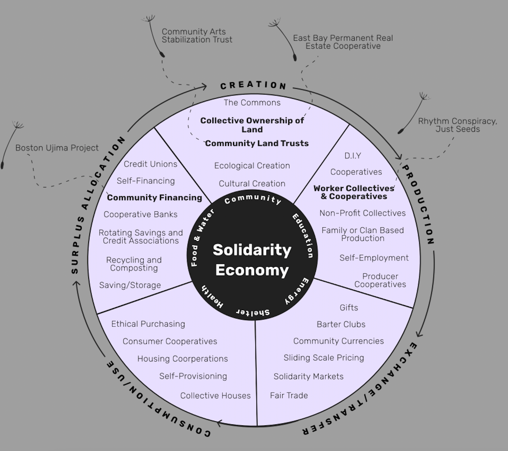
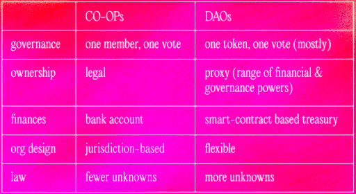
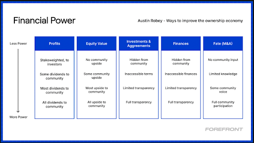
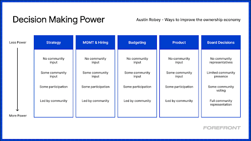

# Let's DAO It：合作社、DAO 和集体的未来之路

**By Sara Campbell**

> Metalabel、Ampled 和 Unnamed Fund 的创始人奥斯汀·罗比（[Austin Robey](https://twitter.com/austinrobey_)）最近在 Crypto, Culture, & Society 讨论分享了建立更好的集体所有和经营的组织所固有的机会和挑战。

作为以下三个先锋组织的创始成员，奥斯汀·罗比是重新构想数字时代共享所有权和民主治理的团队的关键成员。

- [Ampled](https://www.ampled.com/)，一个由艺术家和工作者拥有的类似 Patreon 的音乐人平台
- [Unnamed Fund](https://unnamed.fund/)，一个由社区领导、合作掌控的创意生态基金
- [Metalabel](https://metalabel.xyz/)，一个集体所有的社区网络，创造知识、资源和工具，激发集体文化产出。

在上周 CCS 的演讲中，奥斯汀强调了他在 DAO 和合作社领域的建设中所学到的东西，以及随着 web3 的发展需要考虑的一些事情。

## 合作社：原始的集体企业

合作社（co-ops）是由其工人、客户或双方的某种组合集体拥有的企业。他们在一人一票（每个成员在投票中得到平等的代表）的基础上运作。合作社可以追溯到 18 世纪，它们是为成员带来利益而存在的企业，而不是为了实现利益最大化。在合作社中，成员=所有者。

> 「合作社是共同拥有的、民主控制的企业，促进其成员的经济、社会和文化利益。它们经常在危机时刻出现，让人们负责他们所依赖的工作场所、信用社、杂货店、医疗保健和公用事业。」—— 内森`施耐德（Nathan Schneider）

一些知名的合作社例子：[Mondragon](https://www.mondragon-corporation.com/en/)、[Equal Exchange](https://shop.equalexchange.coop/)、[True Value Hardware](https://www.truevalue.com/)、[Ocean Spray](https://www.oceanspray.com/)、[REI](https://www.rei.com/)、[Associated Press](https://www.ap.org/)、[Land O' Lakes](https://www.landolakesinc.com/) 和 [SWIFT](https://www.swift.com/)

运行中的合作社类型。[工人](https://en.wikipedia.org/wiki/Worker_cooperative)、[平台](https://en.wikipedia.org/wiki/Platform_cooperative)、[消费者](https://en.wikipedia.org/wiki/Consumers%27_co-operative)、[采购](https://ncbaclusa.coop/resources/co-op-sectors/purchasing-co-ops/)、[多方利益相关者](https://uwcc.wisc.edu/resources/multi-stakeholder-cooperatives/)、[住房](https://www.investopedia.com/articles/pf/08/housingco-op.asp)、[营销](https://en.wikipedia.org/wiki/Marketing_co-operation)、[生产者](https://uwcc.wisc.edu/resources/producer-cooperatives/)。

虽然合作社可能不是最广为人知的治理形式，但奥斯汀指出，它们出人意料地普遍。超过 12% 的人是世界上 300 万个合作社中的一员。此外，每三个美国人中就有一个是合作社的成员。

## 团结经济

合作社存在于[团结经济](https://neweconomy.net/solidarity-economy/)的大背景下，这是一个建立公正和可持续经济的全球运动，将人和地球置于利润和增长之上。

重要的是要明白，许多这类组织 —— 工人集体和合作社、易货俱乐部、团结市场等 —— 往往是为了自给自足、生存，或者作为对市场失败的回应而开始的。

「如果没有人愿意为我们建造它，我们就为自己建造它。」

## 平台合作主义

特瑞勃·舒尔茨（Trebor Schulz）在 2014 年创造了「平台合作主义」一词（也许不是巧合，在以太坊推出前一年）。作为一场运动，平台合作主义正在探索我们能够改变互联网结构的方法，以便所有参与者都能为他们的劳动得到公平的回报。它在某种程度上是对[零工经济](https://www.investopedia.com/terms/g/gig-economy.asp)崛起的反应，零工经济逆转了历史上劳工运动多年来争取的工人权利和保护措施。

舒尔茨与人合编了一本名为[《我们的破解和拥有：平台合作主义的崛起，未来工作和更公平的互联网的新愿景》](https://worldpece.org/sites/default/files/artifacts/media/pdf/ourstohackandown.pdf)的论文集，他说，平台合作主义「将工人、业主、社区和城市置于一种导致政治力量的团结之中。」

在这个领域运作的一些组织的例子包括 [Stocksy United](https://www.stocksy.com/)、[The Drivers Cooperative](https://drivers.coop/)、[groupmuse](https://www.groupmuse.com/)、[Ampled](https://www.ampled.com/)、[Resonate](https://resonate.is/)、[Guilded Freelancer Cooperative](https://www.guilded.coop/) 和 [Savvy Cooperative](https://www.savvy.coop/)。

## DAO 能从合作社那里学到什么？

奥斯汀最近为 [Friends with Benefits](https://www.fwb.help/) 写了一篇[文章](https://www.fwb.help/wip/what-co-ops-and-daos-can-learn-from-each-other)，讲述了他从平台合作主义运动和 DAO 领域的工作中学到的东西。下图说明了合作社和 DAO 的基本区别。

_图自《合作社和 DAO 可以相互学习的内容》_

奥斯汀指出，DAO 和合作社之间的差异主要归结为治理，但这主要归因于文化而非结构。参与者必须就所有权的共同定义达成一致。

所有权定义的一些例子包括：

- **财权：** 利润（分红/股票回购）、股权/账面价值、财务准入和透明度。
- **决策权：** 对战略的投入、雇佣、预算、董事会代表、对领导的问责。

> 「所有权经济并不总是意味着通证、股票期权或股权的字面分配。相反，它意味着所有权 —— 可能表现为新的经济奖励、平台治理或新的社会资本形式 —— 可以成为用户体验的新基石，有大量的设计空间可以探索。」—— 来自 Variant Fund 的杰西·瓦尔登（[Jesse Walden](https://twitter.com/jessewldn)）

> 「拥有感就像吃饭的感觉。」—— 科瑞·罗森（Cory Rosen），雇员所有权全国中心主任

奥斯汀建议，DAO 有机会更加雄心勃勃地定义什么构成了所有权。他指出，说平台上的新颖经济奖励就是所有权是有危险的，因为它忽略了决策权的一些关键原则，最终可能以某种方式稀释实际所有权。

在最近为 [Forefront](https://forefront.market/) 撰写的一篇文章[《改善所有权经济的方法》](https://ff.mirror.xyz/ZRsr5HZMfbHOEe2lIYoWinRCI65NlvDW_QzEu1rn7As)中，奥斯汀阐述了一些关于 DAO 如何更好地捕捉和传达社区的无形价值的想法。他表示需要双向问责，即领导者也必须对成员负责，这颠覆了强调成员必须对领导者负责的传统等级结构。

## 历史背景很重要

奥斯汀指出，除了确保更好的决策外，对 DAO 的历史背景的了解也很有帮助。历史上有许多集体组织和协调方式的例子，我们可以借鉴。这一点值得注意，因为在科技界有一种倾向，即把事情看作是需要技术解决方案的技术问题，而实际上它们远远超出了这个范围。

例如，一些例子包括：

- 经济协调：互助社会、团结网络、易货网络
- 集体所有制：合作社、管家式所有权、社区信托集体
- 决策和团体文化：合作社章程、互助行动、团体决策教学法
- 社区和地方货币。伊萨卡小时（Ithaca Hours）、伯克希尔（Berkshares）、布里斯顿英镑（Brixton Pounds）

奥斯汀推荐了杰西卡·戈登·內姆巴德（Jessica Gordon Nembhard）的[《集体的勇气》](https://www.psupress.org/books/titles/978-0-271-06216-7.html)一书，该书研究了黑人合作社的历史以及他们在争取民权和经济平等运动中的地位。

## 少一些模因，多一些意义

合作社文化的形成主要是为了帮助受压迫或经济上处于劣势的人满足彼此的基本需求。这一点值得注意，因为合作运动的历史根源和它目前在科技界的表现方式之间存在着脱节，而像宪法 DAO 这样的异想天开的项目得到了很多关注。

重要的是要记住，我们正在建立的协调平台和机制的类型有能力有意义地改变人们的生活，使之更好。

## 关于对合作社的常见批评

奥斯汀指出，与普遍的理解相反，合作社并不意味着所有成员对所有的决定都有发言权。合作社通常有指导决策的框架，并以 [Ample](https://docs.ampled.com/coop/decision-making) 的框架为例进行了说明。对合作社的一个常见批评是，由于需要建立共识，它们进展缓慢，但情况并不总是如此。有了共同商定的程序和框架，决策可以像传统的等级制组织一样迅速发生。

同样值得注意的是，由于合作社与反资本主义企业的历史联系，合作社的历史可能没有被充分发掘。例如，关于合作社的文献缺乏，商学院中关于集体组织和所有权的课程几乎不存在。

对合作社扩散的潜力持乐观态度的一个原因是，互联网的机制使建立和运营合作社所需的知识更容易获得，其好处也更容易传播和宣扬。

## 合作社可以从 DAO 中学到什么

创办合作社涉及与传统创业相关的所有风险，但没有经济上的好处。挑战包括：

- 难以筹集资金
- 因为需要相当的努力，所以难以启动
- 关于它们如何运作的巨大信息差
- 缺乏专业的资源和服务来支持
- 财务激励机制不明确

> 合作社面临的挑战是如何确保其成员的多元化价值观得到准确的体现和维护，同时也保持运营效率。因此，许多成功的合作社将正式的管理层次与成员的深思熟虑的许可相结合（而不是扁平的、直接的民主制度）。」—— 杰西·瓦尔登在[《过去、现在、未来：从合作社到加密网络》](https://a16z.com/2019/03/02/cooperatives-cryptonetworks/)中写道。

然而，奥斯汀反驳了自上而下的等级制度是创建伟大产品或有效运行组织所需要的观点，指出这可能是一个认知问题。我们目前对合作社和 DAO 的表现几乎没有文化数据点，但这将随着时间的推移而改变。

集体快速迭代的一个例子是来自 [PartyDAO](https://twitter.com/prtyDAO)，它能够快速资助创建 [PartyBid](https://www.partybid.app/)，这是一个集体所有的产品，让人们把他们的资本集中起来，作为一个团队购买 NFT。

集体组织有希望发展的另一个例子是[退出社区运动](<https://www.colorado.edu/lab/medlab/exit-to-community#:~:text=Exit%20to%20Community%20(E2C)%20is,by%20their%20community%20of%20stakeholders%3F>)，「努力开发创业公司'退出'标准模式的替代品。与其简单地以被更成熟的公司收购或公开发行股票为目标，初创企业能否以成熟的利益相关者社区的所有权为目标？」

像 [ENS](https://ens.domains/) 的空投是退出社区的一个例子，因为网络中的所有参与者都因他们给企业带来的价值而得到了回报。

推动伟大的集体前进的一个关键方面是让人们相信更好的组织方式是可能的。如果我们要看到广泛的普及采用，有很多关于合作社的迷思需要被驱散。

## 未来：合作社和 DAO 模式的混合体

虽然集体组织的新模式将继续出现和发展，但其中最成功的可能包括以下的一些组合：一人一票的治理，通证作为所有权，社区投资，贡献者的流动性，以及通过链上的贡献进行启动。

通过从过去学到的东西，并展望未来，我们可以创建体现两个世界最好的社区：有效的、有原则的、资源充足的组织，致力于建立一个更公平、民主和集体所有的未来。
