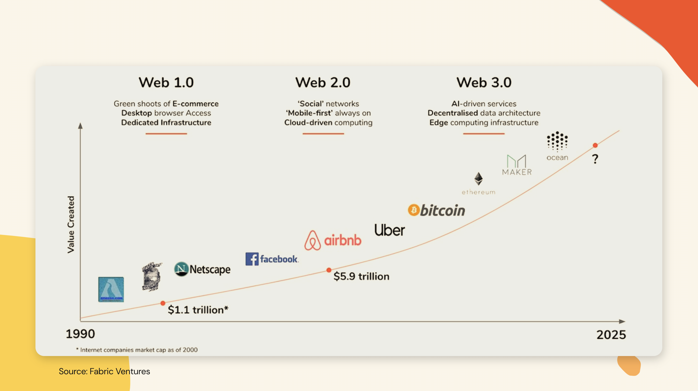
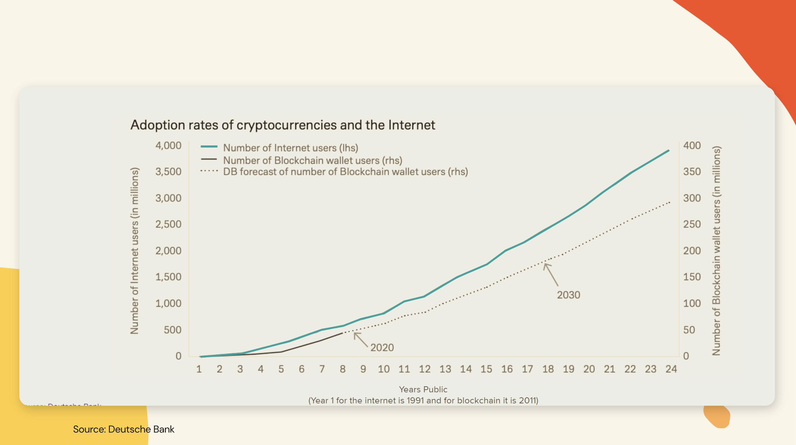
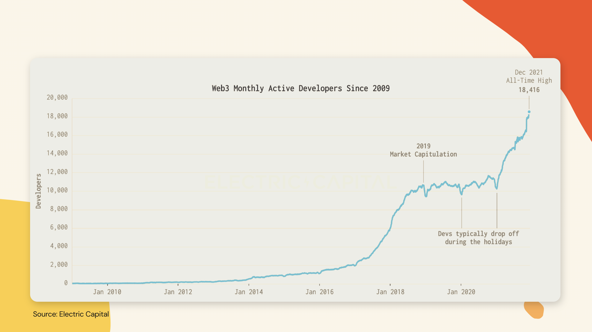
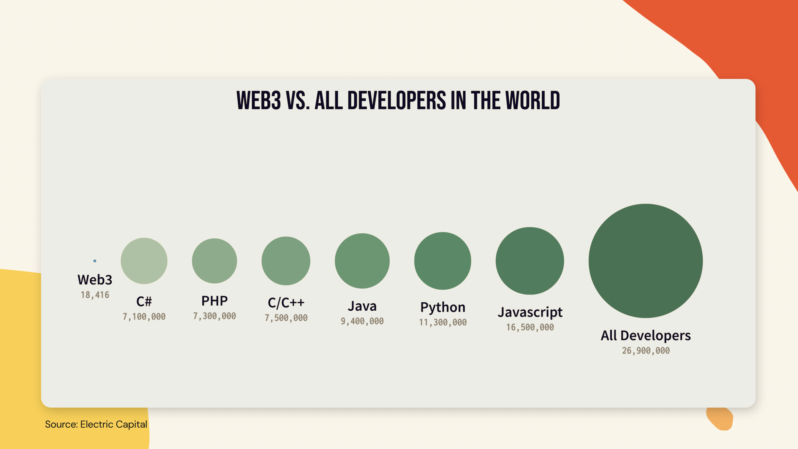
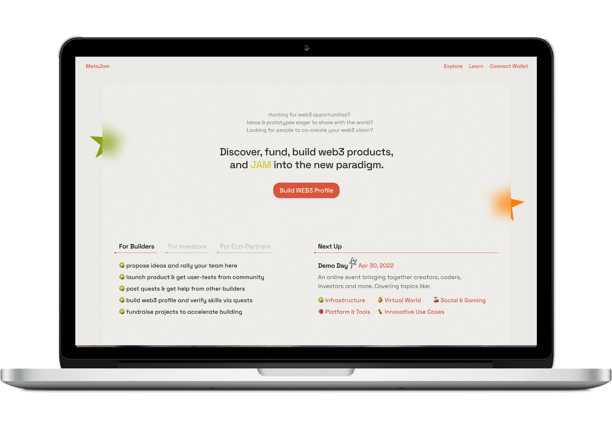
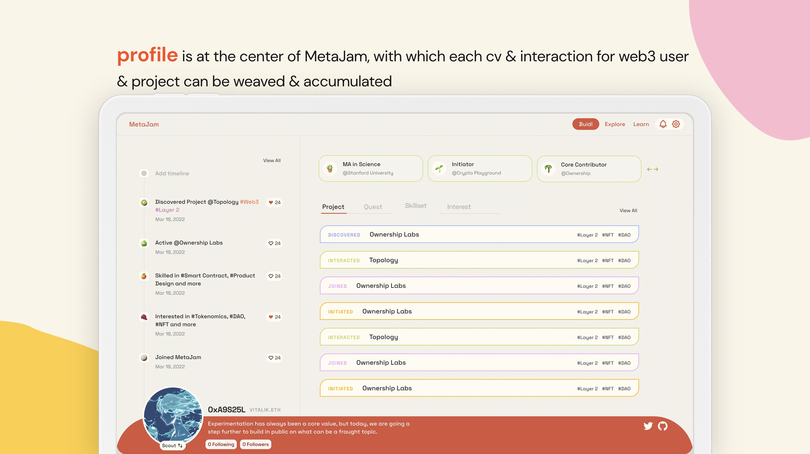
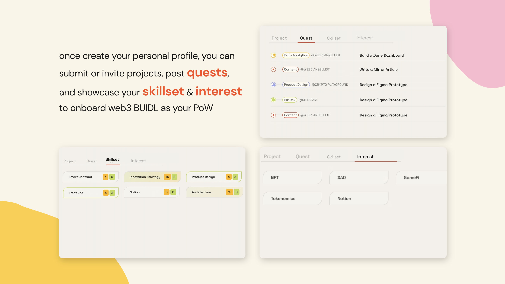
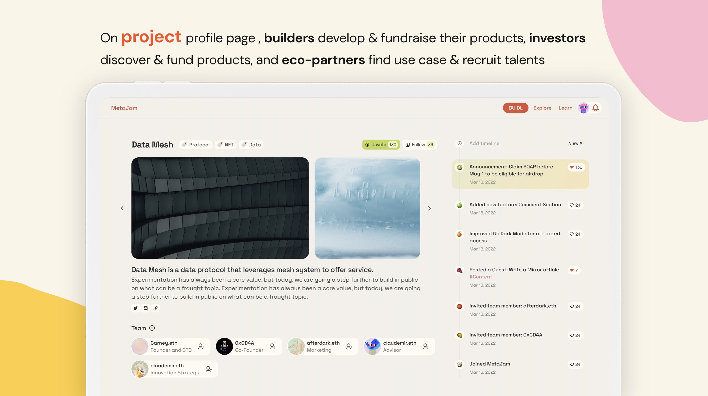
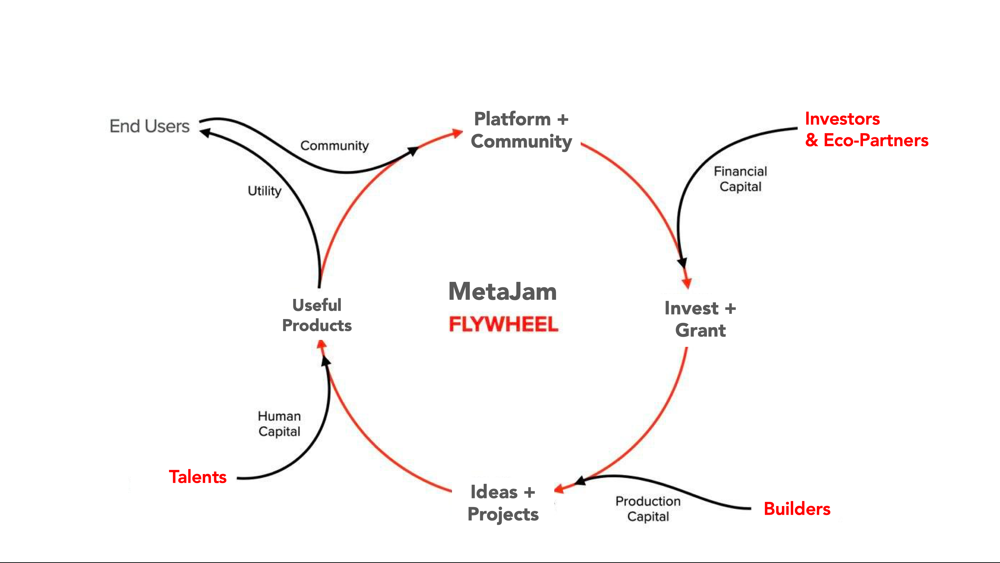
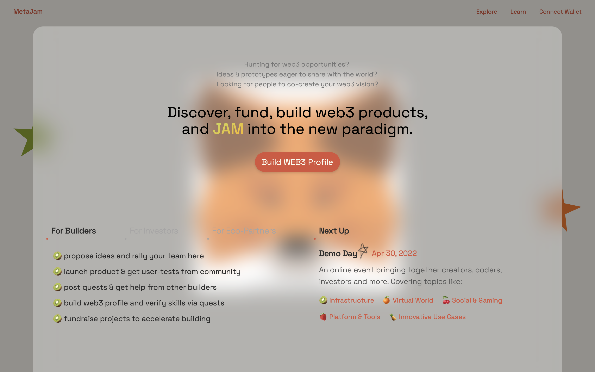

# MetaJam 亮相：帮助勇敢者从创意到产品开发建设 Web3

> 今天，我们上线发布测试版 MetaJam，这是一个人们探索发现、孵化测试和投资 Web3 产品（即去中心化应用，Dapp）的社区。

毫无疑问，我们正在进入 Web3，一个由所有人拥有、分享和共治的，更好的互联网。

以传统互联网大规模普及的历程来对照，今天 Web3 的发展正如当年 1997 年的互联网。

Web3 正在迅速普及，不仅以加密钱包用户数量这一指标来衡量，而且，我们还看到，2021 年加入 Web3 的开发者数量比历史上任何一年都要高。

然而，这仅仅是 Web3 BUIDL 的开始。

- 自 2021 年以来，越来越多的建设者（Builder）和投资人已经开始涌出 Web2 世界 ALL IN CRYPTO —— 根据 Crunchbase 的数据，去年共有 273 亿美元的资金投入 8785 家 Web3 原生公司，其中 60 家成长为 Web3 独角兽；
- 与此同时，创历史新高的 18,416 名 月活跃 Web3 开发者数，到目前为止仅占全世界 2690 万开发者的 0.068%。

而且，在新生的 Web3 开发建设中还存在着许多问题：

- 对于**用户**来说，什么是 Web3？如何找到用户体验友好的 Dapp 来享受 Web3 带来的好处？
- 对于**建设者**来说，如何在基础设施、人才、工具、技能和资金供应不足的情况下创建 Web3 产品？
- 对于**投资人**来说，如何发现和投资具有指数级增长潜力的 Web3 产品，以驾驭从 Web2 到 Web3 的投资范式转变？

## MetaJam 亮相

MetaJam 正在建立一个基于 Web3 的社区，人们在这里发现、资助和创建 Web3 产品（即 Dapp）。我们的使命是帮助有胆识的人从想法到产品开发建设 Web3，甚至更多。

_Profile 居于 MetaJam 的中心，每个 Web3 用户和项目的简历和互动都可以通过它来编织和积累_

_创建个人 Profile 后，您可以自己或邀请他人提交 Web3 项目，发布任务，并展示您的技能和兴趣，作为你的工作量证明（PoW）参与到 Web3 的建设中去_

_在项目 Profile 页面上，建设者可以开发他们的产品并进行融资，投资者可以发现并投资产品，而生态合作伙伴则可以找到用例并招募人才_

MetaJam 使用如 Layer 2、NFT、DID 和去中心化存储等一系列区块链技术开发搭建，旨在聚集早期用户、专家、建设者、投资人和生态合作伙伴（如公链、底层基础设施和加密协议等），推动更好更快的开发建设 Web3。

## MetaJam 是如何驱动飞轮来促进 Web3 建设的？

在 Web3 世界，你可能是一名早期用户、一位经验人才，有可能也是建设者或投资人。无论你是谁，你都可以在 MetaJam 上做任何事情，并把事情搞定（我们在下面列出了一些）：

**对于建设者：**

1. 建立你的 Web3 档案，并通过完成各项任务（Quest）来验证你的技能
2. 在这里提出你的想法并召集你的团队、吸引你的粉丝
3. 发布你的任务，并从其他建设者那里获得帮助
4. 推出你的产品并从社区获得用户测试反馈
5. 为你的项目筹集资金，以加速发展

**对于投资人：**

1. 招募星探（Scout）来寻找项目
2. 利用社区的力量来对目标项目进行尽职调查
3. 更快更好的投资项目
4. 使用时间轴（Timeline）功能跟踪项目进展
5. 查看关于项目的社区更新

**对于生态合作伙伴：**

1. 为你的基础设施平台或协议找到用例
2. 整合各种新兴的 Dapp 以建立可组合性
3. 通过验证技能来发现招募人才

MetaJam 正在打造和驱动飞轮，通过以下方式促进 Web3 BUIDL：

- 通过降低建设者（创业者）和投资者的 Web3 产品/应用的筹资/投资门槛，让 Web3 的开发建设更加民主化，并让社区从第一天起就能共同创造 Web3 产品/应用。
- 通过建立一个建设者和投资者互为供需的双边市场来推动 Web3 开发建设的网络效应，并通过嵌入生态合作伙伴、星探、社区用户等的供需关系来加以扩展。
- 促进 Web3 开发建设的可组合性，为生态伙伴（（如公链、底层基础设施和加密协议等）提供一个 Web3 产品/应用的可组合测试平台和协作社区。

## 让我们跃入新范式

现在，我们真诚邀请您连接钱包，通过创建个人档案，提交你的 Web3 项目，或邀请朋友创建 Web3 Profile，来尝试 MetaJam 的测试版。

此外，更多的功能和惊喜正在来的路上：

- 在本周，我们将介绍在 MetaJam 中创建的 Web3 项目
- 下个月，我们将发布 Project 页面，让用户探索并构建项目，并发布 Learn 页面，让你学习上手 Web3 更容易
- 4 月 30 日，我们将定向邀请建设者和投资人参加 MetaJam 的第一个 Demo Day 活动

让我们现在就来发现、构建、投资 Web3 产品，拥抱并加入全新的范式转变中去！

- **官网：** https://www.metajam.studio/
- **推特：** https://twitter.com/MetaJamStudio
- **群组：** https://discord.gg/wXtj2UuedP
