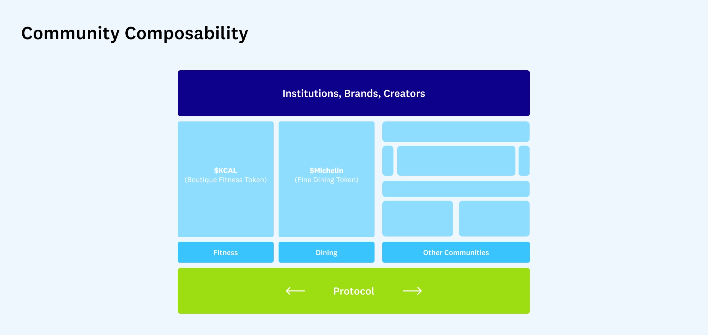

# 「社区可组合性」能否帮助 Web2 用户跃入 Web3？

**作者：** Jenny Wang, Michael Chiang

Web3 已经渗透到主流文化中，从帕丽斯·希尔顿（Paris Hiltion）在《今夜秀》上展示她的 NFT 到 ConstitutionDAO 试图购买仅存的美国宪法副本之一。然而，加入 Web3 仍然是一个面向早期用户的复杂和混乱的过程。有一大群数字原住民 —— 让我们称他们为「Web2.5」—— 他们对加密技术充满好奇，但可能对 Web3 没有足够的热情来忍受其学习上手过程。

如果 Web3 的建设者继续要求 Web2.5 的新用户在没有资产、网络、地位或历史的情况下跳入 Web3 的陌生世界，那么 Web3 要达到广泛的普及采用将是困难的。简化上手程序是一个解决方案，许多新的 Web3 公司正是专注于这个目标。但是，由于文化和技术上的原因，在可预见的未来，上手培训可能仍然会很复杂。这里有另一个想法。如果我们先向 Web2.5 用户展示 Web3 的好处，然后给他们一个跳转的桥梁，会怎么样？我们相信，这个桥梁可能在于「社区可组合性」，这是一个有着几十年历史的计算机科学概念的新变化。

A16Z 的克里斯·迪克逊（Chris Dixon）将可组合性[定义](https://twitter.com/cdixon/status/1451703070589587456)为「像乐高积木一样混合和匹配软件组件的能力……每个软件组件只需要编写一次，此后可以简单地重复使用。」我们正在引入**社区可组合性**这一术语，以描述社区可以像积木一样堆叠在一起，以创建新的社区层。

Web3 的建设者可以通过将他们零散的 Web2 历史统一到一个统一的数字身份中来吸引 Web2.5 用户加入 Web3。虽然社区的可组合性并不是所有类型产品的万能药，但它可以让建设者通过联合充满热情领域中的子社区来创造更有粘性的社区，以及通过允许 Web3 中的任何人向社区成员提供好处和经验来让项目惠及所有利益相关者。

我们目前只是处于消费者加密领域的早期阶段。作为一家新的 Web3 公司的联合创始人，以及之前的 NFT 项目负责人和社区经理，我们已经了解到，真正成功的消费者加密产品必须满足 Web2.5 的要求。社区的可组合性为 Web2.5 用户提供了一种完全「拥有其影响力」的方式。

## 今天 Web3 中是如何使用可组合性的

Web3 中社区可组合性的例子已经存在。不过，重要的是要认识到，在这些场景中，可组合性在很大程度上被用来进一步惠及 Web3 的早期用户。(例如，[DeFi 挖矿](https://academy.binance.com/en/articles/what-is-yield-farming-in-decentralized-finance-defi)给加密原生用户提供了一种方法，通过在不同的借贷市场和新协议之间移动他们的资产，用他们的加密货币赚取更多的加密货币）。相比之下，我们建议通过向 Web2.5 用户解释 Web3 如何实现所有权和数字身份，来扩大 Web3 的用户群。

OpenSea 的竞争对手 LooksRare 最近的成功说明了 Web3 社区可组合性的力量。LooksRare 利用 OpenSea 的交易数据，用 $LOOKS 通证奖励主力用户，本质上是利用了 OpenSea 和 NFT 交易者网络。虽然 OpenSea 仍然是主导平台，但 LooksRare 产生了巨大的交易量，并且作为一个在不到一两个季度内建立的公司，成功地保持了有意义的市场份额。

衍生 NFT 项目，是当前流行项目的分支或混搭，是社区可组合性的另一个例子。例如，「无聊猿猴游艇俱乐部」（Bored Ape Yacht Club），有许多衍生项目试图利用其盛名。有些，如「突变猿游艇俱乐部」（Mutant Ape Yacht Club）和「无聊猿猴养犬俱乐部」（Bored Ape Kennel Club），是由 BAYC 的创造者 Yuga Labs 创造的。其他创作者推断出 BAYC 的艺术、风格和特征，创造了他们自己的非附属项目，如 Jacked Ape Club、Apocalyptic Apes 和 Apes In Space。Azuki Mfers，一个其艺术是蓝筹项目 Azuki 和 Mfers 的混搭系列，已经有超过 360 个 ETH 的交易，尽管创作者与 Azuki 或 Mfers 的创作者没有关联，也没有得到他们的认可背书。这些衍生项目试图将母体项目的社区以及尚未能够参与的外部粉丝聚集在一起 —— 要么是因为入门价格太高，要么是因为衍生艺术和路线图对他们更有意义。通常情况下，母体生态系统的成员并不参与衍生项目。

最后，头像图片（Profile Picture，简称 PFP）NFT 配件项目，或用于装饰 PFP 的数字资产，是更明显的面向消费者的社区可组合性的好例子，因为它们可以通过一个共享市场将多个社区联合起来。[10ktf](https://10ktf.com/) 是一个由 Beeple 支持的项目，它用你的猿猴创造背包或鞋子的 NFT，你也有可能在未来的元宇宙生态中「穿戴」。10ktf 支持一些流行的系列，包括 BAYC、Cool Cats、Forgotten Runes Wizard's Cult 和 World of Women，这意味着只有这些 NFT 的持有人可以参与。古驰（Gucci）最近宣布的合作是一个令人难以置信的里程碑，也是整个 10ktf 社区的胜利，它从目前支持的所有 PFP 中汲取营养。

## 建立一座「Web2 -> Web3」的桥梁

在之前的[《可组合性是创新》](https://future.a16z.com/how-composability-unlocks-crypto-and-everything-else/)一文中，加密项目创始人 Linda Xie 将可组合性的能力誉为加密领域最强大的一个方面：「因为可组合性允许网络中的任何人采用现有的程序，并在其基础上进行调整或构建，它释放了我们世界上不存在的全新用例。」

她是对的。但重要的是要明白，可组合性不仅仅是一个密码学概念，甚至是一个软件概念。Web2 公司经常利用可组合性来扩大他们的客户群，即使他们没有使用这个词。一个有用的例子是咖啡订阅盒创业公司 [Cometeer](https://cometeer.com/)，它每月从流行的咖啡店（如 Joe's Coffee 或 Equator Coffee）邮寄各种速冻咖啡豆。每个盒子里都有客户已经喜欢的品牌的咖啡，也有他们还没有尝试过的新品牌的咖啡。因此，Cometeer 将品牌忠诚者群体 「组合」到他们的客户群中。有针对性的广告也显示了可组合性的作用：公司从现有数据库中寻找客户。

这些 Web2 的例子展示了「客户群」的可组合性，而不是真正的社区可组合性，这导致了同侪粉丝或创作者和他们的追随者之间形成了新的或更强的联系。广义上讲，社区是一群因共同兴趣或身份而走到一起的人。社区是任何加密项目成功的核心。

虽然 Web2 热情空间的社区成员已经成熟，但它们是零散的。健身是一个典型的例子。一个健身爱好者的 Web2「影响力」分散在不同的数据库中 —— Rumble 不接受 Barry 的忠诚度；在 SoulCycle 记录的里程数不在 Peloton 上显示。

建设者可以利用社区的可组合性作为通往 Web3 的桥梁，将健身和其他热情空间中孤立的群体联合起来。在健身的例子中，一个 Web3 的原生平台可以反映出你在不同课程中的锻炼记录，你通过各种健身会员资格获得的所有状态将被整合，形成你的链上数字健身身份。这意味着用户可以拥有自己的全部影响力，并根据自己的历史行为从任何人那里获得奖励。这种假想的生态系统在 Web2 中是不可能的，因为在 Web2 中，社区不能不经允许地相互组成。然而，对于那些加入 Web3 的 Web2.5 用户来说，健身从一个由中心化公司定义的兴趣变成了他们自己的兴趣，并且可以更容易地与其他运动爱好者分享。

我们还没有看到 Web3 消费者应用的真正潜力。但我们可以想象 Web3 的建设者如何利用社区的可组合性。为什么不创建一个新的开发者平台，用 $CODE 通证来奖励 StackOverflow、开源平台 Github 仓库和 r/programming 上最活跃的贡献者？或者，想象一下，用 $MICHELIN 通证奖励来自 Yelp、DoorDash、UberEats 和 Foursquare 的顶级验证评论员，以启动一个可信赖的 Web3 美食社区，这将让那些更关心探索新餐馆的用户加入，而不是购买 NFT（目前最常见的 Web3 手段）。

如果我们能够建立满足 Web2.5 的消费者加密产品，而不是要求他们采用一种新的行为，他们不是更有可能探索 Web3 吗？我们有机会将 Web3 扩展到最早的采用者之外，并展示社区拥有的产品是多么有意义。我们相信，抓住这个机会的团队将获得复合效益，并推动 Web3 的发展。

> **作者简介**
>
> 
>
> Jenny Wang 曾与体育明星、时尚品牌和名人合作推出 NFT 项目。她是 Dogpound 的首席技术官，街头服饰品牌 re-inc 的联合创始人，以及 Techsetters by Kode With Klossy 播客的联合主持人。
>
> 
>
> Michael Chiang 是一位工程师和数据科学家。他曾是 Rumble Kong League 的社区经理，Frontier Talent 的 CTO，以及 The Athletic 和 Twitch 的高级数据科学家。
