# Web3 可组合之旅，7 天后大理启程，你上车么？

> 如今，在国内，除了上海、杭州，Web3 从业者、爱好者最多的地方，非**大理**莫属。疫情 3 年来，来到大理的 Web3 数字游民与日俱增，呈现出指数增长的趋势，正在推动大理成为中国 Web3 ，尤其是 DAO 社区的奇点之一。对 Web3 技术趋势的热忱、对 DAO 治理与自组织精神的探索，今年盛夏在苍山洱海之边迸发。_大理 Web3 街(gāi)会：瓦猫之夏｜ Dali Web3 Summer Fest_ 定于 8 月 19 日 - 20 日举行。

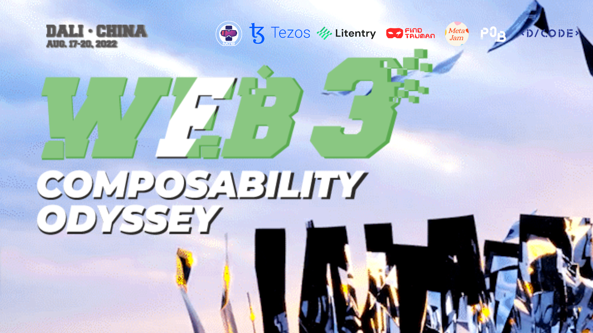

> Web3，作为下一代互联网、支撑元宇宙发展的核心底层，由于区块链、DID、去中心化存储技术赋能赋权，天然具有开放的可组合性。在大理 Web3 街(gāi)会那两天，**「Web3 可组合大理奥德赛」（Web3 Composability Odyssey Dali）主题营地**由致力于连接服务 Web3 建设者的 [M7e 元宇宙特攻队](https://www.m7e.io/)发起主理，活动邀请所有致力于 Web3 可组合性大业的公链、协议、中间层服务、Dapp、DAO、NFT 项目等创始人、技术产品负责人和研究者通过演讲、讨论、演示、工作坊、游戏、大篷车访谈等多种形式交流探讨可组合 Web3 从技术到应用的无穷可能和前景。
>
> **延伸阅读：**

# Web3 Composability Odyssey Dali

## 时间：8 月 19 日 - 20 日 13:00 - 20:00

## 内容：主题丰富 · 形式多样

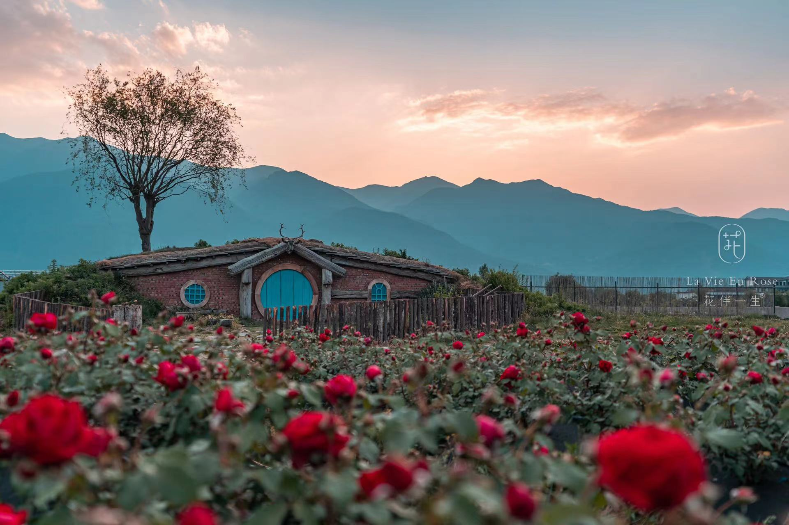

7 天后，大理花伴一生农场，定将成为 Web3 思想创意合作迸发交流、火花四射的自由空间。「Web3 可组合大理奥德赛」主题营地以其丰富的主题内容、多样的活动形式来促成这一场域的诞生。

### 活动板块 1：技术开放研讨串烧

- **主持人：** Kayla
- **预告：** 开放式报名参加的 5-10 人主题研讨会，每个圆桌至少有一位相关领域的技术担当作为嘉宾，由主持人带领话题，从技术、基建、可组合性三个方面组织大家一起探讨 Web3 特定领域的深度洞察。**申请加入，请添加主持人微信号: mskaylawang，发送个人简介以及想参与的研讨会主题。**

### 活动板块 2：Monologue | 为什么 Web3 的自由会比 Web2 多一点点

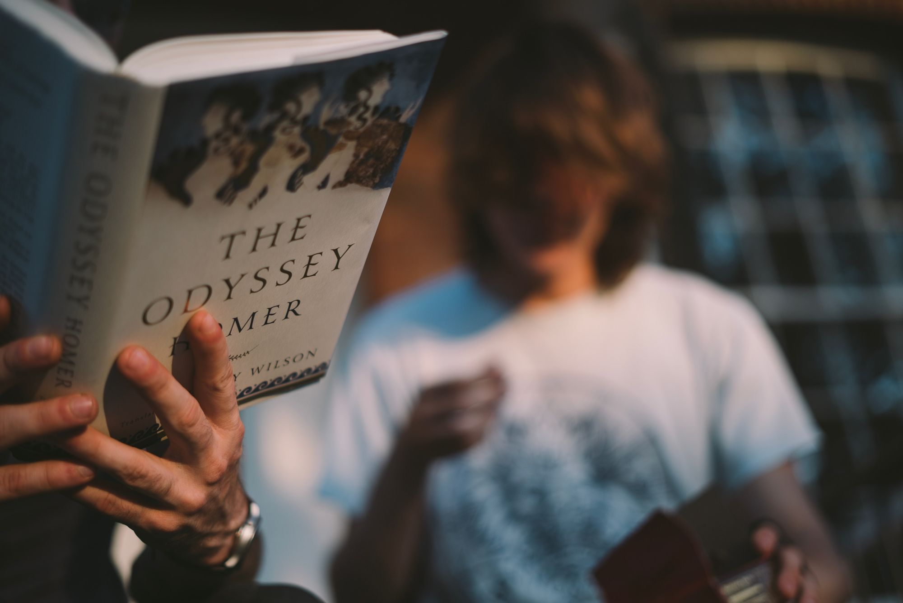

- **主讲人：** 陈序
- **预告：** Web3 的自由会比 Web2 多一点点，多在哪里？为什么？届时请元宇宙和未来资产智库 MetaZ 创始人来讲一讲~~

### 活动板块 3：Tezos Builder 飞镖会

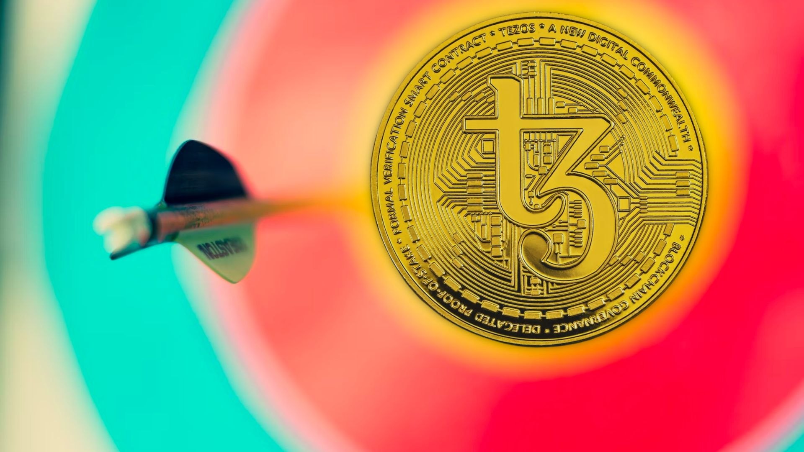

- **主持人：** Echo
- **预告：** 为现场 builder 介绍 Tezos 的黑客松和 Ecosystem Growth Grant（EGG）。开发者每人有 3 次丢飞镖机会，5 环以内即可获得一周内进行 Grant review interview 的机会。参与者都可扫码进群，随时获得 Tezos 即将进行的各种黑客松相关信息，并获小礼品一份。

### 活动板块 4：上车！8 分钟约会 NFT

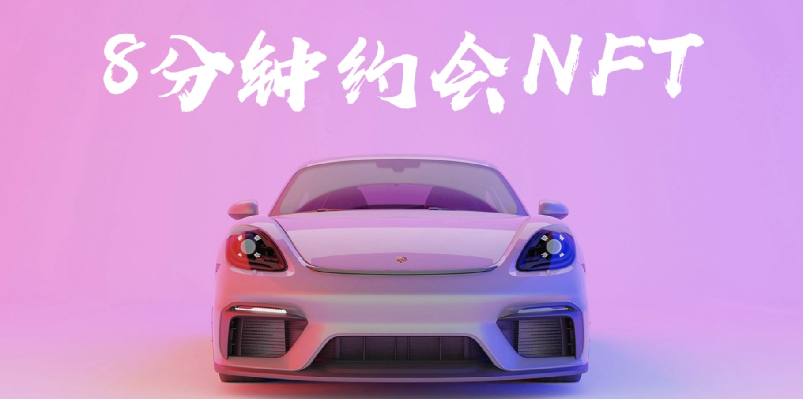

- **主持人：** Bella 墨色如瞳
- **预告：** 来营地边上的大篷车上这个乐高空间，吹吹空调，聊聊 NFT 的认知，你的 NFT 项目，你拥有的 NFT。额外福利：乐高像素小礼品，以及帮你找到项目和人

### 活动板块 5：DApp 头脑黑客松

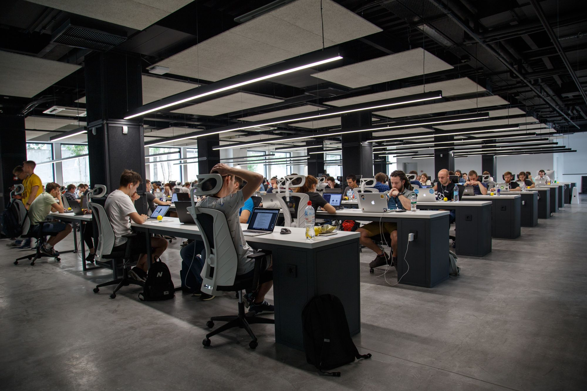

- **主持人：** Carney
- **预告：** 围绕如何构建 web3 可组合声誉系统，一起来脑暴！

### 活动板块 6：Web3 项目速配

- **主持人：** Bob
- **预告：** 借鉴 8 分钟速配活动的娱乐形式让 Web3 项目进行交流和需求合作的对接。

### 活动板块 7：虚拟形象交互及可组合实验

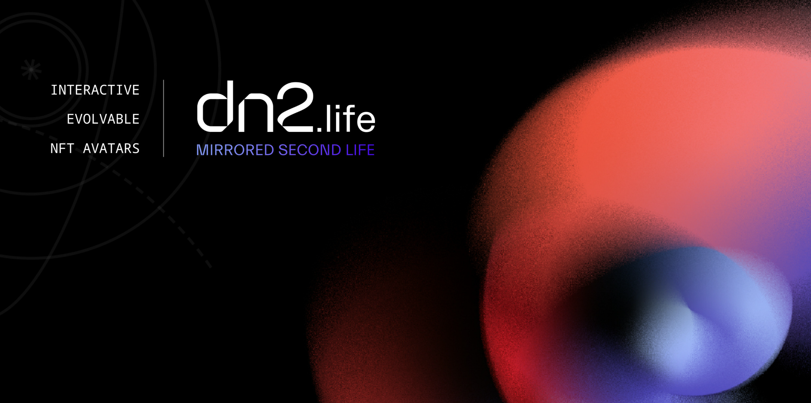

- **主持人：** Jacky
- **预告：** 用户在不同元宇宙拥有越来越多的虚拟形象和虚拟时尚。用一场可组合的游戏实验，摸索打造一套 NFT Avatar 交互养成体系，帮助用户穿梭不同的元宇宙，塑造更强的情感价值的认同和绑定。

### 活动板块 8：剧本杀不就是多元宇宙？

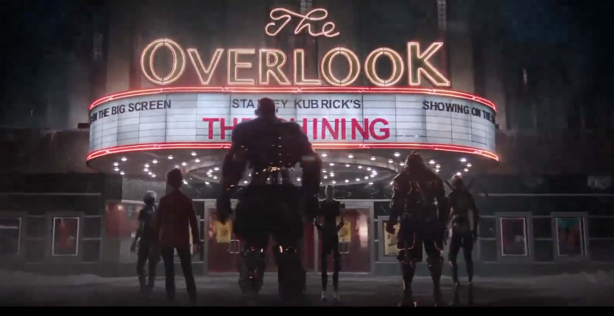

- **主持人：** FindTruman & MultiverseDAO
- **预告：** 第 1 步，领取人物卡（包含人物信息及阶段任务）；第 2 步，完成人物卡上对应的阶段任务；第 3 步凭任务完成凭证领取 FindTruman 周边礼物一份；

### 活动板块 9：Web3 社交神器让你变成最社牛的人

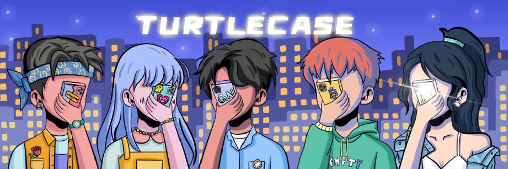

- **主持人：** Anling
- **预告：** NFT 知识问答环节，奖品为 TurtlecaseGang 带 NFC 芯片手机壳，可展示你收藏的 NFT。

### 活动板块 10：阵营对抗之 Web3 元素之力觉醒

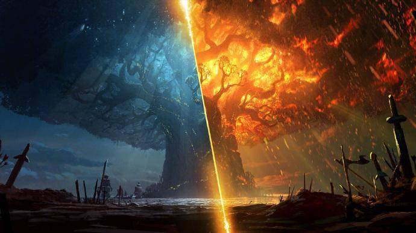

- **主持人：** Lucia
- **预告：** Web3 兴起后，World 世界开始由 Web3 基础协议控制，这种力量被称为「元素之力」，由部分 Web3 实践者和爱好者掌握。PhalaWorld 中存在四大对抗/联合阵营：AI, CYBORG, X-GENE, PANDROID。玩家选择加入其中一个阵营，完成该阵营对应任务，点亮「元素之力」，每获得一个元素之力，获得一个盖章。点亮元素之力最多的阵营获得本次活动最终胜利。

### 活动板块 11：星盘小作坊，解读你的生命密码

- **主持人：** Helen
- **预告：** ISAR 认证占星师现场解盘，结合 NFT、SBT、Web3 交友、元宇宙养宠等各种元素。

### 活动板块 12：瓦猫 NFT 火漆印章领取处

- **主持人：** Kayla
- **预告：** 现场介绍火漆印章制作工艺，满足条件可领取 Web3 大理街会瓦猫图腾印章。

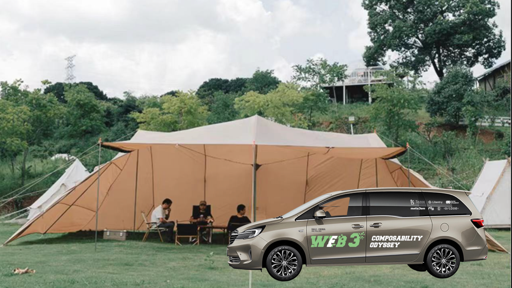

以上只是 Web3 Composability Odyssey Dali 主题营地目前确定的部分活动板块。**主题营地活动板块共建继续开放招募，有意参与者，请加主理人微信（Jeanchen27）沟通。**

## Web3 Builder 欢迎上 MetaJam 报名参与

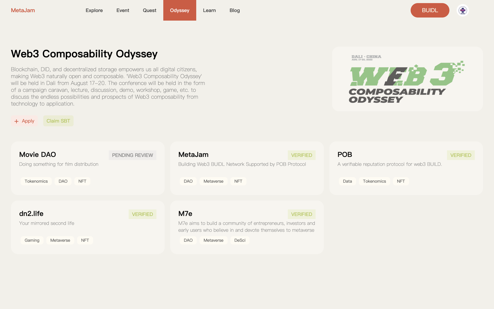

只要你是 Web3 Builder，无论你人在不在大理，都可以在 Web3 项目聚合协作网络 MetaJam 报名参与，上车 Web3 Composability Odyssey。

基于 POB 去中心化工作流协议支持，MetaJam 专辟 Odyssey 板块，任何 Web3 项目方均可在该页面中选择指定的组织，进入到详情页，选择 「Apply」申请加入，创建或选择项目进行提交，审批通过后即可获得 SBT 一枚，全流程完全在 Polygon 链上执行。

**链接：** https://www.metajam.studio/odyssey/web3-composability

## 如何参与瓦猫之夏

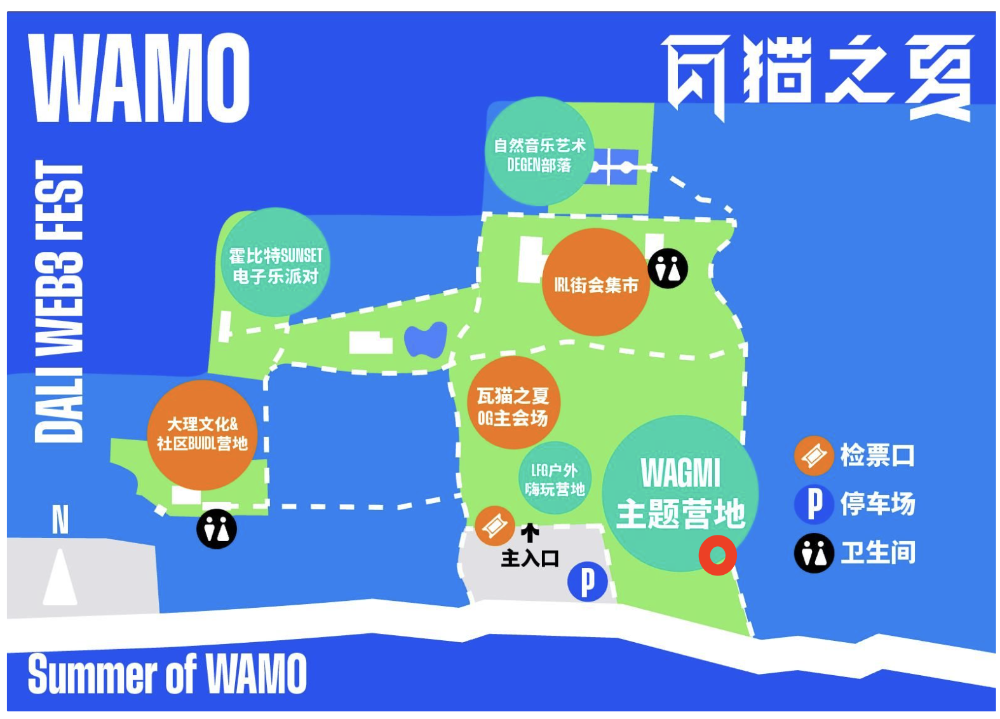

由 M7e 元宇宙特攻队主理的营地活动是瓦猫之夏大理 Web3 街（gāi）会系列活动之一，因此参加需要通过瓦猫之夏的官方渠道，并支付门票费用。门票收入用于瓦猫之夏 Web3 街（gāi）会的场地建设和支持，并不归属 M7e 元宇宙特攻队。同时，瓦猫之夏 Web3 街（gāi）会正在接受募捐，详情请查看：https://mirror.xyz/web3dali.eth

如果你想来玩，点击下方图片报名吧！

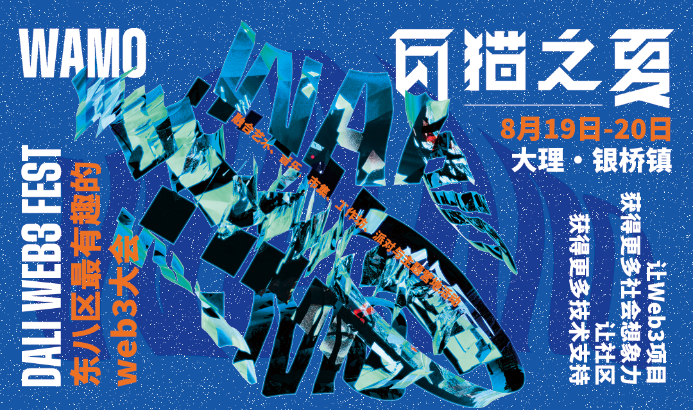

## 常见问题

**1. 大理防疫政策如何？**

截止发文，我们在「国务院客户端」小程序上查询到大理属于常态化防控区域，对于低风险地区的人员采取 3 天完成 2 次核酸的政策。具体政策或者其他特殊情况，可自行查询，或咨询大理市防疫电话：0872 - 2150950

**2. 参加活动有什么费用支出？**

除去活动门票，大家需要自行承担出行和住宿费用。

**3. 是否还能参加其他活动？**

可以。除了主会场和 Web3 可组合之旅主题营地的活动，周边还有很多 Web3 项目方、社区自发组织的活动，比如 **8 月 18 日晚 Tezos 组织的 NFT 沙龙**，以及各种音乐烧烤聊天活动等等。大家可以扫码入群，并关注本公众号活动更新。

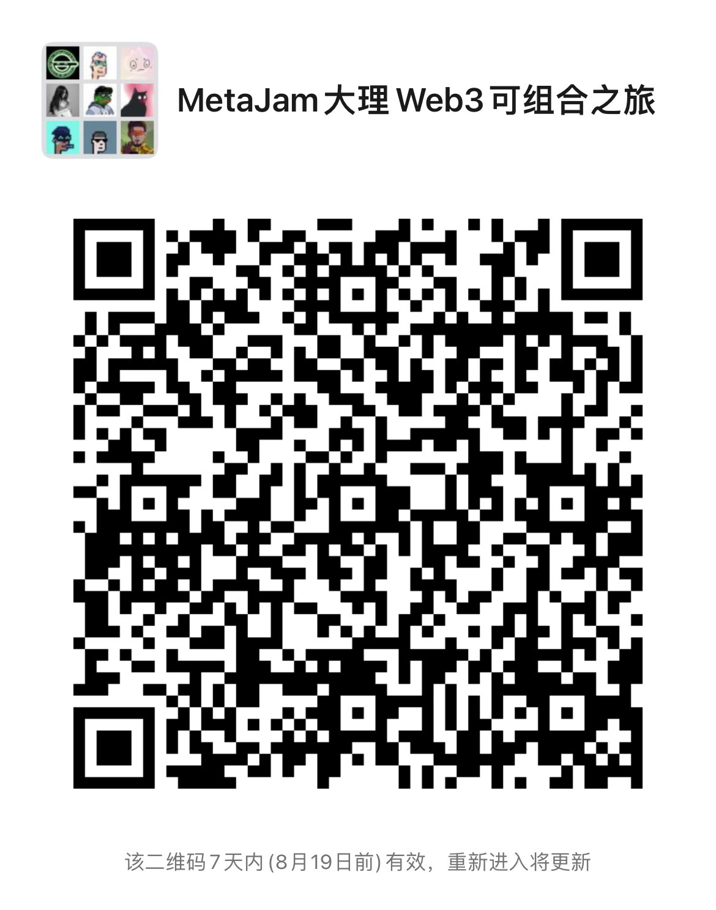

- **MetaJam：** https://www.metajam.studio/
- **推特：** https://twitter.com/MetaJamStudio
- **电报：** https://t.me/+QXy7Qs9LgEFlOTM1
- **群组：** https://discord.gg/wXtj2UuedP
