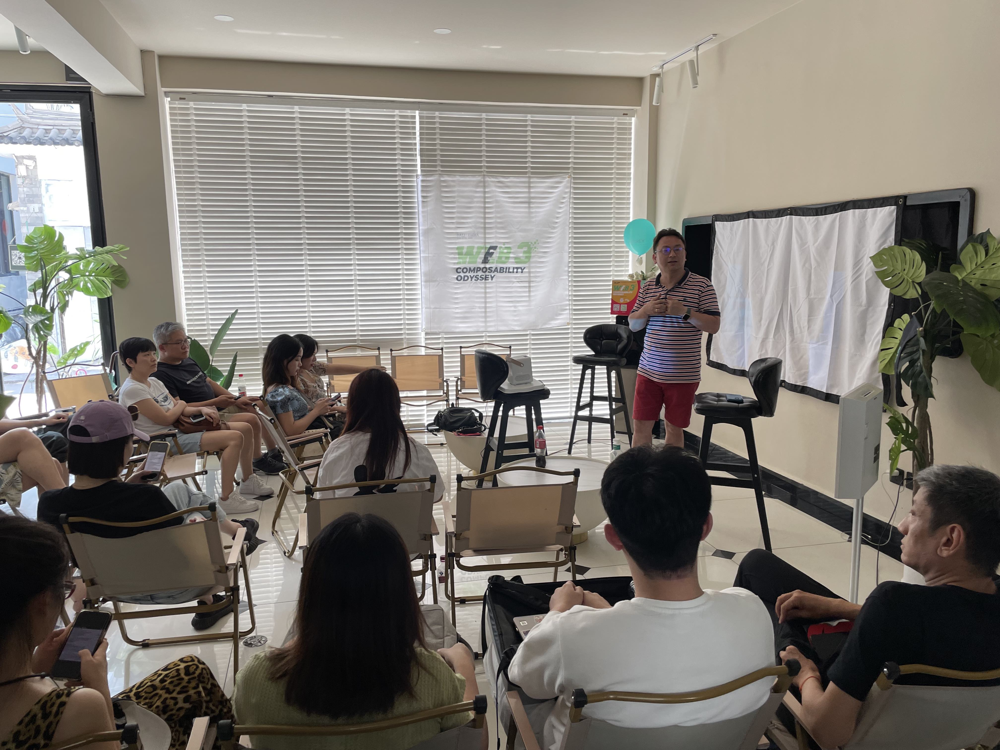

# Web3 可组合之旅，大理只是第一站！

> Web3，作为下一代互联网、支撑元宇宙发展的核心底层，由于区块链、DID、去中心化存储技术赋能赋权，天然具有开放的可组合性。在 8 月 19 日 - 20 日大理 Web3 街(gāi)会（瓦猫之夏｜ Dali Web3 Summer Fest）那两天，**「Web3 可组合之旅大理行」（Web3 Composability Odyssey Dali）主题营地**由致力于连接服务 Web3 建设者的 [M7e 元宇宙特攻队](https://www.m7e.io/)发起主理，活动邀请所有致力于 Web3 可组合性大业的公链、协议、中间层服务、Dapp、DAO、NFT 项目等创始人、技术产品负责人和研究者通过演讲、讨论、演示、工作坊、游戏、大篷车访谈等多种形式交流探讨可组合 Web3 从技术到应用的无穷可能和前景。

OK，以上是我们 8 月 12 日发布的「# Web3 可组合之旅，7 天后大理启程，你上车么？」预告的活动安排。

然而，当我们 16 日中午刚刚登机出发的时候，Web3 可组合之旅大理行迎来第一个变化 —— 因疫情防控形势需要，大理 Web3 街(gāi)会的主会场临时被取消了……

这里就是主会场：大理花伴一生玫瑰庄园。我们 19 日上午去搬运活动需要的帐篷椅时初步勘探了一下 —— 这个优美的露营地值得你流连忘返。

## 8 月 17 日

拥抱变化：人人自主，进一步去中心化的去办一场活动！

原定 17 日的 Web3 可组合之旅香格里拉之行，取消，转战大理古城和喜洲古镇寻找新场地。

最后，我们还是在大理古城 706 青年空间斜对面找到了一家民宿作为活动场地，便于五湖四海来到大理参加瓦猫之夏｜ Dali Web3 Summer Fest 的 Web3er 光临。

（场地视频）

## 8 月 18 日

当晚 8 点，Tezos 主办、元宇宙特攻队协办的 Tezos Cafe Meetup 在苍山半山腰靠近大理大学附近的跳房子咖啡馆顺利举行。

活动主题就是：**在大理，我们拥抱不确定性**。Tezos 中国市场负责人 Echo 介绍了 Tezos 目前吸引 Builder 的计划：黑客松和 Ecosystem Growth Grant（EGG）。EGG 是 TZ Apac 为了支持亚太地区开发者设立的 grant 项目，平均资助金额 1 万美金。TZ APAC 还将设立孵化项目扶持优质项目。活动中，FindTruman、Createra.fun、Multiverse DAO、MetaJam、POB 等项目创始人、负责人分享了各自项目的进展以及对 Web3 行业趋势的展望。

其实，当天下午，已经有多场 Web3 活动在大理古城景区的客栈酒吧举行，吸引一波又一波的 Web3er 涌入又涌出……

# 8 月 19 日

下午 2 点，Web3 Composability Odyssey | Web3 可组合之旅大理行活动正式举行。

M7e 元宇宙特攻队创始人 Jean 开场介绍道，Web3 可组合之旅大理行的想法缘起于去年 12 月 M7e 与 IOSG 在深圳合作举办的[元宇宙嘉年华（Metaverse Carnival）](https://www.m7e.io/post/iosgs-metaverse-carnival)，有感于 Web3 Social 赛道兴起，My Crypto Profile 产品负责人 Kayla 向 M7e 提议今年初在大理举办一场关于 Web3 可组合性技术到应用的研讨交流活动。今天，在 Tezos、Litentry、FindTruman 大力襄助，以及许多 Web3 项目热情参与下，Web3 可组合之旅大第一站活动得以在大理成功举行。

Web3 的开放可组合性，是 M7e 今年开发打造 MetaJam 和 POB 两个产品中深有体会，希望通过 Web3 可组合之旅系列活动去布道 Web3，团结所有 Builder 一起推动下一代互联网早日到来。[MetaJam](https://www.metajam.studio/explore) 是 Web3 项目可组合协作网络平台，[POB](https://www.pob.work/) 是基于去中心化工作流的可验证声誉协议。这两个产品希望通过聚合全球最新最多的 Web3 项目和 Builder，鼓励他们基于可验证的 Web3 贡献记录和声誉展开无许可的协作，创造大量真正能为广大用户所使用的 Web3 产品和服务。

- 陈序主题演讲：「为什么 Web3 的自由会比 Web2 多一点点」

- NFTrust.cc 核心架构师赛博佛客分享：「你的 NFT，你的标识符」

- FindTruman 创始人刘洵梦分享：「剧本杀不就是多元宇宙？」

- 0xgen Labs Helen 分享：「解读你的 Web3 生命密码」

- Phala World Katy 分享：Play to Build

- Zecrey 分享：基于 ZK-Rollup 的二层协议

- Jacky 分享：数字虚拟时尚项目 repit!

- MetaJam 产品负责人 Bob 介绍如何打造 Web3 项目聚合协作网络

- Beryl 策划主持的压轴圆桌「Women in Web3」

与此同时，「上车！8 分钟约会 NFT」访谈、 Zecrey 和 TurtlecaseGang 产品展示在门廊处热热闹闹举行……

## 8 月 20 日

仍然是疫情防控形势需要，让我们拥抱第二个变化：临时取消第二天在原地举行活动。M7e 团队选择驾车环游洱海，在挖色镇鹿卧山洱海之滨，我们向 Dalifornia 致敬，也确定了 Web3 可组合之旅下一站的方向……

在双廊，我们遇到了百姓网创始人王建硕，原本他要在我们 20 日的活动中做一个主题分享《站在史前互联网博物馆看 Web3》，由于没能通过活动快速链接大理的 Web3er，他写下了
《大理，在我心中从 Dailifornia 又变回了 Dali》。

（活动视频）

在 2022 这一黑天鹅群舞、灰犀牛狂奔的年份，憧憬或投身于 Web3 的 Builder、年轻人出于形形色色的需求和情绪自发涌到了云南大理，把它短暂的变成 Dalifornia，苍山洱海临时变身「Web3」和「Opensea」，点燃了对下一代互联网的冀望和兴奋。

**延伸阅读**

- 这几天，Web3 在大理发生了什么
- 流民的盛宴｜预言家周报#185

## Web3 可组合之旅，大理只是第一站！

熊市正是 BUIDL 时。回顾历史，伟大的产品，往往诞生成长于泡沫破灭的低谷期。因此，Web3 可组合之旅（Web3 Composability Odyssey）大理只是第一站，我们将于下个月起在上海、杭州、成都、深圳，以及世界的其他城市继续我们的奥德赛！

欢迎以上 4 城的 Web3er 扫码加入！

- **MetaJam：** https://www.metajam.studio/
- **推特：** https://twitter.com/MetaJamStudio
- **电报：** https://t.me/+QXy7Qs9LgEFlOTM1
- **群组：** https://discord.gg/wXtj2UuedP
