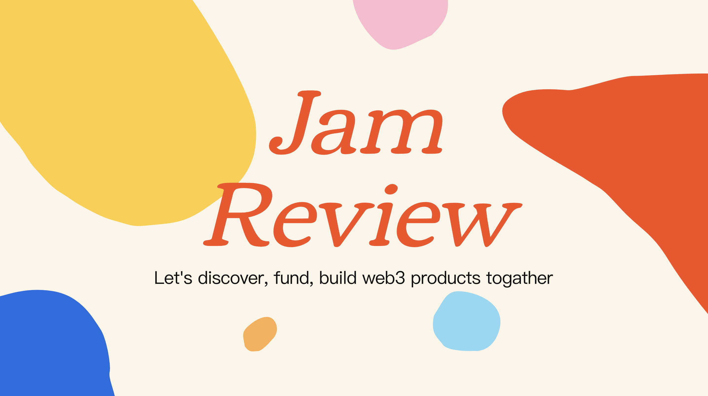
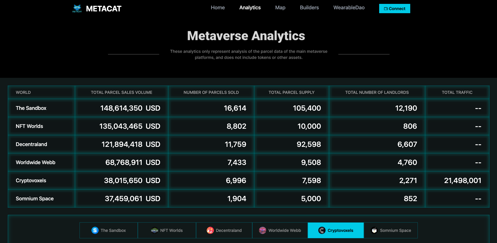
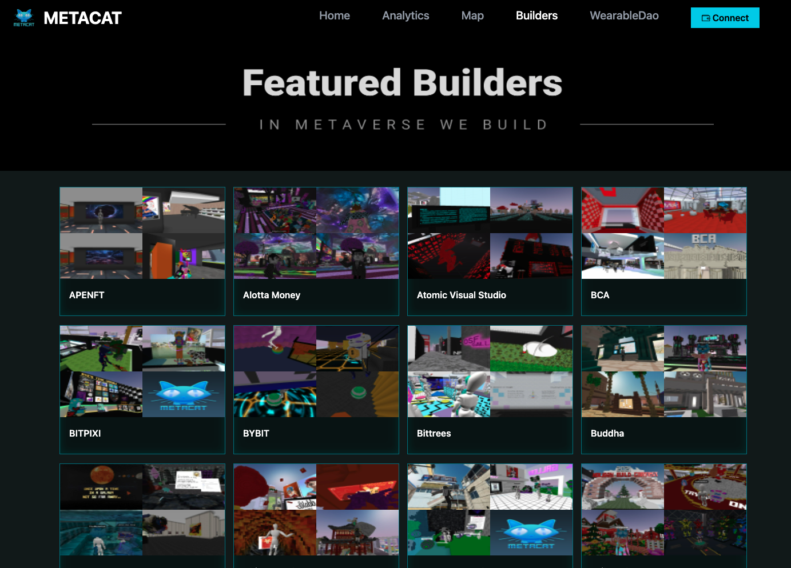
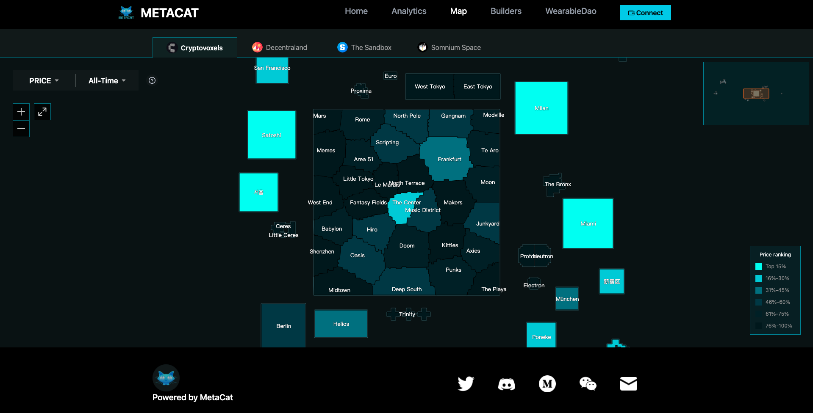
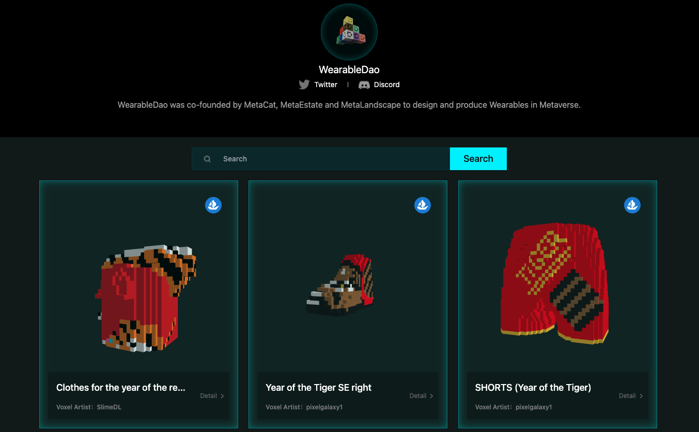

# MetaCat：为你提供元宇宙数据分析及内容导航｜ Jam Review No.5

> 今天 Jam Review 第五期精选推荐元宇宙数据分析及内容导航平台 MetaCat，欢迎所有致力于 Web3 BUIDL 的朋友一起来测试评论，参与帮助这些项目从产品、招聘、社区到融资等各方面的成长。
>
> 目前，MetaJam 的 Project Dashboard 仍在开发，计划于月底月初上线。因此，欢迎大家点击 MetaJam 首页 Jam Review 推荐的产品 Notion 链接https://daox.notion.site/MetaCat-c1ffa8fb10e74a489b856e4d3eecaa00 留言评论。

## MetaCat

> **类别：** 元宇宙
>
> **推荐：** M7e
>
> **官网：** https://www.metacat.world/
>
> **推特：** https://twitter.com/Metacat007
>
> **群组：** https://discord.gg/yRt6be237P
>
> **博客：** https://medium.com/@themetacat

### 你的产品是做什么的？

(video)

MetaCat 专注于元宇宙平台数据分析、内容导航，致力于为大众提供最完备的元宇宙数据分析服务和最好用的内容导航服务。同时 MetaCat 也联合发起了 WearableDao ，致力于探索元宇宙中数字商品的新商业形态，以及在 Web3 语境下创作者经济的更多可能性。

### 你的产品功能带来什么独特价值？

1. Metaverse Analytics：MetaCat 持续追踪并分析主流元宇宙平台的数据表现，为用户提供涵盖元宇宙平台内容、流量、交易等维度的数据分析。不同于其他元宇宙数据分析平台，MetaCat 单独呈现了虚拟土地的数据分析。

2. Featured Builders：MetaCat 依托自身数据能力，汇集了活跃在各元宇宙平台的优秀建设者/建筑机构及其代表作。为玩家提供优质元宇宙场馆推荐的同时，也为 B 端用户提供了一份优秀元宇宙建筑机构清单。

3. Metaverse Heatmap ：元宇宙平台热力图是介于数据分析和内容导航之间的产品，数据分析维度提供了通过地图了解地价的宏观视角；内容导航维度为玩家提供寻找优质场馆及活动的直观途径，此外对于了解不同元宇宙平台的价值逻辑很有帮助。

4. WearableDao：WearableDao 由 MetaCat、MetaEstate、烤仔建工联合发起，合各家之力为元宇宙生产更多优质内容，探索数字消费品、虚拟时尚在元宇宙中可能性。

### 你的产品满足或解决了什么需求或问题？

1. 缺乏专门针对元宇宙虚拟土地的交易平台：元宇宙虚拟土地作为高客单价商品，现有交易平台存在用户体验不佳、商品呈现抽象、数据辅助缺乏等问题；现有 NFT 数据分析平台缺乏单独针对虚拟土地的分析服务。
2. 元宇宙内容生产正反馈机制未形成闭环：一方面元宇宙中的优质内容，未能有效触达用户；另一方面，元宇宙中缺乏持续生产优质内容个人或机构和很好的内容变现渠道。
3. 大众缺乏直观的、综合性的了解元宇宙平台的渠道。

### 你的产品如何在竞争中脱颖而出？

与 MetaCat 同类或相似的竞品有：WeMeta、MetaMetriks、Digital Landowners Society、Milk and Honey Estates、Parcel 等，各家均在元宇宙虚拟土地数据分析方面有产品布局，差异在于对市场的理解、团队背景、生态资源等。MetaCat 是唯一一家亚洲背景，对元宇宙内容非常关注、在元宇宙热力图方面持续探索的团队。

### 你们短中长期的增长路径是什么？

2022 年 Q1：Cryptovoxels、Decentraland 数据分析、优质内容导航、热力地图

2022 年 Q2：

- The Sommnium Space、The Sandbox 热力地图
- The Sommnium Space、The Sandbox、NFT worlds、Webb 数据分析
- 元宇宙租赁平台上线：优先从 Cryptovoxels、Decentraland、The Sandbox 开始
- 探索除 ETH 以外的其他链上元宇宙平台，并形成数据分析图表&价格热力图元宇宙平台中英优质文章集锦

2022 年 Q3：

- 元宇宙土地估值模型
- MetaCat 会员增值服务，提供多维度、更细致的数据服务。

2022 年 Q4：初步形成一站式元宇宙平台信息汇聚地、流量聚集地（你想了解的元宇宙信息，都在这里）：

- 信息汇聚：优质建筑指南、租赁平台、地价流量热力图、优质 wearable、交易数据波动、文章资讯类等；
- 流量聚集：地主与玩家、建筑师和建造需求者、出租方与承租方、购地者、投行、wearable 购买方和提供方、媒体类入驻

2023 年：

- 拓宽网站元宇宙平台信息的深度和广度，使不同层次（小白用户、高级玩家）能各得所需。
- 增加网站曝光，进一步提高网站浏览量；探索广告模式、NFT 持有和网站浏览的结合商业模式的运用。

更多交流讨论，欢迎加入 MetaJam Discord 的 Jam Review 频道：https://discord.gg/F3bkBDk5mK
