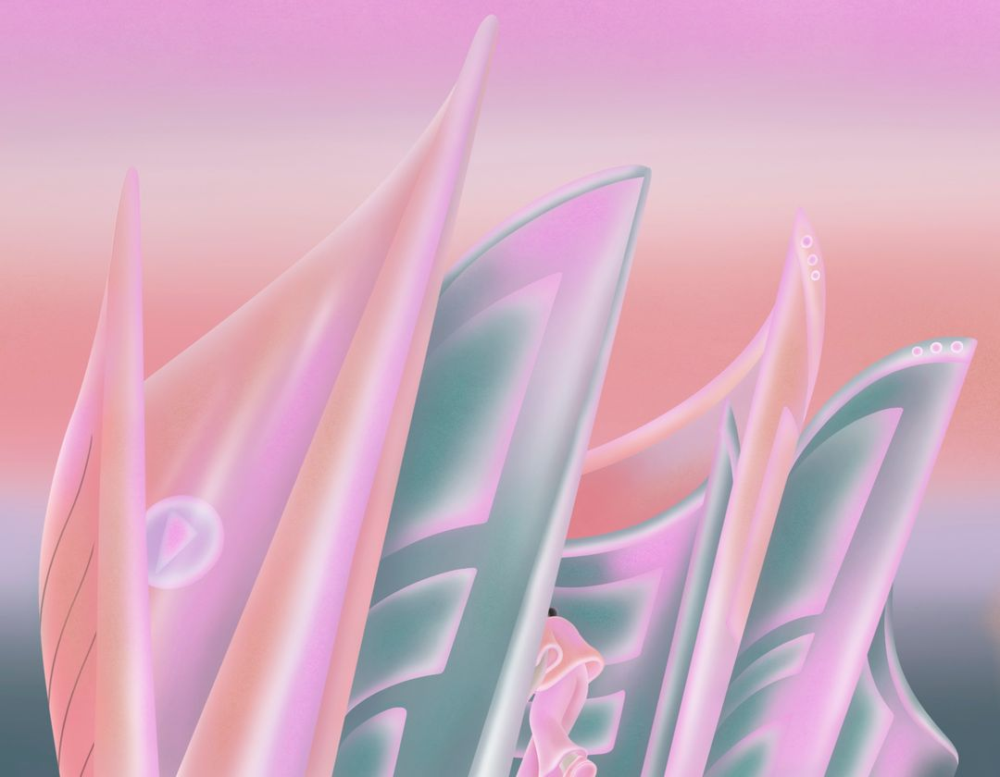
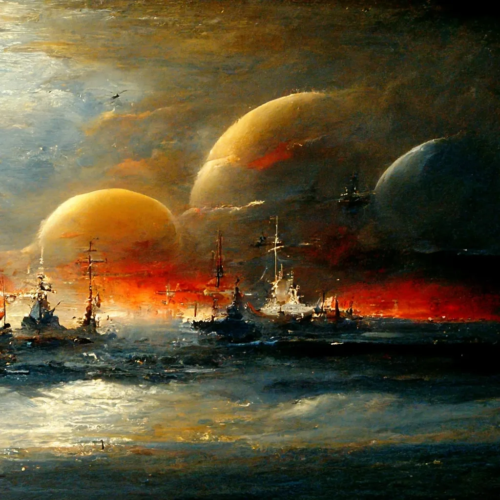

# 无尽媒体

> ChatGPT 是迈向一个由人工智能产生的无限的、可定制的内容世界的最新一步。它的出现将影响我们创造、消费和商业化媒体的方式。

**作者** Mario Gabriele

## 摘要

如果你只有几分钟的时间，下面是投资者、经营者和创始人应该了解的无尽媒体。

- **人工智能是一个能力越来越强的媒体创造者。** ChatGPT 是人工智能令人匪夷所思的能力的最新表现形式。模型可以写文章，写诗，产生图像，并生成视频。
- **们可能正在进入一个「无尽媒体」的时代。** 人工智能不仅是一个有能力的创造者，而且是一个即时的、经济的创造者。随着时间的推移，它可能会在各种媒介上与人类的能力相媲美或超越，导致一个电影、漫画或小说创作可以按需进行，无休无止的世界。
- **无尽媒体可以加强现有 IP 的价值。** 版权在我们的文化中占主导地位，特别是在电影和电视中。然而，大的 IP 版权往往必须花大钱把他们的最新作品变成现实。人工智能可以提供成本和时间上的节约，从而一步步释放价值。但是，虽然它可能对 IP 持有者有好处，但它也威胁到他们，让每个人都更容易创造高质量的媒体。
- **艺术家、作家和其他创作者将需要适应。** 一些创作者将看到巨大的效率提升，其他许多人将变得过时。随着人工智能的改进，对人类艺术工作的需求可能会消失或大大减少。
- **共享的文化参考可能会消失。** 尽管社交媒体的注意力被碎片化，但仍有共同的文化接触点。一旦媒体可以通过无限定制的选项按需生成，这将会消失吗？人们聚集在一起闲聊的时刻可能会越来越少。

在琐碎的痛苦中，很少有像完成一本好书那样的痛苦。这是一种奇怪的心碎，同时又太大或太小。你正在失去一个包含人物、斗争和意义的完整世界 —— 但这个世界完全是虚构的，对你的生活没有真正的购买力。

一个故事可以由它的结局决定，也可以由它的结局毁掉，这是任何作家或电影人都知道的事实。海明威写了 47 个版本的《永别了，武器》，以便「把话说对」，而库布里克则对《闪灵》的结尾大费周章，直到最后一刻才下令销毁剩余的片段，以便没有干扰者可以重新安排他的构思。

请允许我用我最好的广告语来问：_如果有另一种方法呢？如果你所知道和喜爱的故事根本不需要结束呢？如果你可以永远阅读你喜欢的书或观看你喜欢的电影呢？_

像大多数信息广告一样，隐含的产品听起来太神奇了，不可能是真的 —— 就像博尔赫斯为比利·梅斯（Bill Mays）写的文案一样。在人类历史的总和中，这一直是事实。它可能不会再保持这种状态了。

生成性人工智能的迅速成熟，与其说是「破坏」了媒体创作 —— 仿佛是一只恼人的大黄蜂在敲打玻璃窗 —— 不如说是将其解构了。通过人工智能算法，可以迅速而廉价地产生令人惊叹的图像和合格的文字。就像早熟的孩子一样，现有的模型似乎不可避免地会改进，新的技能也会增加，直到创作一部新的海明威小说或希区柯克电影并不比用 Midjourney 生成图像或用 OpenAI 的最新推出的 ChatGPT 生成短篇故事更棘手。

这对内容生产意味着什么？它将如何改变我们的消费方式？谁会赢，谁会输？在一个无尽媒体时代，叙事对我们意味着什么？

## 走向无止境

首先，再定义一下。当我们说「无尽媒体」时，是什么意思？

从根本上说，我们正在谈论媒体制作和消费方式的转变。人工智能将使它能够按需产生，而不是按情节创造。如果你想让 JK·罗琳或乔治·RR·马丁再写一本书，你必须等着他们来做。根据他们对写作的兴趣程度，这可能需要一段时间，几年，几十年。

电视节目、音乐专辑、游戏和其他各种形式的媒体也是如此。创作过程取决于人力资本，这需要时间。

相比之下，人工智能没有人类的限制。它能以更快的速度处理和生成信息。虽然它还没有能力制作一部著名的 HBO 电视剧，但我们已经看到它有能力写博客文章或比人类更快地创作图像。一张 DALLE-2 的图片对于一个人来说可能需要几周或几个月的时间来制作，但这个模型在几秒钟内就能生成。

一旦媒体可以即时生成，它将改变我们的消费方式，因为我们的欲望将不再受到内容可用性的限制。如果你想再读一本《指环王》，村上春树的短篇小说，或玩一个《死亡救赎》式的游戏，你不需要等待他们的创作者的努力（或复活）。你只需导航到一个平台或另一个平台，就会产生一个新的作品。

你还将以不可预见的方式定制你的媒体，指定背景（输入：新朋克中土）、情节结构（输入：比尔博、萨鲁曼和一个精灵的三角恋）、语气（输入：黑暗喜剧）以及任何数量的其他变量。创作原创叙事几乎是轻而易举的，而且 —— 取决于版权的执行情况 —— 创作粉丝小说式的混搭可能同样简单。

这就是我认为即将到来的无尽媒体世界。我们今天有多接近？

为让这一运动出现，生成性人工智能必须在三个方面取得成功：

1. **质量。** 人工智能必须能够创造出质量足够高的媒体，以维持注意力。最终，它应该能够创造出与人类相当或更高质量的媒体内容。
2. **速度。** 按需模式的出现需要多快？我怀疑这将因媒介的不同而有很大的差异。当你在通勤时，为每一首新产生的歌曲等待几分钟是不可能有吸引力的，但是为了制作一部新的电影，这可能可以接受。
3. **成本。** 媒体生成将需要更加经济。具体来说，它必须足够便宜，让消费者通过直接付款或关注来证明其成本。

根据你的基准，人们可能会说，人工智能要么已经达到了这些标准，要么还差得远。像 Midjourney 这样的产品使人们可以很容易地在几秒钟内以几分钱的价格生成一个令人愉悦的图像。当我要求它创造一个特纳式的外星海景，在日落时分有护卫舰在战斗，它梦见了这个：

相当不错!奇怪的是，我为它感到骄傲，好像我的提示显示了品味或智慧。看看我们对我们的合成作品有多大的依恋或疏远感，将会很有趣。

OpenAI 的 ChatGPT 功能 —— 使用被称为「GPT-3.5」的新的先进模型 —— 让人们更清楚地了解到 AI 是多么强大的作家。我要求 ChatGPT 以科马克·麦卡锡（Cormac McCarthy）、村上春树、雪莉·杰克逊（Shirley Jackson）和奇努阿·阿切贝（Chinua Achebe）等作家的风格创作几个短篇小说。ChatGPT 似乎还不了解风格。它主要是围绕着作者最喜欢的词汇、主题和环境，而不是真正模仿句子结构。对纳博科夫的模仿有一个美丽的女人，但没有尝试他的调皮的文字游戏；对麦卡锡的印象有一个坏境的设置和无赖的主人公，但不敢尝试与他的奔放的散文相匹配。

然而，其结果却好得吓人。有说服力的，有趣的，并充满了相关作家的气息。故事在几秒钟内产生，而且是完全免费的。诗歌的实验表明，GPT-3.5 也能理解押韵和韵律。

如果你的媒体消费完全由漂亮的绘画和扎实的短篇小说组成，你已经可以有效地享受无尽媒体。更复杂的产品仍然遥不可及。我们似乎还没有接近制作一个可以取代《继承》的电视剧或安妮·卡森（Anne Carson）可以写的散文诗。

这篇文章的其余部分是纯粹的思想实验还是实际讨论，取决于你如何回答这个问题：我们会到达那里吗？从人工智能生成的博客文章和漂亮的图片到司汤达、斯科塞斯和斯威夫特（两者）的传真，是否有一条技术上可穿越的道路？如果没有，那么我们可以保留我们的人类天才理论 —— 人工智能将处理讨厌的和衍生的东西，把伟大的艺术和伟大的媒体留给人类创造性的头脑。如果是这样，那么我们剩下的问题就是时间问题。它是早到还是晚到？下个十年还是下个月？ (或者，可怕的是，明天？)

甚至在今年结束之前，我们可能会看到相当大的进展。如果传言属实，OpenAI 的 GPT-4 预计将在 2022 年 12 月至 2023 年 2 月之间推出。虽然细节不多，但它被说成是一个重大的飞跃。对生成性人工智能的快速进展下注，越来越觉得是一种站不住脚的立场。

## 价值转移

在一个无尽媒体世界里，价值在哪里产生？我们应该期待什么样的转变？

在考虑无尽媒体的时候，传统上希望有价值的 IP 持有者能从中受益。如果你拥有《哈利·波特》系列电影的版权，那么按需廉价地生成无限媒体的能力将是一个巨大的利好。你将把生产成本降低到接近零；更棒的是，你将能够更好地实现客户的货币化，增加频率、可靠性，以及可能的终身价值。与其每隔几年掏出 20 美元买一张电影票或一本书，粉丝们可能会每月支付 20 美元来访问一项服务，分享来自波特宇宙的新内容，或者让客户自己产生这些内容。

顾客不会感到厌烦吗？有些人可能会。但粉丝小说和粉丝论坛的流行表明，消费者正在寻找方法，在传统的发行之外发挥他们对版权的痴迷。好莱坞最可靠的表演者往往是翻拍或续集。2017 年的一项研究发现，有史以来收入最高的 50 部电影中有 41 部建立在现有的 IP 上；重拍或续集的数量从 1981 年的 16%上升到 2019 年的 80%。迪斯尼一直特别关注这些动态，并善于利用这些动态。通过其「迪士尼+」订阅服务，它已经将《星球大战》和漫威等票房大作扩展为可流传的系列。

IP 持有人获利的程度可能取决于他们被允许如何积极地保护他们的资产。由于可以从粉丝身上赚取更多的钱，版权诉讼正变得越来越多，关闭未经授权的游戏、商品和体验。虽然保护 IP 持有者是有好处的 —— 特别是在谈到在世的艺术家或作者时 —— 但过度的管理可能会限制进一步的创造力。

大型语言模型背后的公司对 IP 的使用采取了不同的立场，说明对源材料的获取如何影响你可以制作的内容。

一周前，当我在 OpenAI 中输入「哈利·波特」这样的词汇时，出现了一条信息，称该搜索违反了该公司的内容政策。当我今天再次尝试时，我没有遇到这样的摩擦，愉快地产生了一系列的 IP 热点：哈利·波特吹着神奇的萨克斯，米奇老鼠与皮卡丘击掌合十，新朋克卢克天行者用光剑烤棉花糖。

尽管 DALLE-2 允许这些提示，但它很难产生高质量的图像。试图生成像 Hello Kitty 和 Pacman 这样的人物，产生了无法识别的结果。将它们与 Midjourney 相比，你会看到一个明显的区别。类似的提示产生的图像质量更好：

(我搞不清楚为什么，但 Midjourney 很难理解两个角色击掌的想法。不过，米卡丘还是那么可爱！)

是什么造成了这种差异？可能是模型在训练期间接触到相关图像的程度。为了避免版权问题，OpenAI 似乎已经确保它对 Hello Kitty 或 Luke Skywalker 的样子的理解有所减少。Midjourney —— 以及 Stable Diffusion —— 似乎有较少的顾虑。

许多最有趣的无尽媒体将依赖于全新的 IP。与其输入「给我一部新的《星球大战》电影」这样的提示，我们将可以说，给我一个原创的太空幻想。快乐的意外将比比皆是，机器智能会产生让我们惊讶和激动的故事，形成全新的粉丝热爱。特别是如果对受到积极保护的 IP 的访问受到限制，这些作品中的许多可能会有更好的质量。(另一篇文章的主题：如果我们不小心，什么样的叙事可能被人工智能模型制造者偷运到新媒体中？)

谁将拥有这些原创内容？建立这个模型的公司？帮助你创建它的平台？还是你，提示者？这也将是一个有争议的问题。例如，DALLE-2 允许用户出售图片，但一些律师认为这些条款是矛盾的。

无论所有权如何，我们应该期待大量的内容，而目前的内容看起来很古板。至少在某些方面，这对用户来说可能是一个有意义的胜利，他们第一次能够在他们想要的时候产生他们想要消费的东西。你在寻找一本以 18 世纪日本为背景的奥尔罕·帕慕克（Orhan Pamuk）风格的神秘小说，以便在火炉旁欣赏？或者想在下一次飞机旅行中观看一部以不久的将来为背景的黑暗喜剧般的英国侦探剧呢？所有的心情、奇思妙想和偏爱都可以得到满足，因为它们出现了。

如果考虑你想产生什么感觉太累了，你也可以潜入其他用户产生的越来越多的无限内容中去。新的平台将帮助我们对这些无穷无尽的杰作和罪恶的乐趣进行排名，而工具将把我们的兴趣与这个庞大的汇编联系起来。帮助发现、策划和推荐的产品将积累价值，因为丰富的内容使这三者变得更加重要。

## 使之有意义

我最近一直在思考一个问题：技术让听起来合理的类比变得毫无意义。这个行业的规模和速度超过了我们简化和翻译的能力。当我们试图把一个宇宙塞进一个信箱的时候，丢失了太多的细微差别。

考虑到这一点，我们应该谈谈生成性人工智能在涉及专业艺术家时的巨大不公平性。该行业最强大的模型是在人类产生的数十亿数据点上训练出来的。数以百万计的绘画、漫画、照片、散文和书籍被摄取和吸收，为模型提供素材。人类辛苦开发的独特而奇特的技能突然被整个吞噬，变成了任何人都可以使用的商品。现在，只要能上网，就有可能像梵高那样作画，或像迪斯尼那样制作动画。

这公平吗？在某些方面，这感觉是一个没有结果的问题。它正在发生，并将继续发生。公平与否与它有什么关系？海啸是没有意识的。当技术在这样的时刻兴起时，最好的事情是确保它尽可能负责任地被开发和指导 —— 引导它的力量远离脆弱地区。

答案当然是：不。不，这不公平。而这正是类比显示其局限性的时候。反过来说，人工智能的发展与人类相似。它与其说是在模仿现有的艺术作品 —— 复制粘贴像素或洗刷文字以适应新环境 —— 不如说是在学习。它研究和改进，就像我们一样!

只是，我们无法摄取 50 亿张图片。我们不能看着少数的模仿品而神奇地模仿他们的风格。我们需要超过五秒钟的时间来画一幅教皇坐在自行车上吃苹果的肖像。将人工智能的能力与人类的学习相提并论，抹杀了它的神奇之处，也淡化了它的风险。银河系深不可测的跨度或海滩上沙粒的无穷大 —— 这些是更合理的比喻。

艺术家会适应吗？一些人将被这种技术所推动，利用它来改善他们的工作并节省时间。一个乐观的框架是，艺术工作将被「半成品化」。人类和机器将结合起来，创造出比任何一个人都更伟大的东西。有一段时间，「半人马」是表现最好的国际象棋选手，比单独的人类和无援助的算法都要好。但随着人工智能的改进，人类的干预已经变得越来越多余或适得其反。不过从中期来看，「半人马」可能会茁壮成长，做出令人印象深刻的绘画、电影和书籍。

根据人工智能带来的变化速度，许多艺术家可能成功地转变为相邻的角色：作家成为编辑，画家成为艺术设计师。那些在「世界建设」方面有天赋的人 —— 创造人工智能发挥作用的范围 —— 也可能暂时繁荣。不过，人工智能似乎并没有失去它的胃口。它可能也会吸收这些任务。

在许多方面，我希望我在人工智能对艺术家的影响方面是错误的(我经常这样，我提醒自己)。虽然我对人工智能释放新形式的创造力感到兴奋，但我仍然是……一个作家。一个由手指、拇指、肌肉和灰质组成的混合物，需要食物来运作，需要钱来购买食物。一个文字由机器制造的世界，在经济上是不利的，在自我感觉上是灾难性的(如果我不是一个作家，我是什么？请不要让我走马车夫和点灯人的路）。

一种可能性是，随着丰裕变成超丰裕，我们更重视人类的工作。就像在机器时代有一个手工制品的市场一样，尽管人工智能的效率和经济性很高，但可能会有对人类制造的艺术、音乐、文学和电影的渴望。

除了生成性人工智能为艺术家带来的转变之外，其创造性产出的速度和数量可能对社会产生更广泛的影响。在《去中心化的国家》中，我认为互联网和社交媒体已经迎来了一个「分形真理」的时代。

> 互联网降低了出版成本，消除了守门人，让「出版商」的数量激增。当然，出版商的定义已经发生了根本性的变化，从指一个组织转变为指一个人。现在，每一个发推特或帖子的人都是一个独立自主的出版商，为其他网络公民的信息消费做出贡献。
>
> 在这种扩张的压力下，真理已经变得支离破碎。不久前，个人只从几个新闻来源获得报道。虽然可能有一些不同的意见，但总的来说，对一个特定主题的观点数量是有限的。今天，每一个话题都是通过数千甚至数百万个相互竞争的观点折射出来的。
>
> 在互联网空间的巨大的、不确定的腹地，区分这些观点需要时间和持续的认知能量。由于公民报道的发展揭示了传统出版商的盲点和偏见，消费者不能再简单地默认为相信一个来源，而必须在成百上千个来源中跳转。由于没有仲裁者，而现有的平台又偏向于极端的立场，所以用户会遇到更多不同的和幻想的立场。其结果是产生了分形真理，在这种情况下，每个人都只看到总体模式的一小部分，但仍然相信自己立场的权威。网上分享的每一个新观点都可以被分叉，从而开启进一步的分形。

无尽媒体将产生类似的影响，创造出一个日益分化的文化。尽管互联网已经允许子群体和小众社区繁荣发展，但仍有一些文化现象是跨越性的。例如，如果你是 20 世纪 90 年代生活在贫困线以上的识字儿童，那么你与《哈利·波特》有一些关系实际上是不可避免的。也许你喜欢它，也许你讨厌它，也许你对它漠不关心，但你知道它。而且你可以在这一领域与他人产生联系。每一本大型畅销书、票房大卖、白金唱片和热门电视节目都有这样的变化。虽然它是如此根深蒂固，我们可能很少认识到它；我们有一套全面可共享的参考。

这能在无尽媒体中生存吗？如果我们的消费在定制生成的内容中被分割开来，什么叙述会成为我们文化的一部分？我们会失去什么样的共同语言？

---

「从什么时候开始，任何一首诗的第一行和最后一行是诗的开始和结束？」希穆丝·海尼（Seamus Heaney）写道。

人工智能将负责创造我们一生中的许多奇迹。如果我们的发展方向正确，每个领域都可能看到自己的一部分被改造，从医疗到教育到重工业。巨大的飞跃似乎是可能的。

像这些其他行业一样，媒体将被改变得面目全非，改变我们与艺术、信息和意义的关系。这首诗没有显示出结束的迹象，让电影运行，听着音乐继续播放。

**来源：** The Generalist
