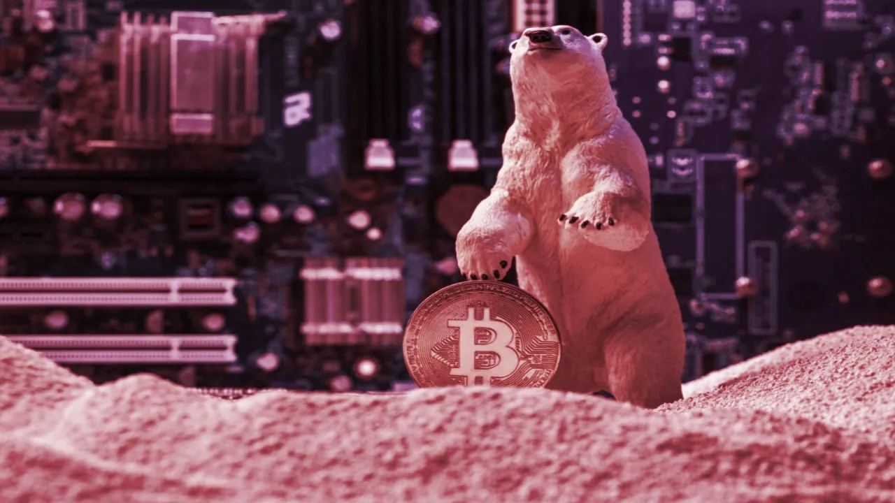

# 2022 年并非币圈最糟糕的一年

> 今天，1 月 3 日，2023 年新年开工第一天，Decrypt 总编辑 Daniel Roberts 撰文表示：Crypto （币圈）在今年结束时，破产、价格下跌，情况非常糟糕。但 2022 年仍有一些乌云边的银线和看涨的理由。

2022 年对币圈来说，是一个可怕、恐怖、不好、且非常糟糕的一年。

币价在第二季度初开始下跌，从未反弹；Terra 在 5 月崩溃，导致 Celsius、Voyager 和三箭资本破产；美国执法机构在 8 月制裁了 Tornado Cash；FTX 在 11 月崩溃，导致 BlockFi 破产，Genesis 和 Digital Currency Group 出现警告信号。现在整个世界都在关注币圈——以错误的原因。

但这一年并不全是坏事。这个行业看到了积极进展的曙光，如果你错过了，或者在 FTX 创始 SBF 涉嫌欺诈的大恐慌中忘记了，那也是情有可原的。

## 以太坊合并

经过多年的等待，以及很多很多次的拖延，以太坊的合并事件在 9 月发生了，并且顺利进行。以太坊是排名第二的加密货币，从比特币使用的能源密集型的 PoW 工作量证明挖矿机制（长期以来一直是环保主义者的出气筒）过渡到用电量减少 99%的 PoS 权益证明机制。

这一转变的影响可能需要几年时间才能被人们理解，但它可以让以太坊在技术普及采用率上处于与比特币相抗衡的地位，甚至有一天，价值也会被提升。虽然 ETH 的价格没有从该事件中动摇，虽然主流的反应感觉是呜咽而不是爆炸，但这并不意味着合并是耸人听闻(它也发生在美国经济崩溃，通货膨胀率飙升，每一种投资资产类别都在下跌的时刻）。

「这是一项巨大的事业，以太坊开发者社区处理得非常好，」以太坊创始人之一、ConsenSys 首席执行官 Joe Lubin 在 10 月告诉我，「我认为，这是围绕着以太坊是否会在未来具有系统重要性的问题的最后一个疑问……而且我认为我们在其他生态系统的同事可能对以太坊生态系统感到更多的尊重。」他们确实如此：甚至以前的「比特币最大主义者」也承认合并的意义。

## 立法势头

在币圈，每个人都把监管作为一个可怕的恶棍来谈论：监管=死亡。这是可以理解的，因为对许多人来说，加密货币的整个原始吸引力是切除中间人，去中心化一切，并存在于政府监管的范围之外。随着时间的推移，人们已经非常清楚，这对大多数项目来说不是一个现实的愿景。看看今年令人震惊的 Tornado Cash 的制裁就知道了。加密货币的未来将比纯粹主义者想要的更加规范，但规范并不一定意味着干涉。

虽然美国证券交易委员会（SEC）主席 Gary Gensler 的声明确实令人不寒而栗，但华盛顿特区的其他关键人物的思想要开放得多，他们正在努力制定立法，以一种不会扼杀创新的方式来监管加密货币市场。参议员 Lummis 和 Gillibrand 已经达成共识，合作制定了一项法案，让商品期货交易委员会（CFTC）而不是 SEC 负责加密货币（对不起，Gary），Coinbase 正在支持另外两项法案（一项来自参议院的 Stabenow 和 Boozman 参议员，另一项来自众议院的 Thompson 和 Khanna 众议员）有类似的目标。

重点是：当币圈每个人都忙于害怕恐慌 Gensler 和 SEC 的时候，有一些令人鼓舞的监管措施正在悄悄发生。甚至拜登在 3 月份的加密货币行政令也应该被视为一个积极的指标：该行政令是一个（温和的）呼吁多个机构在监管加密货币方面达成一致；它没有说「全部关闭」。同时在国外，欧洲议会在 3 月通过了一项加密货币立法方案，其中特别提到「确保欧盟金融服务监管框架有利于创新，不会对新技术的应用构成障碍」。

## 风险投资仍然相信

你可以说他们疯了，也可以说他们痴心妄想，但风投机构一直在向 Web3 投入资金。Andreessen Horowitz（a16z）是 Web3 领域的巨头，为另一个以加密货币为中心的基金（其第四个）筹集了 45 亿美元；a16z 校友 Katie Haun 的 Haun Ventures 为加密货币投资筹集了 15 亿美元；Pantera 为一个区块链基金筹集了 13 亿美元。一系列币圈公司和项目即使在币圈深冬里也得到了资金，包括 Fireblocks（5.5 亿美元）、ConsenSys（4.5 亿美元）、Secret Network（4 亿美元）、NEAR（3.5 亿美元）、Chainalysis（1.7 亿美元）、Keyrock（7200 万美元）和 Ramp（7000 万美元），这只是其中的几个例子。

哦，还有一个叫 FTX 的加密衍生品交易所，在 2022 年以 320 亿美元的估值筹集了 8 亿美元（4 亿美元用于 FTX，4 亿美元用于「独立」的 FTX 美国实体）。

对了，最后一个例子是一个提醒。风投机构可能会做得非常、非常糟糕。他们的工作是把钱扔在一堆东西上，希望有几个能大获成功。但是，即使在 2022 年的一连串崩溃和破产之后，那些腰缠万贯的人仍然想给币圈创始人提供资金。

## 大品牌进入 NFT

是的，价格快起快落的小图片的投机泡沫破裂了。要否认这一点，你需要敲敲你的脑袋。但那主要是 PFP 人群，为一个卡通猿猴掏出了几十万美元。这种疯狂带来了抽地毯般的「跑路」，滑稽的失败的艺术展示，以及「清洗交易」来膨胀一个新市场的销售量。

正如 NFT 领域的多位领头人在泡沫破灭后所说的那样，这种狂热对这个领域来说是不可持续的。「从心理健康的角度来看，这对 Art Blocks 这个团队并不健康，对 Art Blocks 的艺术家也不健康，」Art Blocks 创始人 Erick Calderon 在 gm 播客中告诉我们。

在这之后，随着尘埃落定，真正的用例仍然存在。NFT 只是通证（我相信我们很快就会停止使用所有这些首字母缩写词和行话），可以作为任何需要即时证明所有权的东西，从派对通行证到体育门票，到俱乐部会员资格，到房地产契约。这些都是合法的可能性，让那些能够看透那些似乎被「NFT」这个词触发的嘲笑轻视的人感到兴奋。

信徒们现在包括蒂芙尼、阿迪达斯、星巴克、百威啤酒、Instagram 和 Reddit 等大品牌，它们都采取了拥抱 NFT 的行动——即使在 NFT 交易量暴跌之后(还要向 Polygon 致敬，它被选为其中三个品牌的区块链合作伙伴）。所有这些品牌都是在犯完全和羞辱性的错误么，还是他们有可能是在做什么？

《最终幻想》游戏发行商 Square Enix 的总裁 Yosuke Matsuda 在他的年终信中对 NFT 发出了看涨的声音：「我期望看到数字商品交易的最终规模化，因为它们在公众中变得更加普遍，每个可用内容的价值都被纠正为其真正的估计价值，我期待它们变得像实物商品交易一样习以为常。」

## 币圈媒体保持饥渴

最后，以一个更原初的（不是公司）说明：SBF 的戏剧性堕落是币圈媒体的一个繁荣时期。FTX 的崩溃引发了主流的迷恋，超过了币圈所发生的任何事情——比门头沟、比 丝绸之路、比 The DAO 黑客事件、比 Quadriga 惨败、比 2017 年的突然牛市更引人关注。

自 2011 年以来，我一直在写关于比特币的文章，我的手机和邮箱从来没有被好奇的朋友和家人的这么多询问轰炸过。主流平面媒体和广播媒体都认识到，他们需要了解和报道币圈的情况。我为我们的记者团队如何报道 FTX 的故事感到自豪，同时也很高兴看到我们的一些同行（尤其是 CoinDesk，它的 Alameda 资产负债表独家报道赢得了很多关注）的出色工作。

因此，虽然在加密货币市场处于深冬，最大的新闻是负面的时候说，这听起来可能是矛盾的：这是一个令人兴奋的时间来报道币圈。正如我喜欢说的，它永远不会无聊。我希望你能坚持在 2023 年与 Decrypt 合作，了解币圈的爆炸性新闻、教育、热点和洞察力。
