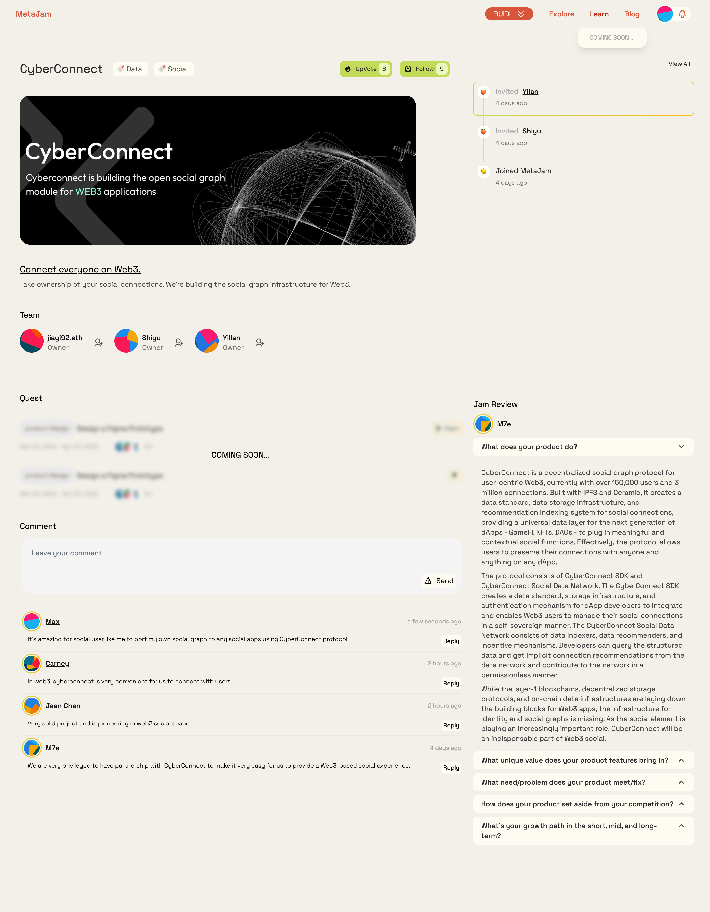
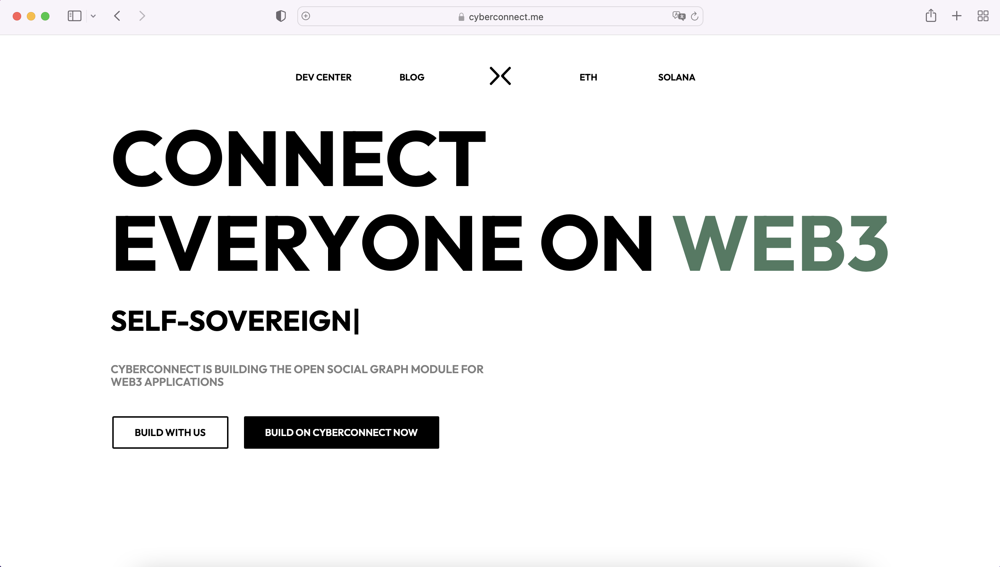

# CyberConnect：去中心化社交图谱协议｜ Jam Review No.7

> 今天 Jam Review 第七期精选推荐去中心化社交图谱协议 CyberConnect，欢迎所有致力于 Web3 BUIDL 的朋友一起来测试评论，参与帮助这些项目从产品、招聘、社区到融资等各方面的成长。
>
> 大家可以通过 CyberConnect 项目来体验 MetaJam 的 Project Dashboard 功能，欢迎点击 https://www.metajam.studio/project/cyberconnect 。

## CyberConnect

> **类别：** 社交
>
> **推荐：** M7e
>
> **官网：** https://cyberconnect.me/
>
> **推特：** https://twitter.com/CyberConnectHQ
>
> **群组：** https://discord.com/invite/bYJ3cB7bbC
>
> **博客：** https://mirror.xyz/cyberlab.eth

### 你的产品是做什么的？

CyberConnect 是一个去中心化社交图谱协议，用于以用户为中心的 Web3，目前拥有超过 15 万用户和 300 万连接。它与 IPFS 和 Ceramic 一起构建，为社交连接创建了一个数据标准、数据存储基础设施和推荐索引系统，为下一代去中心化应用 —— GameFi、NFT、DAO —— 插入有意义的和有背景的社交功能提供了一个通用数据层。该协议允许用户保留他们与任何 dApp 的任何人和事的联系。

该协议由 CyberConnect SDK 和 CyberConnect 社交数据网络组成。CyberConnect SDK 为 dApp 开发者创建了一个数据标准、存储基础设施和认证机制，让 Web3 用户能够以自我主权的方式管理他们的社交关系。CyberConnect 社交数据网络由数据索引器、数据推荐器和激励机制组成。开发者可以查询结构化数据，并从数据网络中获得隐含的连接建议，并以无须许可的方式向网络做出贡献。

虽然第一层区块链、去中心化存储协议和链上数据基础设施为 Web3 应用奠定了基础，却缺失了身份和社交图谱的基础设施。由于社交元素正发挥着越来越重要的作用，CyberConnect 将成为 Web3 社交中不可或缺的一部分。

### 你的产品功能带来什么独特价值？

该协议有 4 个关键属性：

- **自主权：** 我们将社交图谱数据的所有权和用途交还给用户。只有用户对他们的数据如何使用、在哪里使用以及用于什么目的拥有自主权。
- **可移植：** 互操作性是真正开放网络的关键。我们让每个人都能以自己的社交图谱作为 Web3 身份的一部分，在不同的应用之间旅行。
- **区块链不可知：** 该协议不受任何单一区块链的束缚，是为多区块链生态系统创建的。
- **可组合：** 开发者可以通过两行代码轻松地与我们的社交图模块集成。快速启动，并在此基础上敏捷地进行快速迭代。所有这些都不需要专用的后端数据服务器。构建体验而不是墙。

此外，社交连接汇总到导致**整体数字身份**的地址。加上我们的民主化索引系统，这给连接一个全新的多种含义，并带来前所未有的数据价值。

### 你的产品满足或解决了什么需求或问题？

之前在 Web2 中，社交图谱有三个关键问题：

- **巨头垄断：** 行业巨头侵犯了用户对自己的社交图谱数据的主权，以谋求企业利益。鉴于垄断权力，问责制是稀缺的。用户不得不忍受不断变化的平台规则，并冒着被删号和他们的社交资产被拿走的风险。为此，我们让用户能够拥有他们的连接和社交数据，并将数据带到他们喜欢的任何平台。例如，一个有影响力的人将能够把粉丝群带到任何社交媒体应用。
- **孤岛和冗余：** Web2 社交网络是有围墙的花园，以高转换成本留住用户 —— 用户在使用一个新的社交应用时，必须反复建立和声明连接，导致数据孤岛和冗余的社交图。为此，我们让用户能够拥有和维护相同的聚合社交图谱，并配置图谱以适应不同的社交环境。这有助于用户保持一个完整的数字身份，同时在转换环境时保持灵活性。
- **启动困难：** 孤立的社交图谱迫使开发者从头开始建立用户网络。这让产品启动极为困难，使得新项目处于竞争劣势，并随着时间的推移扼杀了用户体验创新。为此，我们为开发者提供了强大的、易于使用的 CyberConnect SDK，以便在此基础上开发建设。开发者可以通过两行代码轻松地与我们的社交图谱集成。通过所有现有的连接立即快速启动，并在此基础上达到网络效应。所有这些都不需要专用的后台数据服务器。

而 Web3 目前的基础设施有两个不足之处：

- **对于正在出现的大量以用户为中心的数据来说，基础设施不足够：** 在 Web3 社交中，每个人都能够形成连接并产生内容，从而产生大量的以用户为中心的数据。这种数据本质上是动态的，并且经常被修改。我们缺乏一个高效的解决方案来支持这种丰富和动态的数据，同时保持用户所有权和便携性的承诺。为此，我们正在与 Ceramic 合作，为可扩展和可变异的数据提供一个具有成本效益的解决方案。
- **连接数据缺乏结构和意义：** 随着数据数量的激增，寻找正确和有意义的连接和内容变得越来越困难，尤其是在社交用例中。我们需要对数据进行结构化和索引，以实现 Web3 原生的发现和查询。而目前占主导地位的面向合约的系统和关系型数据结构不能支持更高级的查询功能。为此，我们建立了由数据索引器、数据推荐器和激励机制组成的 CyberConnect 社交数据网络，其基础是图形数据库。开发者可以查询结构化的数据，并从数据网络中获得隐含的连接建议，并以无须许可的方式对网络做出贡献。

### 你的产品如何在竞争中脱颖而出？

**我们为丰富的社交数据而建设。** 基于智能合约的 Web3 社交协议，如 Lens，是为了在稀缺性驱动的系统中承载社交连接的价值。想想 DAO，NFT —— 正是这里的排他性和有限性产生了价值。而这种稀缺性是人们所希望的，并且在社交通证和社区管理等用例中被有目的地维护。相比之下，在以用户为中心的 Web3 中，每个人都能够并被鼓励形成联系并产生内容，丰富性是其决定性特征。而这种对社会互动和发现的更普遍的需求是所有主要的社交应用，如社交媒体、内容平台和即时通讯工具所要满足的。CyberConnect 提供了一个与区块链无关且节省 gas 的协议，以支持这种丰富且高度动态的以用户为中心的社交数据，同时保持用户所有权和便携性的承诺。

**我们作为一个协议专注于为开发者建设，并与开发者一起建设。** 例如，mem 试图同时做社交图谱、人际关系探索者、知识共享，而我们明确将自己定位为协议的底层，我们将专注于让它为我们的合作伙伴工作并与他们一起工作。

**我们的协议不与特定区块链绑定。** 目前的社交协议在设计上也是与某个区块链挂钩的。例如，Deso 部署了自己的区块链，并在此基础上构建社交功能。我们认为这限制了它们在 Web3 上的扩展能力，而我们的区块链无关的设计让真正的 Web3 社交体验取决于互操作性。

**我们是第一个并且有经过长期测试的信念。** 我们有先发优势，是第一个发布的社交图谱协议。我们现在拥有最大的连接数据，有 15 万用户和 300 万连接，我们支持以太坊、BSC、NEAR 和 Solana，并且我们已经与 23 个项目整合。我们的团队还拥有无与伦比的业绩，对社交和 Web3 有长期坚定不移的愿景，经过 7 年的行业测试和证明，我们之前的项目 DLive 是最大的基于区块链的直播平台，在 2020 年被 BitTorrent 收购。

### 你们短中长期的增长路径是什么？

我们将专注于与我们的项目合作伙伴和开发者社区一起建设，为一个真正连接的 Web3 提供更有意义的社交功能。 请注意更多的协议更新、工具、集成、黑客马拉松、资助和各种社区活动。

更多交流讨论，欢迎加入 MetaJam Discord 的 Jam Review 频道：https://discord.gg/F3bkBDk5mK
