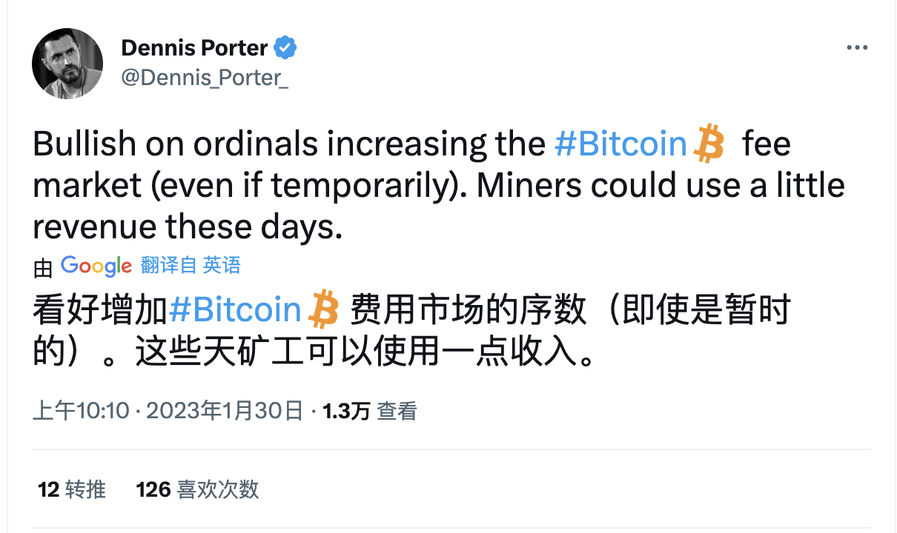

# 16.9 万美元的无聊猿猴 NFT 被烧毁，从以太坊转移到比特币上 | Decrypt 报道

> 编号为 1626 无聊猿猴（BAYC）的持有者烧毁了 NFT，象征性地将其存在转移到比特币网络上。不过无聊猿猴项目方 Yuga Labs 表示这是一个不合法的无聊猿猴 NFT。

一件珍贵的数字收藏品在上周末被永久地从总数为一万的流通中移除，因为它的持有者象征性地将该资产的基础区块链从以太坊转移到比特币。

该收藏品是「无聊猿猴俱乐部」（Bored Ape Yacht Club，BAYC）第 1626 号，是 NFT 领域头部项目里的一个猿猴。它最近一次在 OpenSea 上的销售发生在去年 11 月，当时它以 108 个以太坊的价格出售 —— 在交易时接近 43.2 万美元，今天的价格约为 16.9 万美元。

NFT 是数字资产，具有可证明的独特性，标志着物品的所有权，目前通常表现为数字艺术品。第 1626 号 BAYC 的所有权与以太坊网络上记录的数字通证有关，直到最近为止，它也可以在以太坊网络里进行交易。

数字通证可以通过一个叫做「烧毁」的过程中被永久地从流通中移除，这涉及到将资产发送到一个无法取回的地方。杰森·威廉姆斯（Jason Williams）声称在周末烧毁了第 1626 号 BAYC，以防它至少在以太坊网络中再次被出售。

「本质上就是把一辆兰博基尼扔进一个垃圾压实机 —— 这很有趣，」威廉姆斯告诉 Decrypt，「把臃肿的 JPEG 文件放在比特币的基础链上是否明智另说，但我认为看到它如何发展会很有趣。」

威廉姆斯相信他的猿猴现在存在于比特币上。这是因为第 1626 号 BAYC 被烧毁的地点与一个通过 Ordinal 制作的铭文（Inscription）有关。由 Casey Rodarmor 创建的 Ordinal 是一个允许将视频和图片等内容分配给单个「聪」—— 比特币可分割的最小单位 —— 在比特币的网络上作为铭文永久存在。

尽管比特币上的 NFT 铭文数量已经接近 10 万个，但很少有起眼的市场供人们交易，目前有相当数量的买家和卖家通过 Ordinal 的 Discord 服务器相互联系。

烧毁是通过为 Ordinal 新开发的名为 Teleburn 的功能进行的，该功能为每个新铭文创建了一个独特的位置 —— 在那里，数字资产可以被烧毁。该功能允许用户将另一个网络的现有资产分配到比特币铭文中，同时将其从流通中移除，在创造该新功能的人眼中，有效地在链之间转移通证。

「这个想法是，你是单向、永久地烧毁另一条链上的资产，并将其指向住在比特币链上的 Ordinal，」与 Rodarmor 合作创建新 Ordinal 功能的罗勃·汉密尔顿（Rob Hamilton）说。

汉密尔顿上周六在田纳西州纳什维尔的一个为比特币社区服务的联合办公空间 Bitcoin Park，就开发 Teleburn 功能与 Rodarmor 接触。在汉密尔顿提出威廉姆斯想烧掉他的猿猴后，两人决定合作，后者曾回应过 Rodarmor 的一条推文。

_https://twitter.com/GoingParabolic/status/1624198702691676167_

「我们现在就去写一些代码，」据汉密尔顿说，Rodarmor 认为烧毁猿猴这事让他觉得「非常兴奋」。

截至报道发表时，Rodarmar 没有回应 Decrypt 的评论请求。然而，根据汉密尔顿的说法，在最近的推特上可以看到两人正在开发 Ordinal 的 Teleburn 功能。

_https://twitter.com/ck_SNARKs/status/1624483388378734595_

烧毁第 1626 号 BAYC 并不是 Ordinal Teleburn 功能第一次使用。Rodarmor 首先在他拥有的一个 ENS 域名 rodarmor.eth 上测试了这个新功能。然后他们两人观看威廉姆斯烧毁猿猴。

汉密尔顿说，Teleburn 这个词是由 Rodarmor 创造的，是传送和燃烧这两个词的组合。Rodarmor 在最近的一条推文中提到了该功能与汉密尔顿的快速开发。

_https://twitter.com/rodarmor/status/1624485582826049537_

汉密尔顿认为，Teleburn 功能将作为人们为其数字收藏品搭桥的一种方式而流行起来，并指出 Rodarmor 计划将 Ordinal 的 Teleburn 支持扩展到除以太坊之外的其他链上资产，如 Tezos 和 Solana。

「这现在已经设定了代表整个资产链的标准，」汉密尔顿说，「这将是真正掌握游戏规则的方式，」他指出，被烧毁的资产将永久地从流通中消失。

## 一个老街区的黑猩猩？

随着前天周一无聊猿猴被烧毁的消息在推特上流传的时候，Yuga Labs 的联合创始人格雷格·索拉诺（ Greg Solano）对此事进行了权衡，声称与第 1626 号 BAYC 链接的比特币铭文是原始 NFT 的无授权复制品，因为威廉姆斯不再在以太坊网络上保持其所有权。

「如果你把你的猿猴转移到一个你不再控制的地址（即使它是『燃烧』的地址），你实际上已经放弃了你的许可证，」他说。

索拉诺还反驳了最初推文中提到的第 1626 号 BAYC 「从[以太坊]永远消失」的说法，因为它仍然存在于链上，即使人们无法再访问它。

_https://twitter.com/CryptoGarga/status/1625200408363732993_

来自 Yuga Labs 发言人向 Decrypt 证实，该公司认为第 1626 号 BAYC 的铭文是一个非法的猿猴。

「只有从以太坊合约：0xBC4CA0EdA7647A8aB7C2061c2E118A18a936f13D 铸造的 NFT 是合法的 BAYC NFT，」Yuga Labs 发言人说，指的是产生该系列 10,000 个猿猴的智能合约。

Web3 开发平台 Hiro 的首席执行官阿历克斯·米勒（Alex Miller）表示，新的 Ordinal 功能能否取代以太坊托管数字艺术品是值得怀疑的。Hiro 为 Stacks 构建工具，Stacks 是一个建立在比特币之上的网络，旨在为底层网络带来智能合约功能。

「尽管我非常支持比特币，并认为那里将会产生一个巨大的生态系统，但它不会在明天取代以太坊 NFT，或者可能根本不会，」米勒告诉 Decrypt。「不过我认为，观察这一事态发展会很有趣。」

米勒说 Teleburn 功能为追溯数字艺术品的出处 —— 以前的所有权记录 —— 提供了一个跨链解决方案，并补充说，如果数字收藏品在多条链上流通，要确定哪个是真正的数字收藏品是很有挑战性的。

Hiro 的 CEO 还比较了在比特币上使用 Ordinal 与以太坊 NFT 的数据存储方式。虽然使用以太坊可以在链上存储图像等资产，但大多数 NFT 都指向链外存储的资产，无论它是图像还是其他类型文件。有了铭文，数据被直接和永久地存储在比特币区块链上。

无论 BAYC 第 1626 号铭文是否是其基于以太坊前辈的非官方版本，米勒认为该收藏品将「具有很大的价值」，因为它具有首创的独一无二的性质。

「他基本上把它变成了现在的超稀有[猿]，」米勒说。他提到了 NFT 经常根据其属性的稀有性而被赋予价值的类别，「市场将把它作为独一无二的艺术品来看待。」
