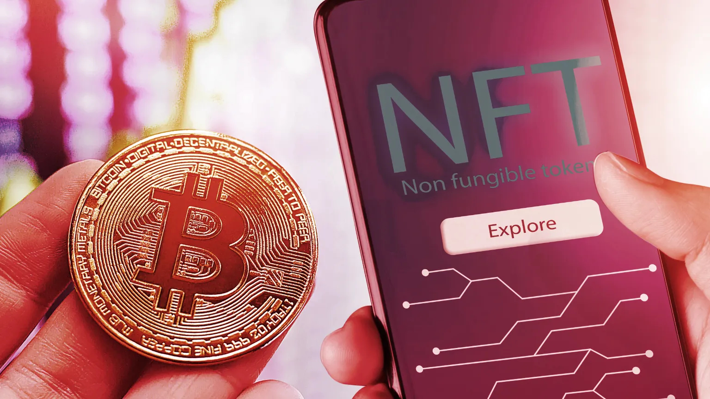
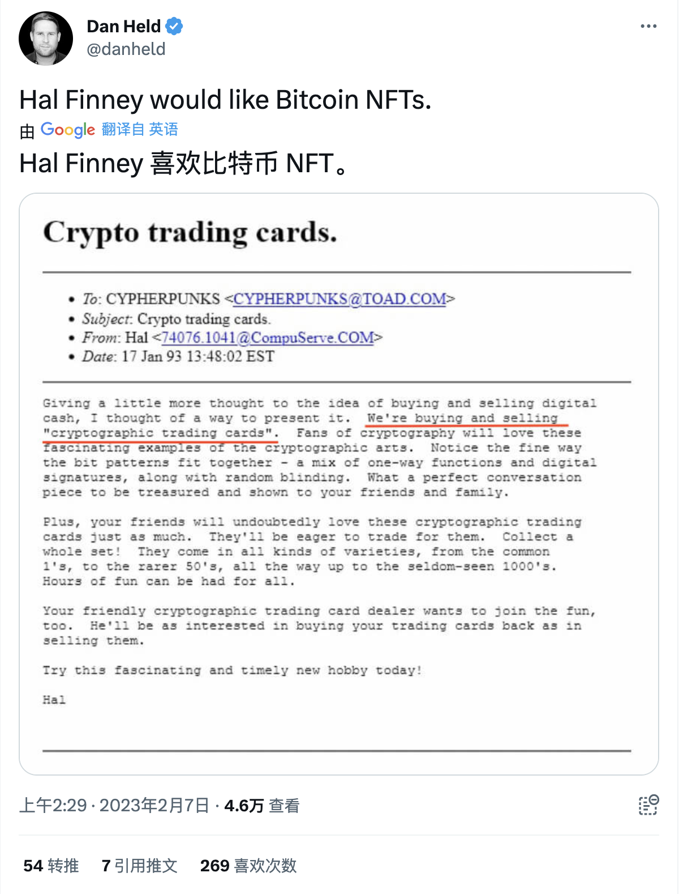

# 随着 11,000 个 NFT 铸成比特币，比特币极端主义者是否会浮现 | Decrypt 报道

> 有争议的 Ordinals 项目继续分裂着比特币社区。

在 1 月推出时，Ordinals 在比特币社区引起了轩然大波，因为爱好者、倡导者和开发者都在争论将 JPEG 放在区块链上的好处。虽然激烈的争论仍在继续，但根据 [Dune](https://dune.com/dataalways/ordinals) 报告，使用 Ordinals 的比特币铭文数量在周二已经超过了 11000 个。

Ordinals 是旨在将 NFT 引入比特币生态系统的最新项目。第一个项目，Counterparty，在 2014 年通过「稀有佩佩」（Rare Pepes）系列首次向比特币引入了 NFT，而 Stacks 则在 2017 年跟进。然而，Ordinals 项目不同，因为资产，包括 JPEG 甚至视频游戏，直接刻在比特币区块链上，不需要侧链或额外的通证。

Ordinals 项目消耗了比特币社区很多注意力，并引发了关于比特币网络最终目的新辩的问题。对一些人来说，Ordinals 打开了威胁比特币网络的潘多拉盒子，包括恶意软件攻击和暴涨的交易费用。

https://twitter.com/Pledditor/status/1623103449188511745

其他的反应并不像世界末日那样。

资深比特币信徒 Dan Held 在推特上支持 Ordinals，称该项目「对比特币有利」。Held 分享了已故的 Hal Finney 的一封邮件的截图，他在邮件中写到「加密收藏卡」。Held 说 Finney 会喜欢比特币 NFT。2014 年去世的芬尼是许多被认为是比特币的匿名创造者中本聪的人之一。

https://twitter.com/danheld/status/1622663850867687424

与以太坊和 Solana 不同，Ordinals 将其 NFT 称为「数字工艺品」，而比特币领域的其他人将数字资产简单称为「铭文」。Ordinals 铭文之所以可行，归功于 2021 年 11 月比特币 Taproot 升级引入的一项功能允许将任意数据存储到一个 satoshi 的证人。

https://twitter.com/Dennis_Porter_/status/1619880603159252992

自开发者 Casey Rodarmor 于 2023 年 1 月 21 日推出 Ordinals 以来，人们对 它的兴趣稳步上升，一些人希望能突破一个 satoshi 上可铭刻的内容的极限。

https://twitter.com/epodrulz/status/1623032538078842897

「Ordinals 项目是比特币的一个里程碑，展示了比特币网络的创新如何在其作为健全货币的用途之外产生广泛的新应用，」Lolli 联合创始人兼首席执行官 Alex Adelman 在一封电子邮件中告诉 Decrypt，称 Ordinals 是比特币的归宿时刻。

Adelman 说，虽然比特币在致力于创新和开发新应用的投资和人才数量上仍然远远落后于以太坊，但比特币 NFT 将吸引新一轮的兴趣和资本，并为开发者创造新的机会，以构建新颖的解决方案，来促进比特币网络的可扩展性和效率。

https://twitter.com/CryptoLanroc/status/1622806761962110976

虽然在比特币区块链上铸造 NFT 的快感引起了区块链老炮的新关注，但 Ordinal 铭文缺乏许多人与 NFT 相关的功能，比如智能合约，而比特币区块链并不支持这些功能。

Satoshibles 的开发者 Brian Laughlan 认为，Ordinals 的局限性将使 Stacks 等项目受到更多关注。

「我现在更加看好 Stacks 的原因是，人们最终会开始感受到 Ordinals 如高主链费用、没有智能合约等的限制，」Laughlan 在 Discord 上告诉 Decrypt，「他们将寻求二层解决方案，而 Stacks 已经准备好填补这一空白。」

Laughlan 说来自比特币极端主义者的反击让 Stacks 很难「发出自己的声音」，并补充说，Ordinals 是 Stacks 可以要求的最好的东西。

「现在比以前更多的人在关注比特币，」他说。「你让以太坊极端主义者运行比特币节点，而比特币极端主义者突然爱上了 JPEG 小图片!这个世界已经疯了。"

随着围绕 Ordinals 的辩论继续进行，比特币区块链上的铭文显然将继续存在 —— 无论比特币极端主义者喜欢还是讨厌它。
