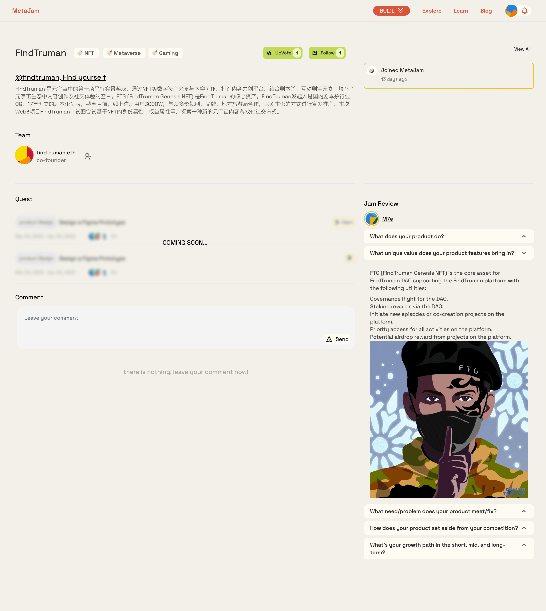
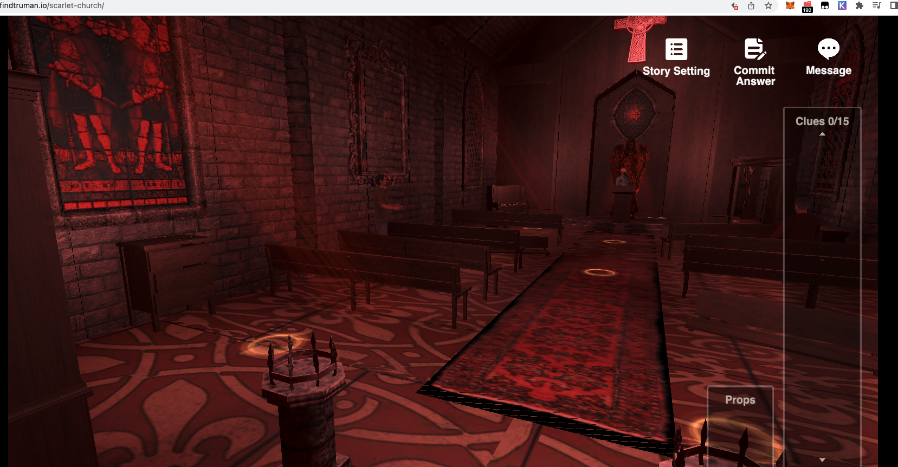
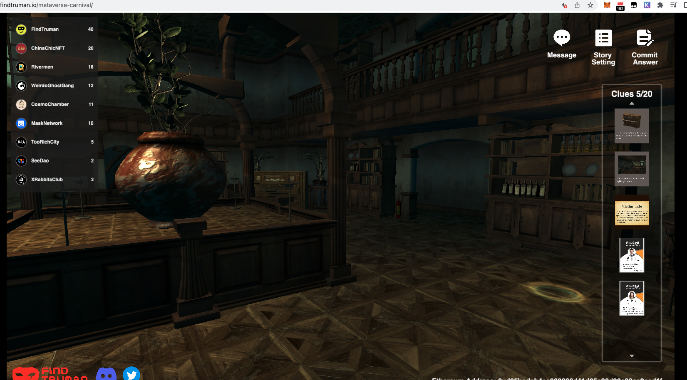
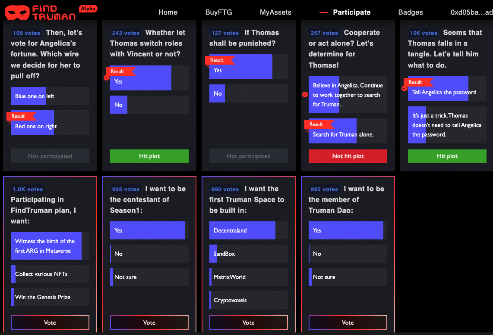
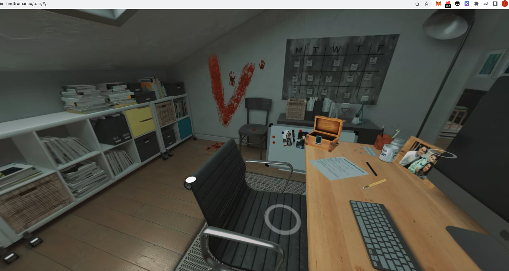
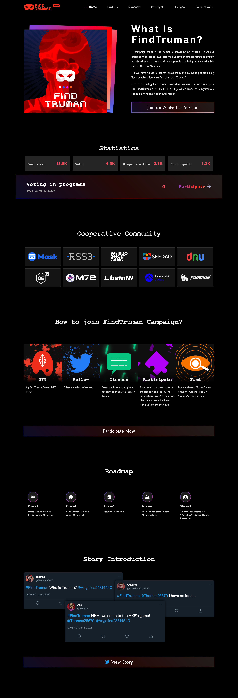

# FindTruman：第一个剧本杀元宇宙｜ Jam Review No.9

> 今天 Jam Review 第九期精选推荐第一个剧本杀元宇宙项目 FindTruman，欢迎所有致力于 Web3 BUIDL 的朋友一起来测试评论，参与帮助这些项目从产品、招聘、社区到融资等各方面的成长。
>
> 欢迎点击 FindTruman 项目页面 https://www.metajam.studio/project/findtruman，给项目产品留言评论！

## FindTruman

(video)

> **类别：** Metaverse
>
> **推荐：** M7e
>
> **官网：** https://findtruman.io/
>
> **推特：** https://twitter.com/FindTruman
>
> **群组：** https://discord.com/invite/vrUjMWsjAj
>
> **博客：** https://medium.com/@FindTruman

### 你的产品是做什么的？

在这个平台上，作者们发起了一些一般性的故事情节，试图鼓励社区成员加入这一故事和 IP 的共同创作的流程中。通过这种方式，可以创建一个具有良好粘性的天使社区。在这一流程结束时，我们有了一个有趣的故事或 IP，有了第一批粉丝。然后，在不同的 Web3 元宇宙平台（如 Decentraland、Sandbox）上将这个故事商业化为 3D 场景，或者将这些故事/IP 转变为 Web2 游戏，都可以开始。最后，通过这种商业化，可以产生经济效益。

我们让玩家与故事互动的第一种方式是通过如以下三个链接的 3D 场景：

1. https://findtruman.io/scarlet-church/]
2. https://findtruman.io/metaverse-carnival/
3. https://findtruman.io/wgg/hsh/

在这些 3D 场景中，我们可以让故事的某些部分发生，玩家可以通过收集线索、与 NPC（非玩家角色）交流、在场景中寻找一些隐藏的材料或信息来帮助故事的发展。通过这种方式，玩家或社区成员与故事有了更深刻的互动，可以在一定程度上参与故事的发展。

另一种有趣的让玩家与故事互动的方式是通过 Twitter 或其他开放平台上的实时故事直播秀，就像下面的链接一样，我们有 6 个 NPC，每个人都有自己的 Twitter 账号，整个故事的发展是由他们通过 Twitter 进行交流。在整个过程中，玩家有权通过投票决定故事的某些部分，一些「关键性投票」和一些通过使用他们的 NFT 的「非关键性投票」。只有拥有 NFT 的社区成员才能参与投票，投票结果将决定故事的走向。

https://twitter.com/search?q=(%23FT_Alpha_Test)%20(from%3AThomas26670%20OR%20from%3AAngelic25314540%20OR%20from%3AAxe509%20OR%20from%3AVincent10679122%20OR%20from%3AFindTruman)&src=typed_query&f=live

一些像这样的投票结果：

也是一个和在以下链接里的这个故事的 VR 场景：

https://findtruman.io/tdsr/#/

### 你的产品功能带来什么独特价值？

FTG（FindTruman Genesis NFT）是 FindTruman DAO 的核心资产，支持 FindTruman 平台的以下功能：

1. DAO 的治理权
2. 通过 DAO 进行质押奖励
3. 在平台上发起新的剧情或共创项目
4. 优先访问平台的所有活动
5. 从平台上的项目中获得潜在的空投奖励

### 你的产品满足或解决了什么需求或问题？

1. 为其他衍生产品共同创造内容和故事
2. 激励社区参与共同创造的流程，从而建立第一代的追随者和粉丝。
3. 尝试将更多的经济利益分配给创作者、作者和社区参与者。

### 你的产品如何在竞争中脱颖而出？

实际上，我们是 Web3 中唯一的剧本杀元宇宙平台。 我们向来自不同生态系统、项目和社区的各种合作和交流开放。

### 你们短中长期的增长路径是什么？

- 第一阶段：建立第一代粉丝和社区，主要在 Twitter 和 Discord 上。发布 4 个 PGC 内容
- 第二阶段：开发多语言和多文化的内容，与 Web3 的大社区联合，引进 Web2 的大 IP，创造 40 个 PGC 内容。扩大 Web3 的用户群，引进 Web2 的用户群
- 第三阶段：发展 UGC 平台，发展创作者经济生态，建设和发展元宇宙剧本杀。

更多交流讨论，欢迎加入 MetaJam Discord 的 Jam Review 频道：https://discord.gg/wXtj2UuedP
