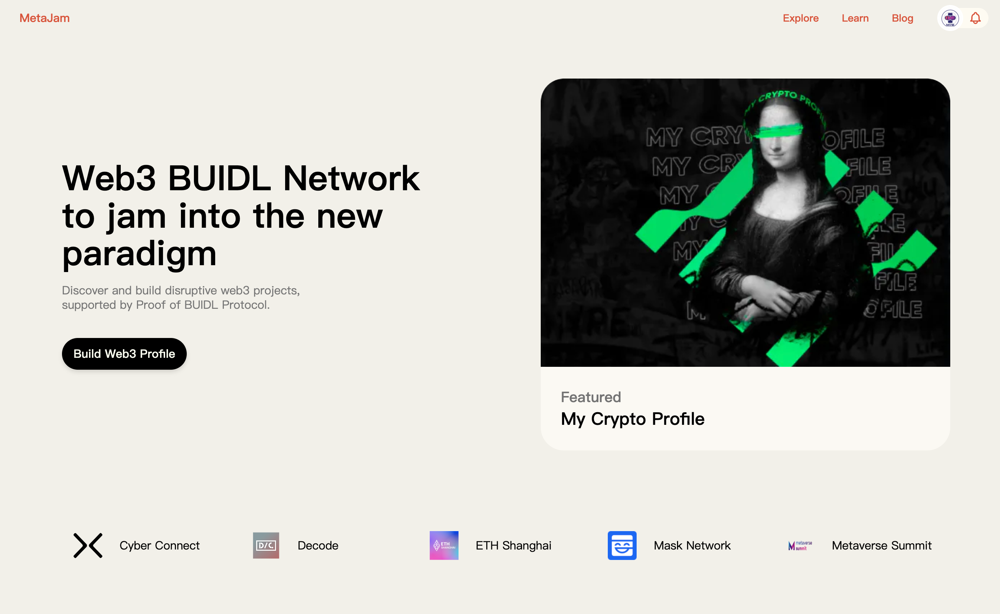
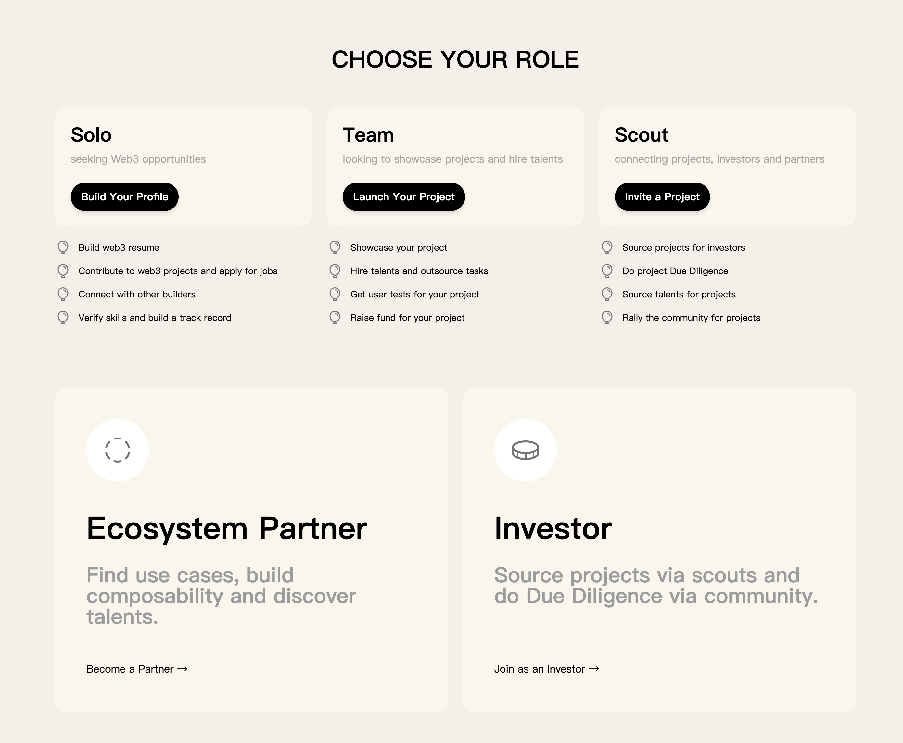
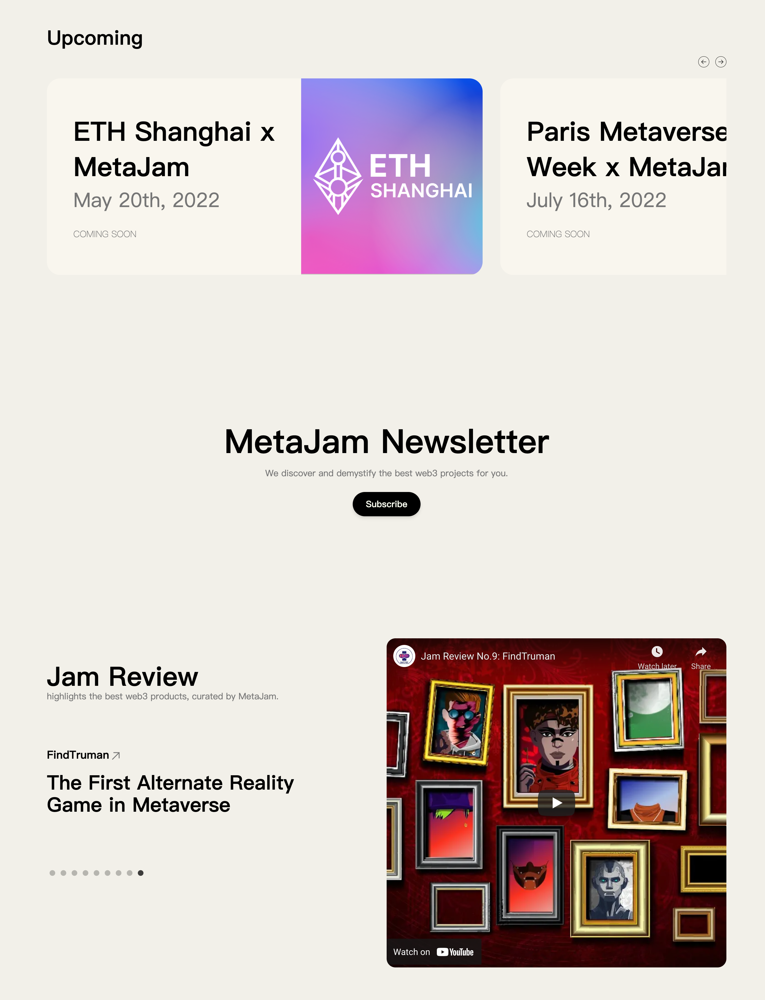
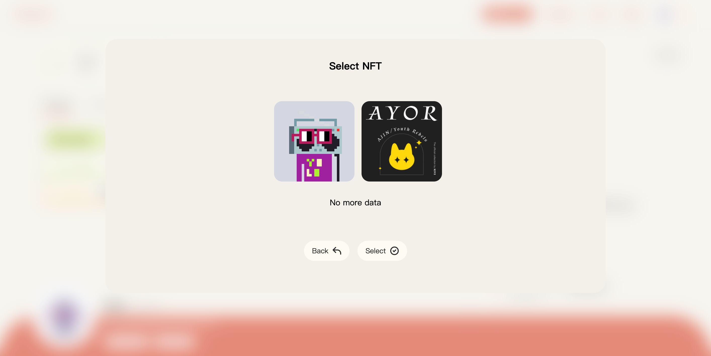

# MetaJam 首页全新改版：打造 Web3 BUIDL 网络，融入 Web3 新范式

> 今天，我们发布全新改版的 [MetaJam 首页](https://www.metajam.studio/)以及一系列新功能，以聚焦于一个明确清晰的目标：打造 Web3 BUIDL 网络，帮助建设者融入 Web3 全新范式。

## 选择不同的角色使用 MetaJam

加密市场总是起起伏伏，然而 Web3 的开发建设（BUIDL）才刚刚开始。这就是为什么 MetaJam 要打造一个 Web3 BUIDL 网络，在 [POB（Proof of BUIDL）协议](https://mirror.xyz/m7e.eth/UrpfickuPgmfzkF8bO3b5POUC-fpb0aAMr9oNofmcvk)（去中心化的 Web3 BUIDL 可验证声誉协议）的支持下，人们可以发现很酷的 Web3 产品/Dapp，并打造颠覆性的 Web3 项目。无论是人才、星探（Scout）、建设者、生态伙伴还是投资者，你都可以在 MetaJam 上做出贡献并获得收益，MetaJam 通过让各方参与进来，共同推动 Web3 BUIDL 的飞轮运转。

作为**个人**，你可以：

- 通过经验证的任务（Quest）建立你的 Web3 简历
- 验证技能并打造你的业绩记录
- 在网络中求职找工作
- 为 Web3 项目做贡献，赚取信誉积分和通证奖励
- 与社区中的其他建设者建立联系

作为**团队**，你可以：

- 在社区中展示你的项目
- 通过 Web3 简历和星探招募人才
- 通过任务来外包
- 从社区中获取对你的产品的用户测试
- 为你的项目融资

作为**星探**，你可以：

- 为投资人寻找项目
- 为投资人进行项目的尽职调查
- 为项目寻找推荐人才
- 为项目召集社区成员
- 赚取你的信誉积分和通证奖励

作为**生态伙伴**（如公链、基础设施平台、加密协议等），你可以：

- 为你的基础设施或协议找到用例
- 整合新兴的去中心化应用以建立可组合性
- 发现拥有经验证技能的人才

作为**投资者**，你可以：

- 招募星探来寻找项目
- 利用社区来做项目的尽职调查
- 最大化投资机会

现在你可以选择建设者的角色，[创建你的个人档案](https://www.metajam.studio/profile)，和/或[创建你的项目](https://www.metajam.studio/project/create)，或邀请其他人创建项目。如果你是寻求合作的投资人或生态伙伴，你可以通过点击页面上的[按钮](https://metajam.typeform.com/to/IVEn4RIE)留下你的信息。

## 即将举行的活动和 Jam Review

入驻 MetaJam 的 Web3 建设者不仅是为了实用功能而来，也是为了网络而留下。MetaJam 将通过与 [Decode](https://www.decode.build/)、[M7e](https://www.m7e.io/) 等这种覆盖中美的建设者社区以及 5 月的 [ETH 上海](https://ethshanghai.org/)和 7 月在巴黎举行的 [元宇宙峰会（Metaverse Summit）](https://metaverse-summit.org/)等活动合作，吸引世界各地的建设者和各个领域的项目，并推动建设者之间互相帮助。你将在未来几天和几周内看到从这些活动来的项目。

Jam Review，精选推荐平台上创建的 Web3 产品和项目，是 MetaJam 的焦点产品。我们在 Jam Review 中介绍的每一个项目都邀请所有 MetaJam 用户进行测试，并为其产品、社区和融资提供帮助。欢迎访问 Jam Review 项目的简介页面，关注、点赞或留下您的评论。

## 其他新功能及迭代

在新版 MetaJam 发布的 11 项新功能和迭代中，最令人兴奋的莫过于头像编辑功能。你可以上传本地图片，也可以选择你钱包里的 NFT 头像，来更好的展示你在 Web3 BUIDL 网络中的形象。

除了上述头像编辑功能，新版本还支持：

- 查看个人简介的所有时间线
- 个人简介中的项目分页
- 项目编辑功能
- 查看项目简介的所有时间线
- 在项目简介中显示谁是星探
- 项目时间线的编辑、置顶和隐藏功能
- 团队成员更新功能
- 团队成员邀请取消功能
- 邮件订阅

注意：项目点赞和关注功能现已迁移到生产环境中，所有数据都被重置。

更多帮助 MetaJam 打造 Web3 BUIDL 网络的产品新功能、活动和合作即将推出，敬请关注！

- **MetaJam：** https://www.metajam.studio/
- **POB Protocol：** https://www.pob.work/
- **推特：** https://twitter.com/MetaJamStudio
- **群组：** https://discord.gg/wXtj2UuedP
