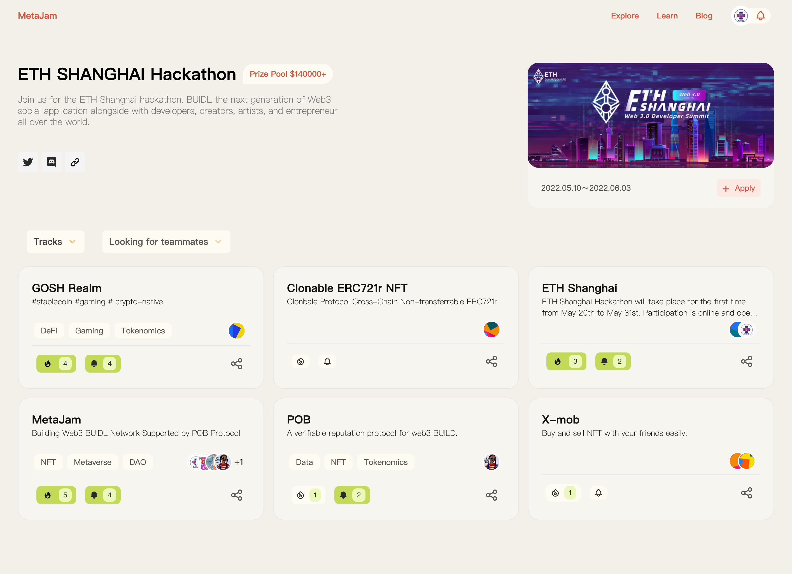

# 2022 ETH Shanghai 黑客松启动：MetaJam 全力支持，打造 Web3 BUIDL Network

> 此刻，5 月 20 日上午 10:00，2022 ETH Shanghai 黑客松宣布启动。与此同时，以太坊上海 Web 3.0 开发者峰会暨黑客松社区支持伙伴 MetaJam 正式上线发布 ETH SHANGHAI Hackathon 专题页面！

5 月 20 日至 6 月 3 日，首届 ETH Shanghai 黑客松大赛作为[以太坊上海峰会](https://ethshanghai.org/)(ETH Shanghai Summit)的平行活动，以「下一代社交」为主题，全程在线上举行，遍邀全球 Web3 爱好者、开发者共同关注互联网和社会责任之间的密切联系，就当下热切探讨的公链、链上数据分析及去中心化社交等议题点燃想象力，来共同定义 Web3 社交的未来。

大赛筹集了总计超过 14 万美元的奖金，聚集了最前沿的 Web3 协议开发者们为黑客松提供丰富的资源和 SDE 工具。通过黑客松大赛，主办方希望共同建设一个更加开放的社交空间，并创建一个共管、共有的去中心化治理结构。

致力于连接 Web3 建设者、打造 Web3 BUIDL Network 的 MetaJam 为配合大赛主办方、满足参赛者在 [Gitcoin](https://gitcoin.co/hackathons)报名之后产生的一系列需求，携手美国湾区第一大 Builder 社区 [Decode](https://www.decode.build/) 专门制作推出了 ETH SHANGHAI Hackathon 专题页面，提供招聘组队、项目展示、关注点赞、评论社交等功能，更好的帮助开发者从创意构思到项目产品的孵化开发。参赛者可点击页面右上角 Apply 按钮创建项目 Profile 加入。​

MetaJam 具体如何上手？请看视频

任何问题，黑客松参赛者可在 ETH Shanghai 的 Discord 中[metajam 频道](https://discord.gg/T7WxcGNZ9Y)找我们解答。

预祝 ETH Shanghai 黑客松圆满成功，所有参与者收获满满，WAGMI！

- **MetaJam：** https://www.metajam.studio/
- **POB Protocol：** https://www.pob.work/
- **推特：** https://twitter.com/MetaJamStudio
- **电报：** https://t.me/+QXy7Qs9LgEFlOTM1
- **Discord：** https://discord.gg/wXtj2UuedP
