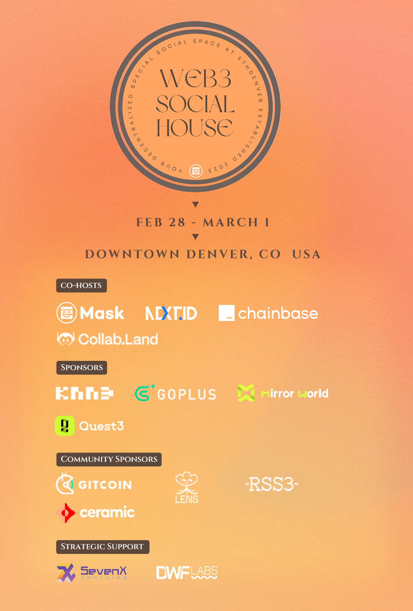

# ETHDenver | Mask Network 邀请你来 Web3 Social House 逛逛

> 一年一度、北美最大的以太坊生态聚会 ETHDenver 即将于 2 月 24 日开幕，3 月 5 日闭幕。据悉 2023 年将有更多华语 Web3 建设者在美国丹佛聚会交流，现发布由 Mask Network 发起的 Web3 Social House 活动邀请函 ——

在 ETHDenver 的 BUIDL Week 和核心活动期间，欢迎和 Mask Network、Next.ID、Chainbase、Collab.Land 和其他令人兴奋的项目一起在 Web3 Social House 会晤交流，体验为期两天与来自世界各地的开发者、投资者和 Web3 爱好者频密脑暴。据悉，预计有 35,000 名与会者参加 ETHDenver，这是一个全球 Web3 建设者必须参与的活动。

位于美国科罗拉多州丹佛市中心的 Web3 Social House 距离主要酒店仅几步之遥。享受一个舒适和设备齐全的空间，有良好的 Wi-Fi，电源插座和工作站，以及免费的小吃和饮料。与来自不同社交项目和开放协议的与会者联络、交流和休闲。可以参加关于在 Next.ID 和其他平台上构建开发的培训活动，以及参加关于 Web3 社交、DID、安全、数据和智能合约钱包状况的小组讨论和演讲分享。

Mask 之前举办的活动取得了巨大的成功，包括在以太坊波哥大 Devcon 期间举办的「人类连接的未来」，有超过 800 人参加，以及与 Gitcoin 合作举办的 ETHShanghai 2022 黑客马拉松，有超过 1000 名与会者和开发者参加。

Web3 Social House 活动抢鲜报 ——

### 为期两天的活动将囊括以下内容（更多细节将持续更新）：

**Next.ID：面向 ETHDenver 社区的开发者首秀**

- 展示 Next.ID 的各种工作坊
- 开发者问答
- 与 Next.ID 创始人、核心开发者和开发者关系人员的会晤交流

**Chainbase 工作坊**

- 如何使用 Chainbase 的数据云 API 来生成一个基于账户的 DeFi 投资组合概览

**Web3 用户安全下午茶（GoPlus 主办）**

- 保护 Web3 用户安全的不同层面
- Web3 的去中心化安全数据框架
- 活动报名：https://lu.ma/moobtpin

**DID 圆桌：Collab.Land，Spruce，Ceramic，Disco.xyz，Next.ID**

**Web3 钱包面板**

**Web3 普及：Web3 的增长和新游戏规则**

**影响圆桌（由 Gitcoin 的 Scott Moore 和 Mask Network 的 Suji Yan 主持）**

**欢乐联谊之夜（音乐畅演、饮料畅饮）**

**面基 Lens、Farcaster、RSS3 和 Gitcoin 社区成员**

_从 2 月 28 日到 3 月 1 日，加入成为 Web3 Social House 一份子吧！_

_报名仍在进行，即刻占座：https://lu.ma/yawp7vd8_

**Web3 Social House 联合主办**

- **Mask Network**（@realMaskNetwork）：你的通往全新开放互联网的门户
- **Next.ID**（@NextDotID）：你可靠的 DID 基础设施层，供所有社交 DApp 使用。我们连接您的 Web2 和 Web3 身份
- **Chainbase**（@ChainbaseHQ）：领先的 Web3 数据基础设施，提供用 API 访问的数据集，让你建立自定义的数据管道
- **Collab.land**（@Collab*Land*）：自动化的社区管理工具，基于通证所有权来管理成员

**Web3 Social House 赞助**

- **KNN3**（@Knn3Network）：一站式 Web3 用户为中心的 dApp 和智能合约的 DataFi 解决方案
- **GoPlus**（@GoplusSecurity）：通过提供开放、无许可、用户驱动的安全服务，为 Web3 提供安全基础设施的建设者
- **MirrorWorld**（@joinmirrorworld）：聚合 Mirror World 生态所有基于区块链的游戏的内容矩阵
- **Quest3**（@Quest3\*xyz）：促进 Web3 项目可持续发展的营销工具集

**Web3 Social House 的社区赞助**

- **Gitcoin**（@gitcoin）：居于开放网络生态中心的建设者、创作者和协议社区
- **Lens Protocol**（@LensProtocol）：无许可、可组合、去中心化社交图谱，让建立 Web3 社交平台变得容易
- **RSS3**（@rss3\*）：开放网络的信息传播
- **Ceramic**（@ceramicnetwork）：用可组合数据构建 Web3 应用的去中心化数据网络

**Web3 Social House 战略支持**

- **SevenX Ventures**（@SevenXVentures）：为项目提供不懈的支持，从营销到融资，从通证设计到资源整合，帮助创业者成功。
- **DWF Labs**（@DwfLabs）：全球数字资产做市商

**特别感谢 M7e 元宇宙特攻队和 MetaJam 的内容和营销支持**
