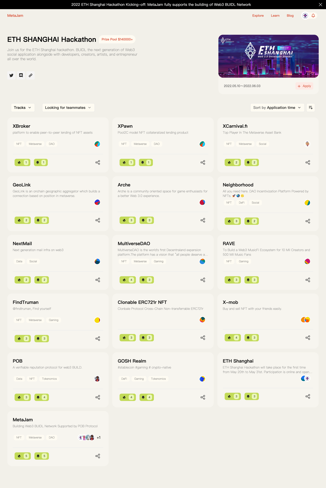
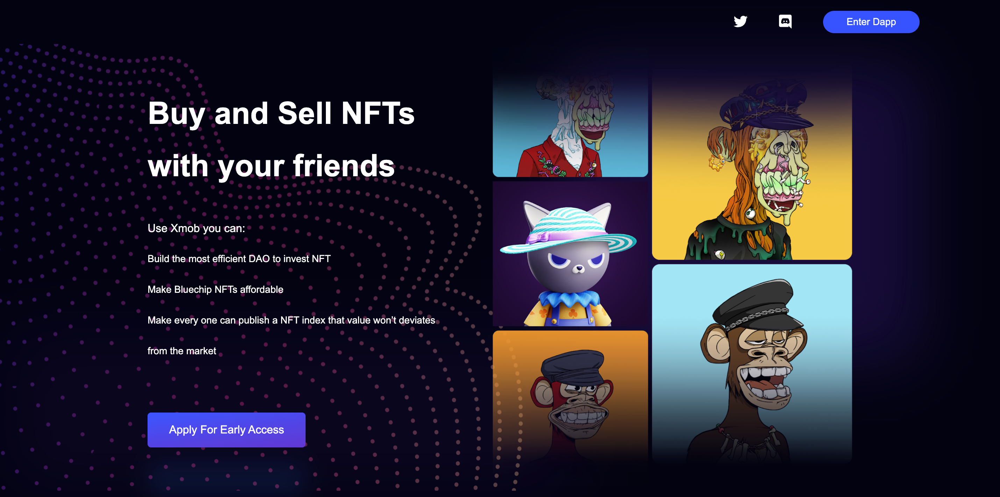
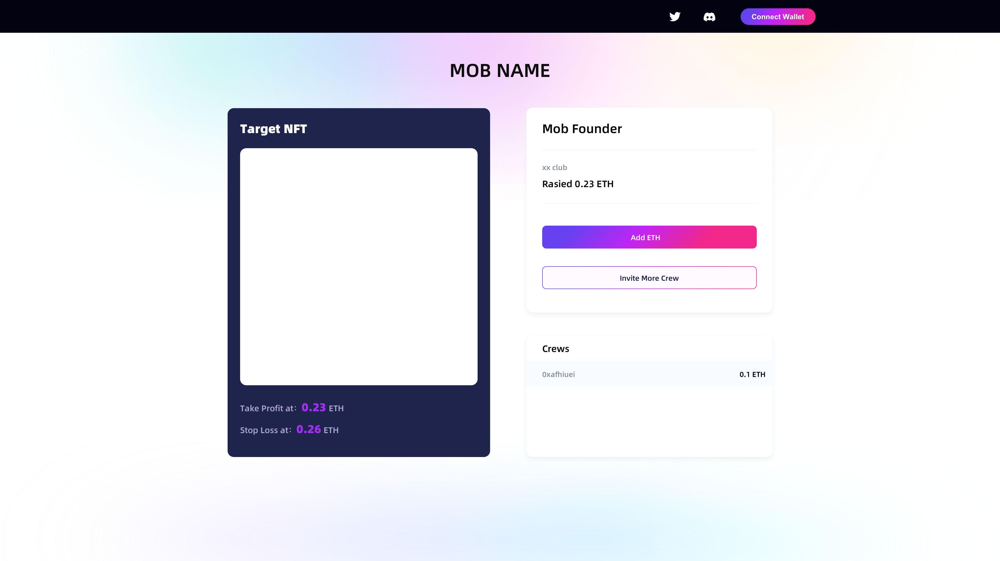
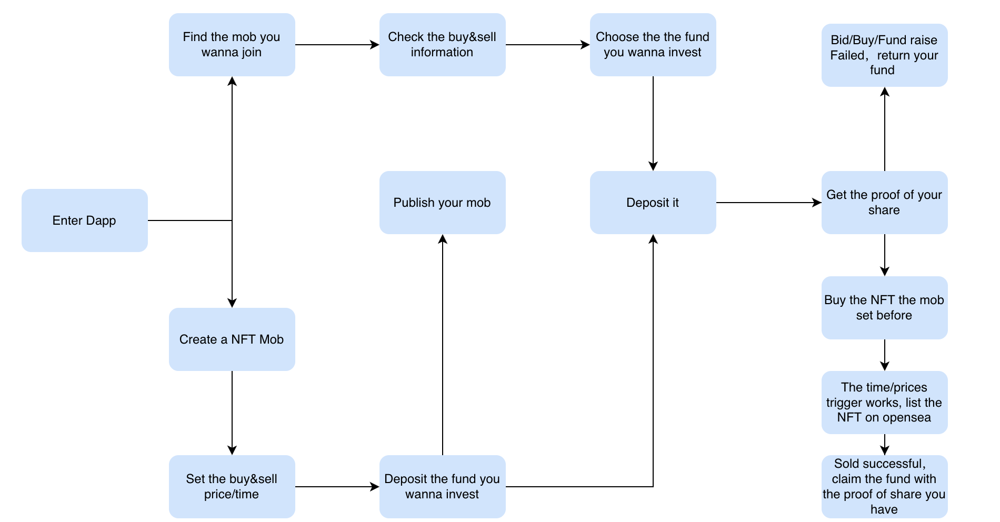
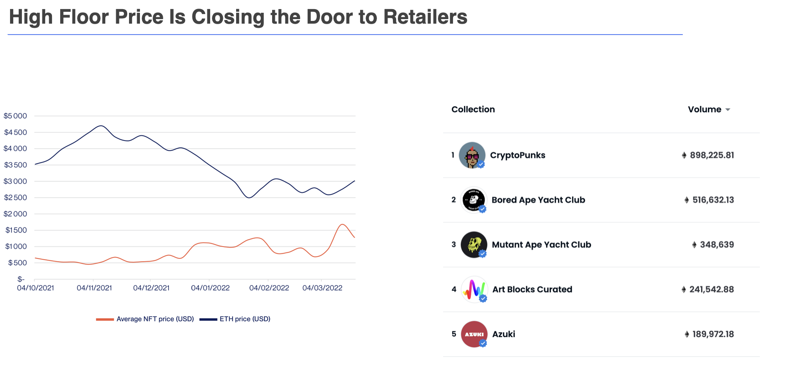

# ETH 上海黑客松参赛项目 X-Mob：方便团购 NFT 的 Dapp ｜ Jam Review No.10

> ETH Shanghai Hackathon 5 月 20 日上周五启动，越来越多报名参赛的 Web3 项目和产品在 MetaJam 创建项目简介，希望在这个 Web3 BUIDL 网络能更好的找人组队、曝光推广，寻求合作。
>
> 
>
> 今天，第 10 期 Jam Review 推荐 [ETH 上海黑客松](https://hackathon.ethshanghai.org/)参赛项目 X-Mob，一款方便和朋友一起买卖 NFT 的 Dapp。

## X-Mob

> **类别：** NFT
>
> **推荐：** M7e
>
> **官网：** https://www.metamob.club/
>
> **推特：** https://twitter.com/XMob_eth
>
> **群组：** https://discord.gg/BBWUKzG4Kr

### 你的产品是做什么的？

X-Mob 是一款方便大家跟朋友一起买卖 NFT 的 Dapp。

### 你的产品功能带来什么独特价值？

- 通过团购的设计，让大家可以低成本获取蓝筹 NFT 份额
- 通过前置投票设计，摆脱了 investment DAO 投资 NFT 在卖出方面的低效问题
- 通过智能合约实现自动交割，解决了 NFT 份额（碎片）容易跟市场脱钩的问题
- 团购+自动交割的设计，实现了最小规模的 NFT 指数发行，任何用户都可以通过 X-Mob 发行一个 NFT 指数

### 你的产品满足或解决了什么需求或问题？

- 目前 NFT 的平均地板价已经高达 1000 美元以上，蓝筹 NFT 的价格更是高不可攀，用户需要低成本的参与方式，团购是很好的切入点
- NFT 衍生品市场目前比较缺乏，需要更多工具来对冲和减少投资的风险，能跟真实市场交割的 NFT 份额（碎片），会让更多套利者参与到这个市场
- 目前多签方案的 Investment DAO 在投资决策/卖出决策上效率偏低，在人数超过 20 人以上，基本只能采用传统的 VC 的 GP 模式来解决效率
- 目前碎片方案由于引入了治理，在 NFT 卖出方面会出现由于双方意见不统一，资产锁在合约里的情况，X-Mob 避免了这一点

### 你的产品如何在竞争中脱颖而出？

目前的 DAO 治理方式在团队人数超过 20 人后，就会出现投资低效/退出流程不清晰的问题，而现有类似 fractional 的解决方案，由于是在第三方市场建立额外的流动性，碎片价值容易跟真实市场脱钩。X-Mob 通过产品设计，让用户只投一次票，同时通过智能合约实现 NFT 资产自动跟真实市场交割，摆脱了上述两个问题。

- **Fractional**: 碎片化解决方案，NFT 卖出流程效率低，而且由于采用 DAO 治理，碎片的价值很容易跟市场脱钩
- **Partybid**: 有很好的买入体验，但是由于它是嫁接在 Fractional 上的 Dapp，NFT 卖出会有同样的问题
- **Mesha:** 一个多签方案的 VC portfolio 管理工具，适合 10 人以下的集体做决策，适合传统的 VC 模式
- **Priysm:** NFT KOL 募资的工具，帮助 KOL 成立自己的 NFT 基金，同样是多签方案，适合传统 VC 的 GP 模式

### 你们短中长期的增长路径是什么？

主要针对以下场景开展运营：

- 突发性热点：通过团购的方式降低用户归零的损失，同时让用户不错过一些热点机会
- 蓝筹指数：针对现有的蓝筹，联系有社交资产的用户，通过 X-Mob 发行不同属性的蓝筹 NFT 指数

产品计划：

- 6 月中上线 Alpha 版本，用户可以实现团购和指数发行
- P2P 交易产品，通过套利解决 NFT 份额的流动性问题
- 数据工具，指导用户更好的选择 NFT 资产标的

更多交流讨论，欢迎加入 MetaJam Discord 的 Jam Review 频道：https://discord.gg/wXtj2UuedP
