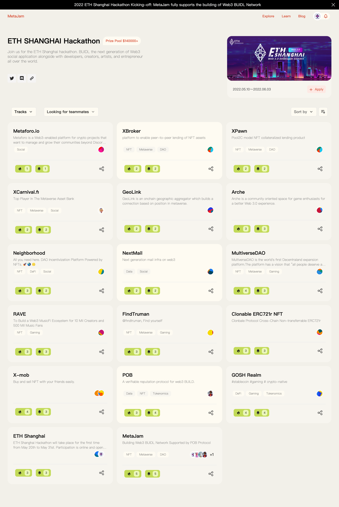
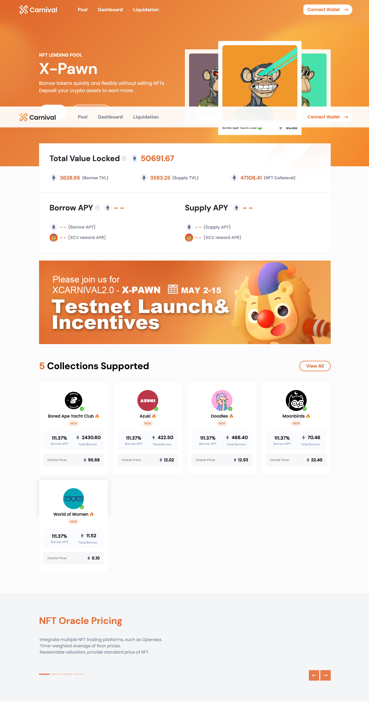
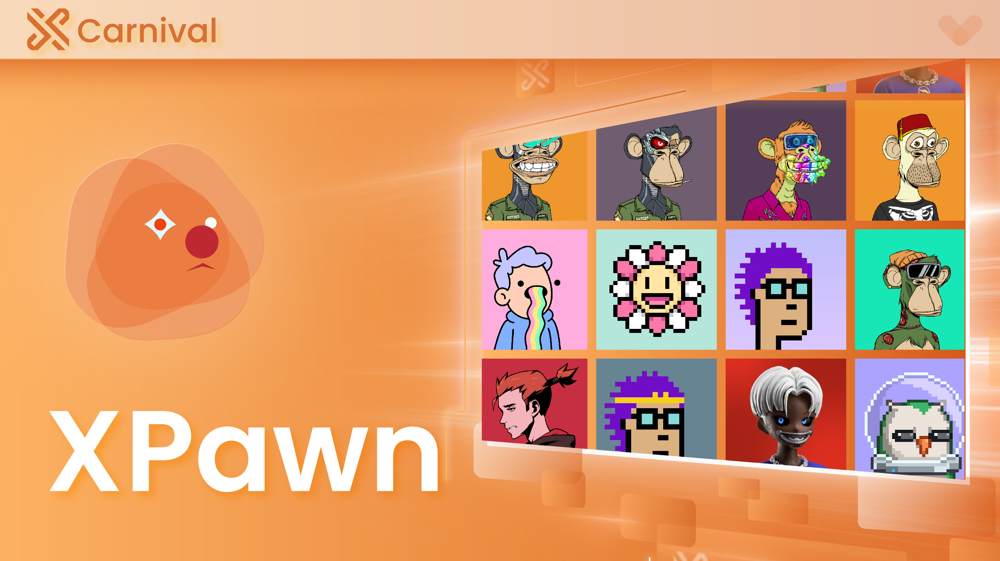

# ETH 上海黑客松参赛项目 XCarnival：优化 NFT 资产流动性 ｜ Jam Review No.11

> 目前有越来越多报名参加 ETH Shanghai Hackathon 的 Web3 项目和产品在 MetaJam 创建项目简介，希望在这个 Web3 BUIDL 网络能更好的找人组队、曝光推广，寻求合作。
>
> 
>
> 今天，第 11 期 Jam Review 推荐 [ETH 上海黑客松](https://hackathon.ethshanghai.org/)参赛项目 XCarnival，一个为 NFT 资产提供市场优化的流动性解决方案。

## XCarnival

> **类别：** NFT
>
> **推荐：** M7e
>
> **官网：** https://pawn.xcarnival.finance/Home
>
> **推特：** https://twitter.com/XCarnival_Lab
>
> **群组：** https://discord.com/invite/SnpRNMkZ2k
>
> **博客：** https://mirror.xyz/xcv.eth

### 你的产品是做什么的？

XCarnival 是多链环境中稳定安全的金融基础设施协议，为 Web3.0 中的 NFT 资产提供市场优化的流动性解决方案，支持 P2P（个人对个人）和 P2C（即时借贷池）模式的资产抵押借贷。

### 你的产品功能带来什么独特价值？

**XCarnival 解决方案 1.0 版：XBroker**

XBroker 是一个 NFT 质押和贷款的平台，为 NFT 市场提供流动性。参与者分为三个角色：抵押人、贷款人和清算人。抵押人是提供 NFT 进行质押借款，贷款人通过出借 USDxc 获得利息，清算人通过拍卖竞价参与清算，即支付拍卖价格获得 NFT。

**XCarnival 解决方案 2.0 版：XPawn**

XPawn 是一个基于以太坊主网上发行的 NFT 资产，创新使用资金池的模式，并进行价值币借贷的平台，用户可以作为存款人或借款人参与其中。储户向借贷池提供 ETH 等流动性，以获得利息和奖励，并获得流动性奖励。借款人可以用他们持有的 NFT 作为抵押品，将 ETH 等借给借贷池。

### 你的产品满足或解决了什么需求或问题？

**XCarnival 1.0 版：XBroker**

- 问题：缺乏 NFT 的流动性，而且定价困难
- 解决方案：P2P 模式下的 NFT 抵押和借贷。通过 XBroker 完成用户之间的借贷，并通过拍卖和清算保护投资者的权益。

**XCarnival 2.0 版：XPawn**

- 问题：不能轻易将多链 NFT 借出；必须等待贷款人匹配交易；高价 NFT 难以得到匹配
- 解决方案。通过产品迭代
  - 标准资产的混合池（多数）
  - 针对高价蓝筹 NFT 的 VIP 人工渠道（少数）
  - 抵押和借贷模式升级。池子对个人的模式让借款人随时通过官方资金池（基金）进行交易

### 你的产品如何在竞争中脱颖而出？

**XCarnival 1.0 版：XBroker**

第一个在 BSC 链上实现 NFT 资产点对点借贷的平台。

**XCarnival 2.0 版：XPawn**

- 选择合格的蓝筹 NFT 藏品进入白名单
- 独特的 NFT 预言机定价：在特定时间段（周）内提供基于地板价的参考价格
- 客户选择借贷范围和利息条件
- 在几秒钟内完成借贷
- 在还款逾期或 NFT 地板价下降的情况下，对抵押的 NFT 进行清算
- 在多个 NFT 市场（如 Opensea 和 Looksrare）进行拍卖，以减少价值损失

### 你们短中长期的增长路径是什么？

- 更丰富、更完整的可借出的 NFT 列表：除了第一阶段支持的蓝筹 NFT 类别外，XPawn 将继续上传社区认可的 NFT 品种，为海量 NFT 提供稳定的流动性支持。
- 更丰富的多链生态：XPawn 在以太坊主网上线后，XCarnival 将陆续上线 Solana、Avalanche、Polkadot、Flow 等。

XPawn 在以太坊主网上线后，XCarnival 将陆续上线 Solana、Avalanche、Polkadot、Flow 等公链；同时，也将继续推进包括社区 NFT 通证在内的生态赋能建设，包括 GameFi、NFT、元宇宙项目合作，包括但不限于白名单、测试和空投。

更多交流讨论，欢迎加入 MetaJam Discord 的 Jam Review 频道：https://discord.gg/wXtj2UuedP
