# 如何铸造一个比特币 NFT | Bankless 指南

**作者：** William M. Peaster

> 欢迎来到 Ordinals 的世界，让 Bankless 为你导游比特币 NFT。

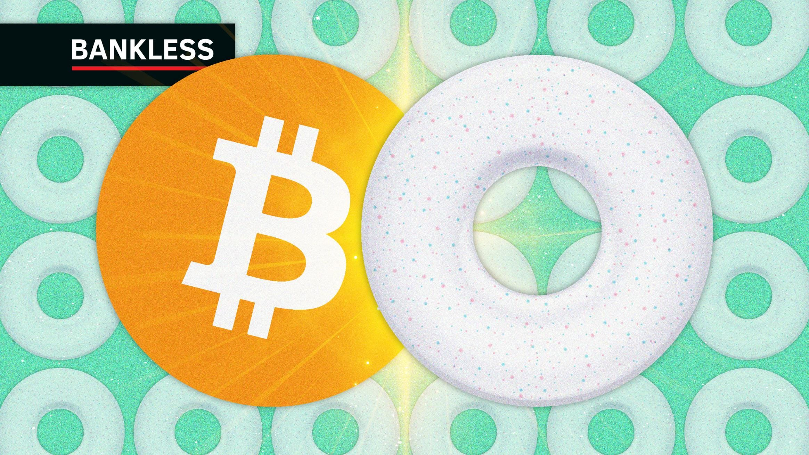

_题图：Logan Craig_

比特币 NFT 的崛起，是 NFT 生态目前最大的故事之一。然而，这一早期场景可能相当混乱。这篇由 Bankless 撰写的教战指南将指点你如何用简单、直接的方式铸造自己的比特币 NFT。

- 目标：学习铸造比特币 NFT
- 技能：初级/中级
- 精力：不到一小时
- 投资回报：自己动手在最古老的区块链上铸造 NFT

**延伸阅读**

## 比特币 NFT 初学者指南

在 Metaversal 通讯，我最近已经连续写了关于比特币 NFT 的[缘起](https://metaversal.banklesshq.com/p/bitcoin-NFT)和[繁荣](https://metaversal.banklesshq.com/p/bitcoin-nfts-again)。

当然，这个场景最早是在 2014 年开始出现的，当时一个建立在比特币上的自定义通证网络 Counterparty 发布。

然而，Counterparty 最终未能获得重大用户增长，而是被以太坊智能合约的崛起所遮蔽，而以太坊智能合约则催化了此后多次 NFT 的繁荣。

近十年来，「比特币 NFT 生态」的概念还没有被认为是可行的，或者说，甚至被币圈绝大多数人认为画上句号。随着 [Ordinals](https://ordinals.com/) 的到来，这一切都改变了，这是一个新的协议，可以在单个聪（最小的 BTC 度量单位）上铭刻元数据。

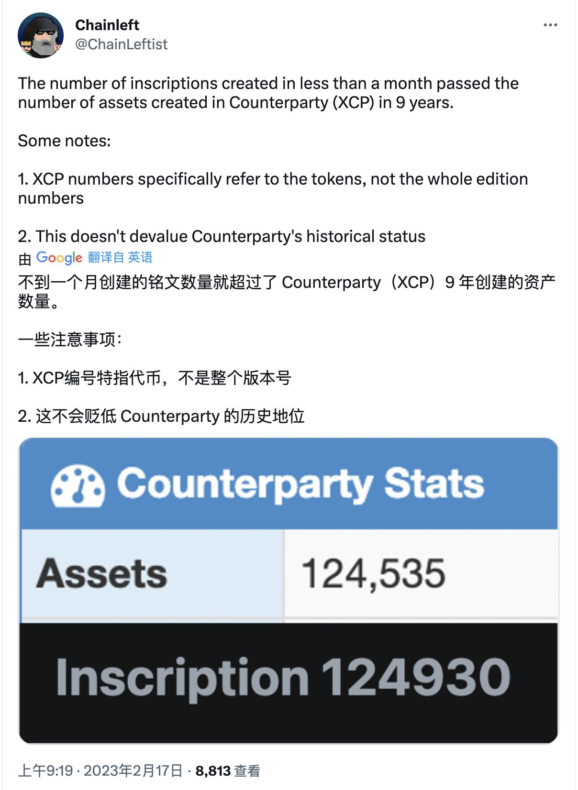

_https://twitter.com/ChainLeftist/status/1626390917073584129_

那么，为什么现在会出现这种流星般的上升？2014 年和今天有什么不同？

首先，当代加密经济现在有一个蓬勃发展和完善的 NFT 生态系统，充满了探索者，他们能够自如地驾驭多种不同的区块链。我们这次已经准备好了，就像它一样。

其次，尽管如此，Ordinals 风格的 NFT 是一个创新的突破，因为它们提供了一种新的方式来铸造直接连接到比特币、完全在链上的 NFT。在这里，「完全在链上」意味着元数据，例如 NFT 的艺术作品，将可以无限期地从比特币区块链上检索，而不是从私人存储服务器或 Arweave、Filecoin、IPFS 等这种存储网络检索。

也就是说，就像我们迄今为止看到的所有 NFT 的方法一样，Ordinals 式的 NFT 亦有一些独特的优势和劣势。

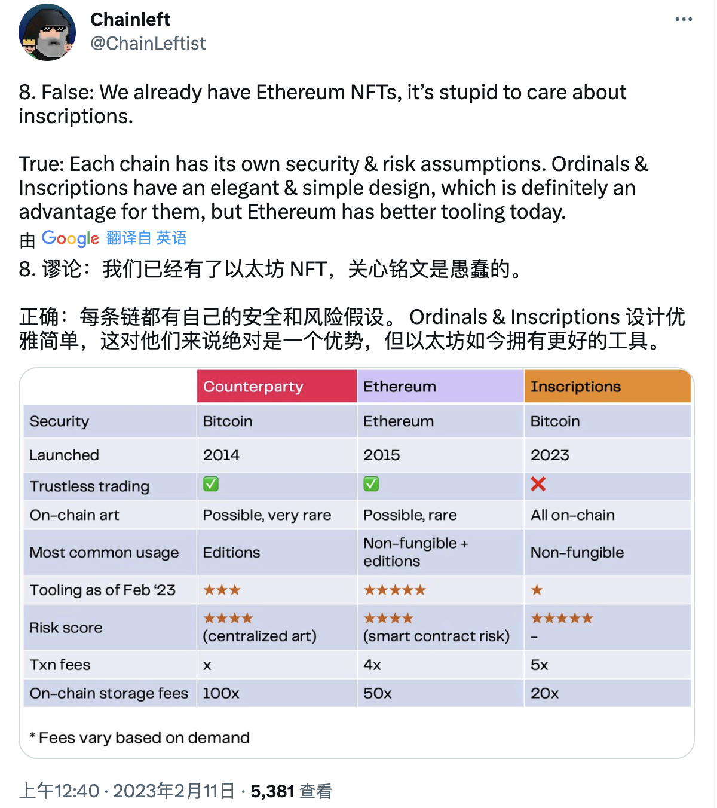

_https://twitter.com/ChainLeftist/status/1624085882230779918_

在他们的**优点**一栏中，新的比特币 NFT 提供了强大的永久性保证 —— 至少在目前的情况下 —— 和廉价的链上存储，而这通常是非常昂贵的。

至于**缺点**，这些铭文缺乏智能合约所提供的可组合性和表达的可能性，而且比特币节点有可能最终将其修剪掉。

不过，现在很清楚的是，这个新的比特币场景将继续存在，并无疑将催生新的 Ordinals 友好的钱包和铸币服务的激增。在最近几周，我们已经看到了这种激增的开始，因为多个项目已经站出来提供简化的比特币 NFT 工具，因为最初需要运行自己的比特币节点来与这些 NFT 交互。

## 比特币 NFT 上手指南

现在开始大家感兴趣的内容。你想尝试创建一个比特币 NFT，但你更喜欢一个简单的 NFT 铸造流程，而不是必须建立自己的节点。这里提供很多选择，但一开始你需要两样东西：

_1. 一些比特币_
_2. 一个与 Ordinals 兼容的钱包_

就像在以太坊上铸造 NFT 需要 ETH 作为燃料一样，你用 BTC 支付来完成比特币 NFT 的铸造交易。在写这篇文章的时候，gamma.io 的正常铸币费用大约是 50,000 聪，即 0.0005 BTC 即 13 美元。然而，供求关系决定这个费用可能有很大的波动。因此，拿价值 25 美元的 BTC，大约是 0.001 美元，应该可以支付你第一次铸币，但考虑到波动，准备价值 50 美元的 BTC 可能是最好的选择。

当涉及到设置一个钱包时，不要在这里偷懒。如果你试图用一个普通的比特币钱包来搞，你可能会不小心花掉构成你的 NFT 的聪！因此，你现在可以使用的最简单的一个钱包是 Xverse，这是一个 Stacks 和比特币钱包，目前有 Chrome 浏览器插件或安卓或 iOS 手机客户端。

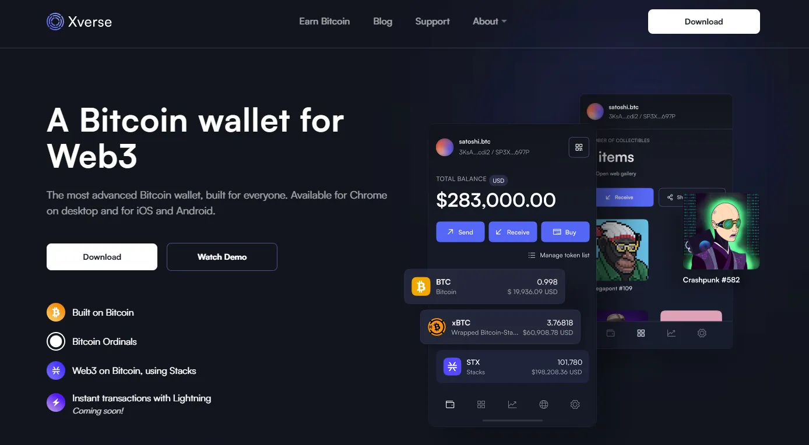

一旦依照你的喜好下载了插件或客户端，你会收到提示创建一个新的钱包。你会被问到是否要现在或以后备份你的钱包，然后提示为你的新账户设置密码。一旦完成，你就可以使用你的 Xverse BTC 地址来接收你的铸币资金，并支付比特币 NFT 铸币。

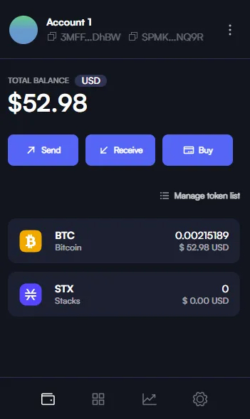

此时，当你把 BTC 收到 Xverse 钱包后，就可以开始铸币了。为此，前面提到的 gamma.io 网站是目前最直接的 Ordinals 式铸造资源之一，所以我向比特币 NFT 的初学者推荐它。

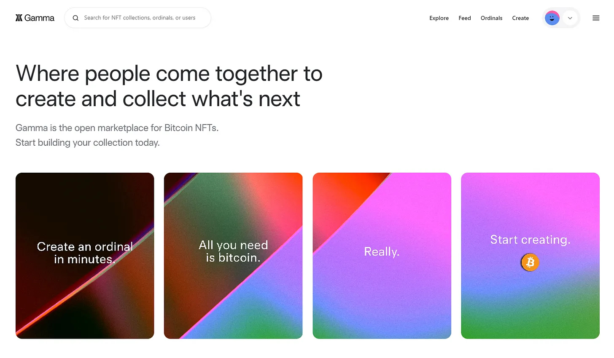

要在 Gamma 进行操作，只需在你的 BTC 进入你的 Xverse 钱包后，前往这个网站。然后点击页面顶部的「Ordinals」按钮，选择「Create Inscription（创建铭文）」。这样做将把你带到一个如下图所示的上传仪表板：

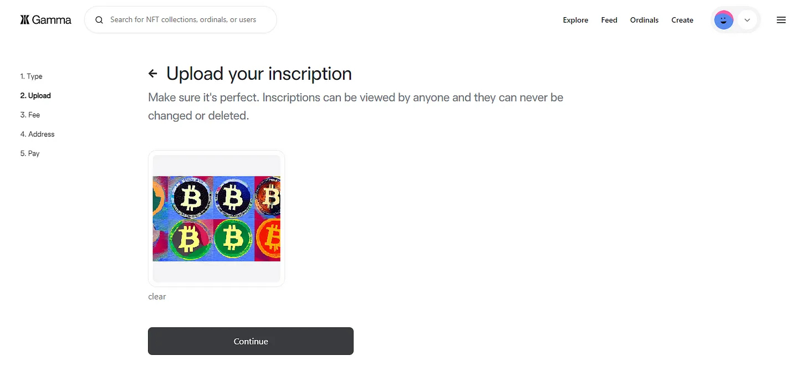

在这里，首先上传你想要的文件类型。然后选择你想要的费用水平（正常、较高或自定义），并输入你的 Ordinal 接收地址，将你的 NFT 交付给他。**注意**：这不是你 Xverse 应用中的 BTC 地址；你需要点击收藏品标签并按「Receive（接收）」，然后复制显示 re 的 Ordinals NFT 地址来进行。

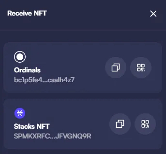

这时，在 Gamma 上按下「Continue（继续）」，同意使用条款，然后为你的铸造交易付款，会有这样的提示：

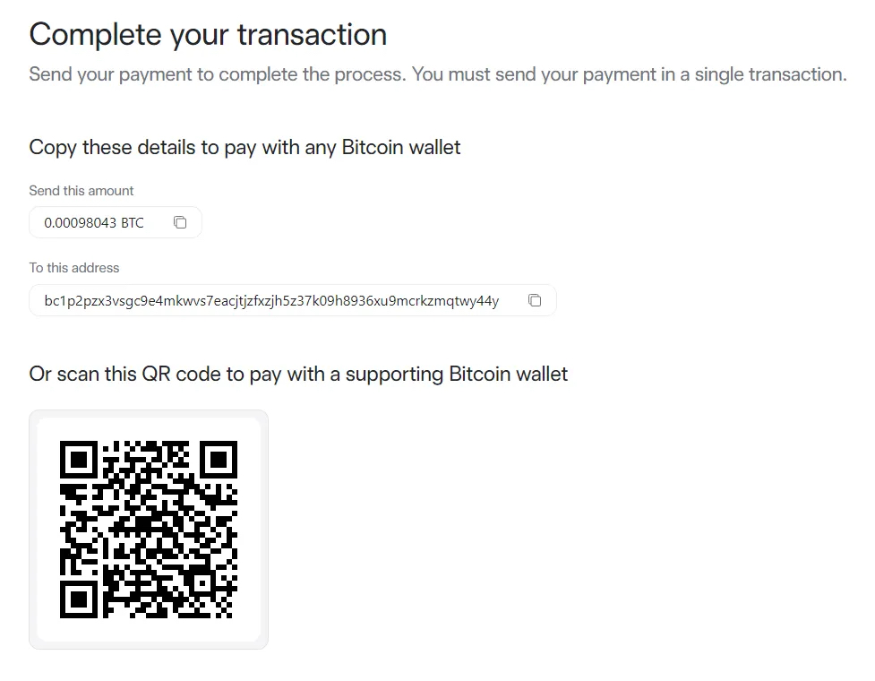

现在呢？进入一场等待的游戏。你的铭文可能需要几个小时，甚至几天才能完成，这取决于你当时的交易费用和使用网络的需求。Gamma 会提供一个等待页面，你可以查看你的铸币状态和交易细节。

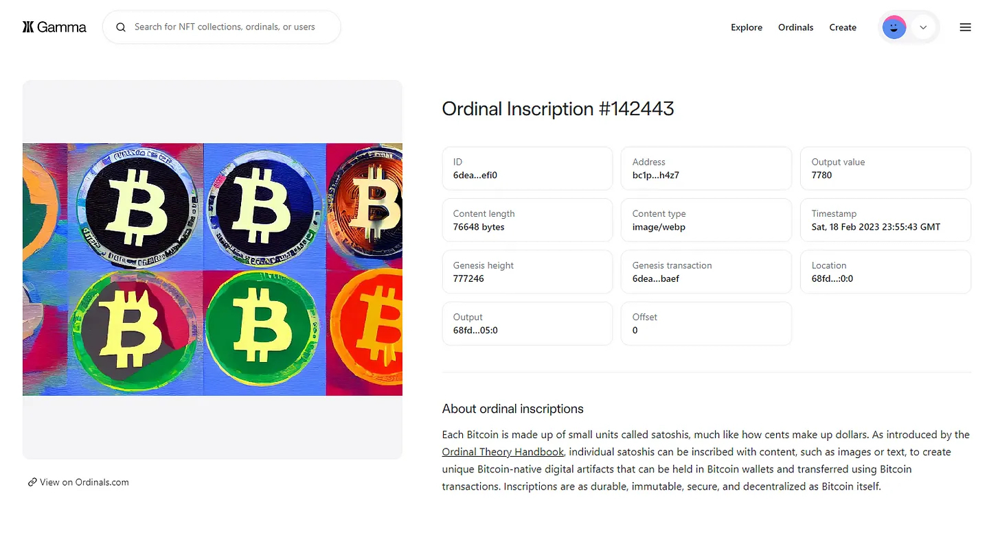

一旦你的铸造交易完成，你就可以在 Gamma 或你的 Xverse 钱包中查看（选择收藏品标签中的「Open gallery（开启画廊）」选项）。至于出售你的 NFT，你可以尝试在 Gamma 上申请一个[收藏列表](https://gamma.io/ordinals/new-collection)，或者在其他一些如今可用的 Ordinals 市场上碰碰运气：

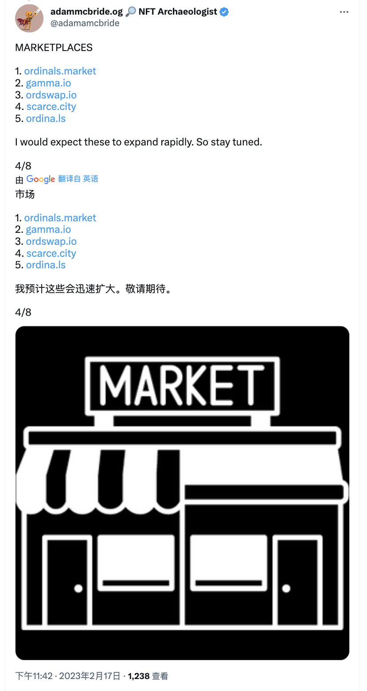

_https://twitter.com/adamamcbride/status/1626608069303226374_

总而言之，现在比特币上铸造 NFT 并不适合胆小的人，但像 Xverse 和 Gamma 这样的服务让它比一些人现在使用的更高级的途径要容易得多，比如建立自己的比特币节点。

放眼望去，看看比特币 NFT 从这里吸引多少用户会很有趣。对于 NFT 纯粹主义者来说，中本聪铭文的持久性和链上可能性是引人注目的，但生态将如何向前发展还有待观察。比特币有可能成为一个领先的链上存储选项，但我们必须等待，看看这条路线所带来的变化。
