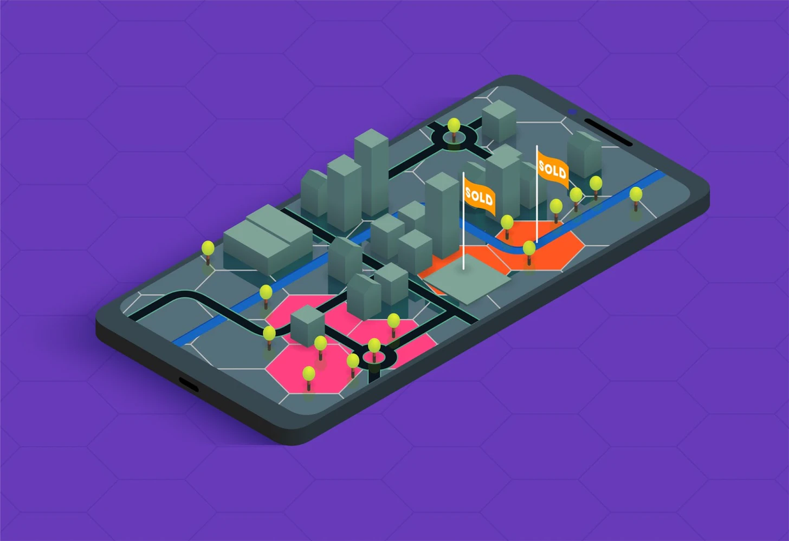
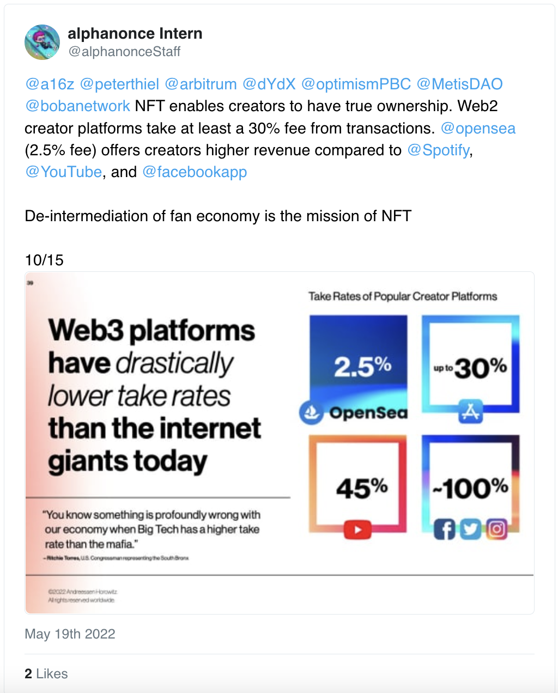
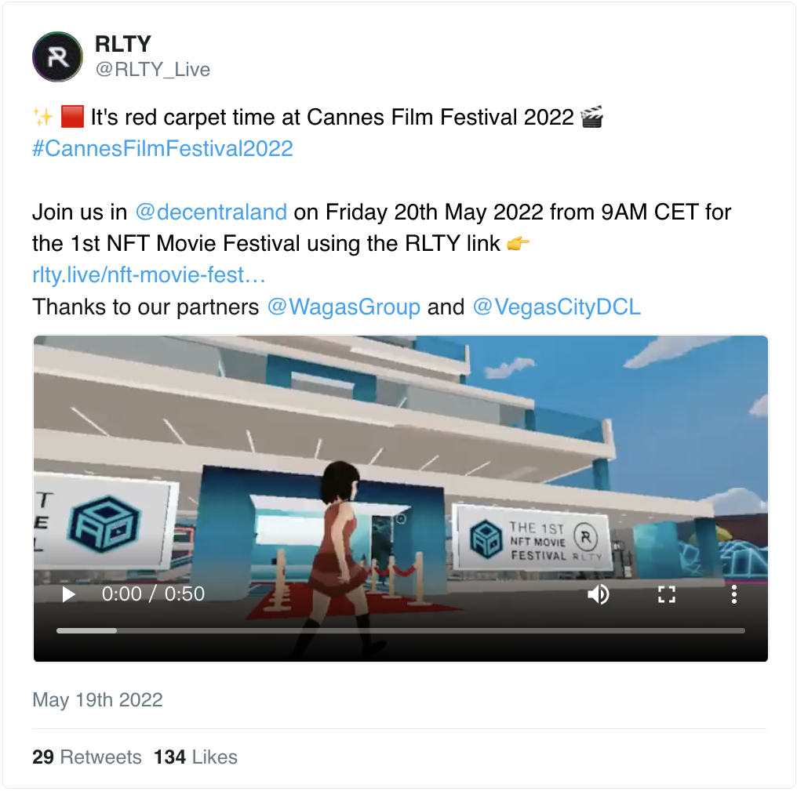
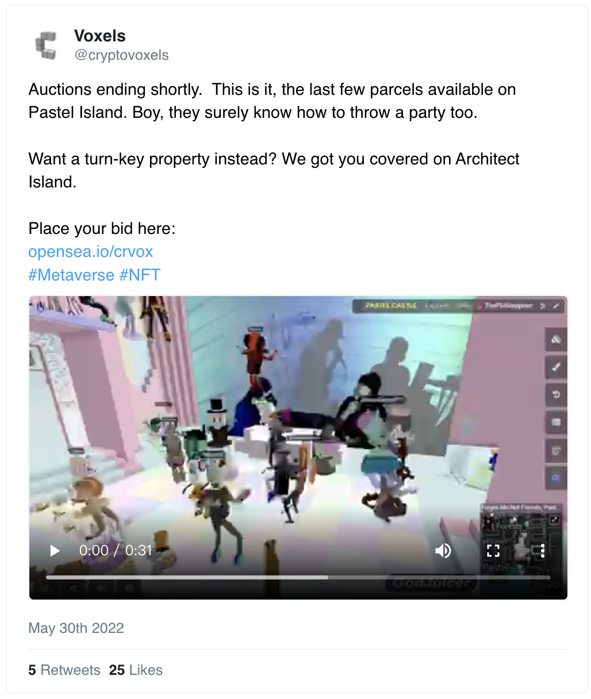
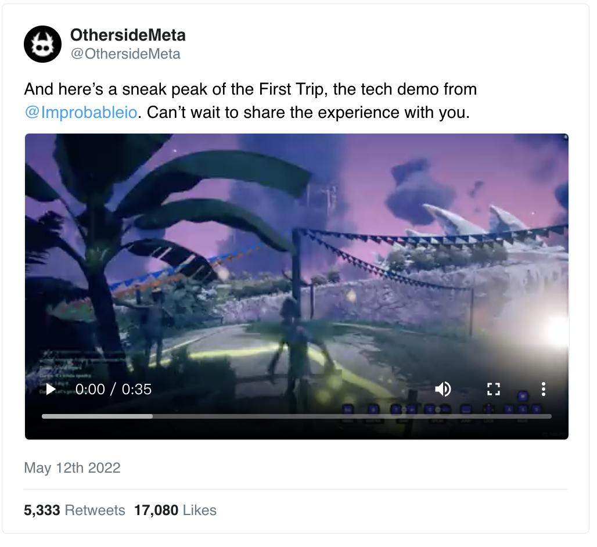
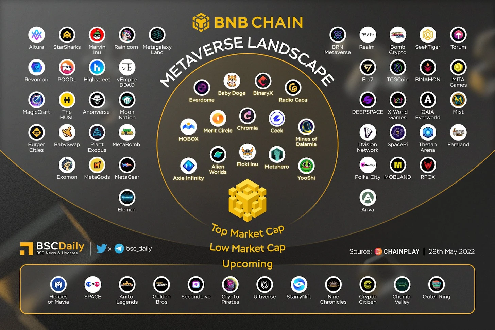
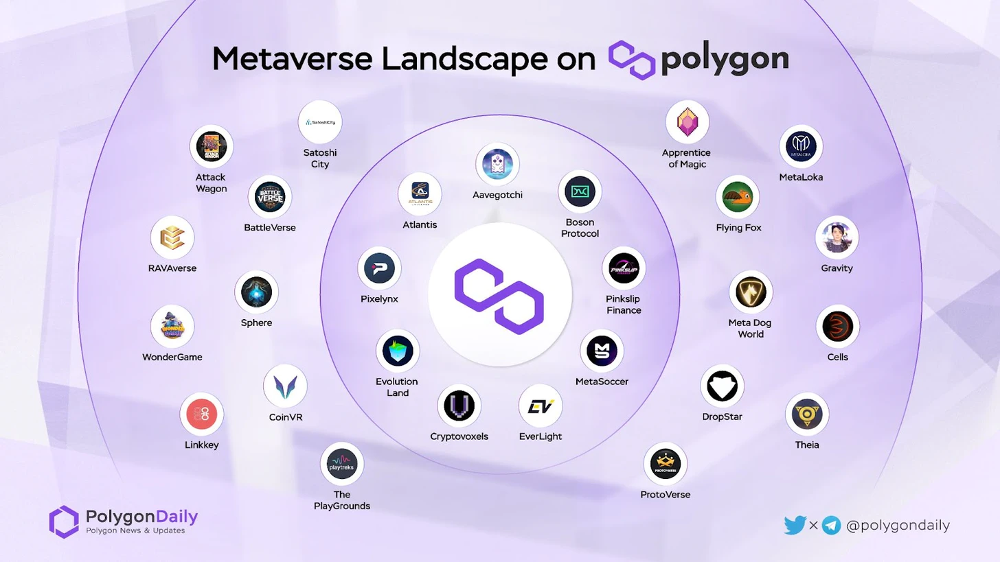
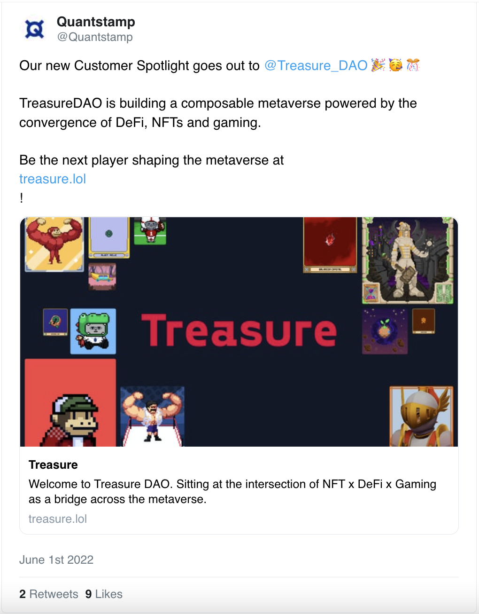
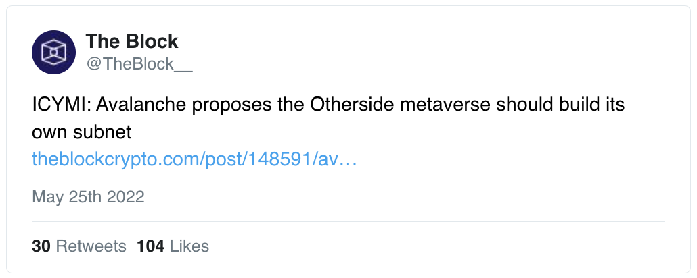
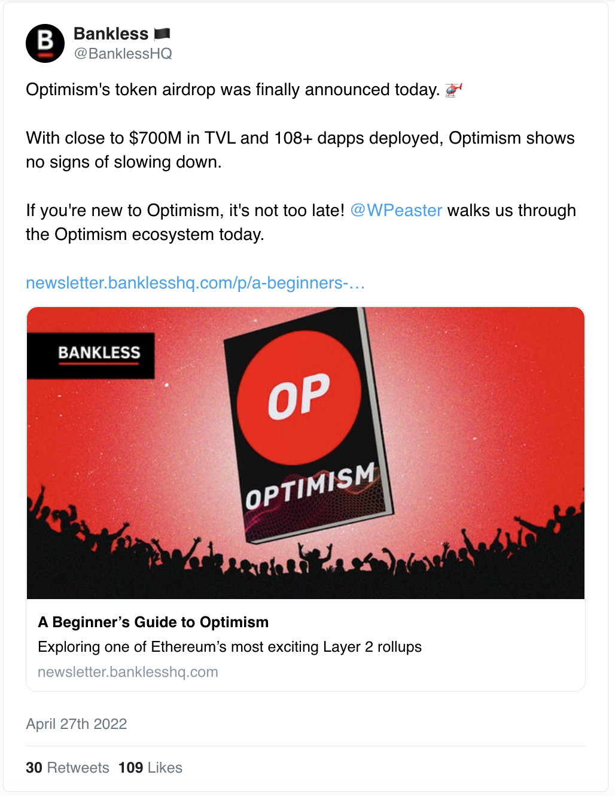

# EVM 元宇宙概览

正如以太坊官网所介绍，以太坊虚拟机（EVM）是「所有以太坊账户和智能合约所处的环境」。

当然，许多元宇宙项目并不依赖 EVM —— 甚至根本不使用区块链技术。然而，那些转向 EVM 的项目之所以这样做，是因为它是适合开放的元宇宙的基础设施，即 NFT、加密货币和开放协议是表达自由、交易自由、开放互操作性等的理想选择。

以太坊之外的许多第一层（L1）和第二层（L2）链已经接受了 EVM，所以今天加密经济中的大多数元宇宙建设工作都发生在 EVM 链上。这篇文章努力勾勒这一 EVM 元宇宙环境。

## 为什么要在 EVM 上构建元宇宙？

在 EVM 上构建，元宇宙项目有能力插入无边界和无许可的基础设施（加密货币、DeFi、NFT 等），以构建和分享他们想要的东西，以及他们想要的方式。

这些团队不必向苹果应用商店申请或担心被踢出 Steam 游戏市场。相反，这些项目使用 EVM 以自己的条款来实现和分发他们的产品，并在很大程度上以非中介的方式。

相比之下，考虑到今年早些时候有消息称，Facebook 母公司 Meta 计划对通过其 Horizon Worlds 虚拟现实平台进行的任何销售收取高达 47.5% 的创作者费用。哎哟我去!

与 EVM 支持的市场工作相比，这种大比例抽佣看起来就像黑手党的手法，比如 OpenSea，它收取 2.5% 的服务费，而 Zora 目前不收取任何协议费。

因此，基于 EVM 的元宇宙项目有更多的权力和更直接的方式实现他们的世界。在介绍完这些之后，让我们来逐一了解一下 EVM 元宇宙概况。

## 以太坊

- 以太坊年轻的元宇宙场景继续促进加密经济中最多的 NFT 交易量和整体活动。这些活动大部分来自以太坊最受欢迎的两个元宇宙项目，Decentraland 和 The Sandbox。

- 其他值得注意的项目，如 Voxels（以前的 Cryptovoxels）和 Somnium Space 在最近的时间里看到他们数据下降，尽管这两个项目仍然有忠实的粉丝群，并被许多 NFT 领域的人视为开拓者。

- 最近几个月，像 NFT Worlds 这样的新项目也涌入视野，而越来越多的人在关注 Yuga Labs 的 The Otherside、Nifty Island、Webaverse、Wassieverse、Southside City Metaverse 等知名的在开发项目。

## BNB 链

BNB 链的前身是币安智能链，是目前以太坊之外最活跃的 EVM 链之一。这并不奇怪，因为币安有一个丰富的生态系统，但如果我们放大 BNB 链的元宇宙场景，它比以太坊的小得多，而且充满了在币安的影响范围之外没有什么知名度的项目。

- 相对而言，今天在 BNB 链上构建的一些较大的元宇宙项目有 AlienWorlds、Ceek、Merit Circle、Metahero 和 YooShi。

## Polygon

- Polygon 被贴上经济实惠、环境友好、速度快的标签，是当代加密经济中以太坊之外最繁荣、发展最快的应用生态系统之一。最近几个月，Polygon 的 NFT 场景大幅膨胀，这使得大量的元宇宙建设者将他们的注意力转向这一用户友好的 EVM 链。

- 由于与 Aave 的联系，Aavegotchi 的 Gotchiverse 目前是活跃在 Polygon 上的最知名元宇宙项目之一。Voxels 是另一个项目，它也在越来越多地尝试使用 Polygon。其他的努力现在要小得多，尽管有许多这样的项目。
- Meta 旗下的 Instagram 最近宣布，它将添加对 Polygon NFT 的支持。这种支持会不会导致 Meta 在未来的 VR 努力中更加关注这一 EVM 链？只有时间能说明问题，但现在这显然是有可能的。

## Arbitrum

- Arbitrum 是一个受欢迎的新兴 L2。它的 NFT 场景仍然非常小，但它正在稳步获得牵引力。目前在 Arbitrum 上领先 NFT 的是 Treasure，它的特点是为元宇宙项目提供去中心化的 NFT 基础设施。到目前为止，已经在 Treasure 上建立的一些项目包括 Bridgeworld、Life 和 Smolverse。

## Avalanche（雪崩协议）

- Avalanche 是一条 EVM 链，目前并没有太多的元宇宙活动发生。可以肯定的是，现在 Avalanche 上有一些较小的项目，如 Atlantis World 和 Lootex。但在这个早期阶段，Avalanche 的元宇宙雄心仍然主要是抱负性的。不过，这一公链的创作者正在努力，他们最近提议在 Avalanche 上建立 Otherside 元宇宙，就是一个证明。

## Optimism

- Optimism 是一个非常有前途的 L2，提供完全的 EVM 等价功能，这意味着在 Optimism 上构建就像在以太坊上构建一样有效。然而，尽管有这一重大优势，Optimism NFT 生态还非常年轻，目前主要被隔离在 Quixotic 市场上。也就是说，Optimism 元宇宙场景目前几乎不存在，预计随着更多项目接受 L2 的 EVM 等价功能，这种情况很快就会改变。

## 缩小范围

总的来说，EVM 元宇宙全景还处于最初阶段，但它的边界已经开始向各个方向扩展。

EVM 开辟的互操作性是这一增长的一个重要部分，并将继续向前发展。然而，认识到非 EVM 和非区块链技术的重要性也很重要，因为它涉及到在未来几年实现一个开放的元宇宙。

例如，像 Blender 和 WebXR 这样的 3D 技术可以成为开放元宇宙建设者的巨大资源，而且需要做更多的工作，以便从 EVM 元宇宙领域向这些工具及其社区进军。我认为，当 EVM 项目开始更深入地拥抱这些额外的开放元宇宙资源时，真正的魔力才会开始。
