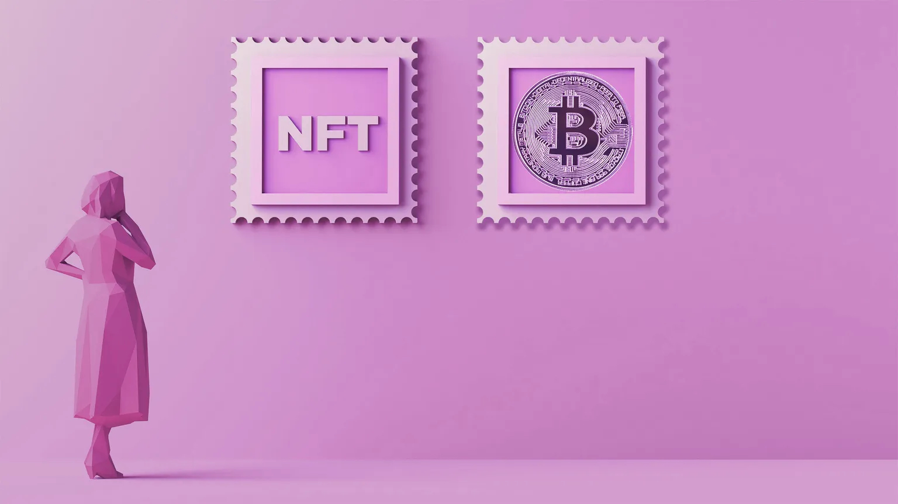

# 比特币 NFT 铸造量突破 20 万，不过对 Ordinals 的兴趣正在消退？ | Decrypt 报道

> 矿工费用在不到两周的时间里从 17 万美元跌至 1.1 万美元，但 Yuga Labs 的一个新项目可能会重新点燃局面。

Ordinals 在 1 月掀起了比特币网络的风暴，这个热门的新事物主导了这个最古老、最大的区块链的话题。2 月 27 日周一，根据 [Dune Analytics 的数据](https://dune.com/dataalways/ordinals)，比特币铭文的数量超过了 20 万个。

与 NFT 类似，[Ordinal 铭文](https://decrypt.co/resources/what-are-ordinals-a-beginners-guide-to-bitcoin-nfts) 是刻在 「聪」（satoshi）上的数字资产，是比特币（BTC）的最小面额。由于 2021 年 11 月 14 日在比特币网络上推出的 Taproot 升级，以比特币的匿名创造者中本聪命名的 Satoshi 上铭刻成为可能。

由于 Ordinals 的流行，比特币网络上的费用在过去一个月里急剧上升，仅在 2023 年 2 月 15 日就超过了 17.05 万美元的铭刻费用。已有超过 131 万美元的费用支付给比特币网络矿工。

然而，自 2 月 15 日以来，每天支付给比特币矿工的费用金额稳步下降，从 2 月 20 日的 54,000 美元下降到截至发稿时的 11,000 美元多一点。

「很明显，我们没有以足够快的速度交付功能，以保持内存池充满，」Ordinals 创建者、前比特币核心贡献者，Casey Rodarmor 告诉 Decrypt，「我们对我们的懒惰感到遗憾，并将在适当时候纠正这个问题。」

Yuga Labs 也可能有助于重振这股热潮。无聊猿猴游艇俱乐部的创造者今天宣布发布 300 个 Ordinals 系列 [TwelveFold](https://news.yuga.com/twelvefold#)，这是迄今为止采用该技术的最高规格项目。

比特币交易费由交易的数据量和用户希望他们交易完成的速度决定。希望自己的交易在高流量时期通过的用户可以决定支付更多的费用来加速他们的交易。

当处理交易的需求超过了矿工的供应时，费用就会上升。在比特币网络上，一个单独的区块是 1 MB，这意味着矿工每个区块只能确认 1 MB 的交易。

在最初的热潮中，用户在 1 MB 大小的区块内可以刻下任何东西，包括原始 Doom 的副本。

2023 年 2 月 7 日，网络上有超过 21824 个比特币 NFT 被铸造出来；这些铭文包括文字、图像、视频和音频文件。目前，仅有超过 5400 个文本和图像的铭文发生。

同时，围绕 Ordinals 的热情导致其他如莱特币、狗狗币等工作量证明（PoW）区块链的开发者试图复制该项目，该项目于 1 月 21 日启动。

2 月 19 日，软件工程师 Anthony Guerrera 在 GitHub 上发起了 Litecoin Ordinals 项目，此前他曾分叉比特币 Ordinals 的 GitHub 存储库。

Guerrera 当时告诉 Decrypt，之所以选择莱特币，是因为它是唯一具有类似功能的其他区块链，并且与比特币一样有 SegWit 和 Taproot 的升级。

虽然 Ordinal 铭文不需要第三方来创建，但像 Stacks 这样的比特币侧链项目的开发者已经利用这种对比特币 NFT 的新兴趣来推动 Ordinal 兼容的钱包和市场，当然是由他们的通证来驱动。
