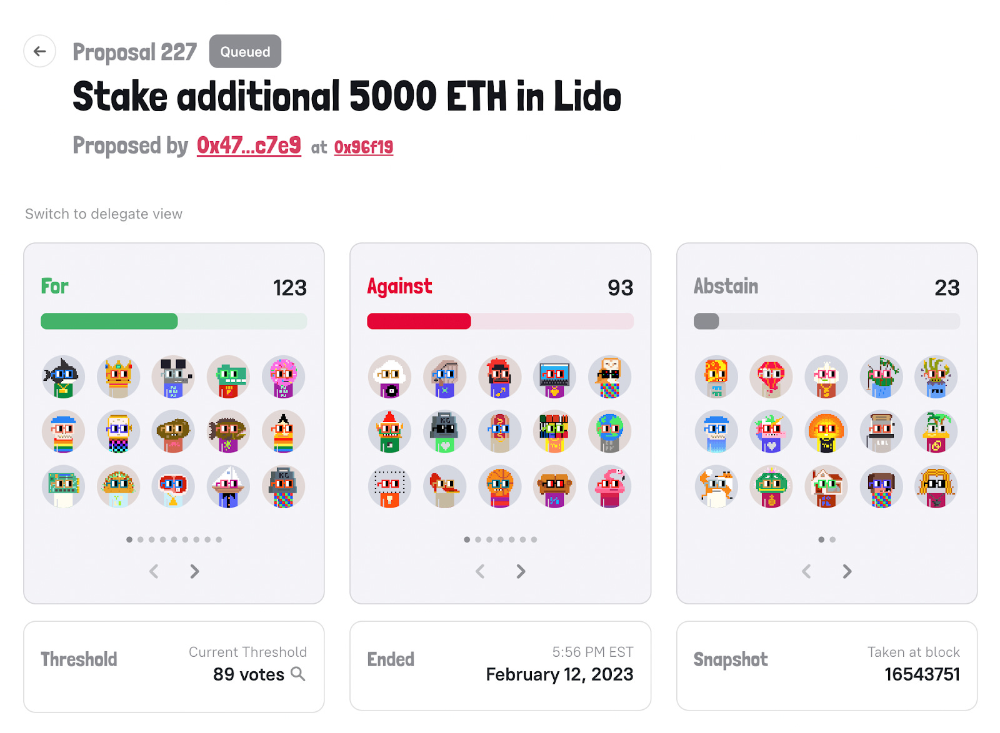

# Nouns DAO 和治理哲学 | Thought for Today

> Nouns DAO，这个成立一年多的 NFT DAO，年初起在中文币圈里获得越来越多的关注和探讨。今天，M7e 元宇宙特攻队翻译 2 月 27 日发表在《斯坦福区块链评论》的本文，以飨读者。

**作者：** 0xBobateas（哈佛区块链俱乐部）

## 简介

用哲学的方法来处理加密货币治理的当代问题，值得解释一下。与我们许多前辈不同，如今哲学家们不再向世界宣布理想中应该发生什么。我们已经变得谦虚。我们不再寻找人类活动的普遍规律，而且我们清楚地认识到，对过去的理解，也许是过去本身，会随着哲学家的观点发生反身性的变化。但问题仍然存在：任何共识机制或并行执行引擎的创新都无法动摇人心。要真正理解 Web3 的影响，我们必须首先理解人类。而要理解人类，我们必须首先理解我们的过去。

诚然，任何先前的经验，无论多么丰富，以及任何历史研究，无论多么彻底，都不能替当前巡游元宇宙的一代省去自己找到答案的创造性任务。然而，知识史的启发性比许多加密纯粹论者所认为的要强。通过对 Nouns DAO 的自治原则和机制进行案例研究，我将试图用哲学的角度来研究 Nouns DAO 对公民社会、社区和 Web3 时代治理的影响。我的结论是，NFT 项目未来的任务是参与一个艰苦的世界建设过程，将意义和象征主义放在这些 JPEG（译注：像素图片文件格式之一，在 NFT 领域俗称「小图片」）背后，使其能够培育一种自我维持的团结、认同和民主责任感。毕竟，治理是两方面的艺术：既有治理者，也有被治理者。在一个有效的治理结构之上，被治理者必须得到足够的激励，以便留在社区内。最终，Nouns 的目标是培养双重任务，即通过利用图像学（iconography）的交流和团结的力量，促进民主 DAO 治理原则和有意义的去中心化。

## 背景：NFT 的价值

在深入了解 Nouns DAO 前，我们需要了解 NFT 的价值主张。记录在区块链上的非同质化通证（译注：英文为 Non-Fungible Token，缩写 NFT），被用于许多目的，如保证数字产权。然而，与同质化通证（译注：英文为 Fungible Token，缩写 FT，即 Token，本文译为「通证」）不同，同质化通证从底层产品中获取价值，但不参与价值创造，而 NFT 通常是产品本身 —— 想想 Fidenzas、Ringers 或 CryptoPunks。虽然 NFT 通常是指向 IPFS（译注：去中心化存储协议之一）上托管的 JPEG 的指针，但许多 NFT 项目，包括 Nouns 和 Cyberbrokers，实际上是直接在链上生成然后存储其艺术作品。

在很长一段时间里，许多人认为 NFT 1.0 时代不过是为了便于在链上追踪并移动的数字收藏品。那是 NBA Topshot 和 中本聪收藏卡的时代。NFT 2.0 时代，即猿猴时代，被许多人吹捧为下一个十亿用户进入加密世界的途径，意味着引入的只是「实用性」的模糊概念，或将你的 NFT 作为某些活动的门票或俗气商品优惠券的权益。启示是，如果你只把你的 NFT 视为一系列贴现的未来现金流，或者只是作为数字交易的棒球卡，你永远不会理解为什么它们如此昂贵（或者有低的夏普比率，上帝保佑）。对我来说，NFT 是一种新的数字基元，可以轻松地引导意识形态一致的社会网络。Nouns DAO 就是这样一个网络。

## NounsDAO 概览

_Nouns 500 [1]_

Nouns 项目是对「简单即美」这一格言的证明。然而，正如实验性努力的情况一样，它的成长已经不止于此。首先，它是一个 NFT 项目和一个 DAO（去中心化的自治组织）。

简单地说，Nouns 是以非同质化的 ERC-721 通证为形式的生成性艺术作品。它们是通过洗牌和重新组合预定义的特征而产生的，这些特征包括沙发和鲨鱼等头像。每个 Noun（除了每第十个头像留给创始团队）拍卖给出价最高者。赢家收到 Noun 后，他的 ETH 将被存入 Nouns 的资金库。拍卖每天都在进行，社区可以影响到明天下一个 Noun 的特性。

这就到了 Nouns 的另一个关键部分：DAO，它（像许多其他 DAO 一样）使用 Compound 治理的分叉软件。就我个人而言，我通过赢得 Noun 55 的公开拍卖加入了这个社区。虽然我可能迟到了，但截至 2021 年 8 月 8 日，Nouns 协议每 24 小时就会生成和拍卖一个 Noun，目前我们的 Noun 是 591。这个过程打算持续到宇宙的终点。

DAO 首先是民主制度 —— 一种决定如何分配社区资源的去中心化方式。在 Nouns DAO，正如许多 NFT 社区一样，主要的「公共资源」是资金库。每个 Nouner（译注：Noun 持有者），无论他们拥有多少 NFT，在 DAO 如何花费其资金方面都只有很小的发言权。他们的投票权与其拥有的 NFT 数量成正比（一些 Nouns 委托给知名成员，按比例提高他们的投票权）。截至目前，共有 341 名 Nouners（持有者，有些人拥有不止一个 Noun），资金库中有 28,176 个 ETH —— 这相当于 4450 万美元的巨款。

正如世界上有不同类型的民主制度（总统制、议会制等），也有许多链上治理的变型。例如，Curve 协议试验了「投票权托管」，即锁定 CRV 通证以换取更多投票权。当然，所有这些都是有代价的。随着托管系统带来更集中的权力，导致更有效的治理，但同时，这些集中的权力系统可能滋生权力垄断，实际上侵蚀了民主（你拥有的 veCRV 越多，你就越能像涡轮增压一样增加 CRV 奖励流向你的流动性池，给你更多 CRV 和更多治理权力）。当我们回到 Nouns 治理讨论时，我们必须牢记这一点。

## Nouns DAO 治理：重新想象「公民社会」

Nouns DAO 的治理机制展示了一个优雅而强大的民主系统，它承认利益相关者的多样性，并保障「Nouns 项目的长期增长和繁荣」[2]。任何拥有 2 个以上 Nouns 的 Nouner 都可以提交提案，在符合法定人数的情况下，每个提案都以简单多数通过。此外，为了确保通过的提案不违反社区规则和利益，Nounders（译注：Nouns 项目创始人）保留最终否决权。

这种简单的设计在实践中被证明是惊人的强大。Nouns DAO 已经创建了 218 个提案，内容范围从抵押资金库的 ETH 到可用财务资源的分配。在这些提案中，153 项已经通过，只有 1 项被否决，这就是提案 60，标题恰如其分地被命名为「测试基金会在时间锁定期间否决提案的能力」。

_Nouns DAO 投票[3]_

这些结果击中了我认为 Nouns DAO 的长期意识形态意义的关键所在。从表面上看，Nouns DAO 似乎不过是一个成功的社区集资的对冲基金，以呆萌的像素艺术为中心。但实际上，Nouns DAO 的成功重新定义了「公民社会」的概念，将过时的民主机制拖向一个去中心化的数字化层面。

考虑到这一点，让我们来谈谈民主治理的哲学和「公民社会」的作用。文艺复兴时期意大利的实用主义政治哲学家尼科洛·马基雅维利（Niccolo Machiavell）认为，所有社会都会退化。他在《论李维》中写道，「君主制很容易变成暴政，变成贵族制，变成寡头制，而民主制往往会退化成无政府状态。因此，如果一个国家的创始人建立了这三种政府形式中的任何一种，他建立的时间都很短，因为他可能采取的任何预防措施都不能防止它滑向相反的方向」[4]。他认为，所有形式的政府都是有害的，治理者只能通过系统地让共和国恢复到退化发生前的初始状态来避免退化。马基雅维利写道，「因为所有教派、共和国和王国的开端都必须有一些善意，通过这些善意，它们可以恢复最初的声誉和最初的增长。」[5]

马基雅维利认为，这种复兴可以从内部或外部实现。从外部来说，罗马在被法国人的外部打击后获得了重生；从内部来说，它被像 Haratius Coclus（译注：普布里乌斯·豪拉提乌斯·科克莱斯，古罗马独眼英雄）和 Regulus Attilius（译注：马尔库斯·阿蒂利乌斯·雷古鲁斯，古罗马军事家，第一次布匿战争统帅）这样具有伟大美德的人重新赋予了活力。然而，很明显，这两种再生方法都不可靠，我相信马基雅维利被迫赞同残酷地处决布鲁图的儿子和类似的可怕行为来打击腐败。他写道，如果罗马「每十年就举行一次类似的清洗」，那么它就「永远不会腐败」；只有当死亡变得更加稀少时，人们才会自我腐败，并开始「违反法律」[6]。总之，马基雅维利被迫为死刑等可怕的惩罚进行辩护，因为他认为这些惩罚对于更大的利益是必要的。他仔细研究了罗马帝国的衰落和灭亡，但他错过了可以拯救他的理论的一块拼图，即使许多民主国家不至于堕落的关键再生力量：公民社会，即人民之间的自由和自愿的社团。

19 世纪法国社会学家托克维尔（Alexis de Tocqueville）在他的《论美国的民主》一书中，将公民社会定义为表达个人利益和解决社区问题的自主聚集的组织网络，即「站在个人和国家之间的中介组织领域」[7]。在前往新世界的前夕，年仅 25 岁的托克维尔对殖民地的省级去中心化分权感到惊叹，对每个乡镇如何管理自己的事务和自主组织每个议题的委员会感到震惊。快进到今天，像达纳·维拉（Dana Villa）这样的学者也将公民社会与新诞生的社团生活相提并论 ——「没有国家的官方赞助……总之，它代表着一个去中心化、多元化的公共领域，它不仅能够推动社会对官僚/专制国家的要求，而且能够反对大型经济利益（如跨国公司）」[8]。公民社会必须在公共-政治层面上得到拥护。

当然，一个好的公民社会的特征必须包括自愿参与、社区感和共同的目标，但 Nouns 的最大创新之处在于它能够允许民主和有意义的去中心化的共生繁荣。NFT 必须超越古怪的收藏品，成为理念一致的社会网络的骨干。你收集一个 Noun 不仅是因为你喜欢 Noggles（Noun 护目镜），而且还因为你认同 Nouns DAO 的意识形态原则。就像 19 世纪 30 年代托克维尔在美国旅行时非常触动的自我组织的新英格兰市政厅一样，Nouns DAO 必须将地方城镇会议带入 21 世纪的区块链上[9]。在元宇宙时代，我们通过无数的相互联系来发展我们的身份，我们以一种家庭之外但非政治的方式彼此建立联系 —— 因此，NFT 已经演变成志同道合的意识形态社区公民的数字徽章，创造一个始于基层的网络公民社会。

在实践中，Nouns 治理模式的所有权和投票者结构也证明了这种去中心化和民主的过程：投票权分布非常均匀，将近一半的投票权由只有一个 Noun 的个人持有。由于每日拍卖的稀释效应，鲸鱼大户持有的投票权不到 20%。随着时间的推移，单一所有者的数量预计会增加，减少在其他高度集中的 DAO 中常见的串通勾结风险。此外，链上的透明度确保没有隐藏的所有权或即将到来的解锁，让投票者更难隐瞒他们的立场和意图 —— 用于投票的唯一 NFT 也为持有人建立了一个跟踪记录，实现了零知识的信任。

## 文化资本的增长：图像学-流动性飞轮

然而，尽管有独特的治理结构，Nouns 的生计还是取决于它能不能很好地传播其文化价值。从根本上说，一个 Nouns 只是一个花哨的 JPEG。要使这个 JPEG 具有流动性，人们必须首先重视它的图像学（iconography）。事实上，图像学和流动性是一个硬币的两面。通过无需许可的 DeFi 协议，文化资本（图像学）已经可以与通证（流动性）无摩擦地互换。因此，就像劳力士每年生产一百万只手表并保持其价值一样，仅仅是由于其立即可识别的魅力和作为良好投资的共识，像 Balenciaga（巴黎世家）这样的时尚公司和新兴的 Tiktok（抖音）网红依靠其图标的病毒传播性。这就是我所说的图像学-流动性飞轮的意思。非常广泛地讲，NFT 通过捕捉文化模因（meme）价值（模因、标志和社会地位的力量），成为文化资本的仓库。

因此，随着流动性的增加，Nouns 的图像学效力也会增加。通过加强图像学，更多的资本将流入该项目，为其病毒式传播提供更多的火力。正如法国社会学家 Bourdieu 和 Baudrillard 所建议的，这种文化符号的价值是基于它在符号等级体系中的地位。最昂贵的 NFT 验证了这一理论；否则一个 Azuki spirit 怎么能卖到超过一百万？然而，由于 Nouns 不是固定的供应，保持 Nouns 价格的唯一方法是传播它的图标，产生的需求将启动一个「品牌效应」的良性循环，这些东西越贵就越受欢迎。一旦这种情况开始发生，只要记住：需求是反射性的，但供应是线性的 ⌐◨-◨。

因此，DAO 必须以有效的方式使用 ETH 来吸引注意力，使 Nouns 成为理想的选择。Lil Nouns 提案（Nouns DAO 的一个分叉，拥有 8 个适当的 Nouns，并有自己的迷你资金库用于启动自己的流动性-图像学）是朝着正确的方向迈出的一步，给投机者一个较低的入口，从而消除了流动性障碍。同样，我也在密切关注 218 号提案，其提议「在日本最好的滑雪场，用 15 个月的时间将 Nouns 带给 200 多万人，并将 Nouns 融入阿尔卑斯山的亚文化」[10]。作为对提案人要求的 19.8 万的回报，DAO 将得到在整个度假村的护目镜分销权，在他们的社交媒体上的专题报道，在 247 辆缆车上的海报，以及更多。虽然我以男孩般的热情看待这个提案（它将逐步推出，直到 2024 年第二季度），但我也认识到，许多其他提案都未能获得吸引力。我并不太担心，因为我对这些提案的心态非常类似于风险投资 —— 大多数会失败，但少数成功的提案会产生渐进式的巨大影响。结合重现活力的市场周期，Nouns 可能被证明是最终利用三位一体的 NFT 技术、DeFi 和 DAO 治理来充分发挥其潜力的项目。

然而，正如我将在后面的章节中讨论的那样，Nouns 艺术必须超越美学范畴。艺术必须不仅仅是离奇的。为了完全克服飞轮的静态摩擦，我们必须确保这一艺术揭露一个价值体系 —— 一套模因、想法和习俗，用于组织一个社区和它的实践。它需要建立一种与世界接触的方式。

## 处死：提案 129

_Nounify 纽约时装周[11]_

虽然 Nouns DAO 的「成长」是其作为 NFT 的原生形式，但 Nouns DAO 的「死亡」却不是。像大多数其他民主国家一样，Nouns DAO 的治理模式最容易受到执行失败的威胁，以及随后的信任丧失。这是一个关于违背承诺的意识形态和资源分配问题，基础设施的改进并不能解决这个问题。

这某种程度也是我个人的事情。我是 「Nounify 纽约时装周」（即第 129 号提案）的提议者，该提案现在因其违背承诺而被人记住。在与我在 1Confirmation（一家与斯坦福大学有深厚关系的风险投资公司）的朋友交谈后，我被介绍给 Advsiry 团队，他们在著名的纽约时装周 —— 一个有许多名人参加的世界主要时装秀活动 —— 承诺提供 Advice X Nouns 出席证明徽章和 Nouns 礼物给客人，在会场贴上 Nouns 品牌，主办一场 Nounish afterparty，在 T 台上展示由 Keith Herron 设计的 Nouns 物件，为 Nouns 拍摄一部纪录片，所有这些报价 33ETH[12]。

在利用我的关系争取支持后，我们以 59 票对 1 票通过了提案。时装周的日期到了，又过去了。由于我无法前往位于世贸中心的艺术地标 Oculus NYC，走秀就在那里举行，所以只能依靠其他出席的 Nouns。令我失望的是，根据一位 Nouner 同伴的说法，事实上「活动期间几乎没有 Nouns 的存在」。我赶紧自己看了录像，并立即联系了 Advisry。他们表示歉意，并指责他们计划不周，缺乏「足够的时间来填写适当的文件」等原因。至于 Nouns 品牌，他们「从意大利赶制了 Nouns 行李箱，并及时送达……但在表演当天，由于某种原因，它没有出现在 T 台上」，原因是「造型团队的错误」。但没有退款。

我声明对这一提议的失败和 33ETH 的损失负责，但显然这显示了关于 DAO 的一个更大的问题：在链上移动治理未能解决任何民主的问题，而这些问题是宪法的反多数主义制定者不得不面对的。Nouns 社区成员之间的信任衰减了，人们集思广益，想出了我们可以拿回钱的方法，包括法律行动。尽管如此，这里最强调的应该是 DAO 在现实世界中面临的执行风险，以及对链上治理的新颖艺术和社区潜在不信任，以及其图像学和流动性。

## 民主政体的问题：一个哲学的视角

自古希腊以来，民主政体一直面临着执行和团结的长期问题。在柏拉图的《共和国》中，苏格拉底认为，民主的目的不是为了诱导非哲学家试图尽可能地成为一个好人。与其说民主是为了培养美德，不如说是为了培养自由 —— 无论多么高尚或卑微的生活都可以自由。但正是这种自由是民主的最大败笔：你必须相信，你不是唯一一个纳税的人。更多的时候，这些没有强烈的共同认同的民主社区会成为囚犯困境的牺牲品。

对于加密怀疑论者来说，很容易指出所有的提案只是想从资金库中获得一些快钱。他们甚至可以找到一些例子，比如第 129 号提案，这些钱被不法分子浪费了，却没有造成任何后果。可以拿希腊人做个比喻，他们享受自由，却不明白是什么让他们获得自由，因此对他们的民主制度不以为然，也不在乎它的死亡。但怀疑论者和浮躁者都被误导了：作为去中心化、民主化的实体，DAO 从根本上说是日益多元化的公共领域的开放社会的一部分。当然，必须有一个伟大的治理结构，但被治理者也必须有同样的激励，让他们愿意被治理。问题就在这里：开放社会对团结有强大的需求，我们必须有这种需求，而且你确实可以在可行的民主中找到这种需求。反过来，团结又需要一种对共同身份的重要性的认识。这一切都回到了自由社团和公民社会的价值上。

在某种程度上，Nouns 强调了一个非常迫在眉睫的问题：技术将以前的抽象和哲学问题带到了我们关注的前沿。当让·弗朗索瓦·利奥塔（Jean-François Lyotard）第一次对后现代元叙事的丧失咆哮时，没有人理解他在说什么。现在，随着去中心化的网络经济和脱离时空世界的虚拟模拟成为现实，我们被迫面对这种认识论的危机。有一个「接近」的崩溃和图像空间的扁平化，我们变得越来越脱离我们成长的舒适世界，并被推入一个神秘的符号世界，在那里每小时的劳动不再转化为 15 美元的价值。

因此，Nouns DAO 未来的最大风险是一种虚无主义的疲惫感。对民主机构的信任度下降，我们不再关心投票，从大多数 DAO 的低投票率就可以看出。我们已经失去了判断何时应该遵守规则、何时应该抛弃规则的能力。我们甚至失去了就规则是什么达成一致的能力。我们不再居住在一个承认这种能力为终极价值的世界里。在一个仅由邪恶的平衡维系的现实中，我希望我们判断能力的恢复不需要像回到古罗马那样公开处决，而这会让马基雅维利会感到骄傲的。

最后，政治发生在小型社区，就像当年发生在希腊一样。没有通用规则，除了培养制造规则的能力。像其他许多人一样，Nouns 仍在遭受中心化加密货币行业的黑天鹅所带来的宿醉，如 FTX 的崩盘事件。因此，DAO 提案往往一叶障目不见森林。我们不应该花时间起草计划，从失败的提案中收回 ETH，从资金库中分配红利，甚至以散漫的方式给慈善机构和其他公共物品捐赠。Nouns DAO 需要重新建立其团结和身份的定位。我们必须拒绝蔓延的虚无主义，它让我们的集体行为既缺乏活力又不正常。最后，一个 Nouner 必须在他作为这个社区成员的身份中意识和实现他自己 —— 在他的自己 Noun 中。

## Nouns DAO 的未来

那么，我们如何夺回我们的命运？我们如何促进公民社会？

也许答案在于，首先通过图像学-流动性飞轮的方式，回到利用 Nouns 的价值作为文化资本的一种形式。毕竟，图像学是影响力，而有了影响力就必须有意识形态的责任。在这些花哨的 JPEG 背后应该是一个相互尊重的社区，它积极地形成意见，修改激情和感情，决定追求的目标，值得钦佩的人的类型，使用的语言，以及最终，它所包含的参与者的性格。

虽然乍一看，这似乎是一个很高的要求，但对于一个以文化资本为基础的经济价值的 NFT 社区来说，这并不是一个不可能完成的任务。这里的关键任务是正确利用正确的叙事，构建正确的背景故事。

事实上，只有在 NFT、DAO 治理和 DeFi 的出现下，这才有可能。在一个完全匿名和加密的世界里，NFT DAO 能够为个人提供一种具体的社会身份感。鉴于个人有能力判断自己喜欢哪一种，它为个人提供了主观的个人自由，提供了多种多样的氛围供其挑选。然而，NFT DAO 必须提供一种公认的生活方式，一个部落，系统地融入到元宇宙的差异化统一中，而不是所有的古怪实验都以超级虚无主义而结束。这种身份必须为人所知，以提供潜在的成就感。作为一个 Nouner，必须帮助无名者获得一个公认的地位（由它的图标所推动），以免他们与他人隔离，与公民社会疏远，而只通过自私地追求投资损益来衡量他们的自我价值。

故事具有与生俱来的道德效力；这就是为什么托尔斯泰认为文学的价值在于它能够在道德上进行改善和改革。因此，对于像 Nouns DAO 这样的 NFT 社区来说，未来最大的任务也许是参与一个艰苦的世界建设过程，将意义和象征主义放在这些 JPEG 背后，让它能够培养一种团结、认同和民主责任感。哲学真理不需要普遍的有效性，只需要普遍的可交流性。

作为一个众所周知的成功项目，Nouns DAO 的民主实验最终必须作为一个鼓舞人心的模式：为无数个以其为形象的小型本地 DAO 提供一个模范的灵感源泉，这些 DAO 都有自己的集体认同感。如同百花齐放，这些微型匿名社区将以它们自己的特殊和确定的原则出现。在他们对这一现实的意识和对自身利益的关注中，他们同时也成为这一内在活动的无意识工具，在这一活动中，他们自己所承担的形状消失了，而新的网络公民社会则努力向其下一个更高的阶段过渡。只有通过这种方式，民主和去中心化才能在加密时代生存。

因此，让我们围绕我们的 JPEG 建立一个世界。

**关于作者**

0xBobatea 是哈佛大学的一名大三学生，学习哲学和经济学。就像之前的卡尔·马克思一样，Boba 作为 Dragonfly Capital 研究分析师，致力于用他的扶手椅哲学来改变世界。他在 Cryptokitties（加密猫）之前购买了狗狗币，并在 2020 年开始交易 NFT，当时他担任 Axie Infinity 的社区大使。在哈佛大学，Boba 帮助创建了哈佛区块链俱乐部的研究倡议。他是许多 NFT 社区的 KOL，包括 Azuki、Doodles 和 Nouns。

**[推特](https://twitter.com/0xbobateas)**

**[Mirror](https://boba.mirror.xyz/)**

**参考文献**

[1] https://nouns.wtf/noun/500

[2] https://nouns.wtf/vote/129

[3] https://nouns.wtf/vote/227

[4] 尼科洛·马基雅维利，《关于提图斯·李维斯前十本书的论述》第 1 卷第 2 章

[5] 马基雅维利，《论李维》第 3 卷第 1 章

[6] 同上

[7] 维拉·达纳，《剑桥托克维尔指南》中「托克维尔和公民社会」章节

[8] 同上

[9] 亚历克西·德·托克维尔，《论美国的民主》，弗吉尼亚大学美国研究项目，第 1 卷，第 5 章

[10] https://nouns.wtf/vote/218

[11] https://discourse.nouns.wtf/t/nounify-new-york-fashion-week/1925

[12] https://nouns.wtf/vote/129
