# ZK、L2 如火如荼的竞赛进展 | Bankless 指南

> 随着以太坊「上海升级」在本月实施，业界更多的注意力、资源将投注于 L2，ZK（零知）技术与应用是其中最为耀眼的明珠。今天分享 Bankless 指南，帮助大家获得一张最新的导览图。

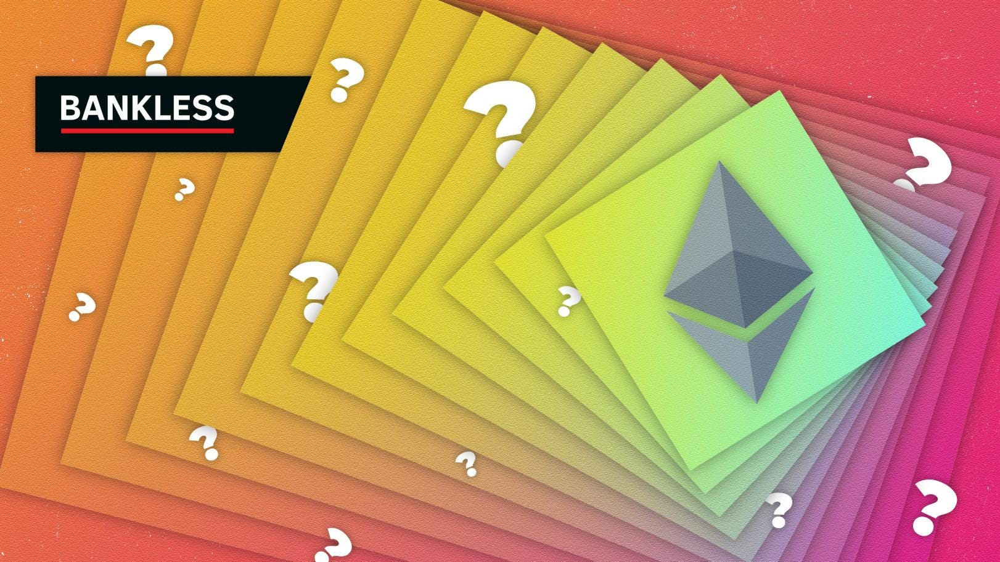

**作者：** William M. Peaster

_题图：[Logan Craig](https://twitter.com/slacker_daddy)_

用区块链术语表述，以太坊的初始阶段是单体区块链。

这意味着，在最初几年，「第一层」以太坊主网只负责执行自己的交易，促进自己的网络安全，并服务于自己的[数据可用性](https://ethereum.org/en/developers/docs/data-availability/)。

在过去的几年里，以太坊一直在迅速走向**模块化**设计，这意味着*围绕*以太坊构建的外部第三方解决方案越来越多地被倚重，以扩展以太坊的数据和执行需求。

_模块化以太坊 —— 来自[《超级可扩展性以太坊》](https://newsletter.banklesshq.com/p/ultra-scalable-ethereum)_

在数据可用性方面，Celestia 和 Polygon Avail 等项目是竞争者。至于执行，近年来，我们看到 Arbitrum 和 zkSync 等「第二层」 L2 的崛起，它们在以太坊之外执行交易（即链外），然后有效地「卷起」成批的交易到以太坊 L1，在这个过程中提供令人难以置信的实惠和快速的用户体验。

今天，以太坊 L1 本身只能进行每秒 30 个交易（TPS）。为了更好地处理世界范围内的活动水平，而不出现重大的网络拥堵（高费用，慢交易），以太坊越来越依赖于扩展创新来优化其执行能力。这里有两种主要类型的解决方案：**链上扩展**和**链下扩展**。

链上扩展是指直接对区块链进行的任何改变，以提高其交易执行能力，即吞吐速度。对于以太坊来说，一个例子是[分片](https://ethereum.org/en/upgrades/sharding/)，这项创新一旦实施，将把活动负载分散到几十个主要的的以太坊链上，而不是一个单一的主网。

_以太坊 L2 和分片的未来 —— 来自 [Vitalik Buterin](https://vitalik.ca/general/2021/12/06/endgame.html)_

链下扩展指的是外部执行环境，即 L2 在以太坊之外促进廉价和快速的交易，然后将交易数据分批发布到以太坊，最终完成活动并继承以太坊的安全性。链下扩展不是像分片那样将 L1 分割成许多主链，而是培养了许多外部 Rollup（卷起打包）的第二层，其可定制性令人难以置信。

## ZK rollup：领先的基于 ZK（零知）的链下扩展技术

谈到 L2，当代最流行的解决方案之一是**零知 rollup**（ZK rollups）。值得注意的是，这些 rollup 可以开展约 2000 TPS，比以太坊目前的 30 TPS 增加了 6.5 倍！

这一特定的 L2 类型使用「零知识证明」，例如 [SNARKs](https://consensys.net/blog/developers/introduction-to-zk-snarks/)，以加密方式验证并在以太坊上发布其批次交易。相应地，通过零知识证明将链下执行与链上数据结合起来，就可以得到 ZK rollup _（反之，通过[欺诈证明](https://ethereum.org/en/glossary/#fraud-proof)将链下执行与链上数据结合起来，就可以活动[Optimistic rollup](https://ethereum.org/en/developers/docs/scaling/optimistic-rollups/)）_。

综上所述，L2BEAT [目前跟踪](https://l2beat.com/scaling/tvl)的 5 个最大的 ZK rollup 例举如下：

1. dYdX：加密货币和衍生品交易所 | 3.75 亿美元 TVL（总锁仓金额）
2. Loopring：交易和 NFT 的 L2 | 1.21 亿美元 TVL
3. zkSync Lite：交易和 NFT 的 L2 | 6500 万美元 TVL
4. ZKSpace：交易和 NFT 的 L2 | 4900 万美元 TVL
5. Aztec Connect：私密 DeFi 的 L2 | 1500 万美元 TVL

_今天最大的 10 个 L2 协议中，有 4 个是 ZK rollup —— 来自 L2BEAT_

今天正在运行的领先的 ZK rollup 是使用 [StarkEx](https://starkware.co/starkex/) 技术（如 dYdX 和 Loopring）或基于 [zkSync](https://zksync.io/) 的代码（如 zkSync Lite 和 ZKSpace）建立的。然而，还有更多与这些技术栈无关的 ZK rollup 产品也值得你关注，比如 Aztec Connect。

## 关于 Validiums 和 Volitions

然而，ZK rollup 并不是当代以太坊扩展场景中唯一值得注意的基于 ZK 的解决方案。另外两种扩展方式是 **Validiums** 和 **Volitions**。

_Validiums_ 在链外执行交易，并通过链外的零知识证明维护其数据。这种方法与 ZK rollups 在以太坊上的数据批处理方式形成对比，即在链上发布数据。那么，数据的存储位置是 ZK rollups 和 Validiums 之间的关键区别。

Validiums 的「双链下」方法让它们最终成为托管方，因为数据是由受信任的各方维护的。不过，Validiums 在免信任方面的不足，可以用超强的性能来弥补，因为今天最强大的 Validiums 可以开展 20,000 以上 TPS。

目前，两个比较知名的 Validiums 是 [Immutable X](https://l2beat.com/scaling/projects/immutablex) 和 [Sorare](https://l2beat.com/scaling/projects/sorare)，前者是以 NFT 为中心的扩展解决方案，TVL 为 1.23 亿美元；后者是传奇体育数字卡游戏，TVL 为 2100 万美元。其他目前值得关注的 Validiums 包括 [ApeX](https://l2beat.com/scaling/projects/apex)、[rhino.fi](https://l2beat.com/scaling/projects/rhinofi) 和 [Myria](https://l2beat.com/scaling/projects/myria).

至于 Volition，它们是 [StarkWare](https://starkware.medium.com/volition-and-the-emerging-data-availability-spectrum-87e8bfa09bb) 团队的一项创新，它们是 ZK-rollup 和 Validium 的交叉。也就是说，有了 Volition，用户就可以在链上和链下的数据可用性之间进行选择。这让应用可以选择 Validium 级别的 TPS 性能，同时仍然可以与非托管的 ZK-rollup 技术互通。zkSync 最新突破性的 [zkPorter](https://docs.zksync.io/zkevm/#what-is-zkporter) 机制就是这样一个值得关注的 Volition 系统。

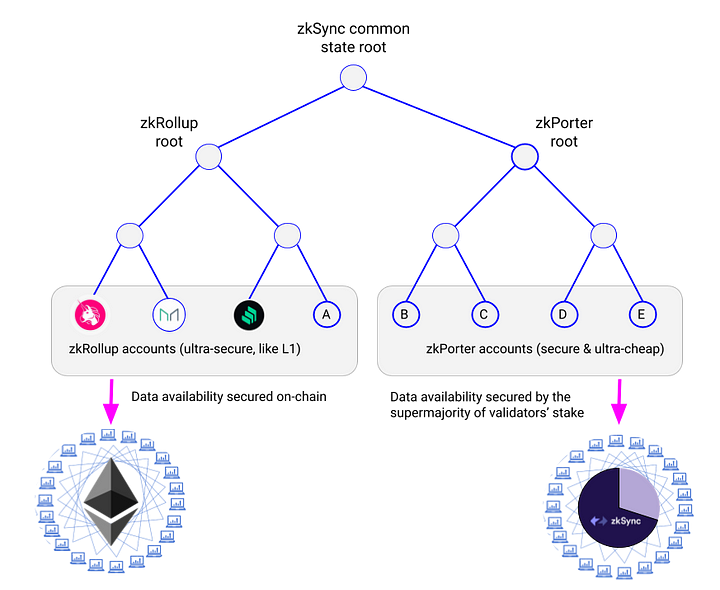

_来自 Matter Labs_

## zkEVMs，可扩展性圣杯

考虑一下 ZK rollup 的架构如何有两个主要部分：接收和跟踪 L2 区块数据的链上以太坊智能合约，以及作为基于以太坊交易的执行环境的链下虚拟机（VM）。

那么，zkEVM 就是与以太坊虚拟机（EVM）兼容的 ZK rollup，即以太坊 L1 的执行环境。

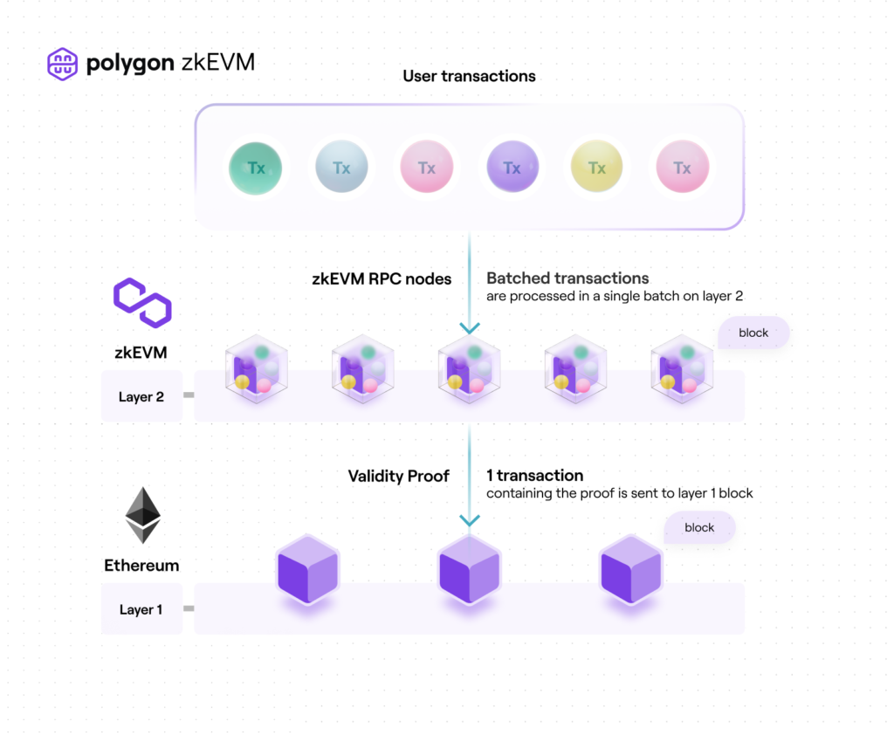

_Polygon zkEVM 扩展的一般方法说明 —— 来自[Polygon](https://polygon.technology/blog/polygon-zkevm-public-testnet-the-next-chapter-for-ethereum_

在以太坊的扩展竞赛之初，Arbitrum 和 Optimism 等 Optimistic rollup 有一个巨大的优势，即这种类型的 rollup 最初更容易与 EVM 兼容，甚至完全等同。这种技术上的亲和力使得应用可以很容易地移植他们的代码，并从 L1 到 L2 使用他们喜欢的工具，这是伟大的用户体验。

相比之下，ZK 类扩展的特异性使得 ZK rollup 一开始就采用了定制的虚拟机，这意味着项目要进行更多的工作，即「解释」EVM 的代码或使用从头开始写的新代码。不过，截至 2023 年 3 月，多个 ZK rollups 项目现在明显处于公布自己的 zkEVM 实现的边缘!

因此，zkEVM 的到来代表了 [Vitalik Buterin 在 2021 年的预测](https://vitalik.ca/general/2021/01/05/rollup.html)，即「从中长期来看，随着技术的改进，ZK rollup 将在所有用例中胜出」。由于使用了加密证明，ZK rollup 比 Optimistic rollup 有内置的隐私和安全优势，所以当你把 EVM 的兼容性添加到组合中时，ZK rollup 有可能在未来竞争中超过 Optimistic rollup。

## 正在进行的 1 型和 2 型 zkEVM 的竞赛

「扩展战争」的是 Optimistic rollup 和 ZK rollup 团队之间发生的非正式的友好竞争，以尽可能提供最好的区块链扩展解决方案。

然而，在 ZK rollups 本身也在进行另一场比赛，这是一场非正式的比赛，看看哪个团队能够实现 Vitalik Buterin 定义的第一个「1 型」和「2 型」zkEVM。

_Buterin 的 zkEVM 分类_

在 [2022 年 8 月的一篇博文](https://vitalik.ca/general/2022/08/04/zkevm.html)中，Buterin 提供了一种方法来衡量 zkEVM 项目的能力，提出了一个从 1 型到 4 型的评分标准来对它们进行分级。类型 1 的 zkEVM 将与 EVM 完全等同，甚至可以用来升级以太坊本身，而类型 4 的 zkEVM 将只与一些以太坊应用兼容。

也就是说，由于涉及到所有的工作，1 型 zkEVM 的实现仍需要一段时间，但现在有多个项目正在对 2 型 zkEVM 进行磨合。

_今天 zkEVM 的主要工作 —— 来自 [Immutable X](https://immutablex.medium.com/ground-up-guide-zkevm-evm-compatibility-rollups-787b6e88108e)_

例如，[Polygon zkEVM](https://polygon.technology/blog/what-is-a-zkevm) 是一个 3 型 zkEVM，正在成为 2 型 zkEVM，即相当于 EVM 的一些额外的细微差别。[Scroll](https://scroll.io/) 是另一个值得注意的团队，目前正在朝着 2 型 zkEVM 的方向发展。相比之下，[zkSync Era](https://blog.matter-labs.io/all-aboard-zksync-era-mainnet-8b8964ba7c59)（以前的 zkSync 2.0）是一个有主见的、有意的 4 型 zkEVM，通过自定义功能和 zkPorter 令人印象深刻的 Volition 能力得到加强。这里的可能性谱系相应地很宽广。

## zkEVM 的最新进展

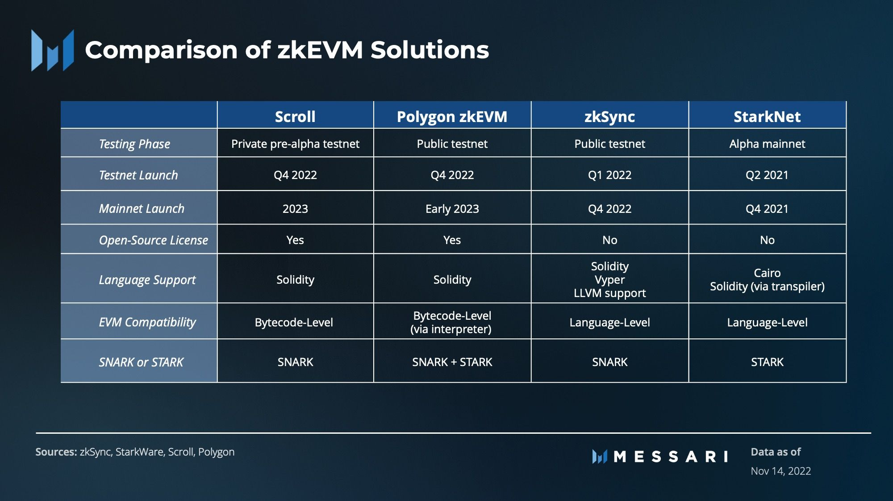

_来源：[Messari](https://messari.io/report/the-zk-everything-report?referrer=author:jerry-sun)_

🟣 **Polygon zkEVM 主网测试版于 3 月 27 日开始：**

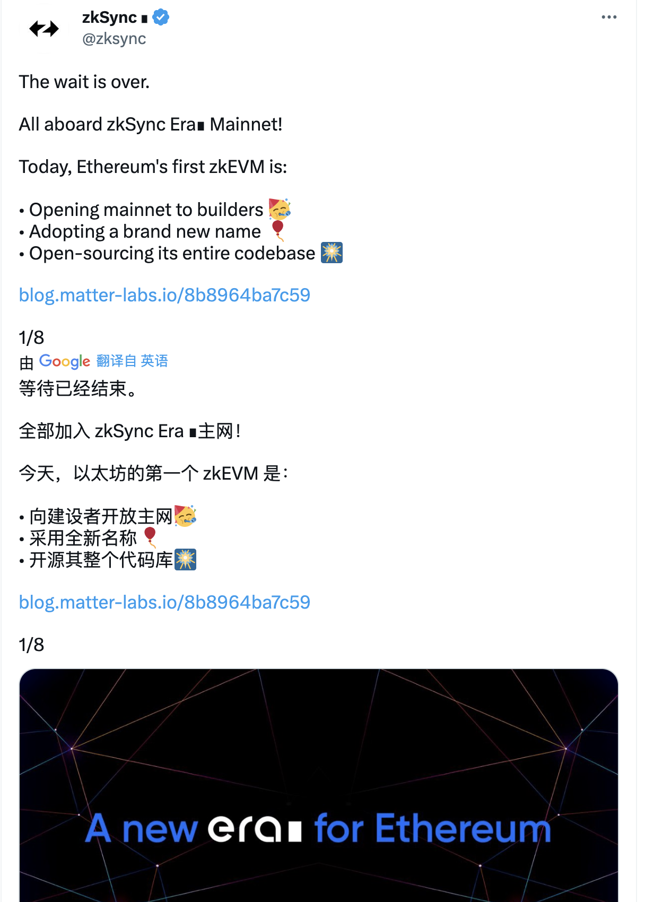

_https://twitter.com/0xPolygon/status/1625529122561597440_

🔁 **zkSync Era 刚刚向开发者上线其主网，用户即将到来：**

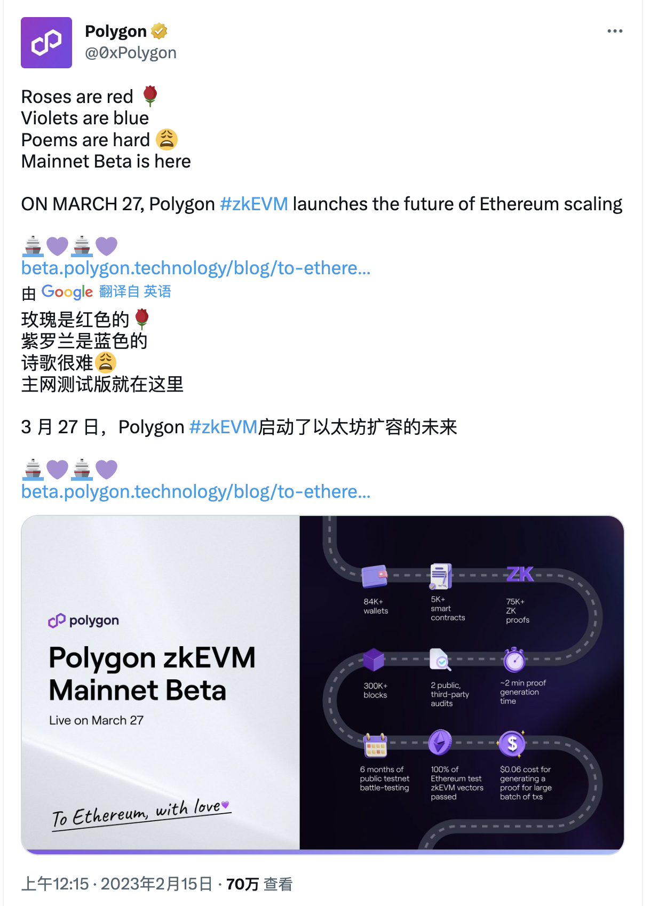

_https://twitter.com/zksync/status/1626235292268240902_

📜 **Scroll 刚刚发布了其 Goerli zkEVM 测试网，这是主网之前的最后一步：**

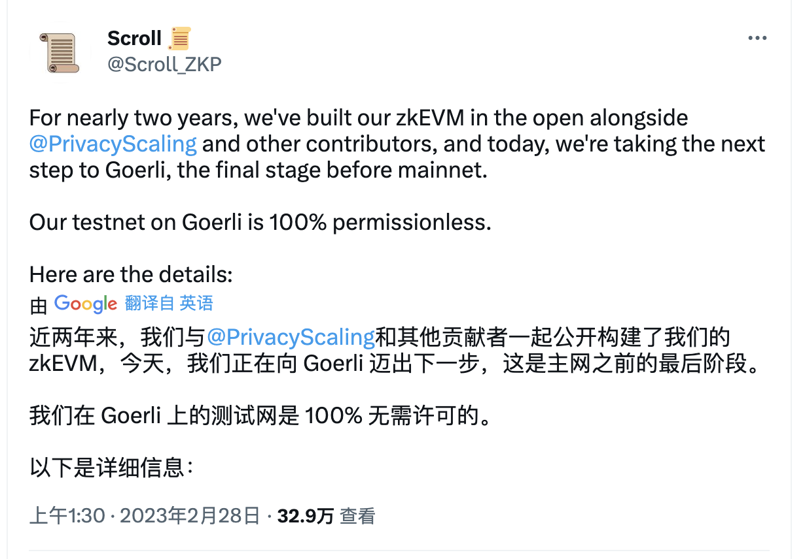

_https://twitter.com/Scroll_ZKP/status/1630258973856395264_

🌐 **Starknet 的 Kakarot zkEVM 已经达到了 3 类状态，并在不断攀升：**

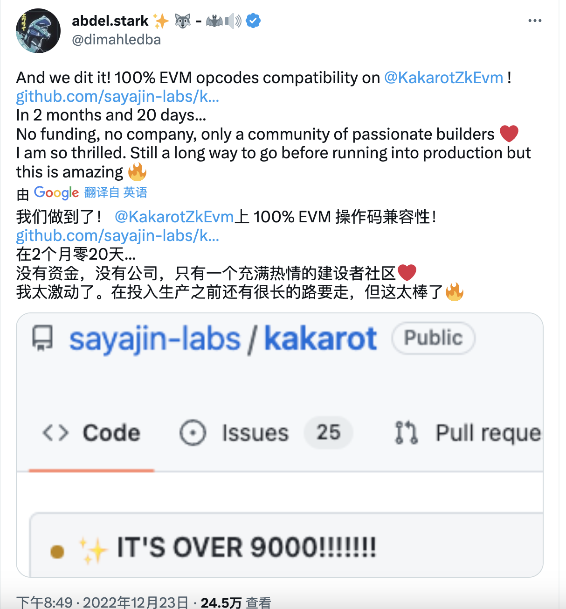

_https://twitter.com/dimahledba/status/1606270836922585098_

## 区块链用户体验新时代即将到来

有一天，以太坊本身可能会升级到 1 型 zkEVM，以进一步扩大链上规模。同时，作为对这一潜在升级的补充，从 2 型到 4 型的外部 zkEVM 将继续开花结果，并为开发者和用户提供独特的定制和用户体验增强，这是以太坊 L1 目前无法做到的。

总而言之，ZK rollup 领域（也可以说是整个 L2 领域）的终局是 zkEVM，而这些努力中的第一个即将上演。2023 年将是普通加密货币用户能够首次尝试 zkEVM 的一年，所以如果你想在这些团队的最新扩展进展开始行动时跳进去，请密切关注 **Polygon、zkSync、Starknet 和 Scroll**!

## Antaplpha #ZKP HackerHouse

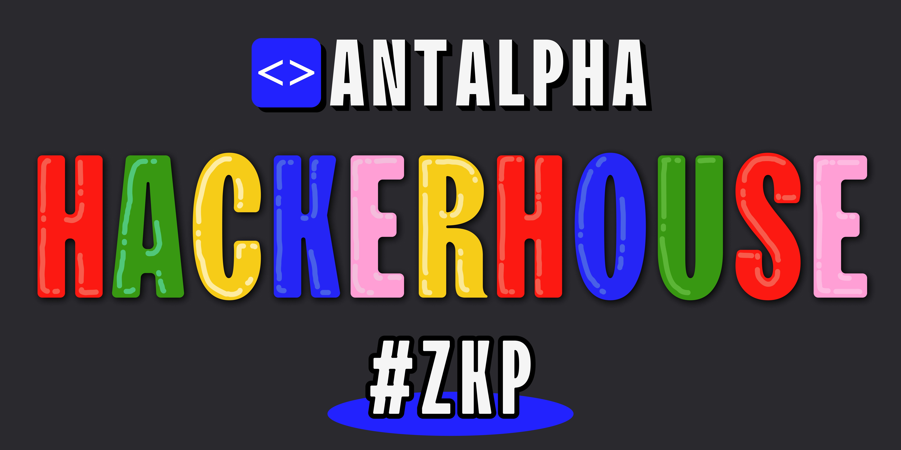

据称正在北美举行的 ETHDenver 上，人人言必称 ZK…… Antaplpha Labs 不仅联合发起 ZKP 共学，而且举办在全球定期巡回的 ZKP HackerHouse。

**第一站：** 美国丹佛

- 2 月 27 日启动

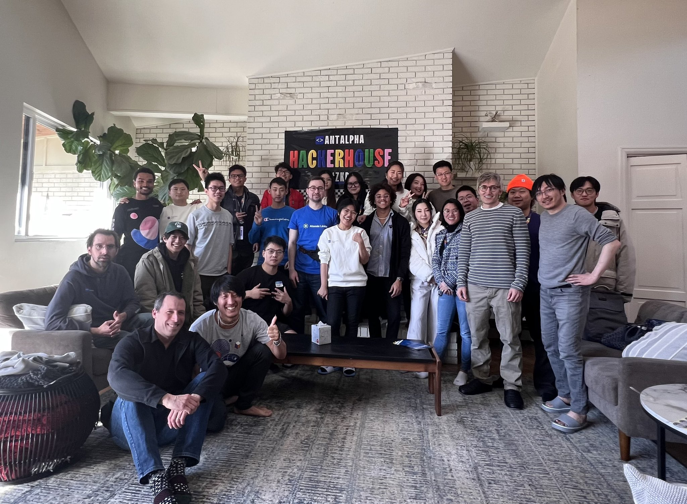

- 3 月 2 日 Demo Day

**第二站：** 泰国清迈

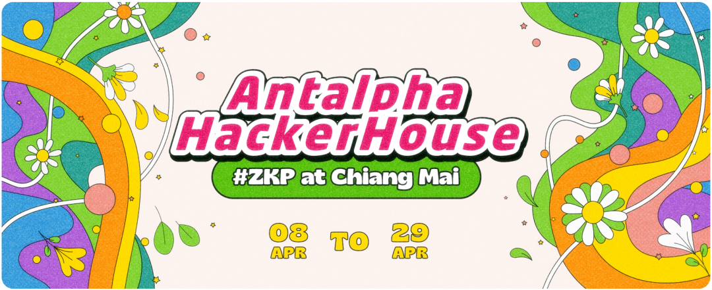

_详情点击上图_

即日起，Antaplpha Labs 正式向全球 hacker 们发出 co-buidling & co-living 邀请！

4 月上旬开始（将遇上泼水节~），3 周时间，本期 HakcerHouse 的主题是**未来数字世界的重要组成部分：ZKP 零知识证明**。未来 21 天里，HackerHouse 将在风景宜人、美食遍地的热带季风地带，和兴趣相投的全球区块链开发者、密码学爱好者们，一起 code hard & play hard！
