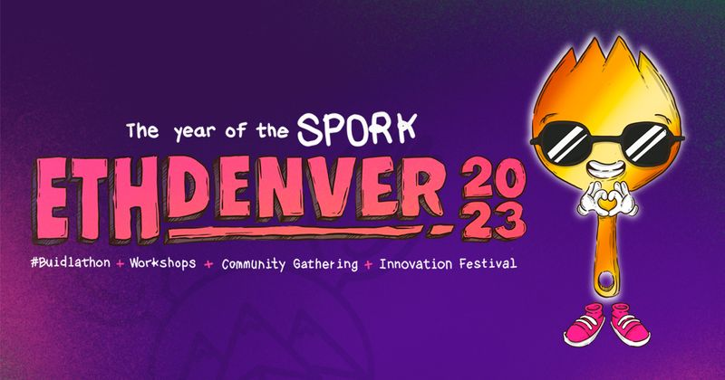
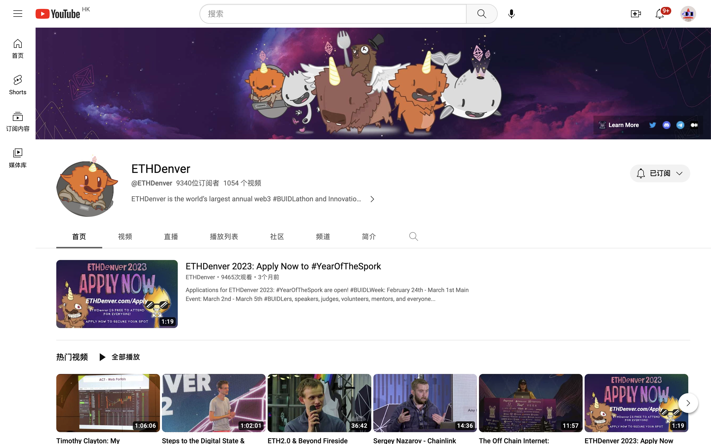

# ETHDenver 搞得吼不吼？且看前方参会者怎么说~~

> 昨天，3 月 5 日，北美最大的以太坊生态活动 ETHDenver 2023 以一场精彩的黑客松 Demo Day 活动正式收官。2023 年开年规模最大的 Web3 BUIDL 盛会据说吸引了全球近 4 万人参加，其中华人估计在千人以上。这场持续了 10 天的大会办的究竟如何？哪些赛道和项目最受瞩目？正在活动现场的 Will 不满足于自己写一篇小作文，和 Elaine 一起采访了包含 16 位投资人、28 位开发者，以及其他身份等 75 位参会者，记录了逐字稿。M7e 元宇宙特攻队略作挑选和文字梳理，原汁原味分享给关注 Web3 但未亲临 ETHDenver 现场的朋友。

**作者：** @financeYF5 @elAIneyang73

## 开发者 & 创业者

**Zhang**

- **项目：** 某 DID 身份项目
- **赛道：** DID
- **评论：** Walletnet 活动还不错，华人项目在生态、标准等上游参与还不太够，策略上还是 Web2 思维，对于老外生态、开源不是那么接受，喜欢自己做，不参与主流生态，建议还是要开放共享。

**Huston**

- **项目：** 某 3A 游戏
- **赛道：** 游戏
- **评论：** 做了 4 年游戏，一直想做有意思的游戏，这次来最重要的是第一次公测，收集反馈，回去改进，让游戏能像 Web2 那样丝滑体验。下次来应该带更多电脑，因为很多人排队玩。认为游戏要集中在 Game 体验，少 fi。

**Jenks**

- **项目：** Filecoin
- **赛道：** 存储
- **评论：** 作为项目方，见到很多 BUIDLer，很多线上聊了一两年的伙伴第一次碰面。我们这次主要来借势发布 FEVM，组织了一些早上的 lighting talk，讲项目的目前状况。参会感受有几点：1）ZK（零知）很火，是未来，个人很看好，在学习；2）分布式存储赛道到了一个转折点，如果有踏实的企业和项目就能做成；3）以太坊基金会在丹佛没搞啥活动，完全社区和 BUIDLer 自发；4）个人认为以太坊开了[Network State]先例（最终是不是以太坊，现在还不确定），比特币是一个承诺，以太坊先发了再迭代，才能进入主流，不是很好参照。以太坊可以很好的区块链技术，效率高能解决很多问题，经济学方面比较厉害的，比特币解决信任问题，是很贵很贵的东西，以太坊很便宜能解决，最可怕就是，简单不需要依赖国家，达到人类协调，所以是一个革命，和文字、印刷、个人电脑一样的工具。

**Ming**

- **项目：** Metis
- **赛道：** 公链 L2
- **评论：** 今年丹佛活动是疫情以来规模最大的活动，开发者很多。最近虽然是熊市，但社区热情很高，对新技术追求很热烈，开发社区没太受市场行情影响，越熊越需要开发。

**初夏虎**

- **评论：** 挺好的，一起来逛的老婆说这生态，已经大到灭不掉了。不太看好技术的东西，大部分 95%会挂，只是不知道 5% 是谁，只能一个问过去，来判断，基本分为三大类：1）金融服务，LSD 借贷这种；2）数据服务，API 方式，开发工具；3）游戏 Gaming。最看好的金融这一块，数据可能有机会，只能少数，游戏一个都不看好，Web2 进去是天方夜谭。

**周期**

- **项目：** ETHStorage
- **赛道：** 存储
- **评论：** 1）这次活动非常好，大部分都是 BUIDLer，非常全球化，亚洲，非洲有很多开发者来参会，是一场盛宴，项目非常多元化，各个方面的生态都在参与，整个展馆做了很大优化，每个人都有足够多的空间展示自己。2）随着比特币 NFT 的发行，大家对纯链上的以太坊 抱有非常强的需求，但是以太坊原生存储还是一个很大问题，以太坊基金会刚刚宣布支持 ETHStorage，说明他们也在布局去中心化存储这块。我们刚刚在 ETHDenver 的主会场发布了对于 Web3:// 的访问协议，对于以太坊新的应用做了很多展望，会持续在以太坊活动上发声。

**Shu**

- **项目：** Hexlink
- **赛道：** DID
- **评论：** 1）这个活动更加集中在 dev（开发）上面，聊的很多元化，项目更加多元化，在展览上看到挖矿或者不太需要 dev 的项目，这边聚焦在 Web3 这个 topic，虽然叫 ETHDenver，但是实际不属于以太坊的项目也会出现。2）我做的是 DID，这个赛道现在白热化了，当 AA（账户抽象）出现后所有人看好，去年很多人觉得不性感，今年关注度在大幅增加，项目也越来越多。我们正在发布 MVP，play.hexlink.io，欢迎体验；3）除了 DID 以外，我还看好实用型 NFT（PFP 以外的 NFT）和体验更好的钱包，以及粉丝经济，它能非常好导流到 Web3，因为给 KOL 利益，他们就能挪粉丝过来。

**Rae**

- **项目：** Manta
- **赛道：** ZK
- **评论：** 1）第一次来丹佛大会看到卖 T 恤有点惊喜，挺好的，不同的人面对面聊天，获取一些内部消息，比如大的项目，会约一个市场机构，帮着做 BD；2）对 ZK 赛道的看法：2021 年底看到很多 ZK 和隐私的，会有一些应用，和 DAO 和治理、隐私结合。ZK Day 活动很火，能单独成会了，很多人说火，不是说活动组织的好，是 ZK 火，ZKP 在区块链得到非常加成，天然的场所

**Tiger**

- **项目：** AIGPT
- **赛道：** AI
- **评论：** 1）参会感受：听说有 2-3 万人参加，最震撼的是这么多人相信这个生态，共识很强；2）赛道看法：去年差不多开始做 AI 的，看好 AI，说实话 Web3 很多没太落地，AI 落地，让我兴奋，能解决问题，ZK 没太看，因为从 Web2 来的，3）其他赛道：DeFi 背景好的项目不缺钱，缺好项目，和约会一样，缺的是好项目和能帮助项目的钱

**Dy**

- **项目：** 某 DeFi+NFT 项目
- **赛道：** DeFi，NFT
- **评论：** 1）参会感受：活动不错，人够多，项目广泛，每个赛道都有人尝试，成功失败无所谓，ZK 很热，竞争激烈，cex 压力比较大，来的人不多，风投，聊了几个，觉得变暖，看得多投的少，华人挺多的。2）赛道看法：DeFi 已经比较成熟，还有空间。NFT 只有 2 年历史，还有比较大发展空间。每年行业格局都不一样，我们认为万物皆可 NFT，早期行业大多是图片、PFP 的玩法，但是集中程度在接下来几年会慢慢冲谈，现在有多重媒体的 NFT 出现，比如体育，音乐，DeFi 在 NFT 里面的应用，相对还很初期，市场有一些品牌提供直观服务，缺乏很多金融配置，比如衍生品、杠杆，和流动性协议。整个行业里面还在向多元化探索，未来几年会出现多重不同类型和不同维度的 NFT。比如 2022 年下半年出现很多 Web2 大公司发行他们的 NFT 用来激励他们的用户和回馈社区，也是给行业带来信心和背书的一种方式。整个行业 NFT 逐渐回归理性化，增加功能性，虽然炒作还存在，但是市场会逐渐向健康化发展，同时 NFT 是进圈很好的渠道，很多人不懂币，但是喜欢 NFT 直观的视觉冲击，来进入这个圈子。这给 Web3 破圈带来一个很好的切入点。这也是为什么在熊市 NFT 圈子比较抗跌的原因之一。

**Jessy**

- **评论：** 公链很积极，VC 投资人没那么积极，项目之间合作越来越多，美国项目对亚洲感兴趣，现在这个时间点拿钱比较难，还是 BUIDL 为主，以前拿不到前的项目现在挺难的。合作比较好的，国内和国外对于同一个事情看法非常不一样，国内追捧的海外一般，中国人更多觉得 DeFi 还是主流，用户、项目方也好都围绕 DeFi，非常核心，离钱太远就会被忽略。

**ZK**

- **评论：** 1）参会感受：华人强在跟踪，试错，这里谈的不仅是自由，还有闲钱做什么，应该做什么，开放式问题，2）中国很少听到问题，开放式思维，十年后会怎么样，有钱做什么改变，治理以后很难，谁真的监控信息，这里的开发者很有意思，不会聊币，而是热情是什么，华人很少问热情是什么，合作赚钱重要；3）建议：华文社区一手资讯翻译很多，很少激励，需要思想领袖，V 神就是，打造布道信仰，华人很少做这样的事，还是赚钱最重要。

**Jackie**

- **赛道：** AI
- **评论：** 1）参会感受：做 Web3 的 chatbot 活动很好，开发者很多，挺好的，参加了很多高质量活动，很多朋友都来了，上一个是 stanford 的 week，AI.有很多项目；2）赛道看法：比较看好 AI，这几天帮助朋友快速启动成立一个新的项目，非常快，中国非常火，至少 1000 人。

**Nick**

- **项目：** Salus
- **赛道：** ZK
- **评论：** 1）参会感受：这次是最好的，注重开发者，比 Token 2049 和纽约的 Consensus 好，那些活动太多投资人，项目少，就不平衡。去年丹佛活动全是 DAO，都挂了。我这次来为了参加 hackerhouse，感觉标准高，东亚差一些，国内很多好的开发者，审计从一半就开始了，结束也不能重新写，如果比较早接入比较好。我唯一在早期介入，和 CTO 聊，有很好的机器学习的，刚做好就可以用快 hacker 活动很好，尤其是 GitHub 的活动，有 100 个房间，比主会场都好，有 mentor，总体参加的公司都很好；2）赛道看法：ZK 是最大的，每个人都在搞，ZKEVM 什么的，我不认为过热，安全角度来看，ZK 和升级，是很大的主题，今年很多安全审计问题，回看这两个领域的问题，所以会比较看好技术角度觉得是有可能实现的，会有很多开发机会，但是安全角度也会有很多带解决的问题。

**Carlos Noe Saavedra**

- **评论：** 1）参会感受：很多投资人、开发者，活动质量很好，虽然熊市很多人没来，但能感受到能量，这一周每个人聊的都很高效。2）赛道看法：MEV 讨论，Cryptoecon Labs 的一个主题很有意思，很多聪明人在研究怎么降低，身份的讨论也很有意思，Gitcoin 很有趣，很多进展，很多人复杂模拟，项目更复杂了，工具也丰富了，不能拷贝项目了。项目每年更容易做好，现在是好时候，连锁反馈，更多创始人，衍生品，链上数据，FTX 挂了，大家想在明面上搞。ZK 很多，还要等一会，发展没那么快，还有很多事要做才能退向市场。身份、治理更快，L2 很火，已经很多，我喜欢 Starknet、Scoll、Polygon、Aztec。3）关于自己：很多人喜欢我的项目，更加自信了，很开心，2 月上测试网了，夏天上主网。

**Greg**

- **项目：** 保密，这次来参加黑客松
- **评论：** 1）参会感受：第二次来丹佛，比去年人数翻了一倍，35000 人参与，7500 名 hacker，活动是在一个新场所举办，WiFi 再好点就更好了，我很喜欢，因为我人很有能量，很快乐，很乐于助人，这是为什么我经常来，去年只是展示，今年做导师，几乎没上去，全部时间在聊 hacker，和大家聊天，聊技术，而不是卖自己的产品，当导师的感觉很棒。帮别人解决问题。大家最常遇到的问题是，我去帮别人 pitch，例子花 15 分钟，更好的去 pitch，他们不知道 90 秒时间内如何表达，我教他们怎么去讲一个好故事。2）赛道看法：对于叙事来说，ZKSNARK 已经聊了 5 年了，终于能用了，L2 也好用了，AA 领域终于有标准了，上主网了，每年都有进步，ZK，L2，更便宜了，更快了，更多人能交互，所以是好事。AA 是非常有用的，我花一天时间辅导完了没时间学习。开发者都在面对很小很具体的问题。这个黑客松强调新手上路，2 周时间，一般 3 天，会有很多课程，一开始就是很多教程，非常好的事情。所以能很多人是新手。3）作为开发者的感受：很多 Web2 开发者理解 Web3 都很难，需要一段时间理解差异。是一个巨大的学习曲线。今年的不一样，去年 VC 扔钱，今年紧缩了不少。有几百万 Web2 开发者，几万个 Web3 开发者，一些最好的开发者在 Web3，因为更容易赚到钱。聊了几个开发者，都在辞职，因为更容易融资，并且 BUIDL 的东西直接能赚到钱。很低成本就能 BUIDL 东西。我本身也是个投资人，我会投一些接触过的比较熟悉的公司，非常了解 CEO 或者 CTO。一般找一个有经验 CTO，我负责商业部分。

**BrAIn chau**

- **项目：** 黑客松导师
- **赛道：** AI+区块链
- **评论：** 1）参赛项目方向：加拿大滑铁卢大学，combinatorics 和 optimization 专业的，本科大四。帮朋友来编程 Soldity 的，主要学机器学习的，区块链主要听朋友的，这次做的是一个 AI+crypto 的项目，抗审查很重要，很重要的扩容，ML 已经计算已经很大了，放在区块链上也很难。2）参与丹佛黑客松感受：朋友推荐来的。感觉很有趣，但一直在编程。总体来说感觉不错很 nice，很累。参赛的大部分都是比较早期的。

**Jake**

- **项目：** Blswallet
- **赛道：** 基础设施
- **评论：** 1）参会感受：和去年相比，今年规模很大，很多展位，很开心看到很多人做了很多东西，比如 NFT 市场为诗。2）赛道看法：去年也有很多 ZK，比如一个 ZK 战船游戏，展位去证明能玩，ZKMap。很多人在 hackhouse，所以大家在自己家里编程。这边会有很多教育，比如如何用编译器。还是觉得这是一个挖项目的好地方，黑客松会像是一个科学展会，可以走来走去，问他们问题。看他们的 pitch，明天（3 月 5 日）早上 10 到下午 2 点 Demo Day，如果我是 VC 我会逛。3）其他赛道看法：L1 Gonosis 有一些新做法，其他的没太关注。主要在看以太坊生态，和 L2，Optimism，很高兴看到 Coinbase 发布无许可的 L2，以及 ZK，ZKSync 等等。

**Kriill**

- **角色：** 黑客松参赛者
- **评论：** 1）开发者背景：JS 和 solidty，之前做 Polygon，Huma Finance，和自己的项目有点关系。2）为什么来？因为 BUIDL，见其他开发，组队了，都是不认识的人。3）丹佛参赛项目：参加的是 mAInbounty，huma，metamask，1 个主 bounty 和 10 个赞助者，3 个人去完成，有些是部署一下就行，huma 和 ceremic 的比较难，我们在 metamask 在建立社交恢复。主要和导师交流，学习如何 pitch，马上去 hackhouse，这边网不太好。那边有 10G 网络。之前参加过 Ethglobal 的黑客松。之前关注 DeFi，现在关注如何获客，让东西更容易使用。DeFi 没有什么新主题和新机制。

**Alex**

- **项目：** Ubloan
- **赛道：** GameFi
- **评论：** 1）参会感受：和去年哥伦比亚以太坊 DevCon 很像，是一个真的面向开发者，尊重 idea 的盛会，无论是波哥大，还是丹佛，环境有点简陋，吃的也很一般，场地也是大工厂，但洋溢着创新和去中心化思想的火花。演讲者的水平都非常高，不管投资人还是项目方，都能发表很多代表发展方向的见解，而且丹佛黑客松周期很长，酝酿了一个很好的开发者的气氛。2）赛道看法：GameFi 赛道，游戏资产的去中心化协议，可以用游戏资产抵押，释放贷款，业务本质是 DeFi，但是涉及到 NFTfi、NFT，GameFi 和 Infra，行业处于大爆发的前期，就像互联网大规模普及的原因是游戏，Web3 也是一样的。从 2017 年的加密猫到 2021 年的 Axie Infinity。现在 GameFi 处于第三波浪潮的前期，前两拨都是像素级别的游戏，体验不好，所以没有价值输入，但是影响力有目共睹。2017-2021 年开始，有很多厉害团队开始开发 3A 游戏，兼顾经济模型和可玩性，特点是 Free-to-Play，游戏的可玩性很好，但是不需要花钱，成为高阶玩家或者资深玩家，需要氪金，因此一部分增量价值是以 NFT 形式去呈现的。这是从商业逻辑推理。另外从第一性原理来看，为什么游戏是下一个大爆发，人们玩游戏是为了逃离现实生活，而不是喜欢现实。未来元宇宙会成为镜像或者平行的存在的，现实世界的产权制度，会在虚拟世界中重建一次，包括物权、产权、抵押、借贷、衍生品，都会重新做，所以我们可以看到个人资产的大部分，都会以虚拟资产形式存在，为虚拟资产提供借贷抵押方案，就成为了应用之一。根据调研，未来 3-12 个月，会有很多 3A 游戏发布，可以遇见只要有 1-2 个游戏被追捧，则是游戏甚至下一个牛市会被引领。3）其他赛道看法：DeFi 有一个问题，对于增量价值的创造有限，2020 年 DeFi Summmer 都是 ERC20 抵押品做借贷，但是 ERC20 不缺少流动性，是一个存量竞争，全世界最聪明的 10 万人互相割，真的走向大众，要和 NFT 和生活结合创造价值，比如信息安全或者更高 APY 套利。对于音乐这个赛道，房地产或者 Web3 结合，用户不会为了新技术多付费，以及用户的适应成本，人是有惯性的。总结：因此这些赛道玩家应该有充足的耐心，每个在用户教育方面都要付出成本，来推动行业进步，以及为新世界创造什么价值，全世界应用一共就 200 亿美元，市值有限，会有很多死亡者。但游戏不一样，全世界有 30 亿游戏用户，是元宇宙的早期用户。

**Smartisan**

- **项目：** DAOkey
- **赛道：** NFT
- **评论：** 1）参会感受：就像小孩一两岁天然觉得这里展示的是未来，大人觉得是骗局。我觉得大会之前觉得有社区的感觉，但是大会非常大，大明星项目太多的话，会 ignore 它，这可能会损失以太坊的未来。包括 Lens、Scroll 这些大公司太商业化，没有区块链精神和情怀，一点不讲社区文化。2）赛道看法：我们有两个朋友看好 ZK 硬件加速，他们觉得软件已经到极限了，但是硬件空间还很大。做 AI 的朋友不这么认为，认为软件提升大，硬件提升空间大。还有个朋友之前做公链和 DeFi 的，他认为 NFT 市场会比代币大几万倍。聊了一圈 DeFi 的人他们都反对这个观点，认为 NFT 市场比 DeFi 市场大 20-40%左右。我们以前投了一个 Web2 转的项目，当时游戏玩家特别反感，觉得是骗局，以前我很不理解。但是现在看到大会会场很商业化，就特别理解，金钱味道太重了。怎么看 NFT 赛道？刚开始觉得 NFT 是赌场，左派发明了大词，现在因为 NFT 还不是生息资产，还是击鼓传花的，像一个赌场，我们希望探索作出创新的东西。

**Kartin**

- **项目：** Hyperoracle
- **赛道：** ZK
- **评论：** 1）参会感受：这次活动很好，很多项目都来了。ZKDay 这种周边活动很好，普及新技术下的 Infra 的知识。对于 AA 钱包，有一种新的 AA，不单纯是 4337，不需要 EOA 和登录邮箱，也开始出现了，还有以太坊还出现了一些去中心化的 Listing 服务，可能成为类似于 ENS 一样级别的以太坊原生服务，还有基于 ZK 的各种 Infra，能带来各种全链上游戏和衍生品，所以非常期待这些基于全新 Infra 的全新应用。2）赛道看法：ZK 预言机，我感觉真正在做的只有我们一家，去中心化的预言机网络，用 ZK 保证节点对程序执行的正确性，原本类似这种预言机或者中间件的网络，例如 ChAInlink，Glato，GRT，还有 Keeper，都是利用质押和罚没机制来保证的，这样的机制不是很去中心化，因为需要一个执行主体去执行，如果关掉了就不能正常运作，这些都是可被停止的。而且它们没办法 100% 保证正确性，只是为了保证不被经济上的惩罚，大概率不被作恶，零知识证明可以强制保证数据和计算的正确性，这样的话我们能拥有无法被停止的去中心化预言机网络，目前赛道 ZK 技术一般会被用于隐私和扩容，但是我们用于取代原本的辅助性网络的共识。因此 ZK 赛道发展到今天在 Infra 层面，主要是这三种场景。接下来是怎么基于新的 Infra 来开发出新的应用，Infra 层应该短期内不会有新的，原因是没有新的技术被挖掘。一般是现有技术，技术找到新的 Infra，才会有新的应用，提到新的水平。

**Benli**

- **项目：** Apus Network
- **赛道：** 计算
- **评论：** 1）参会感受：活动有点像 CES 的感觉，和 Consensus 感觉还不一样，Consensus 有点像 AWS 大会。大家完全是 DAO 方式的松散准备，很多周边活动质量很高。投资人还是躺平状态，不太愿意出手，好点的项目方也不想接触投资人，除了一些估值问题，主要是目前生态更愿意找一些能提供价值的投资人。2）怎么看自己所在的计算赛道：对于我们赛道看到更多的项目转计算，比如 Filecoin，发布了 FEVM，向计算这个赛道去倾斜，存储公链项目，落地场景比较单薄，加了计算，数据可以处理，有更大的想象空间，赛道还是非常受欢迎，比如 Flicker、Fluence，都在往计算转，所以觉得比较有未来。AIGC 也是需要大量的边缘 GPU 节点做推理，随着 AIGC 的火爆，算力是越来越稀缺的，对我们来说也是一个风口。3）怎么看其他赛道：各个赛道，以太坊毫无疑问就是共识，L1 的公链，自己再做 L1 就比较难了，Solana，Avalanche 都可能沦为以太坊的 L2，可能这是大家的共识。其他包括 Coinbase 新发的 Base，说自己不发币，是以太坊 L2，币安有 Binance ChAIn，未来有更大的一些想象空间。4）我们来干什么？找到一些有契合点的投资人，而不是拿钱而已。熊市大家都节衣缩食，等待牛市。欢迎大家关注我们这个去中心化边缘计算平台，1 个月后上线，欢迎 GPU、CPU、网络的矿工来找我们合作。

**Alvin**

- **项目：** Maverick Protocol
- **赛道：** DeFi
- **评论：** 1）参会感受：这个会很好，开发者是整合生态最重要的力量之一，和很多网友面基。2）赛道看法：我们自己的赛道是 DeFi AMM，整个 AMM 技术还是很早期，中心化用的订单簿，存在几十年了，AMM 本质在于 24/7 交易，做市商成本比较高，AMM 第一代就是 Uniswap v2，xy=k，有很多问题，不够高效，Uniswap 出了 v3，可以聚集流动性，问题来了，eth2000 是 OK 的，但是到了 2001 就不行了，LP 就没有进账，Maverick 也是集中，但是能自动挪到 2001/1999,任何时间都是最深的流动性，这是机制。我觉得这个赛道还很新，会有很多被采用的。赛道技术上来说 v3 的技术，别的基本都是 fork 的，代币机制上有一些创新，最大问题是资金利用率，每天交易一亿美金的 TVL，要几个亿，收益率也很低，对于我们来说资金利用率，50-60 TVL 就能产生 100 的交易量，在 1inch 上线了 1 个半月左右，秘密上线，下周公开上线，如果去做稳定币交易的话，如果交易量在 2 万以上的话，都是最好的价格，证明比较少 TVL 能产生较大的交易深度。底层机制方面还期待更多创新。

**匿名 C**

- **项目：** 某匿名存储项目
- **赛道：** 存储
- **评论：** 熊市挺好的，利好 Web3 BUIDL，这个周期不投会后悔，基建还是挺好的，死了就死了，活下来的下个周期都不错，丹佛活动以 BUIDLer 为主，技术出身觉得很好，很多机会，大家都是懂的人，没有商业互吹，存储是大市场，Filecoin 是头部，目前 Arweave 量还不够大，但是很看好，Greenfield 有实力，但是不一定能占据生态位，市场认可度很难说。ZK 早期投资不算过热，中间件很看好。

**匿名 S**

- **项目：** 待定
- **赛道：** 存储
- **评论：** 1）参会感受：丹佛很有热情，但不喜欢这样的东西，门槛太高了，目前这个里面 L1、L2、ZK，对于普通人无法理解了，只是圈子自己玩，对于新人门槛太高，长期来看是不合理的。不像谷歌和苹果，大家都看大家都懂，圈子里自己玩只能越来越卷，圈内技术和封闭。2）赛道看法：目前对于存储理解就是，整个 Web3 除了交易以外是最重要的领域，比较卷，对于 Web2 处于早期，还是处于存储文件的，Greenfield，和 ETHStorge，所有人没有解决 database 去后端化，一定要解决 database，因为是一个工程问题，不是一个学术问题，ZK 是一个学术问题，工程问题是大家知道解法，谁做的更稳定，更节能，更清晰，Web3 缺乏工程化，标准化做法，他的需求 Web3 需求是瞄着宏大需求，但是对于真实需求还是少，几万的用户，单点存储就够了，没必要讲那么大的故事，因此出现一个尴尬问题，大家都在卷最新的技术和扩容，但是没有用户案例，至少有 10 个项目在做，但是没有一个量级的用户的存在，我做到一半产生的疑问，这样对嘛，当年 AWS 是自身驱动的，现在 Web3 存储还是照搬，但是没有用户就很难催生技术。这么火的 ZK 在 Web2 真的有应用吗，Web2 应用在 Web3 有发展吗？现在很明显的一个趋势是去后端化，存储和无服务器计算交给别人去做。包括 Ceremic 的 composed database（上传 IPFS，CRUD 更新都是在节点网络更新的）db 放在中间层，IPFS 做存储层，是从 Web2 的 snowflake 套用过来的，大家解决方案都是一样的。还有 chAInlink Function，学的 AWS 的 Lamdba，FVM 也是去后端化的计算，核心在于 EVM 兼容，这就是为什么我说是工程而不是学术方案。

**匿名 H**

- **评论：** 1）参会感受：挺好的，今年比较熊，很多 BUIDLer 做东西，赛道有热点；2）赛道看法：ZK、AI 相关的，游戏要融合用户，才能打开，感觉现在圈子自己在玩，用户量比较小。Web3 核心价值是更优化的价值体系，更适合场景，不适合所有，科技赋能，不是独立业务，引入用户，更是一个底层机制开发者角度，给 BUIDLer 一些碰撞，时间太短，聚一下，高质量还是要长期迭代。ZK 有点过热，pricein 很多了，是在场景里才产生的需求，架构发生变化，应用可能收窄。

## 投资人

**Vincent**

- **机构：** Sky9
- **评论：** 丹佛活动会议组织的不是特别好，比较乱，听不清。BUIDLer 比想象的多，没看到很多新东西，都是已有赛道很卷，都很好，都很牛，哪个起来了，都买过

**Zhenzhen**

- **评论：** 1）丹佛活动挺好玩的，消费者期待解锁了；2）很多核心是创作者和粉丝，已经在游戏、在音乐等领域重新发展粉丝经济，如何对粉丝更好的，不是光对公司游戏以外去 earn。监管挺多，很多消费者进来很难；3）丹佛开发者，游戏开发者热情，城市很有意思，未来更多人了解到，娱乐超越西海岸，更年轻，更 creative，没看太多项目，还是需要输出意识形态，希望更多优秀创业者，不要害羞，看看 Vitalik，没想好就要先说，这样就和别人沟通再完善，调整发现策略。4）国内的创业者应该多说说，应该讲出来，做过了不说，比如梦幻西游可以找出来辅导游戏或者辅导应用，更自信一些，更主动发声。5）人口红利还是有的，产品管理水平高，美国反馈不够多，做过经验和认知很强，很多开发者没成功，都可以再试试 Web3，国内政策和大厂打压，很难有创新，在美国有机会，对华人很有信心，我对创业者建议，能出来赶紧出来。

**Elaine Yang**

- **机构：** Waterdrip Capital
- **评论：** 1）参会感受：整体质量比 Consensus、Token2049 高很多，创始人开发者都会直接在展位站台，可以直接和创始人链接，机构来这边转展位展台应该会很高效；2）讨论焦点：整体以太坊生态大主题还是围绕 L2/ZK/钱包/安全/存储/DeFi 为主，开发者工具平台更多出来以 API 和 SDK 中间件为主，去年融资很好，AI 和 Social 讲 SBT 和信誉系统的创业者在出来。

**Rick**

- **机构：** NGC
- **评论：** 1）参会感受：活动整体满意，找到很多新的，项目比较多，质量比较好，创新的项目愿意主动表达想法，和自己去线上不一样的感觉；2）投资角度看，叙事变化没有那么大差异，比较火的，钱包、FVM 生态有一，LSD，新板块很亮眼项目，ZK 一方面是最火的，华人之光的感觉，总结收获很大，文化和气氛，包容度很高；3）个人感觉这两年会有社交层的机会，应用或者，带来一些应用链的机会，带来下游产业的机会，还有物联网相关的，可能成型的新模式，准备回去研究，NFT 流动性，AMM 和 Fi、DAO Tools 这些也有机会。

**Victor**

- **机构：** alephcrypto.xyz
- **评论：** 1）智能合约应用非常重要，一层和二层，一层已经完结，二层接近完结，虽然一层零星有一些问题，比如 Polygon 出现了第二次区块重整，对于桥的有很大威胁，但是以太坊主网已经几个月没出现什么问题了，二层链和 Rollup 在等，Arbitrum 已经很成熟了，还有很多中心化和半中心化的桥，就在等 ZK，二层就收官，应用大爆发，以智能合约为基础，在 Dapp 层上面搭建一些基础设施的。所以很关注这个领域释放的价值。区块链最重要还是有用，还是要有面向用户的产品。2）对储存赛道的看法：存储很缺，我自己也投了一个，叫 CYFS，激励机制叫 DMC。存储是一个需要被填补空缺，对现有的项目，分为 3-4 个层次，最原始的是在以太坊的智能合约里存储，餐桌碗里的。ETHStorage 相当于热存储，桌面上的东西，Arweave 相当于冰箱里的东西，冷，持续不能特别大，取的效率高。IPFS 属于仓库和硬盘赛道。类似车库，是分层次解决，和计算机理论类似，以太坊解决的是计算的问题，存储一直没有解决好。

**Matt Huang**

- **评论：** 1）参会感受：自己是创业者，很喜欢开发者的感觉，之前钱太多。很喜欢 Fight 什么东西，非常有感受到，湾区太有钱，underdog fight for dreams not only money。这边真的有很大的开发者群体，看到都是生态的核心血液。最喜欢坐在开发者身边聊。2）投资方向：很多中间件，行业在回归，进化，加速，过去做垂直整合，现在发现很多产业，成熟到分工了，产业价值链，API、SDK，开发者接入，产业高度成熟中。

**Ferris 和其他两位匿名投资人**

- **评论：** 1）参会感受：BUIDLer 比较多，和国内差别太大了，国内基本很难看到原创性项目，国内 copy 比较多，谈论技术和落地的发展的比较多，国内圈子。这边肯定是发生事情的。things happen。这里就没有媒体，国内媒体一大堆，真正项目比较少。和国外其他会感受，也很大，和里斯本风格也一样。和国内还一个区别是团队，这边很多单打独斗的，很少有草根，一个 idea 就做，都是有人领投。国内的为了赚钱，国外的是为了自由。亚洲文化就是经验主义，归纳的，标榜表面的东西，这边会以逻辑为主。里斯本没那么多硬核的开发，这边是大规模的硬核的。里斯本的规模很小，这边气场很硬，啥也不怕。里斯本更放松，脾气更软一些。印象深刻的项目，没看到太印象深刻的，微创新。2）看到两个方向，隐私，以隐私为主要力量的公链和生态，非常勇敢的在做掉脑袋的事情，非常勇敢。没有把监管放在眼里。像 Tonado Cash 进去是个很大的事情。还有一个 DeSci，感觉下一个 DeFi 之后下一个能推进行业的东西，但是很远，没有细研究，但愿景很好，就是很难落地，有点当年 STO 的味道。3）还是看到一些项目有兴趣推进的，可以投一投，不是创新特别强。4）Deal Sourcing，首先要人来，收获有，但是不及预期。有几个项目会推进，微创新也是有意义，以前没看到，DeFi 微创新很正常，因为大问题解决了，已经把传统金融都搬上来了。自己还是关注 DeFi 比较多，GameFi 看不懂，NFT 不认可，还有一个 LSD，但是快过去了。5）投资角度建议及反馈：a）一定要找准自己定位，国内外行情变化，创业地点，背后推手资本，看看自己的点在哪里。b）看到一些比较烂的项目，Web2 很烂的，又来 Web3 比较牵强，一些做硬件的，软件的。Web2 失败者又来，比 Web2 更复杂，怎么成功。c）这次来深度看了两个，看了仓位大的，都比较失望，团队出发点、技术能力都是比较好，但是落地比较难，到后面，故事只能说一轮，第二轮还是比较难。Cosmos 是除了以太坊比较好的，共识比较好，很多 BUIDLer 上去，吸引项目方比较多，另外两个 Rollup 会有新项目，但是那是以太坊的一部分 abi 的 DeFi 进展很快。币安链资源也不错，但是内心不认为是公链，是币安的延伸，所以会承载币安的风险。Sui 和 Aptos 兴趣不大。

**Daniel**

- **项目：** Bytetrade Lab
- **评论：** 1）参会感受：同质化，缺乏创意，趋势大同小异，讲的内容比较重复。2）赛道看法：大项目比较不错，一级不太行，新的比较好的比较少，大的撑着币安低调一些，还有 OKX，比较低调，监管严格，没看到新趋势，没有创新，监管不是好事，剩下的不一定乐观，

**匿名 Z**

- **评论：** 1）对个体来说，除非是项目方创始人或者关系特别好，信息差扳平太快了，做一级不划算，除非是美本计算机，非常卷。2）叙事上没用特别新的东西，看了很多都是开发者工具，不是以太坊级别的，而是以太坊上面工具的叙事，所以很难去经济层面捕获价值，能捕获的都是比较旧的东西。3）华人生态位整体有提高，比 2019 年熊市质量好很多。但是华人没有话语权。还是需要老外头部机构来带。4）依旧觉得应用层和大规模采用有点早。5）当年是 wow 这东西牛逼。现在是这东西听起来牛逼，但是已经有很牛逼的项目了，行不行不知道。包括 MEV、LSD、ZK、中间件都是这种感觉，赛道很拥挤了。转了一圈，做去中心化执行层的都 3-4 个项目。API，安全，赛道也是这种感觉。听下来有点审美疲劳。6）互联网是纵向的，打通用户，Web3 底层是横向的，大家都铺的差不多了，同一层在竞争，讲的都知道，但哪个好不知道。当年是没有，直接梭哈，现在不行。

**匿名 B**

- **评论：** 1）参会感受：比 Consensus 好过一个 NFT LA，不想去 Consensus 了。这次主办开了一个开发者活动，30 个开发者，值得。2）看哪些赛道？看两个，第一吸引用户，第二吸引开发者，主要问这个，能满足就看，最近老 NFT 比较多，另外看开发者工具，基础设施，组建，赛道这些，ZK 短期有些 hype，长期看好。最近投了硬件加速，准备做一个播客，讲清楚硬件加速赛道。3）其他都挺好的，没太多中国人，总体来看，活动很值得来。

**匿名 L**

- **评论：** 1）参会感受：这次展会还是能感觉中国崛起，7X 是唯一赞助商。感觉创新不如以前，意思是，各个赛道越来越成熟，但没之前 DeFi Summer 和 NFT Summer 那么有意思了。2）对于赛道 DeFi 领域还是有很多很有趣的小创新，但是大家不是很关注，更多还是围绕 LSD。3）能感受到华人之光，无论是赞助、项目、发言，最大一次盛会，顶级创业者越来越多，以太坊大会还是像大市场，有一点像信息交流。另外，就是丹佛太冷了，而且吃的不好。

**匿名 O**

- **评论：** 1）参会感受：活动很好，比 Token 2049 和 Consensus 好，项目很多，成熟项目也多，资本方还要投的还在，不投的不来了，参会者质量高，Consensus 很多投机。开发者挺多，非常全球化，里斯本、非洲、格鲁吉亚、阿根廷、巴黎、德国、迪拜都来了，据说 4 万人，酒店 3 倍价格了，卡尔顿 1.6 万一晚。周边活动质量很高，Interop Summit 硬核输出，ZKDay 来的人都是重量级的。Aptos、Sui 创始人很干净。DeFi，LSD 火，GameFi 不多，NFT 也不多，大部分是 Infra；华人很多，不怎么投的不来了，ant、7x、分布式、Hashkey、IOSG 有自己想法；5）华人一定要出来，新加坡或者西方，从业者质量越来越高了，学历、背景、工作经历，不会英语没有意义。2）赛道看法：ZK 过热，太贵了，早期动不动上亿，大的 20-30 亿，估计 ZK 会发好多币，ZK 大年预期强烈，资本也很多；GameFi 和 Social 不火，但是没办法，DeFi 不行，必须看好，品质很好，还会有好的；钱包看 mpc 非托管，有些人想做争取 MetaMask 份额，比如 Openblock，

## 其他

**姓名匿名 M**

- **机构：** 某头部 DEX
- **赛道：** 交易所
- **评论：** 1）参会感受：第一次来美国参加，挺新鲜，会场设计组织都很好，活动挺好的，人很多，很热闹，各个类型都有出现，很多项目方干啥的，这里都有。2）赛道看法：Game、Infra，老生常看，差不多，大家有热情。遇到很多新项目在融资，挺繁荣，不像熊市。第一次在美国参会，看到一些亚洲力量，比如 7x，一些项目方，Mask、Scroll 挺积极的，DeFi 感觉主流的都更新了，都在优化，做很多东西，ZK 好贵，自己觉得落地还有一段时间，ZKroll 落地还有时间，投资在看，比较贵，怎么能参与再想想，提早合作，也听到会应该投没有怎么出手。

**匿名 L**

- **机构：** 某交易所钱包团队
- **赛道：** 交易所
- **评论：** 1）参会感受：活动比去年好，所有活动很 native 很 Web3，Consensus 对大众，NFT 大会对圈外人。这里是圈内人一个聚集地方，只有在 DevCon 感受是另一个世界，这个更 DAO。2）赛道看法：主角是以太坊，这个是所有赛道，包括 LSD 肯定是最大叙事，安全会很好，国际上叙事，应用层故事都是获客，比较关注，2.0 和应用层，大家都在讨论 ZK、L2 就还好，老生常谈，去年中 6-7 月 接触项目，今天此刻最火的明星。去年很熊，判断以太坊、Lido 吃不完，VC 要提前看，否则排队，提前一年看市场，偶尔有些中国项目视野国际化，天花板也国际化，比如 ReadN，玩法叙事都是国际的。

**匿名 A**

- **机构：** 某交易所基础设施团队
- **赛道：** 交易所
- **评论：** 赛道主要看基础设施，牛市会火的几个，具体来说就是：1）一站式 B2B，类似审计公司，2）很激动是因为，Dynamic NFT，具体来说 NFT 收集点数 3）无需 gas 费用的交易，4）onchAIn P2P 。很多 VC 不是技术背景，是一个问题。

**Luna Lau**

- **机构：** 清华大学区块链协会
- **身份：** 学生
- **评论：** 1）参会感受：从清华来到 Denver，感觉到中国和海外的学生能够接触到的行业信息有很大的差别，对于行业的参与程度也有很大不同。比如说，在 Web3 的创业方面，中国的学生会受到较多阻力，较难直接获得行业最前沿的资源支持。因此，我们需要不断地激励自己，走出 Web3 中文的舒适圈，主动去英文的活动里学习参与。2）清华校友资源丰富：另一方面，清华在 Web3 的校友资源的丰富度其实远远超出我自己之前的预期，清华本身就在诸多传统领域有十分浓厚的师兄师姐传帮带精神，而且在，我能感受到这样的宝贵精神已经延续到了加密行业。我个人衷心地希望，清华区块链协会可以做好传承，在世界范围内走的更远

**学生 A**

- **背景：** 北美计算机专业，基金实习
- **评论：** 1）学生入行：计算机科学专业，通过 2021 NFT 入场，赚了就想了解，加入基金找项目，学校大部分做项目，使用工具，对于 VC 视角不适用，做一些喜欢的产品，项目都融过资，小的质量一般。2）参会感受：没看到特别好的，中国人和中国人玩，努力的在融入北美社区，一般的只能弄到中国项目，矛盾，投后比较难，可能还是文化差异。华裔一定要在家里做好研究再出来，纯社交，谈的比较浅。3）赛道看法：直接学很难，最火的 ZK，个人看好 NFT，将来会有很多用例，有点像是炒币和真实桥梁当下火和表现好不好不一样。

**学生 B**

- **评论：** 1）各赛道看法：大家都在 BUIDL，很多创业者不是很创新，解决的痛点不够痛，解决的不够好，要对行业有深度思考 BUIDLer 很好，很佩服，DeFi 并没有成为行业推动，看基础赛道，MPC、AA、4337 钱包很看好，熊市有推进的还是基础层。2）熊市踏实做事下一个牛市会增长，很值得，疫情之后的第一个大会，之前所有的都是 online 的。3）建议：能自己付费，有假期，能出来参加尽量参加，期待未来

**HHR**

- **机构：** 微软
- **身份：** NFT 玩家
- **评论：** 1）参会感受：觉得这个大会非常好，充值信仰，西雅图也有会，但是这边氛围特别好，特别有信仰，很多项目方能了解非常前沿的东西，明天（3 月 5 日）还有黑客松路演，能接触到最新的想法。之前 2017 年买 EOS 进圈，ICO 亏了很多。2）赛道看法：偶尔炒币玩 NFT，想在项目里找一些能兼职的项目，再找机会进入 Web3，一直在很多 alpha 社区，本身也是社区的 BUIDLer 和 creator，主要是为了赚钱，感受社区的氛围。买了至少 2000 个 NFT，都是比较便宜的，土狗都是几百个买，最喜欢的是 mfers。3）规划从事开发入 Web3：想进入 Web3 做一个偏后端的岗位，后端开发，idea 构思，具体那个赛道没想好。Web3 最吸引我的是去中心化，能拥有自己的数据，我拿了特别多空投，5-10 万刀空投，自己的数据这个过程很吸引人，也是双赢局面。

**阿伟**

- **机构：** Web3 101
- **赛道：** 媒体
- **评论：** 1）参会感受：活动感觉是一个社交活动，不是一个内容活动，没有太多时间看展，还有更多的方向和趋势，不在演讲里，而是在线下的交流。2）对播客在国内发展的看法：播客比较特殊，和 Web3 不太一样，在华语区还是比较蓝海。是一个相对比较轻，能链接到专业人士的方式，同时也是自我学习的好方式。商业模式没有太多想象空间。就是偏广告，但是不适合大团队和机构来做，人多没必要，适合小规模来做。3）赛道看法：赛道的话，感觉 ZK 有点过热，有价值，但是资金太集中，钱包是一个主流的方向，但是大家对钱包的设想可能都不一样。欢迎大家听 Web3 101，各大平台都有，比如小宇宙和苹果、Spotify。

## 感受 ETHDenver，请上 YouTube

_https://www.youtube.com/@ETHDenver/featured_
