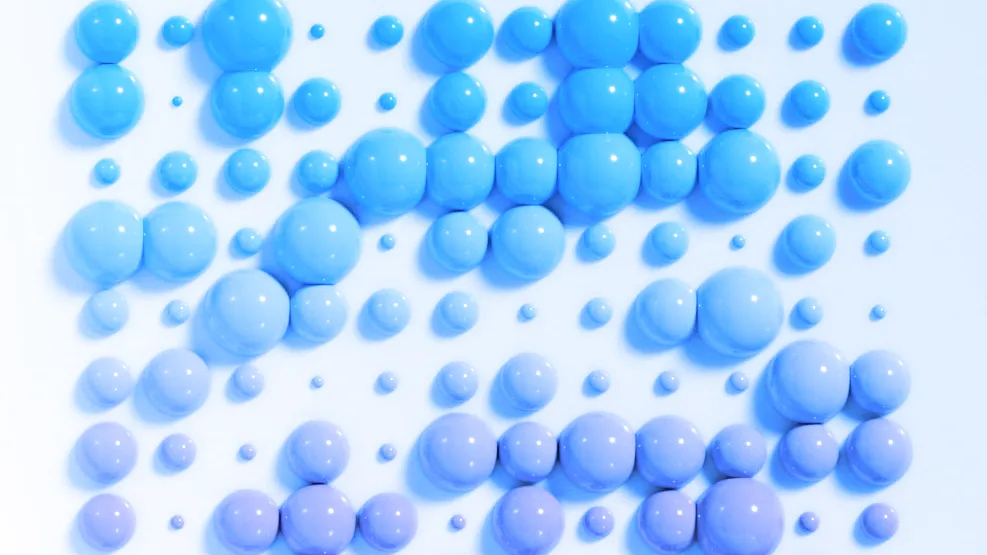
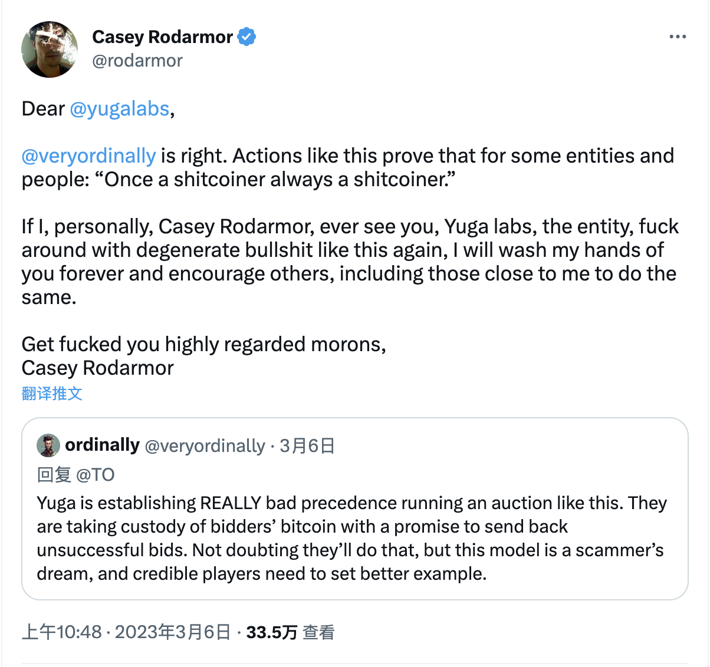

# Yuga 首个比特币 NFT 系列拍出 1650 万美元，但竞拍方式遭 Ordinals 创始人猛烈抨击 | Decrypt 报道

> TwelveFold 300 件生成艺术作品在 24 小时内获得了超过 3000 个竞价。不过，竞拍者全额打款的拍卖方式备受争议。

**作者：** Sander Lutz
2023 年 3 月 7 日

Yuga Labs 首次比特币 NFT 系列的喧嚣而有争议的拍卖周一结束，288 名成功竞标者成功拍下了这一限量版所有作品，总共花费了价值 1649 万美元的比特币。

据 Yuga 发言人称，在周日开始的 24 小时拍卖会上，TwelveFold 系列总共获得了 3,246 个出价。其中，最高出价为 7.1159 BTC，或大约 159,500 美元。最低的成功出价是 2.2501 BTC，或略高于 50,000 美元。

按照 Yuga 的说法，前 288 名竞标者将在一周内收到他们的铭文（译注：即比特币 NFT）。300 件限量版作品的最后 12 件将为捐赠者保留，并作为 Yuga 慈善项目的一部分分发。

Yuga 是主导 NFT 收藏品 Bored Ape Yacht Club （无聊猿猴游艇俱乐部）背后的 40 亿美元公司，之前只在以太坊区块链上发布过 NFT。除了 TwelveFold 之外，所有其他由 Yuga 创建或拥有的收藏品 —— 包括 Bored Ape Yacht Club、Mutant Ape Yacht Club、Otherside 虚拟土地、CryptoPunks 和 Meebits —— 也都有至少 10000 个 NFTs。

TwelveFold NFT 与上述 NFT 明显不同。它们是通过 Ordinals 铭刻在比特币区块链上的生成性艺术作品，Ordinals 是最近推出的一种将艺术品提交给比特币的方法，它将媒体文件永久地刻在单个「聪」上，每个「聪」代表一个完整比特币（BTC）的一亿分之一。

TwelveFold 都是 12x12 的网格--向比特币区块链上的数据存储方式致敬，是结合了 3D 图形和手绘特征的生成性艺术作品。据 Yuga 说，今天拍卖的 288 件作品中的每一件都将由相同的代码生成，以较高的投标价格赢得的作品与以较低的投标价格赢得的作品不会有品质上的差异。不过，该系列的作品将根据他们在竞标过程中的排名进行编号和生成。

(video)

周一早些时候，Yuga 公司在设计 TwelveFold 竞标过程时引发争议。有意购买 TwelveFold 的人必须直接向 Yuga 交纳全额竞标金，才能被允许参加拍卖；Yuga 承诺将在拍卖结束后 24 小时内退还竞标失败的资金。

比特币 Ordinals 协议创建者 Casey Rodarmor 抨击 Yuga 这一竞标方式，认为它让一个很容易被恶意项目方操纵的过程合法化，得以竞标者那里窃取资金。

「如果我，Casey Rodarmor 个人，再看到你，Yuga Labs 这个实体，再像这样搞些堕落的废话，我将永远和你断绝关系，并鼓励其他人，包括我身边的人也这样做，」Rodarmor 周一在推特上写道。

_https://twitter.com/rodarmor/status/1632573965897170948_

「去死吧，你们这些大白痴！」罗达摩尔最后签了这么一句话。

TwelveFold 的竞价过程的结构反映了目前比特币 Ordinal NFT 的大受欢迎和适合这种新生媒介的数字基础设施匮乏之间的脱节。根据 Dune Analytics 的数据，尽管在 1 月下旬才首次亮相，但已经有超过 325,000 个 Ordinals 被铭刻（译注：对应于 NFT 的铸造）。

Galaxy Research 上周一份报告预测，到 2025 年比特币 NFT 市场将达到 45 亿美元。同时预计，到今年夏天，支持比特币 NFT 产品和服务的完整生态系统将会出现。
