# 聚焦 ZKP，Antalpha HackerHouse 在 ETHDenver 都整了啥活？

> 7 天前闭幕的 ETHDenver 是今年开年开发者浓度最高的 Web3 盛会 —— 「人人言必称 ZKP（零知识证明）」、「以太坊上海升级聚焦 LST（流动性质押通证）」、「账户抽象、MPC，钱包进入千团大战」，我们的 Builder 完全无惧 Crypto 熊市、全球宏观黑天鹅乱舞……

(video)

从 2 月 25 日到 3 月 4 日，以「传播 Hacker 精神，促进全球 Hacker 协作」为使命的 Antalpha HackerHouse 差不多与 ETHDenver 同期举办了一系列聚焦于 ZK 和 ML（Machine Learning，机器学习）主题的技术分享和培训。在事先申请的 60 多位候选者中，最终有 9 名黑客被选中组成不同的团队参加黑客马拉松。

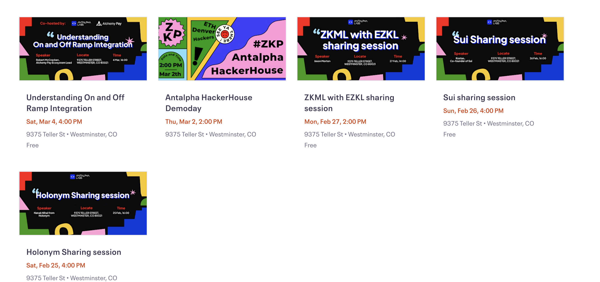

## 重磅分享

**Scroll**

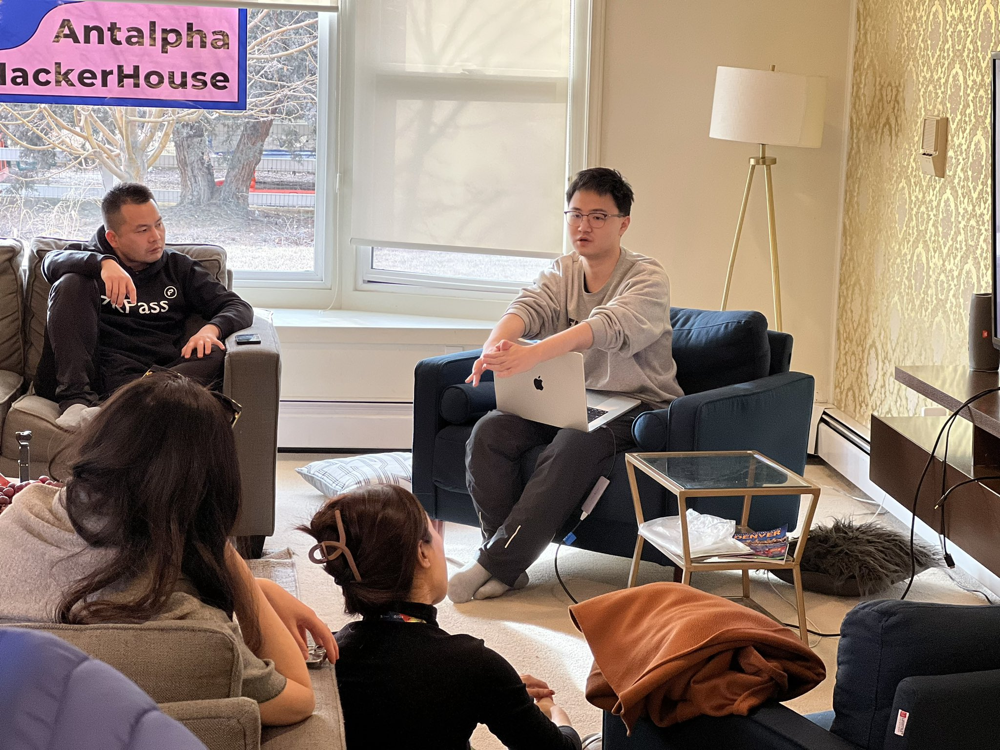

_https://twitter.com/Scroll_ZKP_

Scroll 是基于以太坊的 zkEVM（零知以太坊虚拟机）的 zkRollup，可以让现有的以太坊应用和工具实现本地兼容性。

**Aztec & Noir**

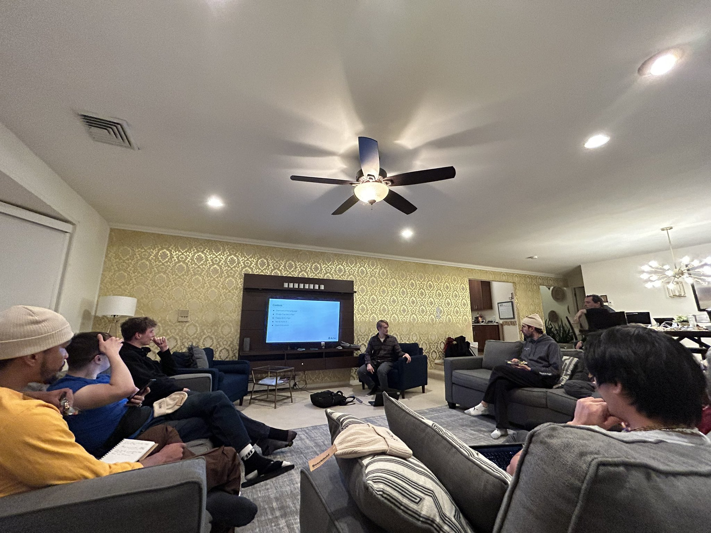

_https://twitter.com/aztecnetwork_

Aztec 正在开发一种由以太坊保障安全的下一代加密区块链，Noir 是 Aztec 的基于 Rust 的隐私编程语言，可以实现零知识电路的开发。

**EZKL**

_https://github.com/zkonduit/ezkl_

EZKL 是一个用于在 zk-SNARK 中进行深度学习模型和其他计算图推理的库和命令行工具。

**视频：** https://youtu.be/QgAuzsSbcik

**Sui**

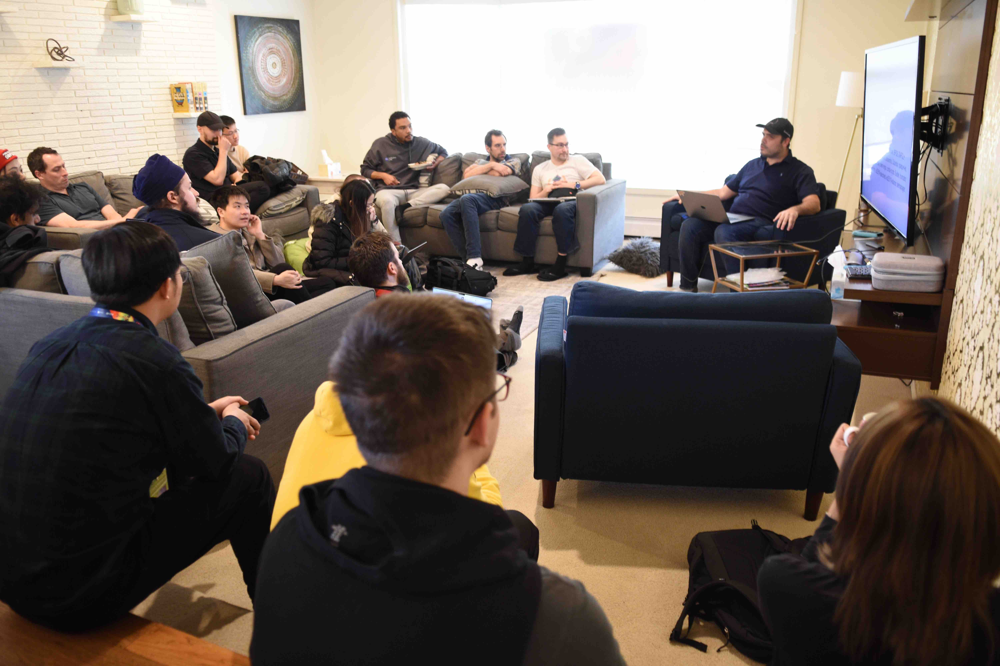

_https://twitter.com/SuiNetwork_

Sui 是第一个设计用于从根本上支持创作者和开发人员构建面向 Web3 下一个十亿用户体验的无需许可的一层区块链。

**Holonym**

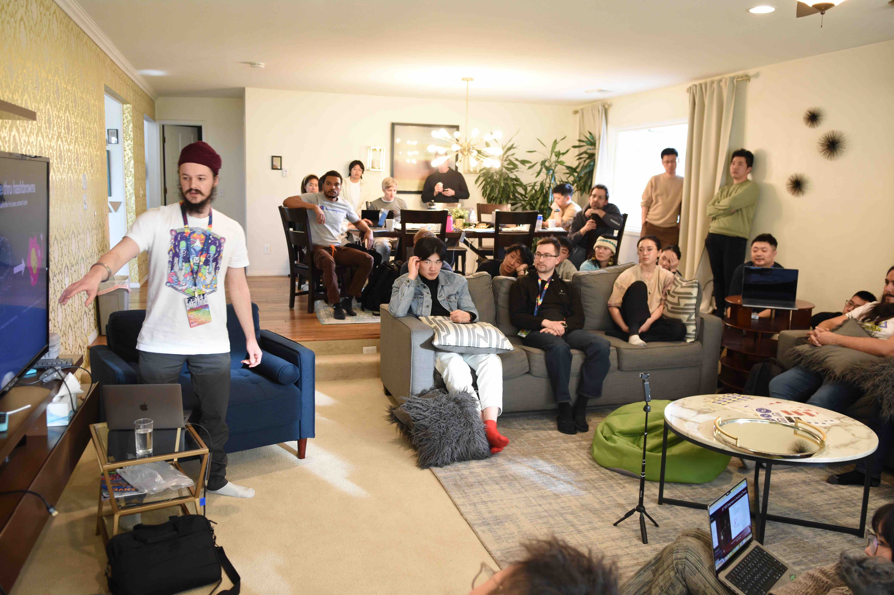

_https://twitter.com/0xHolonym_

Holonym 是一种零知识隐私协议。

**Alchemy Pay**

_https://twitter.com/AlchemyPay_

Alchemy Pay 通过其现实世界的支付网络和通过其 Ramp 解决方案直接访问 Web3 服务，连接全球法币和加密经济。

## Demo Day

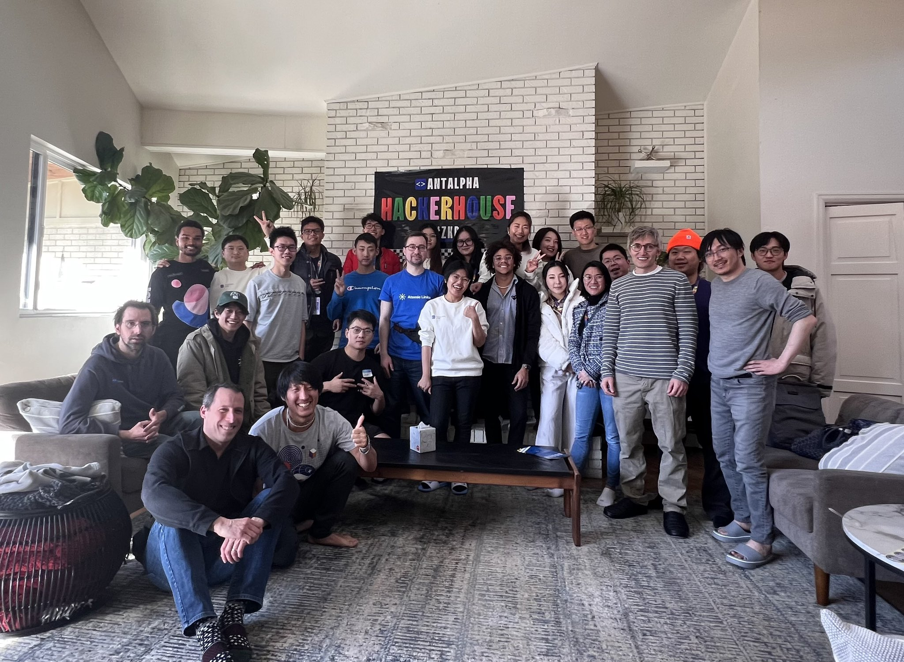

在 ETHDenver 最后一天， Antalpha HackerHouse 组织了一场精彩的 Demo Day 活动，展示了现在和过去参加黑客之家活动的黑客构建的项目。

### **Kakarot by @Danilo**

**Kakarot**是一个在 Cairo 中编写的以太坊虚拟机。这意味着它可以部署在 **StarkNet** 上，这是以太坊的二层扩展解决方案，并运行 EVM 字节码程序。

因此，**Kakarot** 可以用于在 StarkNet 上运行以太坊智能合约。**Kakarot**是超级赛亚 ZK-EVM。

**视频：** https://youtu.be/dzOyddEb1zw

**链接：** https://www.kakarot.org/

### **Hunter Z Hunter by @Danilo & @LanceDavis**

一个通过使用 EZKL 将图像识别机器学习模型转换为零知识电路而启用的寻宝游戏。用户搜索已预先存储的物品并拍照以生成证明。如果证明验证者（由链上的 AI 模型生成）是正确的，奖金将直接发送到用户钱包。这是高计算 AI 在链上的首次实现。

**视频：** https://youtu.be/k2nqjItJ8BU

**链接：** https://app.buidlbox.io/projects/hunter-z-hunter

### **Git3**

Git 的 Web3 分布式实现。使用 CLI 接口，让任何用户都可以将其代码存储在链上。

**视频：** https://youtu.be/YFUOzHsmHYw

**链接：** https://twitter.com/git3protocol

### **Web3 MQ**

最快的社交 Layer 1 和消息网络 —— 开源、加密、Web3 原生。SwapChat 是首个基于 Web3MQ 协议的跨平台聊天 dApp。

**视频：** https://youtu.be/twnMOWwlv1s

**链接：** https://twitter.com/Web3MQ

### **Atomiclinks by @chmilevfa**

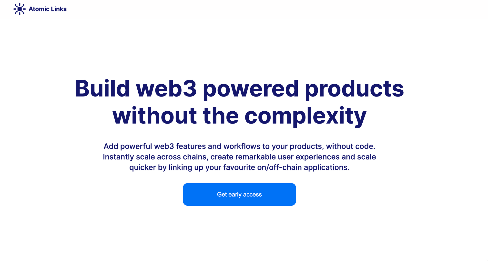

快速链接 Web3 合约到 Web2 应用，并构建简单的工作流程或强大的活动和产品，面向 Web3 的营销人员、运营商、工程师。

**视频：** https://youtu.be/HPQdQwa7Mrc

**链接：** https://www.atomiclinks.xyz/

### **zkLottery**

最公平的全链上彩票，确保所有参与者拥有平等的获胜机会。它采用 ZKP 技术进一步保护参与者和获奖者的隐私，。

### **Owlando**

Owlando 是由用户渐进式自创内容的 3D 社交元宇宙。

**视频：** https://youtu.be/JkqF-D0g0DU

**链接：** https://owlando.io/

## **幕后花絮**

Antalpha HackerHouse 活动期间还发生了一些有趣和令人兴奋的事情，其中有一件事尤其震惊了整个黑客之家 —— 我们的目标是将机器学习图像识别模型转换为零知识电路，从而通过优化将 AI 上链。但是，我们的第一个验证器是 **5 MB 和 109,000 行的 solidity！**这是一个问题，因为以太坊智能合约的限制大小为 24 KB，因此我们需要大量优化。

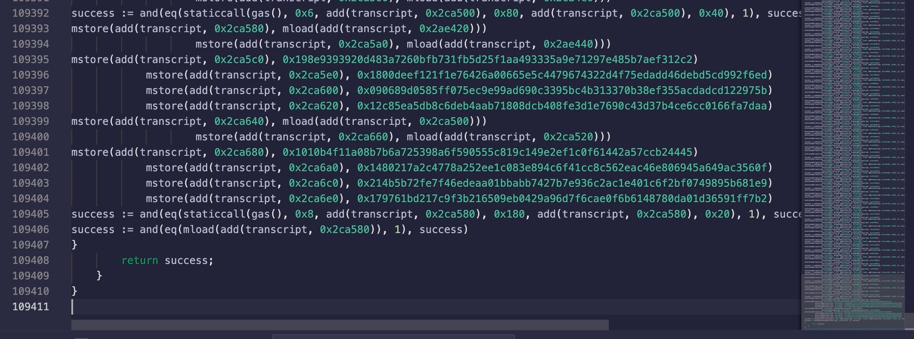

我们首先通过微调参数开始。这涉及学习 Halo2 查找表的工作原理，并进行更改。与开始的 2^ 7 相比，我们将 KZG 承诺大小增加到 2^26。这是因为我们需要更大的证明承诺来减小验证器的大小。然后，我们将最大旋转次数设置为 512，以便让行数更小。我们最大的障碍是将神经网络定义为零知识证明的量化过程。这项技术非常新，我们计划进一步贡献。

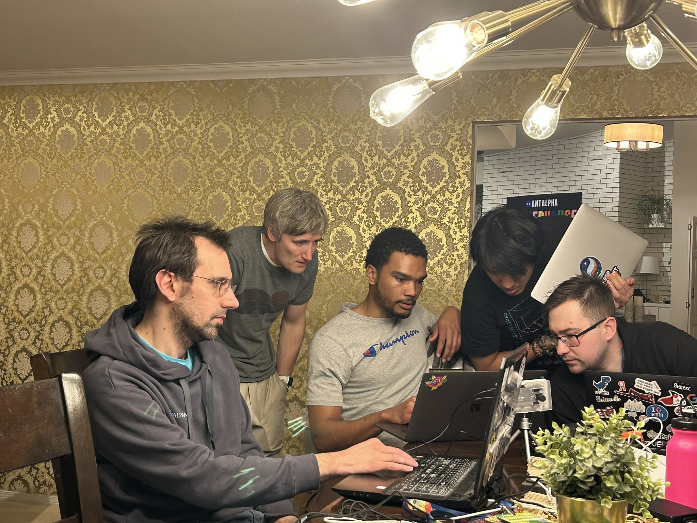

但我们成功了！经过数日未眠的试错，我们成功将验证器大小降至不到 24 KB，能够在区块链上部署我们的人工智能验证器。这是一次艰辛的旅程，但最终我们充满了喜悦、笑容和成就感 —— 因为完成了一项出色的工作。

我们参加了 ETH Denver 黑客马拉松的基础设施赛道，以此结束黑客之家在 ETHDenver 的活动。不幸的是，我们的项目没有被选入决赛 15 强。不过，我们知道做的工作非常出色，未来会更加强大地归来，因为我们刚刚为区块链和人工智能技术结合的未来打开了大门。

在过去两周，我们目睹了许多美好事物的诞生，例如创新项目、机会和潜在的合作，也结交了友谊可能终身持续的朋友。许多黑客已经计划参加下一个 Antalpha 黑客之家聚会，再次一起 hack。ETHDenver 的黑客聚会将被铭记，并为 ZKML 的光明未来开启序幕。让我们一起建设！

你想成为下一场黑客之家活动一员吗？

## **预告**

目前有 2 个新的黑客之家正在泰国 🇹🇭 和日本 🇯🇵 准备，复制链接在浏览器打开可查看相关信息：

[泰国清迈](https://www.notion.so/6a51c13fdd654a6792d536a4460735ec) 🇹🇭 ** 2023 年 4 月 8 日至 2023 年 4 月 29 日（3 周）**

[日本东京](https://www.notion.so/ae1e8da8b4e940499cc5bbb19898a457) 🇯🇵 ** 2023 年 4 月 9 日至 2023 年 4 月 17 日（1.5 周）**

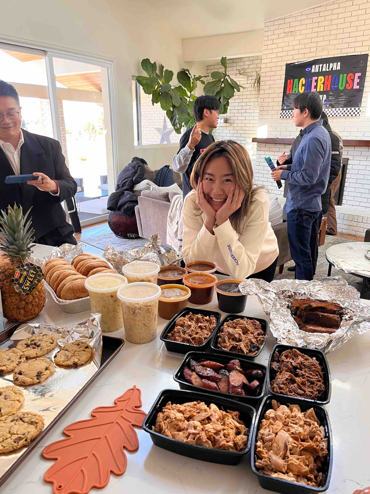

感谢 Antalpha HackerHouse 每个团队成员的支持和贡献确保了黑客们度过了愉快的时光

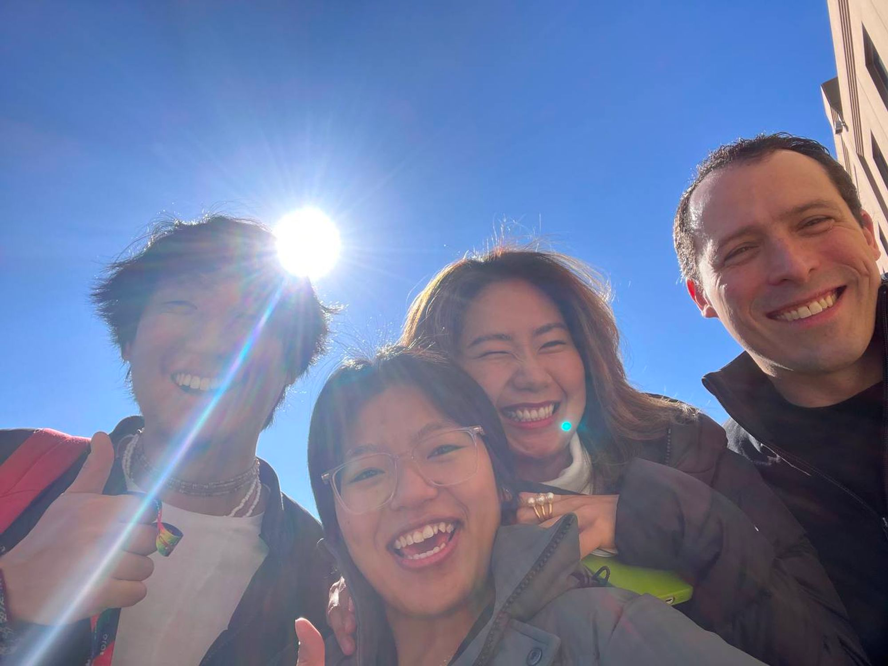

欢迎加入 Antalpha HackerHouse，希望在下一场活动见到你，一起 BUIDL！😉
