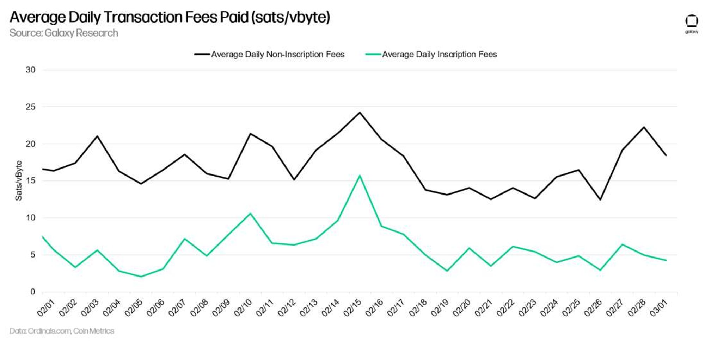

# 万字报告详解比特币 NFT 基础与趋势 | Thought for Today

> 截至 3 月 15 日下午 2:26，有 470,986 个链上 NFT 在比特币上诞生，而这只是短短三个月的成长数字。融技术应用投资消费文化为一体的 NFT 能否在历史最悠久、最为去中心化、相应也最为保守的比特币网络扎根成长，引爆全新的用例和市场？加密资产挖矿交易管理投资机构 Galaxy 十二天前发布万字报告《Bitcoin Inscriptions & Ordinals 比特币铭文和序数》，第一次全景纵深式介绍预测比特币 NFT 及其前景。

**作者：** Alex Thorn, Brandon Bailey Charles Yu, Gabe Parker, Guillaume Girard, Simrit Dhinsa

## 简介

在过去两个月，比特币一个全新领域意外诞生。自 2022 年 12 月 14 日以来，比特币上已经产生了超过 200,000 个 _Inscription（铭文）_。这些数字化铭文是被刻在世界上最古老最安全的分布式账本上的文件，包括图像、文本、音频甚至应用程序。每个铭文可以与一个 *Ordinal（序数）*相关联，即一个独特的聪（sat），BTC 的最小单位。虽然铭文和 NFT 之间存在显著差异，但可以公平地说，在比特币上出现了一个原生的链上 NFT 生态 —— 这在以前是不可能的，而如今其使用已经爆炸。2023 年 2 月 27 日星期一，全球最大的 NFT 发行者 Yuga Labs 宣布在比特币上发行的新 NFT 系列 TwelveFold。

## 要点

- **比特币铭文将成为一个巨大的市场。** 我们对基于铭文和序数的比特币 NFT 市场规模的基准预估是，到 2025 年将达到 45 亿美元。
- **铭文显著扩展了比特币的设计空间。** 强大的可用性和可靠的数据存储的添加打开了各种用例，其中许多仅开始探索，包括新类型的去中心化软件或比特币扩展技术。即使仅仅是 NFT 用例，也有潜力极大扩展比特币的文化影响范围。
- **新用例将推动对比特币的持续增长的兴趣和采用。** 铭文的增长，无论是作为 NFT 市场还是其他什么，都将增强进一步采用比特币的可能性，从长远来看，这可以支持 BTCUSD。
- **即使没有「序数理论」，铭文也可以很大。** 即使不依赖于个别标记 BTC 单位的二层方法，比特币上的显著「blob space」数据可用性也可以找到重要的用途。对于比特币同质化可交换性的负面影响的担忧是过度的。即使与序数相关的 5 亿个铭文也只有 0.2％ 的比特币最终供应变得「非同质化」。
- **铭文可以为区块空间需求设定下限，从而有利于比特币的安全性和费用市场。** 矿工将从铭文中获得增加的费用收入，从而有助于将矿工收入从区块补贴转移至交易费用。
- **为支持比特币 NFT 而开发的重要市场基础设施将在 2023 年第二季度建立。** 仅在两个月内，钱包已经开始提供必要的支持以改善用户体验，并且市场已经开始出现。

这种新的比特币原生用例的出现表明了巨大的增长机会，但也引发了人们对比特币未来的严重关切。虽然许多人拥抱这个新的设计空间，但其他比特币铁杆对其影响比特币去中心化表示担忧。本报告详细介绍了比特币 NFT 的历史，检视了*铭文*和*序数*的基础和当前景观，探索了*铭文*和*序数*所提出的机遇和挑战，并认为他们不仅为比特币生态创造了重大的增长潜力，还可以提高整个比特币网络的忠诚度和安全性。**我们的基准分析表明，到 2025 年，比特币 NFT 可能是 45 亿美元的市场。**

## 铭文和序数是什么？

2022 年 12 月，比特币开发者 [Casey Rodarmor](https://www.twitter.com/rodarmor) 发布了名为 [ORD](https://github.com/casey/ord) 的开源软件，该软件在 Bitcoin Core（比特币核心）全节点之上运行。该软件允许用户将计算机文件编码为十六进制数据，存储在比特币交易（「铭文」）中，并将该发布数据「绑定」到一个单独的聪上，从而有效地创建一个 NFT（「序数」）。

**铭文**是任意数据块和相关元数据的 blob，后者告诉比特币节点如何呈现所述数据（它是图像？文本？其他什么？）。铭文在功能上类似于以太坊上的 calldata，因为它们存储只读数据。由于 Taproot（详见「比特币 Taproot 升级」章节）和隔离见证（2017 年比特币升级）的独特性，这些铭文理论上可以达到 4 MB 大小（的确，有人在 2023 年 2 月初铸造了 3.96 MB 的铭文）。铭文数据作为交易的*见证*数据的一部分发布到比特币的区块链上，并且可以由运行 ORD 软件的任何完整的存档比特币节点解码回可视内容。

**序数**是单独的聪（sats），最小的比特币货币单位（每 1 BTC = 1 亿聪）。术语 _Ordinal_ 来自创建者 Casey Rodarmor 所称的 Ordinals Theory（序数理论），即单独的聪可以在比特币的供应（UTXO 集）中进行标记和跟踪。如果用户选择这种方法，就可以看到聪何时被挖掘以及它们的顺序。用户甚至可以根据各种标准（例如，它们被挖掘多久，它们是否参与了著名的交易等）为这些单独的聪应用不同的稀有特征。本文撰写时，已经将 25 万多个铭文与单独的聪（序数）绑定，其中大多数在 2015 年之前被挖掘。虽然许多人认为较早的聪很稀有，但现实是比特币的货币政策使得发行量被中本聪大量前置（截至 2016 年初，当前流通的 1920 万 BTC 中已经有超过 1500 万枚被挖掘）。

铭文本身存在 —— 现在人们可以在链上放置比先前的解决方案（如 OP_RETURN 或将数据编码为多个交易输出）更加任意的内容。但如果用户采用*序数*，这些铭文也可以与单独的聪相联系，让它们作为 NFT 进行交易和转移。重要的是，一个铭文与单独的聪（序数）的关联是基于目录化单独的聪的离线方法，参与节点必须遵守并同意任何铭文与序数之间的联系在任何有意义的「存在」。虽然铭文本身被发布到实际的区块链数据中，并且所有完整的归档节点都可以看到它们，但实例化、支持和相信序数本身的存在需要社会共识。

基本上，铭文可以单独存在，而不需要序数理论。因此，这两个应该被分开观察。比特币社区正在交替使用序数和铭文，引起了一些混淆。为了减轻与序数相关的铭文混淆，我们将在以下报告中将数字藏品称为「铭文」或「比特币 NFT」。

与以太坊 NFT 相比，比特币 NFT 具有不同的技术堆栈。两种数字藏品之间的主要区别例举如下。

重要的是要注意，新的钱包正在出现，可以提高铭文的可携带性。此外，从托管的角度来看，铭文实际上可能比以太坊 NFT 更好，至少对于机构投资者而言。具体来说，像在 SEC 注册的 NFT 基金这样的机构投资者将需要 NFT 的合规监管，而对于 ERC-721 通证，很难找到这样的监管。因为铭文与单独的聪（即比特币的最小单位）绑定，所以托管者应该更容易为铭文开发机构托管选项，因为不需要支持新的通证标准。具体而言，比特币托管者只需要提供 UTXO 级别的托管，以确保它们不会将序数与其他托管的聪在账户级别上混合。

## 比特币 NFT 历史

比特币上的通证化早在以太坊上 NFT 的创造之前就已经出现了。比特币介入 NFT 文化始于 2012 年的开源项目 Colored Coins（染色币）。该项目引入了一种新的方法，将现实世界的资产或服务附加到 UTXO 集合上。染色币是第一个使用名为 [EPOBC](https://en.bitcoin.it/wiki/Colored_Coins#The_EPOBC_protocol) 的机制的比特币项目，该机制通过将标签值分配到交易的第一个输入的 nSequence 字段中，便于转移染色币并将其与普通比特币区分开来。nSequence 始终存在，但在其他方面未被全节点使用，并可以进行修剪。染色币所使用的方法将任意数据输入比特币交易中的开销为零（不像基于 OP_RETURN 的方法会增加交易的大小）。尽管染色币是第一个尝试在比特币上创建另类数字资产的项目，但该项目过于前沿，最终失去了比特币社区的关注。短命的染色币项目是试图在比特币上创建数字藏品的后续倡议的先驱。

2014 年，第一个比特币分叉 **Namecoin** 铸造了第一个 NFT。历史上的单版 NFT 项目名为 [Quantum](https://www.mccoyspace.com/project/125/)，是由 Jennifer 和 Kevin McCoy 创作的生成艺术作品。Quantum 通过正式引入数字艺术和分布式账本技术（DLT）的交集，引发了加密领域的范式转变。尽管这一历史事件并未发生在比特币上，但诞生在比特币分叉上的数字艺术品仍然引人注目。

2014 年，**Counterparty** 通过编码任意数据通过 OP_RETURN 函数进一步推进了在比特币上发行另类数字资产的想法。比特币客户端将这些交易视为有效但不可花费的交易，但 Counterparty 节点将其视为数字资产转移。Counterparty 的网络效应加速了市场和兼容钱包的发展，为生态的繁荣铺平了道路。例如，EverdreamSoft 在 2015 年开发了第一个基于区块链的收藏卡游戏 Counterparty（Spells of Genesis）。此外，Counterparty 是迄今为止最著名的比特币 NFT 项目 Rare PePe Cards（稀有佩佩卡牌）的制作者。尽管 Counterparty 今天不太相关，但该项目在成功地将 NFT 文化首次引入比特币社区方面发挥了重要作用，目前它仍在使用中。

**Omni Layer**，前身为 Mastercoin，是另一个 2014 年构建的通证化应用。Omni Layer 让开发者能够创建可定制的另类资产，试图将比特币的网络扩展到其自身的货币之外。Omni 层的另类资产通过 OP_RETURN 功能附加元数据，而不改变原生链的特征和逻辑。值得注意的是，稳定币 Tether 成为 Omni 上最流行的通证。尽管在 Omni 上没有类似 NFT 的活动，但值得一提的是，该应用是另一个尝试在比特币上开发另类资产的例子。

2021 年，**Stacks** 推出了自己的一层区块链，为比特币增加 NFT 和 DeFi 功能。Stacks 区块链与比特币区块链平行运行（类似于比特币的侧链）。作为比特币侧链的运行使得 Stacks 网络能够通过引用比特币的状态而受益，从而暗示 Stacks 交易受益于比特币的终局性。然而，在 Stacks 上购买和销售 NFT 只能使用原生的 Stacks 通证（STX）进行交易。因此，将 Stacks 定义为「比特币 NFT」是有争议的，因为这些资产不属于原生比特币链，并且不使用 BTC 进行交易。Stacks 采用的方法将 NFT 引入比特币生态与先前尝试直接将数字藏品引入比特币主链的示例不可比拟。更重要的是，Stacks 的 NFT 生态相对成功，它自称是证实与比特币相关的 NFT 需求的明确证据。

Counterparty 的成功不可避免地招致比特币社区的各种批评。具体而言，反对使用 Counterparty 的论点集中在使用 OP_RETURN 函数将任意数据输入交易中最终会对全节点产生负担这一事实上。然而，支持 Counterparty 的比特币铁杆通过表达 OP_RETURN 函数中的任意数据是可修剪的，因此比特币全节点不需要浪费内存空间下载 Counterparty 交易来反驳反对方的说法。

### Taproot 和 SegWit 如何让铭文成为可能？

尽管 NFT 和其他类型的通证化用例在比特币上和周边已经存在多年（如前一部分所述），但允许创建铭文的构建模块确实于 2017 年形成。首先，2017 年实施的*Segregated Witness（隔离见证）*升级（[BIP 141](https://github.com/bitcoin/bips/blob/master/bip-0141.mediawiki)）通过将签名数据（见证）移动到交易的末尾重新组织了交易，将字节（数据大小）的概念替换为虚拟字节（重量），并重新计算签名数据的重量，使其每个字节仅计为 1/4 个*重量单位*。当很多数据被塞入交易的见证部分时，这种变化导致了有效的块大小增加。比特币的下一个（也是最近的）重大升级 _Taproot_（[BIP 341](https://github.com/bitcoin/bips/blob/master/bip-0341.mediawiki)）于 2021 年启动并为网络带来了几项升级。尤其是，Taproot 允许在交易的见证部分中使用更复杂的脚本，并且还删除了见证数据的大小限制，以及其他几项更改（有关比特币 Taproot 升级的更详细说明，请阅读[此 Galaxy Research 报告](https://www.galaxy.com/research/insights/bitcoin-taproot/)）。SegWit（隔离见证）和 Taproot 这两个升级结合在一起，既使得任意数据存储成为可能，又使其比标准交易数据*更加便宜*，从而为*铭文*铺平了道路。

尽管在 SegWit 和 Taproot 之前使用 OP_RETURN 操作码将数据铭刻到比特币交易中是可能的，但 OP_RETURN 重量限制为 80 字节。因此，使用 Taproot 时，输入任意数据的另一种新类型的脚本变得更加实用，该脚本允许通过 75% 的重量单位缩减（最多 4 MB 的限制）存储无限量的数据。

## 铭文和序数工作原理

要理解铭文和序数的功能，重要的是要了解比特币的分布式分类账会计方法，该方法依赖于一个称为*未花费交易输出（Unspent Transaction Outputs，缩写 UTXO）*的概念。

### UTXO 概述

UTXO 是比特币的会计方法，让比特币交易由先前交易的输出组成。基本上，比特币地址包括一组 UTXO 来代表余额，而不是一个表示整个余额的单一比特币；后者被定义为基于账户的会计模型 —— 比特币不使用。以太坊使用基于账户的模型，其中 ETH 地址花费 1 ETH 仅需要发送 1 ETH，而不是代表总共 1 ETH 的未使用 ETH 集合。

当比特币被花费时，UTXO 被创建和销毁，这提供了网络证明用户的真实比特币余额的信息。有了这些信息，节点维护现有 UTXO 的记录，以执行有效的支出，以防止双重花费。

UTXO 和实物现金类似，因为在使用时需要找零。下面的例子描述了 UTXO 的动态。

如果 Alice 拥有价值 1 BTC 的 UTXO，并想支付 0.4 BTC 给 Bob，她必须将整个 1 BTC 作为输入。为了向 Bob 发送确切的 0.4 BTC，Alice 创建了两个输出：第一个输出是给 Bob（0.4 BTC），第二个输出是作为「找零输出」返回给自己（0.59 BTC，假设 Alice 支付了 0.01 BTC 的交易费用）。这个交易将消耗一个 UTXO 并创建 2 个新的 UTXO。

### 创建铭文

下图解释了如何将铭文数据发布到比特币区块链并与特定序数（聪）相关联。

在铭刻一个聪时，数据被封装到一个 taproot 脚本中，并存储在交易的见证数据部分。Taproot 脚本放宽大小限制使得铭文能力可以存储更多的数据。此外，Taproot 上的单个数据推送限制为 520 字节，因此，大的数据铭刻必须包含多个数据推送，直到铭文的大小达到为止。

要铸造并完全掌控铭文，用户必须首先安装 Bitcoin Core（比特币核心）软件（版本为 24 或更高版本），并在比特币核心钱包中运行完整节点。一旦节点完全同步并索引到区块链，用户必须安装 ord 客户端，该客户端与比特币核心配合使用。ord 客户端允许用户创建铭文并跟踪单独的聪。如果没有安装 ord 客户端，则比特币核心钱包无法区分刻有铭文的聪与常规的聪。

创建铭文时，可以使用 ord wallet inscribe FILEPATH 函数将任意数据内容输入到比特币交易的见证数据中。从这一点开始，铭刻的聪将作为待处理交易放置在内存池中，需要两笔交易（提交 tx 和公开 tx）来完成。一旦包含铭刻的 聪的区块被挖掘出来，铭文就正式写入区块链。

将任意数据铭刻到比特币中的费用很大程度上取决于数据本身的大小，这会改变总交易重量。费用计算使用常规比特币交易中使用的 Sat/vByte（聪/字节）方法，因为在转换为虚拟字节时，铭刻图像字节大小的 75％ 会缩减。用户支付的总费用是铭刻数据在虚拟字节中的重量乘以聪/字节速率。一个重大的误解是，使用更高数量的虚拟字节铭刻任意数据并不一定意味着需要支付更高的费用。例如，以 10 聪/字节的速率铭刻 100 个虚拟字节的费用与以 100 聪/字节的速率铭刻 10 个虚拟字节的费用相同。因此，在铭刻时重要的是要注意聪/字节的费用。

## 铭文和序数的现状

这是一个非常新兴的生态，但基础设施正在迅速发展。由于链上比特币 NFT 从未真正存在过，因此必须构建最基本的组成部分，以建立有深度和流动性的市场，其中钱包位于首要位置。尽管从技术上讲，任何合适的比特币自托管钱包都可以发送和接收序数，但大多数需要额外的功能，以保障创建大多数人可以理解的用户体验。目前已经出现了几个具有此功能的钱包。

每个类别中一些值得注意的项目和公司例举如下：

- **收藏品：** 本文撰写时，Taproot Wizards、ORD Rocks 和 Bitcoin Punks 是最知名的收藏品之一。Yuga Labs 即将推出的生成艺术收藏品 TwelveFold 也可能成为其中更有价值的收藏品之一。
- **市场：** OpenOrdex 是最有趣的市场之一，因为它完全开源的，并且严格使用去中心化工具来实现交易。具体而言，OpenOrdex 使用部分签名的比特币交易（PSBT）来实现铭文无需信任的上架和购买。
- **浏览器：** OpenOrdex、Gamma 和 Ordinals.com 是研究 Ordinal 铭文活动的工具。浏览器还提供有关交易 ID、地址、输出值、重量、聪编号和位置的数据。
- **铭刻服务：** 铸造一个 Ordinal 的复杂性引入了铭刻服务来帮助收藏者创建收藏品。OrdinalsBot、OrdSwap、Gamma、Bitcoin Bandits 和 Luxor Mining 是一些受欢迎的铭刻服务提供商。这些服务负责处理 Ordinal 创建的每个步骤，并且一些服务正在进行大量业务。
- **钱包：** 比特币钱包目前缺乏聪选择功能，这是将 Ordinal 发送到其他地址的重要功能。尽管聪选择不可用，但像 Sparrow Wallet、Electrum 和 Xverse 这样提供 UTXO 选择的钱包被 Ordinal 收藏者广泛使用。
- **数据和发现：** OrdinalHub 和 Ordinal Directory 是收藏者发现流行收藏品和新收藏品以及分析地板价数据的平台。

### 铭文销售前 5 名

尽管中心化市场尚处于初期阶段，交易数据往往不易获取，但交易已经在诸如 Discord 和 Telegram 等在线社群中以点对点的方式进行。根据我们对这些社群和讨论的审核，以下是截至目前的销售额前五的铭文交易：

## 争议与批评

这一区块链新用途在比特币社区引发了重要的关切。自 2023 年 1 月中旬起，铭文量加速增长后，更广泛的比特币社区就其对比特币的影响展开了激烈的辩论。有关铭文的争议凸显了生态在比特币区块链的适当使用方面的技术和叙事层面上的分歧。以下简表可视化呈现支持和反对方在铭文和序数方面的观点。

### 技术基础

铭文确实引入了比特币理论上 4 MB 区块大小限制被利用的可能性，这是一个全新的现象。因此，比特币社区中许多人声称反对铭文，理由是它们可能导致块大小显著增加。更大的区块可能意味着全节点需要增加硬件要求，从而使得操作全节点更加困难，从理论上降低节点数量并损害去中心化。

真正的关注点不应该是存储，而是带宽。具体来说，见证数据（铭文所在的地方）可以被全节点修剪（即舍弃而不是永久存储）。虽然存储技术的改进（HDD、SSD）导致数据存储成本大幅降低，但互联网带宽的成本并没有跟上步伐。因此，世界上偏远或欠发达地区的用户可能会重新考虑运行节点，因为他们的初始区块下载（Initial Block Download，IBD）过程将变得更长、更昂贵、更不私密。然而，这在一定程度上得到了缓解，因为节点可以选择仅从检查点（“assumevalid”）下载区块链数据，减少他们在 IBD 期间必须下载的数据量（铭文或其他）。而且，随着如零知识证明等技术让 IBD 过程变得不那么繁琐，或者如果比特币核心添加更细粒度的工具来处理 IBD 和区块链数据存储（如在首次下载时避免下载大部分见证数据），某些这方面的问题将来可能得到缓解。随着互联网接入和 Starlink 等新技术的普及，带宽也变得更加易于获取。

SegWit 引入的 75％ 折扣和区块增加也受到许多比特币支持者的批评，他们认为在「区块大小战争」期间做出的让步从负责任的开发角度来看是不必要和不合理的。取消 Taproot 脚本的任何大小限制（10k 块）也被视为铭文崛起的促进因素。在某些情况下，关键用户指责比特币核心开发者没有让人们知道 SegWit 和 Taproot 升级将使铭文等内容变得可能，特别是在对 BTC 转账交易提供折扣的情况下。至少，许多人认为铭文不应该从 SegWit 的 75％ 折扣中获益，这从未被视为数据存储激励。

虽然对同质化可互换性的担忧是合理的，但本文稍后将探讨它们为什么被夸大了，因为即使铭文活动大幅增加，也只会导致少量的聪被铭文所限制。

### 叙事基础

批评序数的另一个方面涉及到对比特币本身最初或假定的主要目的的观点。许多比特币支持者认为，以牺牲金融交易为代价，在区块链中优先铭刻任意数据违背了比特币的原始目的，比特币被设计成「点对点电子现金系统」，这是中本聪白皮书的最初标题。此外，许多节点操作者不喜欢必须下载可能被视为有问题甚至可能非法的数据（因为任何类型的数据或内容都可以记录，仅受文件大小限制）。虽然可能对铭文数据进行修剪（丢弃），但大多数节点仍然必须最初下载铭文数据。在另一方面的争论中，有些人认为比特币始终意味着成为一个结算网络，最终所有的经济活动都会在这个网络里终结。因此，以铭文的形式进行价值结算将符合比特币作为结算平台的观点。（有关比特币适当使用的各种主要文化观点的有用背景，请阅读 Pete Rizzo 的文章[《比特币极大主义已死；比特币极大主义万岁》](https://www.forbes.com/sites/peterizzo/2022/07/04/bitcoin-maximalism-is-dead-long-live-bitcoin-maximalism/)）。

最终，由于见证数据可以进行修剪，而通过启用 assumevalid=1 可以避免旧数据在 IBD 中，我们认为对于铭文的技术论据已经基本得到缓解。在叙事方面，铭文交易对于今天的比特币网络上的所有节点都是有效的。需要出现一种社会运动来改变比特币，让铭文不再可能，我们认为这种结果是不太可能的。

## 建模费用、同质性和增长

### 增加矿工费用

通过查看历史数据，2021 年比特币区块空间中存储了 182 GB（87% 利用率）的数据，而 2022 年存储了 166 GB（79% 利用率）的数据。根据前 20,000 个铭文中平均铭刻的字节数为 33,114 字节，假设我们看到与 2022 年金融交易的年度需求水平相同的水平，那么在未充分利用的块空间中可以创建大约 1,330,444 个铭文。具体来说，以这种平均铭文大小，即使每年有 130 万个铭文，也可以填满过去两年未使用的区块空间，而不需要排挤其他交易。

如果仅使用未充分利用的区块空间用于铭文，假设 2022 年制作铭文的平均费率为 3 聪/字节，那么它们将产生额外的 330 BTC 交易费用，可供矿工赚取。

2022 年，矿工从交易费中总计赚取了 5,374 BTC，如果我们再加上铭文的理论交易活动，**矿工总共将赚取 5,705 BTC，总费用增长了 6.1%**。

### 比特币的同质性会受到影响吗？

一个主要的反对铭文的论点是，使用聪作为通证会降低比特币的同质性或可互换性，从而损害其作为货币的使用。我们模拟了几种不同的情况，发现即使在最激进的铭文增长预测下，这些担忧也是过度夸大了。

我们的基准情况预测发现，要铸造 5 BTC 的价值的 5 亿个通证，需要 238 年的时间。因为目前 ORD 每个铭文使用大约 10,000 聪（1 个序数 + 9999 个聪作为「邮资」，用于资助未来转移 Ordinal 的交易费用），在这种情况下，可以合理推测实际上有 50,000 BTC 的同质性降低，仍然只占总 BTC 最终供应量（2100 万）的 0.24%。

鉴于比特币区块限制为 4 MB、区块时间、事实上有 2100 万亿个聪，即使在极度看涨的情况下，铭文对同质性的威胁也微乎其微。

### 铭刻 BAYC 这样的收藏品的成本是多少？

假设费率为 1 聪/字节，则假设比特币价格为 23,000 美元，完全铭刻 10,000 个收藏品的成本约为 9.95 BTC，即 228,943 美元。

考虑到在比特币上铭刻大型收藏品的成本非常高昂，因此收藏品的尺寸很可能会小得多，或者铭刻的艺术品文件的大小会更小或更基于像素。我们可能会看到这些成本障碍将艺术家推向将比特币铭刻视为最适合于单版或高价值艺术品。其他区块链或二层可能更适合于更大的头像收藏，其收藏品的艺术质量并不重要。

### 对比特币安全负担的影响？

基于当前的挖矿经济学以及挖矿费用以美元计价的事实，比特币的安全负担在未来几个减半周期内不应该成为一个问题。然而，铭文活动带来的交易活动增加以及交易的聪/字节的上升很可能会进一步延迟安全负担问题的出现。在下表中，我们试图量化需要的 BTCUSD 汇率来维持 2024 年减半之后各种网络难度水平，并且如何增加总交易费用会影响所需的比特币价格。

当您沿着图表的 y 轴向下移动时，您可以观察到不同的网络难度水平，当您沿着 x 轴向右移动时，您可以观察到总区块奖励的水平以及交易费用占总奖励的百分比。例如，在网络难度为 40.3 T，总区块奖励为 3.53 BTC（交易费用占总奖励的 12.8％）时，假设矿工平均电费为 75 美元/兆瓦时，使用 S19j Pro 的 30 j/TH，矿工的 30％ 毛利，比特币的价格需要达到 39,927 美元才能维持该网络安全水平。

通过对比特币挖矿行业现状进行一些假设，我们可以推导出在下一次减半将区块补贴降至 3.125 BTC 后，维持各种网络安全级别所需的 BTCUSD 汇率。

仅供说明目的，下面是另一个敏感性表格，使用 2040 年减半周期的区块补贴。请注意，为了维持当前和短期难度预测，手续费占总区块奖励的比例要高得多，导致图表颜色呈现更垂直的变化。

### 使用的假设

- 网络难度目前为 39.2 T 或约 300 EH/s。
- 网络中矿工的平均电费为每兆瓦时 75 美元，基于公共矿工的申报和 EIA 的数据。
- 平均 ASIC 效率为 30 j/TH。
- 矿工需要实现至少 30% 的毛利润，以支付电费以外的其他费用，如工资。
- 随着铭刻活动的增加和区块空间的填充，每个虚拟字节支付的平均聪将随之增加，以及支付的总交易费用。我们已经观察到铭刻活动对每日总费用产生了有意义的影响，如下所示。铭刻费用已经高达总每日费用的 23%。

比较有铭文和没有铭文的平均聪/字节，显示过去两周都呈上升趋势。

## 为矿业生态增加价值

正如上面的费用模型所示，矿工有两个主要原因可以从强大的铭文生态中获得巨大收益：他们可以增加最低费率并产生更多的带外支付。

### 稳定的区块空间需求地板价

- 当内存池为空时，铭文交易将成为区块空间的最后买家。
- 由于铭文交易的时间优先级低于金融交易，因此在平均费率较低的情况下，铭刻者会选择结算，从而为区块创建了一个稳定的需求地板价。当在比特币上铸造数字收藏品时，用户可以承受在内存池深度超过 10 个区块以上的情况下被打包，而不会成为问题。然而，一个机构想为交易对手结算大额支付时，可能希望被打包在内存池深度不超过 1 或 2 个区块的范围内。在过去的一周中，我们观察到铭文活动正在为更高的区块深度进行结算，有大量的「基础」为 1 聪/字节的交易在等待确认。

- 随着铭文变得越来越受欢迎并占用更多的区块空间，费率底线逐渐向更高的费率范围转移。在早期，几乎 90% 的铭文是以不到 2 聪/字节的价格铸造的，然后 2-5，5-10 费率范围开始出现，而 10-20 聪/字节的范围（紫色）现在是主导范围，占 53% 的铸造。

- 未来，如果金融交易和铭文具有相似的时间偏好，则它们可以以相同的费用水平竞争。例如，当费用上升时，闪电通道的开放可能会与铭文铸造以费率底线竞争。如果确认了这种趋势，矿工将能够模拟「最低费用收入」，因为当区块补贴减少时，费用作为区块奖励的百分比变得更加重要。此外，在这种环境下，RBF 交易可能会起飞，因为对于对区块空间具有高时间优先级的用户来说，跳过铭文铸造的「长」队列变得具有战略性。

### 矿池的带外交易增加

- 随着铭文的引入，我们开始看到带外支付数量的增加，因为铭刻者希望在单个区块中铸造收藏系列。带外支付是直接发送给矿工而不是广播到整个网络的交易。
- 带外交易的费用通常是预付给矿工或矿池运营者，以便在未来的区块空间中处理交易。带外交易数量的增加可能会对比特币区块空间需求的准确性产生问题，从而影响交易费用市场。
- 通常，包含带外交易的区块在链上的费用为 0 或极低，因为交易费用是在网络范围之外单独支付的。
- 如果带外支付交易量上升到有意义的水平，带外交易可能会对矿工的收益产生一些风险。然而，带外交易可以为矿池提供一种非常有利可图的赚取额外收入的方式。
- 带外交易对于创造新的盈利方式，例如区块空间期货等活动需求的增加将产生影响。

## 可满足市场总量（TAM）

铭文可以通过扩大现有的 NFT 市场并从其他链中获取份额来成为一个庞大的市场。我们已经看到一些 NFT 文化趋势从以太坊迁移到比特币上，包括创造生成艺术和头像 NFT 收藏。然而，比特币设计上的差异意味着铭文的增长和使用不会完全复制以太坊的 NFT 生态。具体而言，铭文完全在链上，但序数（可用于跟踪和交易的唯一聪）在比特币上并不像 ERC-721 或 ERC-1155 通证在以太坊上存在的方式那样「存在」。同时，大多数以太坊 NFT 仅包含指向链下图像的指针，而在比特币上则相反。还有其他相似之处和不同之处，但为了预测铭文的潜在可满足市场总量，与以太坊进行比较是有益的。我们同时查看市场资本化（集合地板价\*\*集合尺寸，跨所有集合累积）和总 NFT 交易量，以三角测量铭文可能的市场规模。

### 市场资本化预测

为了确定铭文市值的熊市、基准和牛市情况，我们参考以太坊 NFT 的现有市场。具体而言，我们回顾了当前发行、拥有和交易的 NFT 类型，并建立了关于哪些 NFT 类别可以在比特币上复制的假设。

- **熊市状况：**我们的熊市假设表明，目前市场上的铭文可以达到 15 亿美元累计市值，仅占以太坊 NFT 市场的 13%（本文撰写时）。
- **基准状况：**如果铭文扩展到像 PFP、模因和实用性项目这样的主流 NFT 文化中，铭文的基础 TAM 将增加到 45 亿美元。
- **牛市状况：**牛市场景将通过将每个类别中的项目数量增加 33% 并添加如现实世界资产等新类别，来扩展基准状况（45 亿美元）。

所有的预测都假设市场和钱包等基础设施得到发展。基础设施发展的进展将是我们的熊市、基准和牛市状况的关键推动力。

### **方法论**

以太坊上每个 NFT 类别的市场总价值之和将是推导比特币 NFT 市场总价值的熊市、基准和牛市状况预计的基线。从这里，每个适用的类别都会被添加到熊市、基准和牛市状况的市场总价值估计中，并进行下述的调整。

### 类别细分

- **头像项目：** 主要用作用户个人资料图片的 NFT，例如 CryptoPunks、BAYC、Azuki 等。这类 NFT 提供的实用性很少或者没有。
- **生成艺术：** 算法生成的作品，主要用于展示，例如 Artblocks、Autoglyphs 等。这些项目没有实用价值，也不用作头像。
- **元宇宙物品：** 任何与元宇宙中的所有权或实用性有关的 NFT。这个类别包括 The SandBox、Decentraland 和 Otherside 提供的物品。
- **实用性：** 任何仅专注于为收藏者提供基于通证门限的实用性的 NFT 项目。这些项目包括 QQL Mint Pass、FlyFish 等。
- **其他：** 不属于以上任何类别的项目。这个类别的收藏包括像 Beeple 的稀有单版作品、像 VeeFriends 这样的公益项目和如 Jack Dorsey 的第一条推文这样的历史收藏品。

### 市值 vs 调整后地板市值

- **调整后的地板市值：** 确定 NFT 收藏的「市值」最常用方法是简单地将地板价与总收藏规模相乘，但更准确的方法可能是将所有之前的通证销售总和起来。在通证从未销售的情况下，此方法将对该通证应用最后已知销售的价值。但是，如果最后已知售价是地板价的 5 倍，则此方法将使用其之前的售价（如果之前的售价也是地板价的 5 倍，则需要查看更早之前的售价）。尽管此计算考虑了稀有的 NFT，但该方法有时会高估项目价值。另一方面，这种方法也可能会低估项目，因为它不包括以地板价 5 倍售出的通证。
- **市值：** 将整个收藏规模与最便宜的可售 NFT 相乘，得到的是一个直观的计算结果。这种方法倾向于低估那些不可出售但价值高于地板价的稀有 NFT 的价值。这就是为什么市值估值低于调整后地板价市值估值的原因。

尽管调整后地板价市值考虑了高于地板价定价的稀有 NFT，但为了简单起见，我们将按照标准市值计算方式制定我们的熊市、基准和牛市的估计。

在这里，我们会根据对比特币可能出现的项目类型的观察，将上述类别分配给每个案例。

与以太坊 NFT 市场相比，根据以太坊 NFT 市场今日价值，比特币 NFT 的熊市 TAM 应包括生成艺术（估计约为 15.6 亿美元）。我们的基准预测假设除了生成艺术 NFT 外，比特币 NFT 还将包括收藏品（作为 NFTvaluations 报告的「其他」类别的一部分，估计占该类别的 1/3）和以太坊上的头像项目的一部分（约占 1/3），总共约占 80 亿至 107 亿美元。更乐观的情况假定比特币 NFT 占据了更大比例的头像项目、实用性项目、其他类别中的收藏品以及以太坊现有 NFT 之外的新 NFT 类别，这将使比特币 NFT 的 TAM 超过 100 亿美元。

请注意，这些是基于以太坊 NFT 市场当前规模进行保守估计，不包括其他链上（包括 Polygon、Solana、Flow、Tezos 等）的 NFT 价值。此外，熊市、基准和牛市预测不包括元宇宙物品的市值，因为分析表明游戏/元宇宙资产不适合在比特币上。

历史上，NFT 用户普及和大规模市场活动需要数年时间才能到达。以太坊 NFT 占 NFT 生态的 92％，用了三年时间才达到 10 亿美元的市值。然而，在达到这一里程碑（2018-2021 年）的三年中，NFT 文化几乎没有得到认可。因此，NFT 的定价明显较低，对它们的需求也很小。以以太坊 NFT 花了三年时间达到 10 亿美元市值为基准，我们可以根据比特币 NFT 的市场情绪和条件调整我们的预测。对铭文的认知快速发展，加上今天已经存在的市场/钱包基础设施，是预测**比特币 NFT 将在不到两年的时间内达到 45 亿美元市值的关键因素**。

### 交易量预测

比特币 NFT 的交易量估计考虑了 OpenSea 自成立以来的历史交易量数据。 OpenSea 的交易量几乎等同于以太坊 NFT 交易量，用了三年时间（2018-2021 年）达到了每周 1 亿美元的交易量里程碑。此外，OpenSea 用了三年半时间达到 10 亿美元的累计交易量。考虑到以太坊 NFT 生态自达到每周 1 亿美元和 10 亿美元累计交易量里程碑以来所取得的巨大进展，更广泛的 NFT 领域已经更好地定位了各种新的 NFT 类别。这可以从 Solana 在一年半内（2020 年至 2021 年中期）实现每日 5000 万美元的 NFT 交易量来看到。因此，比特币 NFT 非常适合快速扩展的 NFT 领域。

考虑到今天围绕 NFT 的良好市场情绪，以及以太坊和 Solana NFT 的历史交易量数据，表明比特币 NFT 将在未来两年内达到 10 亿美元的累计交易量。

以太坊 NFT 交易量在 2021 年牛市高峰时占全球艺术交易量的 21％。使用 2021 年年度全球艺术交易量[数据](https://www.artbasel.com/stories/the-art-basel-and-ubs-global-art-market-report-2022?lang=en)和总以太坊 NFT 交易量，我们绘制了假设性的里程碑，铭文将捕获 0.5％ 至 25％ 的市场份额。以下假设考虑的是铭文创造新市场份额，而不是蚕食交易量，尽管两者的组合可能会发生。

对于比特币 NFT 来说，要占据以太坊 NFT 加全球艺术交易总量的 1%-2% 的市场份额，生态只需要产生 8.22 亿美元至 16.5 亿美元的交易量。比特币 NFT 需要捕捉低个位数市场份额所需的交易量表明，比特币 NFT 实现 8 位数的交易量并不是一个不切实际的概念。

### 关于 TAM 的结论

我们认为合理的假设是，在 2 年内（2025 年），比特币铭文的市值达到 45 亿美元，交易量达到 16 亿美元。这些数值基于从下往上的假设，包括部署的收藏品类型和数量，以及对全球艺术市场交易量的自上而下分析。值得注意的是，这些 TAM 预测并不完全准确，而是代表了一种努力，通过几组假设从保守到激进来三角定位几种可能和合理的结果。

铭文是一种新现象，且极其幼稚。下列因素可能会严重限制或扩大其预计市场份额。

- **TAM 的限制：** 比特币社区对比特币区块链的这种用途的反弹可能会升级到比特币社区强烈拒绝这种用例的程度，甚至在极端情况下采取硬分叉。或者比特币持有者的拒绝可能会导致在铭文生态中投入的比特币数量减少，从而减少总共可能部署的资本。我们在本报告检视了铭文的一些突出批评。此外，如果 NFT 生态整体不继续增长，那么对比特币原生 NFT 的需求将受到限制。
- **TAM 的扩展因素：** 让我们的预测过于保守的最明显的催化剂是加密牛市的回归，这将提高 NFT 的普及率和采用率。如果加密货币价格和采用率出现显著提高，则比特币铭文可能会变得更有价值，对它们的需求也会增加。其他可能使我们的预测过低的因素包括出现全新的铭文用例，这些用例尚未被构思。全新用例的出现，无论是用于其他行业，还是用于在比特币上部署新的扩展技术，或其他任何事情，都会改变我们的分析，我们的分析仅基于现有的 NFT 用例模型。

## **铭文的出现对未来的 BIP 利空**

尽管存在一些比特币铁杆对铭文的支持和反对，**但是在这场辩论中只有一个明确的输家：比特币升级的社会共识**。更具体地说，在公共社区讨论和辩论 Taproot 的过程中，没有提出升级可能会启用*铭文和序数*。事实上，考虑到比特币社区长期以来反对将区块链用于存储大量任意数据以及各种通证化用例，如果这种情况被充分理解，Taproot 可能会被*拒绝*。

在比特币上达成共识是极其困难的，因为每个比特币改进提案（BIP）都会受到严密的审查，以确保它不会对网络构成安全威胁，并且它符合社区对比特币未来的共识。此外，这些更新和它们的激活时间是极具争议的，因为一些比特币铁杆认为协议的定型应该在现在发生，而且只有很少的重大 BIP 应该在未来激活。另一方面，一些人认为，在比特币定型之前，仍需要在广泛的主题上进行更多的更新，例如可扩展性、隐私、自主托管、二层等。

鉴于这种情况，最近的铭文现象以及围绕其从 Taproot 中出现的戏剧可能会在比特币社区中引起更多的摩擦。即使知道在 Taproot 数据上删除任何数据限制的决定是由核心开发者仔细考虑过的，但对于「社会共识」来说，公众对发生的事情的看法才是最重要的。事实上，叙事为王，当前的叙事（无论是否合理）是，一个几乎得到节点运营者、矿工和更广泛的社区支持的重大比特币升级引入了一项特性，这项特性已经被「滥用」以从根本上改变网络的使用方式。而且，这个结果的出现是出乎社区绝大多数成员的意料，并且采用了「速审」这个过程，特别是因为似乎整个社区都支持该升级。如果铭文的启用是被广泛知晓的，社区可能根本不会支持该升级，更不用说它的「快速」激活了。

这里的历史引出了一个核心问题：即使经过核心开发者的仔细和勤勉的审查以及在聊天室和社交媒体上多年的辩论，如果没有人预见到铭文用例，那么下一个比特币更新可能会隐藏什么？

升级激活可能导致意外后果的风险可能会缩小未来 BIP 的范围，并延长它们的评审时间。针对比特币用户解决/改进一个明确的特定用例的更有针对性的 BIP 可能会成为常态（而 Taproot 是 Taproot、Schnorr 签名和其他项目的巨大集合）。另一方面，具有更广泛范围的 BIP，能够一次性向代码引入许多新特性，可能会被超保守比特币社区视为「过于冒险」。例如，像 OP_VAULT 这样的简单提案可能更容易达成共识，因为（几乎）每个人都会同意，它的简单性无论是在范围和目的上都不会对网络构成重大威胁，即使出现问题。而像 ANY_PREVOUT（BIP-118）这样的提案，它已经在工作多年，并且是 Taproot 之后长期的激活之争中的一个长期最爱，可能被迫在社区同意它不构成风险之前经过数月甚至数年的额外审查。在未来 BIP 需要更多尽职调查的情况下，BIP 激活速度将会降低，因为今天的尽职调查过程已经非常缓慢（出于善意）。

## 最后的思考

- **比特币将发展新的文化层。** 比特币上的收藏品的出现是一次真正的叙事复兴，将挑战用户和投资者对比特币作为货币、结算层和应用协议的价值主张的现有观点。
- **铭文将成为高价值收藏品的家园。**铭文生态将满足高质量艺术项目和有价值的单版作品需求。传统的 NFT 领域，如个人头像项目和 10 至 10000 件收藏品，将主要留在其他链上，如以太坊。
- **现有 NFT 主要工作室和创作者将制作铭文。** 地球上最大的 NFT 发行者 Yuga Labs 已经宣布发行 300 件生成艺术收藏品，作为铭文并拍卖。Yuga 的参与将推动其他艺术家铭刻比特币 NFT，进而可能吸引如 OpenSea 等主要的 NFT 市场进军比特币 NFT。
- **风险投资者会跟随但可能会失望。** 尽管铭文的机会和增长潜力很大，但比特币铁杆已经在开发高度去中心化和开源的交易市场技术。[OpenOrdex](http://www.openordex.org/) 是一个很好的例子 —— 一个开源并利用部分签名比特币交易（PSBT）构建的完全去中心化的市场，无需任何托管即可进行免于信任的交易。比特币的开源文化将产生许多工具，没有显著的变现机会，由于开源工具往往用户体验更差，因此对股权投资机会的大门并没有关闭。
- **铭文并不会让版税更有可能。** 比特币上的智能合约缺失使得无法强制执行版税，或让交易市场与智能合约黑名单对抗（正如我们在以太坊上看到的那样）。此外，NFT 生态的更广泛趋势是版税降至零，或完全不执行，而铭文本身不太可能改变这种趋势。
- **蓝筹铭文的标准将是动态的。** 高价值项目将由铭文数量、铭刻的独特性（如完整区块铸造）、序数的稀有性或独特性、艺术品质和创作者声誉的组合来确定。
- **铭文市场可能会出现显著的二级交易量。** 虽然铭刻成本高昂，但转让铭刻的序数的成本不比任何其他比特币交易高。至少在最近的历史交易费用记录中，与以太坊相比，比特币上转移 NFT 的成本显著更低，这表明收藏者可能会更积极地交易铭文，而不是传统的 NFT。
- **市场基础设施将在 2023 年第 2 季度得到发展。** 我们预计强大的工具将迅速出现，新的钱包、市场和其他工具将很快广泛可用。
- **比特币扩容解决方案将变得更加重要。** 在铭文显著增加交易费用的情况下（这种情况可能不会发生），比特币的支付使用将依赖于闪电网络等二层。另一方面，即将推出的基于闪电网络的资产协议 Taro 的出现可能会导致铭文和其他数字收藏品进入新的场所，将一些 NFT 活动转移到二层。由于用户总是更喜欢更快速、更便宜的结算交易，Taro 可能会受益于「序数效应」，为不同类别的用户提供可行的替代方案，从而增加闪电路由节点的收益机会，并为整个比特币生态提供更大的可扩展性。
- **广泛的铭文使用将支持 BTCUSD。** 与公链的所有新的和扩展的用例一样，铭文的广泛采用和使用，无论原因如何，都将推动 BTC 的额外需求。
- **铭文的采用并不板上钉钉。** 历史上，比特币上的通证化倡议成功非常有限。尽管比特币是第一个创建通证和 NFT 的链，但它不像以太坊和其他公链一样专为通证而建。

多年来，比特币已经被世界各地的人们用于许多不同的事情。随着时间的推移，关于比特币的技术发展路线图和文化的流行叙事已经发生迁移和演变。最近，特别是自 2020 年以来，认为比特币的主要作用是作为一种*非主权国家货币网络*的观点已经在许多用户中占据了主导地位。然而，比特币项目继续以意想不到的方式演变。铭文的出现以及其功能很难被从项目中移除的低可能性，可能会再次推动比特币的发展，推动新的用例、兴趣和采用。

