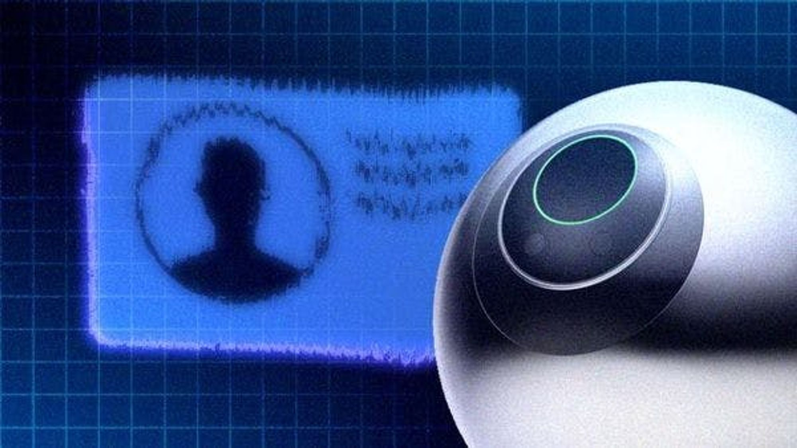
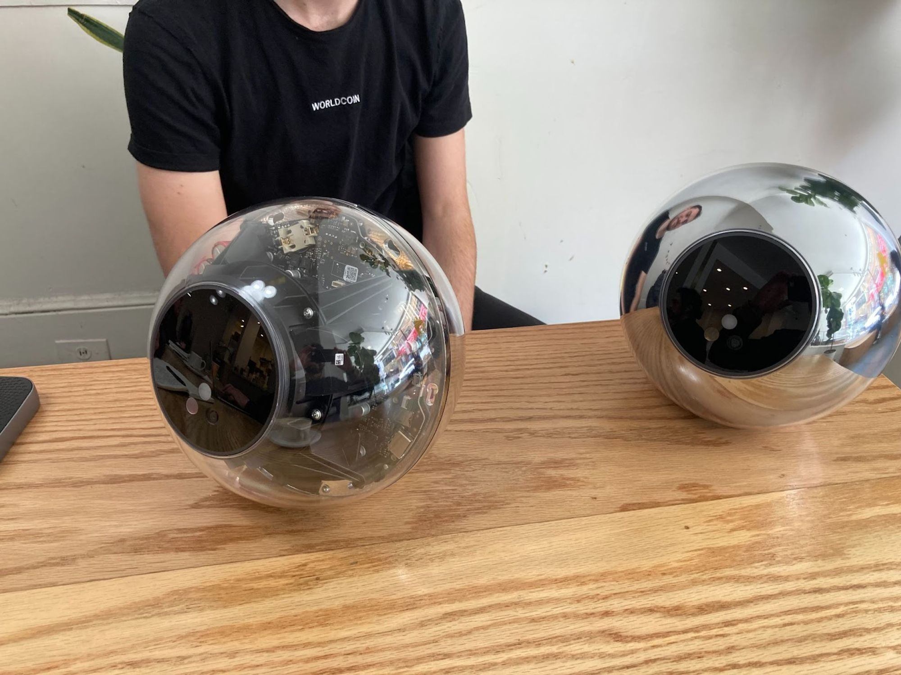
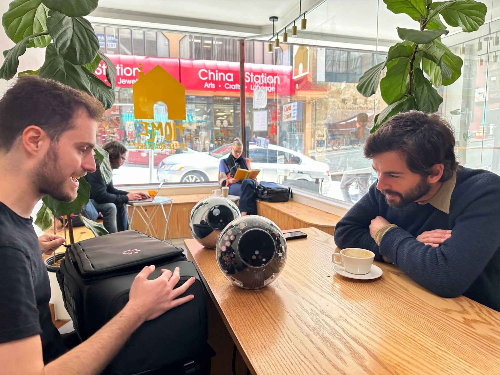

# Sam Altman 左右开弓，GPT-4 和去中心化身份 World ID 同时上线 | Defiant 报道

> 知名硅谷投资人 Peter Thiel 说，「AI 技术向左，Crypto 技术向右」，而 Altman 则左右开弓，就在 3 月 14 日同一天，他领导的人工智能企业 OpenAI 和共同创立的 Web3 项目 Worldcoin 发布了重大的最新产品。

**作者：** Owen Fernau

本周，Sam Altman 的 OpenAI 发布了通过机器人替代人类工作、最为火爆的产品的最新版本 GPT-4，与此同时，Altman 共同创立的 Worldcoin 则推出了一个旨在确保机器人无法冒充人类的项目。

Worldcoin 是一个通过区块链上存储的生物识别信息构建数字身份的项目，3 月 14 日周二推出了 World ID，这是一个旨在为开发者提供工具的协议，以证明数字化操作背后有真实的人。OpenAI 开发了基于人工智能的聊天机器人 ChatGPT，在同一天发布了一个重大升级——[GPT-4](https://openai.com/research/gpt-4)。

World ID 运行在以太坊上，有可能为在加密领域开发者提供新方式来确定交易背后是否有真实的人。缺乏确定身份的机制一直以来阻碍了很多加密领域的发展，如基于个人的投票、建立信用评分和防止空投等奖励计划的作弊行为。

World ID 内测版本在 Polygon 链上运行，但新版本可以与以太坊之外的网络进行桥接，如 Optimism、Arbitrum 和 Polygon。

随着人工智能的快速发展，数字身份的重要性很可能会变得更加突出，因为 AI 技术有可能使先前仅由人类触发的数字化操作易于自动化和复制。这些操作包括基于区块链的交易，其中蓬勃发展的领域，如社交网络、信用协议和合规性等，都有可能被一个 AI 来轻易地模仿人类行为所破坏。

作为 World ID 发布的一部分，Worldcoin 正在制作一个软件开发套件（SDK），让在加密领域内外的开发者可以使用该协议构建应用。

整个 Worldcoin 项目可以分为三个部分：3 月 1 日开始测试的 World ID 协议，目前还未发布、可能是基本收入计划一部分的 Worldcoin 通证，以及一个可用于购买销售和发送加密货币、Worldcoin 通证和传统美元的应用。

_Worldcoin 应用的截屏_

Worldcoin 最具争议的方面源于它建立真人身份的主要方式 —— 通过一种名为「Orb」的电池供电硬件扫描你的眼球虹膜。

_Orb 的两个型号_

用户也可以使用电话号码验证身份，但这可能让他们无法获得与使用 Orb 相同的功能。应用使用虹膜扫描还是电话号码取决于开发者的应用对使用 Orb 建立人格的重要程度。

World ID 最直接的用途是用于应用的登录 —— 作为启动的一部分，Worldcoin 在其 Discord 频道上启用了功能，允许人们使用他们的 World ID 登录。

「World ID 是 Worldcoin 最独特的部分，」Tools For Humanity 公司的产品、工程和设计负责人 Tiago Sada 在旧金山市中心的一家咖啡店告诉 The Defiant。

Sada 强调，很难确定互联网行为背后是否有一个独特的人。「50% 的人口没有可以在线验证的 ID，」他说。「随着人工智能中发生的一切真正酷的事情，这只会成为一个更大的问题。」

的确，人工智能可能在不久的将来能够在网络上执行类似人类的交互 —— Worldcoin 首席执行官兼联合创始人 Alex Blania 上个月告诉 The Defiant，今年内 AI 系统将能够自动在社交媒体上创建帐户并开始发布内容。OpenAI 发布的 GPT-4 似乎符合这一预测 —— 新模型能够推理和处理图像，而不仅仅是像 ChatGPT 那样处理文本。

_GPT-4 分析一幅画面_

Worldcoin 可能成为应对 AI 创造的内容和社交媒体账户所带来问题的一种方式。在 2016 年美国总统选举之后，误导信息已经成为一个有争议的问题 —— 如果 AI 很快可以编程以操纵社交媒体账户并发布虚假内容，那么这种技术将会加剧这一问题。

加密领域也存在一系列身份相关问题。DAO 投票目前集中在一个用户拥有的通证数量上，这带来了富人能够基本上「买下」一个项目的治理。空投经常被操纵。去中心化的信用评分仍然难以实现。

不过，关于 Worldcoin 的方法是否正确，仍有争议 —— 部分[开源](https://github.com/worldcoin/orb-hardware)的 Orb 招致像 Santiago Siri 这样的人的强烈批评，他创立了 Democracy.Earth，该项目创建的另一个身份系统叫 Proof of Humanity。

「网络空间上的人权是一个敏感问题，」他在 Worldcoin 首次出现的时候在[推特](<(https://twitter.com/santisiri/status/1451228320553742344)>) 上发布了这样的话。「任何依赖于客观生物识别技术的系统都可以轻易生成虚假指纹而不被任何人知道……从而劫持选举或窃取收入。」

_The Defiant 上周在旧金山预览 Orb_

Proof of Humanity 旨在建立身份认证，而不是通过扫描人们的虹膜。相反，它的设计通过个人提交视频以及依赖于「信任网络」的组合，即其他已经经过验证的人为某人的个体性背书来确定人的身份。

Sada 不同意这一点，他说很难通过基于信任网络的系统来通过引导阶段。

他说，「如果有 10 亿人进行了生物识别验证，那么你可以在此基础上建立信任网络，我不会感到惊讶。也许该协议在时机成熟的时候会迁移到这个阶段。」

数字身份领域不仅有 Worldcoin 和 Proof-of-Humanity 在研发 —— Polygon 链背后的团队在两周前推出了一个身份服务，而 Unstoppable Domains、Disco 和 Ethereum Name Service（ENS）等项目也在该领域奋进。

ENS 的通证在 2021 年 11 月进行了空投，过去三个月一直落后于 ETH 和 BTC 等主流通证，并且在这段时间内下跌了 4％以上（根据 The Defiant Terminal 的数据）。

_ENS 与 ETH 和 BTC 的价格对比_

目前，Sada 认为生物识别是建立个人身份的最佳途径。

Worldcoin 的[文档](https://docs.worldcoin.org/advanced/privacy)表示，它使用零知识证明来建立个人身份，这是密码学的一种应用，它允许人们证明某事情为真而不需要透露事实细节。根据文档，使用 World ID 并不意味着允许任何人，包括开发者和 Worldcoin 团队，将用户与特定人员关联起来。

然而，一串与人的视网虹膜相对应的数字字符串，称为哈希，确实会在人们使用它时留在 Orb 中。这个哈希需要与其他哈希进行比较，以确定其唯一性。

「很多人正在努力确保比较可以在链上公开完成，」Sada 表示，并补充说他认为虹膜哈希值不需要保密。就目前而言，在 World ID 的测试版本中，该比较确实是在专有服务器上进行的。

Sada 认为在数字和全球范围内建立身份的需求越来越明显，随着人工智能的崛起，这一点变得越来越明显。

虽然 Worldcoin 对生物识别技术的使用仍存在争议，但 Sada 认为，随着人工智能的兴起，在数字和全球范围内建立身份的需求越来越明显。

「人们开始理解为什么需要全球的身份验证，将存在。”他说。“现在的问题是，这会是什么样子。”Sada 表示，Worldcoin 团队认为他们的解决方案的相对开放性比可能出现的中心化系统更为可取。

「看到人们开始理解为什么需要并将存在全球人格证明，这非常令人兴奋。现在的问题是，这将是一个什么样的问题，」Sada 表示。Worldcoin 团队认为他们的解决方案的相对开放性比可能出现的中心化系统更为可取。

「我可以保证，将会有一个全球人格证明验证系统，」他说。

这个系统是 Worldcoin、政府或另一家加密企业开发的系统，还是根本不会出现？目前这是一个开放的问题。
