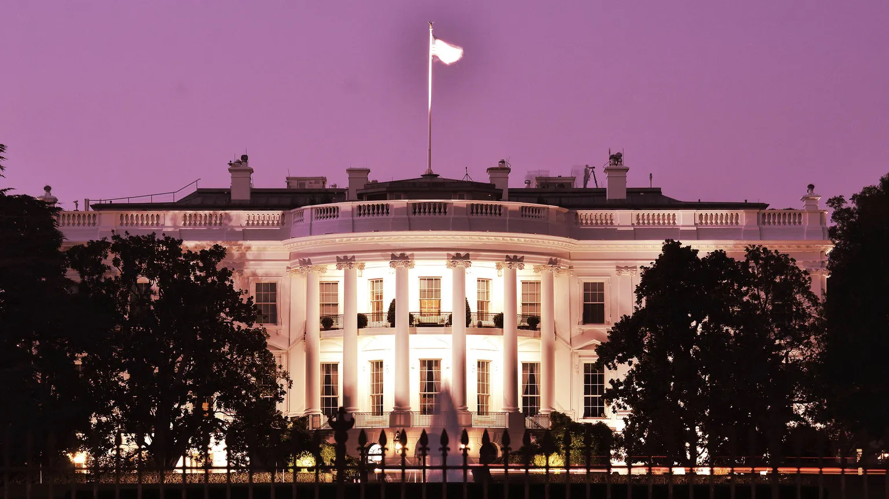
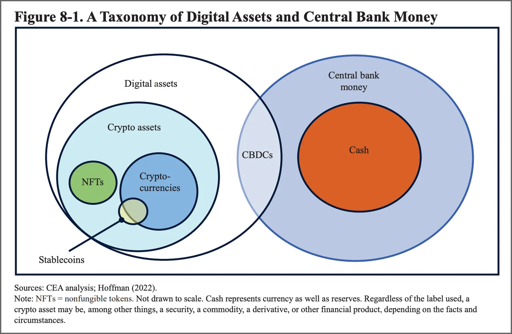

# 美国总统经济报告指责加密货币「无视基本经济原则」| Decrypt 报道

> 近日，比特币价格因欧美银行破产危机创下 9 个月来的新高，且明天凌晨美联储将首度面临是否继续加息的艰难选择之际，美国拜登政府则发布报告继续抨击数字资产创新「是人为创造稀缺性，许多没有基本价值」。

**作者：** Ryan Ozawa

今天，白宫今天泼了加密货币一盆冷水，在它发布的一份长达 513 页的[年度报告](https://www.whitehouse.gov/wp-content/uploads/2023/03/ERP-2023.pdf)中强调了数字资产的消极方面。

在《2023 年总统经济报告》第 43 页第一次提到数字资产 —— 与经济顾问委员会发布的年度更新报告一起发布 —— 称「区块链技术推动了金融创新数字资产的兴起，而这些数字资产已被证明是高度不稳定、并且容易受欺诈。」

「尽管倡导者经常声称数字资产，特别是加密资产，是一种革命性的创新，但这些资产的设计经常反映出对几世纪以来在经济和金融领域习得的基本经济原则的无知，」报告在第 48 页之后继续说道，「这种不充分的设计往往不利于消费者和投资者。」

_数字资产和央行货币的分类，见总统经济报告报告图表 8-1。_

整个报告（包括 100 多页的附录）涵盖了美国经济的所有方面，包括妇女在劳动力大军中的崛起、气候变化、进口商品、外国投资和教育。但有几个章节涉及技术和数字化市场。

第七章的标题是「数字经济中的竞争：新技术、旧经济」。第 8 章以「数字资产：重新学习经济原则」为题直击加密货币。

结论是什么？加密货币倡导者需要重回学校，因为他们正在「以艰难的方式重新学习以前金融危机的教训。」

「除了货币的去中心化保管和控制，有人认为，加密资产可能提供其他好处，如改善支付系统，增加金融包容性，以及创建绕过中介的知识产权和金融价值分配机制，」作者写道，「到目前为止，加密货币资产没有带来这些好处。」

同时，加密货币的成本对消费者、金融系统，甚至是物理环境都产生了不利影响。

「事实上，到目前为止，加密资产似乎没有提供具有任何基本价值的投资，也没有作为法币的有效替代品，改善金融包容性，或使支付更有效率，」作者写道，「相反，它们的创新主要是人为创造稀缺性，以支持加密资产价格。其中许多没有基本价值。」

作者随后阐述了加密货币支持者提出的一些「主张」，包括认为加密货币资产可以成为投资工具，可以像货币一样在没有中央机构的情况下运作，实现快速的数字支付，以及增加金融包容性和改善无银行和银行服务不足的情况。

随之而来的是大量的反驳，重点是对消费者的潜在伤害以及缺乏监管和执法。

「存在大规模不合规行为的主要领域之一是围绕作为证券的加密货币资产的披露，」报告称，然后回到了一个贯穿始终的主题，「这种缺乏披露的情况让投资者无法认识到大多数加密货币资产没有基本价值。」

该报告甚至退一步，试探性地解释了 Web3，「区块链技术支持者声称，它不仅会提高公司的业绩，而且会成为一个全新的互联网 —— Web3，即所谓的新互联网的骨干。」

该部分引用了 Signal 应用创始人和密码学家 Moxie Marlinspike 得出结论说，一些中心化是不可避免的。

「一旦一个分布式生态系统为了方便而围绕一个平台集中起来，它就会成为两个世界中最糟糕的情况，」报告指出，「中心化控制，但仍然是分布式的，足以陷入时间的泥潭。」
