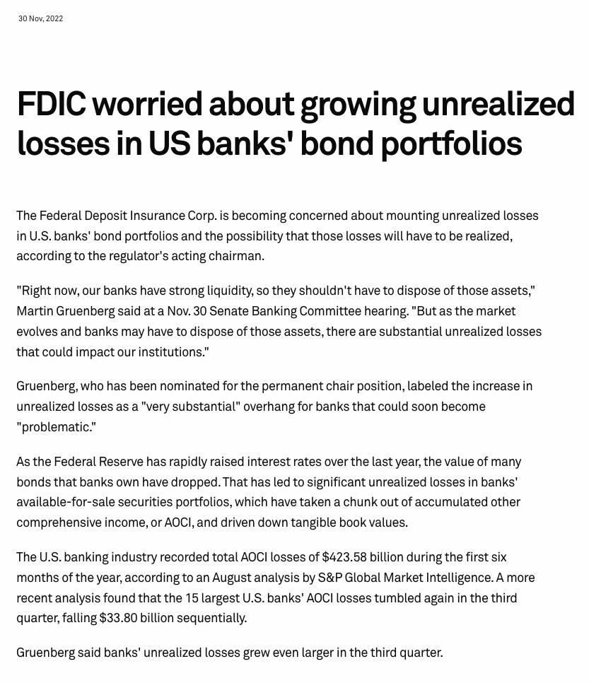
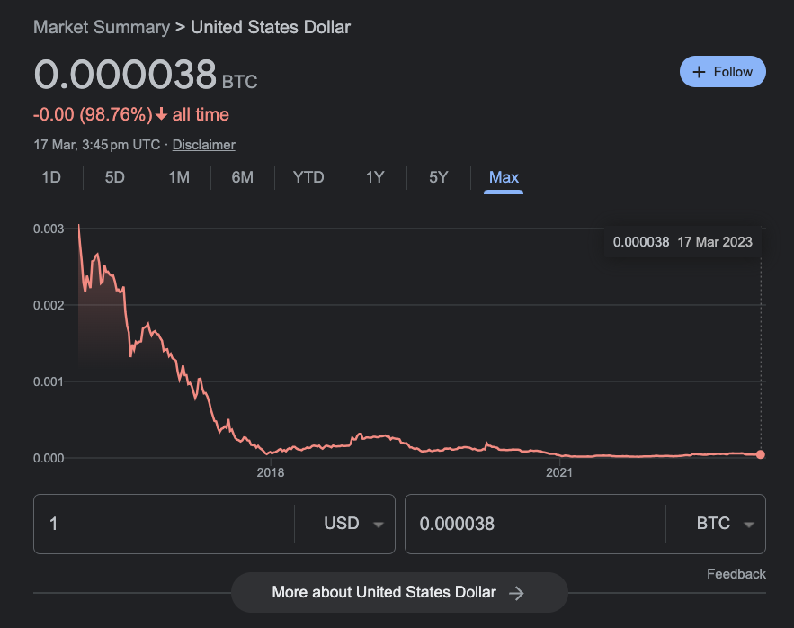

# 知名投资人 Balaji 为什么要打赌 1 个比特币 100 万美元？

> 有钱任性？还是苦口婆心？

最近 Silvergate 银行、硅谷银行、Signature 银行、瑞士信贷等欧美银行相继破产，人们疑惧 2008 全球金融危机再临，比特币在短短 12 天内从 20000 美元飙涨至 28000 美元，创下九个月来的新高。就在北京时间明天凌晨，美联储将首度面临银行危机之后是否继续加息的艰难选择。

**欧美金融体系是否面临崩溃？恶性通胀是否降临美国？人们该怎么办？**

为此，Coinbase 前 CTO、A16z 普通合伙人、《网络国家》作者 Balaji Srinivasan 则 4 天前在推特上和人打赌 90 天内用 100 万美元换 1 个比特币 ——

_https://twitter.com/balajis/status/1636797265317867520_

为什么要打这个赌，Balaji 发推解释道 ——

就像 2008 年一样，银行家们撒了谎。

这一次，央行的人、银行和银行监管机构对所有美元持有者和储户都撒了谎。

这不是你典型的部分储备情况。问题是，在银行里没有足够的按市价计算的资金来支付提款。他们在去年整整一年都知道这一点，并在内部用他们的行话进行了交流。

从图表中可以看出这一点。央行、银行和银行监管机构都知道一场大崩溃即将到来 —— 这个术语是「未实现的损失」[1,2,3,4,5]。但他们从未通知你，存款人。

相反，监管机构允许银行在报表脚注里掩盖其实质性的破产[6]，直到有一个人发现了它[7]。

他就是 Sam Bankman Fried（译注：去年底破产倒闭的加密交易所 FTX 创始人）。就像 SBF 用你的存款来购买山寨币，用会计技巧来欺骗自己和其他人使用这些钱，银行也是如此。

他们都用存款来购买最终的山寨币：长期美国国债。他们都在同一时间，以同样的方式被击倒，因为他们从同一供应商那里购买了同样的资产，而后者在同一时间将其贬值：美联储。

具体来说，正如《纽约时报》所承认的，银行在 2021 年「大肆」购买了大量的国债和其他长期债券，当时印刷出来的海量货币切断了他们对贷款的典型需求，而且他们认为美联储会永远保持低利率。

而且他们有充分的理由相信这一点。鲍威尔说他会对加息保持「耐心」，最迟在 2021 年 11 月 3 日[9]。然后他在 2021 年 11 月 22 日重获提名[10]，并且加息的速度远远超过了任何人的预期 —— 甚至耶伦[11]和联邦储蓄保险公司[12]都承认这导致了目前的银行危机。

鲍威尔为什么要推迟？可能是出于政治原因。总统们不喜欢加息[13]，尤其是在 2022 年的选举年。而鲍威尔认为他可以等待，就像保罗·沃尔克[14]一样「坚定」，然后打败了通货膨胀。

但今天这个世界不是 80 年代的重播。2010 年代，从持续十年的几乎零利率中加息，是对每一个美元持有者的突然袭击。经济学不是政治 —— 当涉及实际合约时，你在政治中看到的那种疯狂的翻转是不起作用的。

因此，任何押注长期国债的人都在 2021 年被干掉。而现在，任何押注短期国债的人都将在 2023 年被杀死。你可能处于的绝对糟糕的境地是将大量资产锁定在三个月的国债上。大银行提供的约 5% 的利率是个陷阱。对于那些央行追随美联储的国家来说，大多数法币银行账户现在都是一个陷阱。

查看我的参考资料，我已经提供了不少。

如果你相信美国银行家和美国媒体，就不要理会我。

否则就购买比特币，从交易所获得你的硬币。

Balaji 还解释了——

**HYPERBITCOINIZATION 超级比特币化**

我们必须用 BTC 对美元的术语来定义恶性通货膨胀，因为所有其他法定货币都可以而且会被膨胀掉。这就是 hyperbitcoinization（超级比特币化）。

这是世界以比特币为数字黄金重新计价的时刻，回到一个很像 20 世纪之前的模式。将要发生的是，个人，然后是公司，然后是大型基金将购买比特币。然后是萨尔瓦多这样的主权国家和微小的加密货币友好国家。

大的举动将是当美国的一个州如佛罗里达州或德克萨斯州，或一个「正常」的国家如爱沙尼亚、新加坡、沙特、匈牙利或阿联酋购买比特币。而当萨尔瓦多告诉印度央行购买比特币，即使是作为对冲，也会结束。

为什么会这么快？嗯，恶性通胀发生得很快。我们已经看到了数字化疫情大流行（COVID），数字化暴乱（BLM），以及数字化银行挤兑（SVB）。一旦人们检查我所说的内容，发现美联储对银行里有多少钱的问题撒了谎，一切都会发生得非常快。所有美元持有者都会被摧毁。

问题是，人们仍然被调到一个模拟世界，那里事情会逐渐变坏，而不是一下子变坏。但数字化世界没有太多的预兆 —— 这是 1，那是 0。就像银行挤兑，只不过这是央行。

然而，有两个预示。首先是美元对 BTC 的长期贬值图，从每个比特币不到 1 美元到 25000 美元。自金融危机以来，许多聪明的钱都在投票反对美元。结局是一个数字化悬崖下跌，在图表上几乎看不见 —— 但在世界范围内高度可见。

这条推特是第二个预示。它将被那些即使在过去几年中仍然信任美国建制派的人所忽视和嘲笑。他们无法想象，美国的银行和媒体会对他们撒谎到这种程度。

但他们就是这样。就像他们在 2008 年和过去十年里所做的那样。美元的数字化贬值即将到来，而且会很激烈。

[1]: Fed, Sept 22: https://archive.is/1QA4q
[2]: FDIC Nov 22: https://archive.is/ZBvli
[3]: FDIC Mar 6 23: https://t.co/1cctxQ27KI
[4]: Fed Feb 1 23: https://t.co/knQzUIKJI2
[5]: Bank CPAs, April 22: https://t.co/OlEnfFqb1N
[6]: Insolvency in a footnote: https://t.co/7b8oCBuFpp
[7]: Discovered online: https://archive.is/tfYIc
[8]: Banks bingeing on bonds, but not because they want to Aug 25 2021: https://archive.is/CtW1B
[9]: Patient on hikes Nov 3 2021: https://archive.is/thPOu
[10]: Renominated Nov 22 2021: https://archive.is/NWb25
[11]: Yellen admits not a tech issue: https://t.co/isHN3j3P3D
[12]: FDIC admits rate rises rekt banks: https://t.co/eIbCwBl2kr
[13]: Presidents don't like hikes: https://t.co/wnEZOVQz97
[14]: https://archive.is/ZM2YK

## 在数字化封锁之前获得比特币

就在今天，Balaji 针对美联储即将于今年 7 月发行央行数字货币这一东西发出了新的呼吁——

_https://twitter.com/balajis/status/1638342907626409984_

也许这是有意为之，也许只是偶然出现。

但在这场危机中，当每个人都在从崩溃的西方银行汇钱出去时，美联储不知为何继续努力推出他们的央行数字货币 [FedNow](https://t.co/EGSX5QoG0l)。

最黑暗的解释是，这是一堵美元长城，在数字美元贬值后阻止你出去。就像柏林墙和其他许多由经济崩溃的政权建造的墙一样，只不过是数字墙。

试想一下，对于那些仍然被困在美元体系中的人来说，工资、价格和资本控制已经到了个人层面。你贬值的美元变成了电子游戏点数，而让经济崩溃的美联储则成为系统管理员。你是疯狂的凯恩斯主义者的小白鼠。

游戏该结束了。在某些地方，除了常规的限制，异见分子还面临被撤销银行业务。而且，这不仅仅是 PayPal 冻结有问题的账户，而是美联储的一些官僚。

现在，虽然这样的事情已经成为全世界极权下数百万人的不幸经历，但我认识到，许多人认为这样的事情不可能在西方发生。

因此，如果你在所有事情上都完全信任美国建制派，请不要理会我，把你的资金放在国债里。

但如果你有一丝怀疑，就想想所有的谎言 —— 国家安全局的监控、伊拉克的大规模杀伤性武器、2008 年的金融危机、过去十年媒体的胡言乱语、在口罩起作用之前就声称它不起作用、否认通货膨胀 —— 所有这些谎言都让我们走到了今天。

再想想过去五年的取消文化、平台驱逐、冻结和取消银行业务。

有了这一切，你确定你想把你的钱全部交给美国建制派吗？100% 的钱？当他们的银行在左右崩溃的时候？当他们在央行造成银行倒闭，而监管机构又教唆掩盖事实之后，还把银行倒闭的责任归咎于储户？

如果你知道，就去找找看。

如果没有，就在他们把你锁起来之前去获得比特币。

_https://youtu.be/pP_HHE0kFhA_

**点击文末「阅读原文」，收看 Bankless 最新专访：Balaji打赌美元将恶性通胀**

## 通货膨胀与通货紧缩 | 经典重温

**作者：**米塞斯

**来源：**https://mises.org/library/inflation-and-deflation

货币所提供的服务由其购买力的高度决定。保留现金时，人们想的并不是保留一定数量的货币或者说一定重量的货币，他想的是保留一定数量的购买力。因为市场的运作会使货币的购买力高度趋向货币供给与货币需求一致的最终状态，所以货币永远不会过剩，也不会短缺。

单个人和所有人，都能完全享受到从货币的使用和间接交换中可以得到的所有好处，无论货币的总数量是多还是少。货币购买力的变化，会在社会的成员之间引发财富分配的变化。

在渴望通过这些变化来发财的人看来，货币的供给有时会短缺，也有时会过剩；而且对这样的收益的渴望，可能会导致旨在用现金数量诱导购买力变化（cash-induced alterations in purchasing power）的政策出台。但是，改变货币的供给量既不能提高货币所提供的服务，也不能损害这样的服务。

个人的现金储备可能会过剩或者短缺。但这样的情形可以通过 增加/减少 消费/投资 来补救。（当然，我们不能陷入那种常见的混淆中：认为对现金的需求与对财富的渴求是一回事）。整个经济体可用的货币数量总是能保证每个人都能得到货币带来的以及可带来的一切好处。

从这种洞见中，我们也许会将为提高货币数量而产生的支出都称为浪费。而一些能被用于其它有用服务的东西被当成了货币、因此从其它用途中撤了出来，似乎也成了对（本就有限的）欲望满足机会的多余限制。正是这种想法，使得亚当·斯密（Adam Smith）和大卫·李嘉图（Ricardo）认为，使用纸币可以减少制造货币的成本，有极大的好处。

然而，对研究货币史的学生来说，情形却截然不同。只要你看过纸币大通胀引发的灾难性后果，你必定会同意黄金生产的昂贵支出微不足道。反驳说这些灾难是因为掌管着信用货币和法定货币的政府错误地使用了权力、明智的政府会实施更可靠的政策，是毫无意义的。

因为货币永远不是中性的（neutral），其购买力也永不可能稳定，跟货币数量的决定有关的政府计划，也永不可能对社会的所有成员都公正无偏。无论政府在试图影响购买力高度的时候怎么做，都必定基于统治者的个人价值判断。它总会以牺牲另一部分人为代价使一部分人受益。它从不不服务于所谓的 “公共利益” 或者 “公共福祉”。在货币政策领域也易用，没有 “科学的应该（scientific ought）” 这回事。

选择哪种商品来当交换媒介（或者说货币），并不是无甚差别的。这个选择决定了现金数量诱导购买力变化的过程。问题只在于，应该由谁来做这个决定？在市场上做买卖的人，还是政府？

正是市场，在连年的选择中，最终为贵金属黄金和白银赋予了货币的角色。两百年来，政府一致在干预市场对货币媒介的选择。哪怕使最顽固的国家主义者（étatists），也不敢说这种干预已经被证明是有好处的。

通货膨胀与通货紧缩；通胀主义和通缩主义
“通货膨胀（inflation）” 和 “通货紧缩（deflation）” 并不是人类行为学的概念。它们也不是经济学家发明的，而是来自公众和政客的日常言谈。

这些概念隐含着常见的错误，认为存在中性的货币、购买力稳定的货币、可靠的货币应该是中性以及购买力稳定的。从这个角度来看，“通胀” 指的是导致货币购买力下降的现金数量变化，而 “通缩” 指的是导致货币购买力升高的现金数量变化。

但是，使用这些术语的人并没有意识到，货币的购买力从未有保持不变的时候，因此总是会有通胀或通缩。因为这些波动微小且难以察觉，他们忽略了这些必然而永恒的波动，并将这些术语保留到形容购买力出现巨大变化的时候。

但是，购买力出现的多大的变化才能叫 “巨大变化”，依赖于个人的相关性判断；因此，这两个术语显然缺乏人类行为学、经济学和交换学（catallacitc）概念所需的分类学精确性（categorical precision）。它们只合用于历史学和政治学。

只有在运用相关的理论来解释经济史事件和政治纲领时，交换学才能自由使用这两个概念。不过，在不可能产生误解、可借此免去迂腐表述的场合，严谨的交换学研究使用这两个术语也是非常方便的。而且，绝不能忘记，关于通胀和通缩 —— 引发货币购买力 巨大变化 的现金数量变化 —— 交换学所说的一切对小的购买力变化也依然适用；当然，更小的变化相对来说更不容易察觉。

而 “通胀主义” 和 “通缩主义”、“通胀主义者 ”和 “通缩主义者”，指的是旨在引发通胀或者通缩 —— 诱发购买力巨大变化的现金数量变化 —— 的政治计划。

作为我们这个时代的显著现象质疑，语义革命（semantic revolution）也改变了 “通胀” 和 “通缩” 这两个名词的传统内涵。今天许多人所说的通胀和通缩，已经不是指货币供给量的巨大增加和减少，而是这些变化的不可避免地后果：商品价格和工作率 上升/下降 的一般趋势。

这种 “创新” 当然是有害的。它在煽动人们趋向通胀主义的浪潮中推波助澜。

首先，已经没有了任何词语能够指代 “通胀” 一词原来指代的那种东西。你没法反对一种你叫不上名字的政策。政治家和作家想要质疑增发大量货币的好处时，也不再能求助一个公众已经接受和理解的术语。

想要指称这种东西的时候，他们必须给这种政策提供详尽的分析和描述，配以细致详实的记录，而且必须在么一次处理这个主题的时候都重复这种恼人的程序。因为这种政策没有名字，它就成了一种自作解释的事实（it becomes self-understood and a matter of fact），然后大行其道。

第二个糟糕之处是，那些投身于对抗通胀的不可避免后果 —— 价格上涨 —— 的徒劳无望运动的人，正把他们的努力伪装成在反对通胀（译者注：比如以最高限价来防止统计数据上的价格上升）。虽然他们只是在对症状开药，他们却假装自己已经找到了病根。因为他们并没有理解这边的货币数量增加和那边的价格上涨之间的关联，他们让事情变得更糟。

最好的例子就是美国、加拿大和英国的一些政府对农民提供的补贴。最高限价（price ceilings）减少了相关商品的供给，因为边际生产者生产了反而遭受损失。为了防止这个结果，政府向生产成本最高的农民提供了补贴。而这些补贴是靠增发货币来筹集的。

如果消费者不得不为相关的产品支付更高的价格，就不会产生进一步的通货膨胀效果。消费者将只能使用已经发行的货币来支付这种额外的之处。对通胀及其后果的混淆，可能直接导致更多的通货膨胀。

显然，通货膨胀和通货紧缩这两个术语的新含义是完全误导人的，必须无条件地拒绝。
