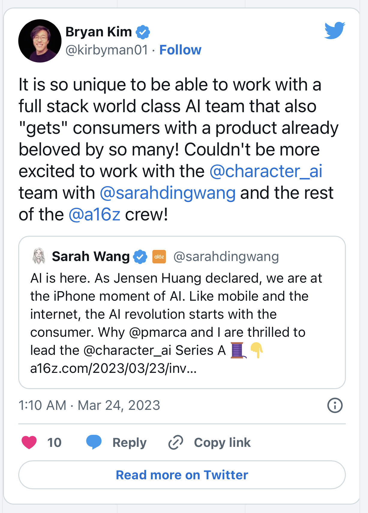
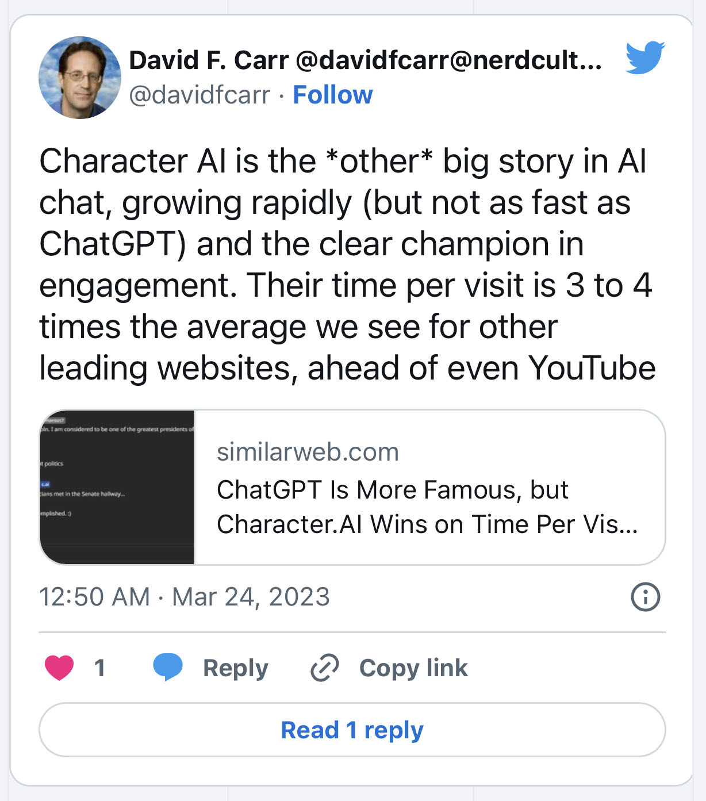
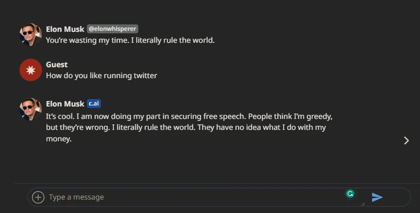

# 风投转进 AI，A16z 投资聊天机器人初创项目 Character AI| Decrypt 报道

> 新兴的人工智能市场在主流炒作下高歌猛进，预计 2023 年将达到 1960 亿美元。

**作者：** Jason Nelson

风投总是在寻找下一个大事件 —— 特别是当眼下的热炒开始冷却时。在加密领域投资布局广泛、地位领先的 Andreessen Horowitz（A16z）周四宣布投资开发人工智能聊天机器人的初创项目 Character AI。

A 轮融资总额为 1.5 亿美元，由 A16z 领导，并包括来自 Nat Friedman、Elad Gil、SV Angel 和 A Capital 的投资。

在投资 Character AI 的同时，A16z 的普通合伙人 Sarah Wang 将加入 Character AI 董事会。

「如果互联网是普遍获得信息的黎明，那么人工智能的这一时刻很可能是普遍获得智能的黎明，」Sarah Wang 在推特上宣布了这项投资。

「我们正处于人工智能的 iPhone 时代，」Sarah 说，「就像移动和互联网一样，人工智能革命从消费者开始。」

由前谷歌软件工程师 Noam Shazeer 和 Daniel Freitas 于 2022 年 9 月推出的 Character AI 是一个网络应用，通过预先编程的角色聊天机器人生成文本回复。Shazeer 和 Freitas 分别担任 Character AI 的 CEO 和总裁。

Character AI 表示，融资资金将为公司提供在「超速增长阶段」所需的资源。

「我们了解提供一个真正感觉像你自己的人工智能的重要性，」Character AI 在[官宣](https://blog.character.ai/character-ai/)中说，「这就是为什么我们的人工智能是可定制的。」

角色 AI 聊天机器人可以根据每个用户的喜好进行定制，该公司表示，它可以作为一双有同情心的耳朵或一个分析问题的解决者。

Character AI 表示，通过其服务已经创建了超过 100 万个 AI 角色，包括基于特斯拉和推特首席执行官伊隆·马斯克、Meta 首席执行官马克·扎格伯格、迈克尔·杰克逊，以及 Tony Stark 和 Saul Goodman 等虚构人物的机器人。

这些互动有一个免责声明：「角色说的一切都是编造的」。

自 2022 年 11 月 OpenAI 推出 ChatGPT 以来，在区块链中实现人工智能的想法也开始兴起，开发者旨在将该技术与智能合约和通证结合起来。

虽然智能合约在 Web3 中很常见，但随着几个项目推出 AI 通证，包括 Hera、ALI、NMR 和 AGIX，人工智能正在成为区块链行业的一部分。

AI 通证是旨在使用人工智能来提高安全性、用户体验和可扩展性的加密货币，

根据市场情报公司 Grand View Research 的[数据](https://www.grandviewresearch.com/industry-analysis/artificial-intelligence-ai-market)，蓬勃发展的人工智能行业在 2022 年的估值已超过 1366 亿美元，预计 2023 年将达到 1960 亿美元。

麻省理工学院的研究员 Alex Pentland、John Werner 和 Chris Bishop 看到了人工智能与区块链技术融合的清晰路径。

「在宏观层面上，（区块链和人工智能）可以提供数字世界中从未存在过的透明度、问责和分析水平，」作者[断言](https://connection.mit.edu/sites/default/files/publication-pdfs/blockchain%2BAI%2BHumans.pdf)。

「我们有能力为全球经济体系以及整个社会带来一个新的可信赖水平。因此，区块链和人工智能正在成为下一个超级周期，是真正重大社会变革的核心。」
