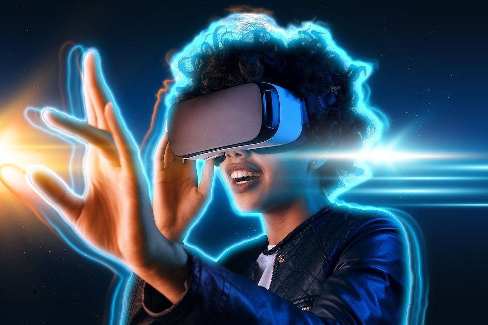
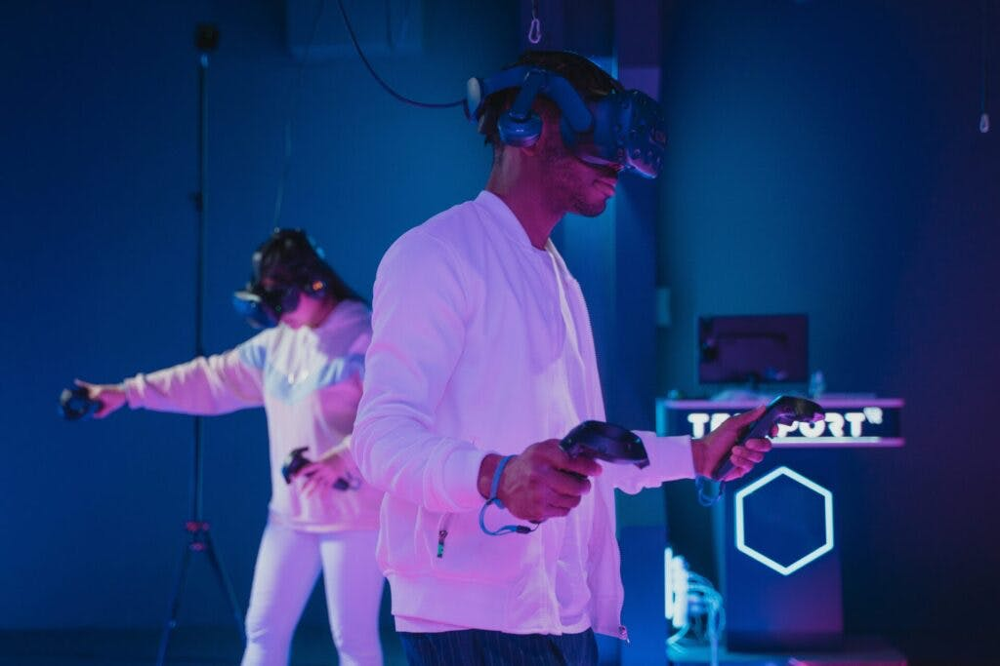
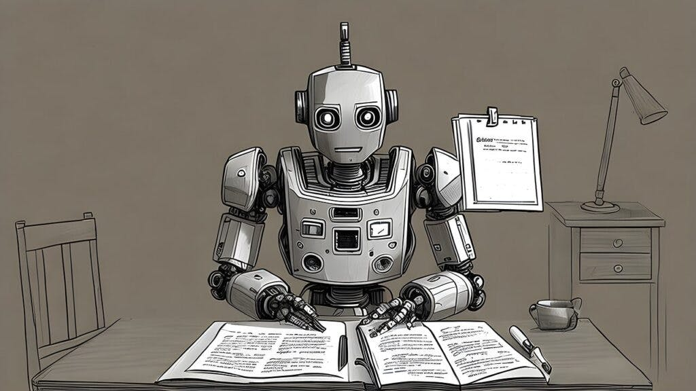

#元宇宙普及步履蹒跚，但这是一件好事 | Thought for Today

> 慢即顺，顺即快

**作者：** Austin Yavorsky

微软、谷歌甚至 Meta 等领先科技公司已经将他们的投资和资源从元宇宙项目转移到 AI 聊天机器人上。因此，混合现实世界停滞不前、失去动力的感觉变得非常真实。

**ChatGPT** 和 AI 类人聊天机器人（经常引起争议）已经取代元宇宙成为科技领域的下一件大事。我们再一次听到科技媒体分析说：「元宇宙不会被大规模采用。」虽然他们可能认为自己正在做什么，但元宇宙已经成为现实。它现在正在经历缓慢但稳定的采用。这就是为什么是件好事。

## 慢即顺，顺即快

Forrester 的《2023 年预测：财富偏爱大胆而专注的人》认识到，随着科技公司竞相开发新的混合现实世界，元宇宙达到了狂热的顶峰。该报告还显示，元宇宙的炒作已经饱和，其发展将因全球经济不确定性而放缓。然而，Forrester 肯定 3D 内容和 Web3 仍将成为未来十年的新常态，从而取代 2D 数字世界。

新技术和产品通常会达到炒作高峰，然后进入平稳期。它正处在平台阶段 —— 现在是元宇宙 —— 技术成熟、新用例开发和基础设施构建的时候。

在混合工作等领域，元宇宙工具正在慢慢被引入远程工作者。例如，微软一直在为 Teams 添加 Mesh 组件，以实现 3D 元宇宙风格的功能协作。谷歌、Slack、Webex 和 Zoom 预计都将在 2023 年做同样的事情。

当用户想到元宇宙时，他们自然会把它与大型科技公司和平台联系起来，例如 Decentraland、Roblox 和 Fortnite（堡垒之夜）。但幕后还有很多事情要做。

## 元宇宙的灵活定义

其实，元宇宙技术应用于解决现实世界问题的其他领域还包括：医疗保健、采用数字孪生技术的工业部门和品牌。麦肯锡表示，到 2030 年，元宇宙有可能产生 5 万亿美元的价值，其规模之大不容企业忽视。

理解元宇宙价值的关键是保持其定义的灵活性。不同的行业和企业正在利用这种灵活性来创建不同的用例、服务和产品。

摩根大通是第一家在 Decentraland 开业的银行。它认为元宇宙是一个每年价值 1 万亿美元的机会。另一方面，全球领先的个人电脑公司之一联想最近发布了其最大的由人工智能驱动的边缘物联网云硬件产品组合，目标是开发元宇宙数字孪生解决方案的行业。西门子与英伟达合作，开始创建他们的工业元宇宙，专注于工程解决方案、数字孪生、物联网和实时分析。

从金融到电力再到制造业，元宇宙正在加速工厂车间、运行安全和维护、执行所有类型的模拟、简化供应链并提高安全性。

Gartner 的《2023 年十大战略技术趋势》报告表示，元宇宙具有保护品牌并帮助其发展、吸引和留住人才和客户以及增加收入的潜力。这家技术研究咨询公司表示，到 2027 年，超过 40% 的大型全球组织将使用某种形式的 Web3 技术，包括基于元宇宙的项目中的空间计算和数字孪生。

随着消费趋势的发展，需要现代超个性化体验，认识到元宇宙和混合世界体验的商业价值的品牌也与全球用户建立了联系。

> 「消费者行为已在很大程度上转向采用数字角色，但许多品牌尚未提供解决方案，」AnamXR 联合创始人兼首席执行官 Irene-Marie Seelig 告诉麦肯锡。

保持元宇宙的定义灵活也是理解这个概念已经在发挥作用。麦肯锡知识管理合伙人 Matt Ball 补充道：「每天有数亿人连接到这些环境。地球上有许多最知名的公司在建立业务，我们的商业价值高达数百亿美元，很快就会达到数千亿美元。」

所有这些新的元宇宙功能、服务和解决方案不仅会推动普及。他们将为第二代元宇宙硬软件奠定基础，并在元宇宙学习曲线上启动工人、专业人士和全球用户。

## 工程质量和安全进入元宇宙

ChatGPT 喧嚣且像过山车般的发布，以及类似的 AI 类人聊天模型，不仅引发了微软、谷歌之间的 AI 大战，还有 You.com 、 DuckDuckGo 等争先恐后地抢先占领市场。它还给全世界上了一课，如果我们愿意的话：即使产品尚未完成、未经过全面测试、验证或 100% 有效，大型科技公司也会发布产品。

与任何其他行业不同，在技术领域，公司可以在许多情况下立即在全球范围内发布产品和服务，而无需经过详尽的安全和标准检查。在现实世界中，产品发布的方式可能非常不同。用户曾悲惨地经历过公司 —— 即使是那些声誉卓著的公司 —— 发布结构不良或不安全的产品时发生的事情。例如，加密货币交易所 FTX 的崩溃。

11 月 11 日，FTX 申请破产保护，导致超过 100 万客户损失了 80 亿美元的资金。 FTX 的创始人 Samuel Bankman-Fried ，又名 SBF，被美国政府指控共谋进行电汇欺诈、共谋进行商品欺诈、证券欺诈、洗钱以及共谋诈骗联邦选举委员会和违反竞选财务规定。

虽然许多人可能会争辩说技术产品不需要监督，但情况并非总是如此。我们看到所有类型软件的测试版本都在推出；以特斯拉的自动驾驶软件为例，该软件据称对多起致命车祸负责，目前正在接受调查。

毫无疑问，世界需要就对民众具有重大影响和风险的科技产品发布进行深入辩论。主流技术只有在功能齐全并按预期工作时才应该发布。

对于元宇宙公司和组织来说，这段时间可能是有益的。元宇宙项目不再受制于「最新最好的技术」所带来的激烈竞争的疯狂步伐。这组独特的环境允许开发者构建基础设施、测试产品、试验新的用例，并确保开发出安全保质的产品。

元宇宙解决方案，无论是社交媒体虚拟世界、金融应用，还是与基本公共服务相关的工作，都必须能够抵御网络攻击，并且绝不能构成道德或合规风险。它们还必须积极地造福于用户和社区。这只有在一家公司专注于构建高质量、安全的产品和服务时才能实现，而不是在他们被迫在纳斯达克等华尔街科技股指数的压力下满足不切实际的最后期限时才能实现。

可访问性、道德规范、安全性和合规性绝不能是事后才想到的；它们必须从每个元宇宙项目开始就嵌入到愿景和源代码中。在 AI 进步的推动下，在边缘和云的支持下，开发者可以使用范围广泛的可用资源。如今，初创公司以及大中小型企业都有千载难逢的机会来花时间设计元宇宙，并把它做好。
