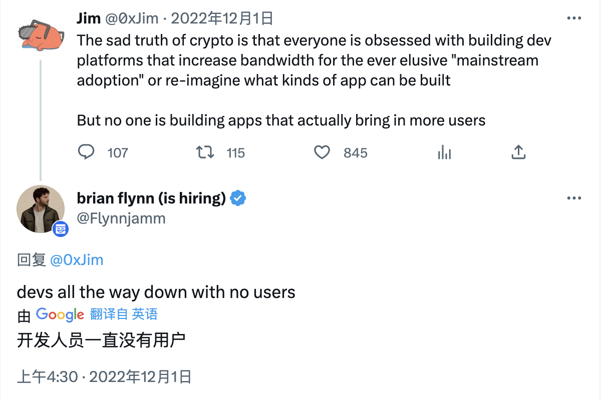

# 「Rollup 即服务」搭车指南

> 以太坊上海升级在即，L2 生态繁荣爆发，模块化区块链正在成为主流。M7e 元宇宙特攻队今天分享由为模块化区块链打造跨链 DEX 的 Catalyst 创始人 Jim 写的行业纵览。

**作者：** 0xjim

未来将有[数以百万计的区块链](https://medium.com/catalystamm/the-proliferation-of-modular-chains-19e60b39b98) —— 有些是通用的，但绝大部分是特定的应用。

[模块化区块链](https://medium.com/imperator-guide/modular-vs-monolithic-blockchains-introduction-to-celestia-the-first-modular-blockchain-d99d6899cfe1)的出现，以太坊以 Rollup 为中心的愿景，以及 Vitalik 在其博客[《终局》](https://vitalik.ca/general/2021/12/06/endgame.html)中承认为了可扩展性而进行的中心化，几乎使这一未来愿景成为必然。

因此，合乎逻辑的结论是，未来将是数以百万计的专为应用服务的模块链 —— 但它们是如何建立的？

当然，有了 Rollups-as-a-Service（RaaS），就可以了。

许多应用团队不愿意考虑运行基础设施的问题。就像 AWS 如何抽象化托管服务器的复杂性一样，RaaS 项目正在为建立和维护区块链做同样的事情。

在不久的将来，部署一个新的链将像创建新的网页或扩展和收缩一个应用一样 —— 与我们现在通过 Docker 容器和 Kubernetes 所做的一样。

仅在过去 6 个月，我们就看到了一连串来自 RaaS 项目的公告 —— 为轻量级、可配置的 Rollup 构建低代码甚至无代码的产品。

## RaaS：Rollups-as-a-Service

以下是目前所有模块化区块链解决方案/Rollup 即服务项目的详尽清单。

## 前辈：Cosmos 和 Substrate

**Cosmos SDK** 和 **Substrate SDK** 都已经存在多年了 —— 允许开发者创建自己的主权链（所以*在技术上*不是模块化的），或者在 Substrate 的情况下，通过成为平行链（parachain）连接到 Polkadot 中继链（Relay Chain）的共享安全。

## 另类 L1

在 2021 年早期，**Polygon** 和 **Avalanche** 是另类 L1（第一层区块链）叙事的一个重要部分。它们内置了原生态的模块化功能：Polygon Edge 和 Avalanche [子网](https://www.avax.network/subnets)。

最值得注意的是，Avalanche 与 Crabada 和 DeFi Kingdoms 等游戏合作，创建了他们自己的游戏专用子网。

Polygon 已经扩大了 Edge 的范围 —— 现在称为 [Polygon Supernets](https://twitter.com/0xPolygonEdge)。通过 Supernet，dApp（去中心化应用）团队可以利用现有的 Polygon PoS 验证者的质押，创建一个单独的特定应用环境。随着时间的推移，Polygon Supernets 还将让 dApp 团队有能力使用 Polygon ZK 技术创建 ZK Rollup。

## 以太坊最大主义者

以太坊上的许多 L2（第二层区块链）正在考虑在他们的网络上特定应用的 Rollup 是什么样子的 —— Scroll、Fuel、Mantle、Boba、Metis、Consensys 的 zkEVM 和 Loopring。

[**OPStack**](https://stack.optimism.io/)，Optimism 的模块化堆栈，是 Base —— 以及其他分叉（如 [Minecraft](https://dev.optimism.io/opcraft-autonomous-world/) 游戏）背后的建筑师。他们有一个共享序列器的超级链愿景，在 Rollup 之间提供同步性和原子性 —— 利用共享序列器。

OP Labs 团队的愿景是让 RaaS L2 成为以太坊顶部的「实验层」。例如，以太坊开发者可以轻松地旋转一个新的 Rollup，以便在生产环境中测试新的 ERC 和 EIP —— 而不是等待以太坊 L1 的全面奉行更新，甚至是其他更成熟的 L2 的更新，如 Optimism 主网。

_https://twitter.com/OPLabsPBC/status/1632186167012777984_

[**Arbitrum AnyTrust**](https://medium.com/offchainlabs/introducing-anytrust-chains-cheaper-faster-l2-chains-with-minimal-trust-assumptions-31def59eb8d7) 及其首期游戏优化部署 [Nova](https://medium.com/offchainlabs/introducing-nova-arbitrum-anytrust-mainnet-is-open-for-developers-9a54692f345e) 是 Arbitrum 的模块化解决方案 —— 允许使用 Arbitrum 的执行层 Nitro，具有使用 [DAC](https://twitter.com/CelestiaOrg/status/1493297616062345216) 的链下数据可用性和向以太坊 L1 发布链上数据的故障安全功能。

上周，在进行空投的同时，Arbitrum 发布了 [Orbit](https://www.prnewswire.com/news-releases/the-arbitrum-foundation-announces-launch-of-arbitrum-orbit-layer-3-chains-for-all-301773505.html) —— 一个开发者解决方案，可以在 Arbitrum 上推出 L3（第三层区块链），作为完整的 Rollup 或 AnyTrust 实例。Orbit 与 Stylus 搭配，允许开发者用 C、C++、Rust 以及 Solidity 等 EVM 语言构建应用。Offchain Labs 设想利用 L3 进行快速实验：引入新的治理机制的[无许可 Rollup](https://docs.arbitrum.foundation/new-arb-chains)，对 Nitro 的修改等。

_https://twitter.com/EdFelten/status/1636353663940587522_

构建在 **StarkNet** 之上的 [**Slush**](https://slush.dev/) 提供了一个 SDK，用于在 StarkNet 之上构建 zkVM L3。Starkware 还提出了著名的 [Fractual Scaling(分形扩展)](https://medium.com/starkware/fractal-scaling-from-l2-to-l3-7fe238ecfb4f) 概念，可以说开始了关于 L3 的对话。

_来自 Starkware 博客文章_

**zkSync** 也在考虑分形扩展和 [L3](https://twitter.com/zksync/status/1579449323523227648) 的问题 —— 他们称之为 [Hyperchains](https://era.zksync.io/docs/dev/fundamentals/hyperscaling.html#what-are-hyperchains)。利用 LLVM，Hyperchains 是类似分形的 zkEVM 实例，在 L1 主网的共同结算下并行运行。

任何人都可以无需许可地部署 Hyperchains —— 采用可定制的模块化 zkEVM 链堆栈，由与主 zkSync L2 完全相同的 zkEVM 引擎驱动。开发者可以选择不同的虚拟机（如 MoveVM）、不同的排序器设计以及数据可用性（zkRollup、zkPorter 和 zkValidium）。

此外，Matter Labs 团队对 Hyperchains 的短暂执行环境有一个愿景。例如，一个 Rollup 可以被旋转起来，以廉价的方式铸造数以百万计的 NFT，NFT 可以被桥接到另一个执行层，并且临时 Rollup 可以被关闭。

[**Caldera**](https://caldera.xyz/) 有一键模块化链部署的愿景 —— 最初从[Optimistic Rollup](https://calderaxyz.gitbook.io/caldera-documentation/getting-started/overview)开始。他们有一个用于测试网 Rollup 的[现场演示](https://dashboard.caldera.xyz/)，真的很有吸引力，而且已经在主网上与 Curio 等游戏客户在生产环境中运行了。

[**Stackr**](https://twitter.com/0xStacked) 仍处于早期阶段，但它是 ETH Global 黑客松的[赢家](https://ethglobal.com/showcase/stackr-network-tbvt1)，似乎很有前途。他们希望能够利用「微型 Rollup」创建「混合应用」 —— 让 Rollup 在执行、数据存储和充分去中心化方面有自由选择权。

_https://twitter.com/Kautukkundan/status/1626622762264698881_

对 [Conduit](https://twitter.com/conduitxyz) 的了解也还不多，但它与 OPSpack 有关，用于 Optimistic Rollup。他们的目标也是「一键式部署」的体验。

## Cosmos 生态

[**Dymension**](https://dymension.xyz/) 的 RDK 允许在 Cosmos 上创建连接到 Dymension Hub 的 RollApps。Dymension RollApps 是用与 Cosmos SDK 相同的工具构建的 —— 主要区别是替换了无共识区块链的模块（即没有验证者过渡逻辑） —— 并且由于没有数据发布带宽作为瓶颈，预计比 Vanilla Rollup 更具有可扩展性。

Dymension Hub 将允许 RollApps 和其他支持 IBC 的链之间进行枢纽式 IBC 连接 —— 不仅对用户有利，而且也提高了 Dymension Hub 作为一个自主网络的地位。

[**Saga**](https://www.saga.xyz/) 是一个弹性区块空间平台，允许开发者按需部署完全安全的、去中心化的「Chainlets（小链）」 —— 利用其主要验证器组的安全性。

Saga 支持多个底层平台的小链 —— 包括 Cosmos 应用链、Celestia Rollup 和 Polygon Supernets。与其他 RaaS 项目一样，Saga 专注于游戏用例，并将支持游戏行业要求的任何技术。

[**Initia**](https://twitter.com/initiaFND) 是一个模块化的解决方案，也在竞逐游戏市场。他们将 MoveVM 用于执行层，ZK 证明，以及 Cosmos SDK 用于快速结算和数据可用性。Initia 计划通过他们所谓的「大厅理论 」来充实他们的 L1 生态，以实现 L2 之间的可组合性和交叉授粉，而不是仅仅关注 L2 基础设施。

[**Evmos**](https://evmos.org/) 计划开发 [Evmos SDK](https://medium.com/evmos/the-evmos-manifesto-7fe5d1ab0d67#:~:text=functionality%20built%20elsewhere.-,Evmos%20SDK,-In%202022%2C%20Ethermint%E2%80%99s)，让开发者能够轻松使用 Ethermint 进行构建，并在 Cosmos 上推出兼容 EVM 的新应用链。

[**Berachain**](https://twitter.com/berachain) 最近宣布了 [Polaris](https://twitter.com/berachain/status/1632819905337733120)，一个重新设计的区块链框架，允许以太坊虚拟机与任何共识机制集成 —— 以 Cosmos SDK/Tendermint 开始。该团队还将建立额外的开发者工具和基础设施，以使与 Polaris 的建设无缝衔接 —— 例如，区块浏览器和钱包。

[**Eclipse**](https://www.eclipse.builders/) 正在建立一个[结算 Rollup](https://members.delphidigital.io/reports/the-complete-guide-to-rollups)，允许 SVM 和其他虚拟机执行层建立在上面，并使用 Cosmos 和 [Polygon](https://twitter.com/EclipseFND/status/1628849328726118402?s=20) 以及最终为数据可用性使用其他 L1。

_《Eclipse 工作原理》，来自他们的网站_

## Celestia 生态

**Celestia** 的 [Rollkit](https://twitter.com/RollkitDev)（之前是 Rollmint 和 Optimint）是一个模块化的 Rollup 框架，允许开发者用模块化的数据可用性组件创建主权 Rollup 或 Optimistic Rollup（soonTM）。Rollkit 有一个通用的 DA 层接口，将允许任何任意的 DA 层被插入 —— 与[比特币](https://twitter.com/RollkitDev/status/1632438374513676288)的整合备受争议。

**Astria** 是一个执行层的结算 Rollup，使用 Celestia 来实现数据的可用性。

[**Fractal**](https://blog.celestia.org/meet-cohort-one-of-modular-fellows/) 是一个构建 zkVM Rollup 的枢纽。

[**Sovereign Labs**](https://www.sovereign.xyz/)正在为「Rollup 互联网」建立 Sovereign SDK，使用任何 L1 的数据可用性和排序以及任何 LLVM 兼容的证明系统进行 zk 证明，创建主权的 zk Rollup（例如 RiscZero 或 Nil Foundation）。

## 其他同行

[**Artesi**](https://twitter.com/artesi_) 正在建立「全栈」 Rollup，包括区块浏览器和 MPC（多方计算）钱包等现成的工具。

[**Alt Layer**](https://altlayer.io/) 专注于创建「Flash Layer（闪存层）」，即用于有时间限制的短暂 Optimistic Rollup。他们正在使用 Substrate SDK。

[**Cartesi**](https://twitter.com/cartesiproject)（不要与 Artesi 混淆）正在为 Optimistic Rollup 创建一个区块链 SDK，用于可编译为 Risc-V 的 Linux 操作系统。

[**Opside**](https://opsi.de/) 利用其创新的 L3 平台，将 zk-Rollup 作为一项服务提供。

## 应用链团队

好了，我们终于涵盖了所有的解决方案，让建立一个模块化的产业链更加容易，但谁在真正创建新链？

三大类：游戏、DeFi 和创作者经济。

### 游戏

到目前为止，游戏是 RaaS 项目引用最多的用例 —— 许多项目只专注于游戏用例。

长期以来，GameFi 一直是加密彩虹尽头的一盆金子 —— 多年来，[Efinity](https://efinity.io/)、[Flow](https://flow.com/)、[Enjin](https://enjin.io/)、[ImmutableX](https://www.immutable.com/)（先是 StarkEx，现在是 [Polygon zkEVM](https://blockworks.co/news/immutable-and-polygon-join-forces-to-attract-web3-game-developers)）等「游戏链」纷纷出现。

这是有道理的。游戏需要与金融应用完全不同的参数：较低的安全性、较高的吞吐量、高存储容量等。

RaaS 项目正在加入对 Web3 游戏的追逐。

### 去中心化金融

更具体地说，独立的金融应用。

那些不需要共享执行层可组合性的应用在模块化的场景下运行良好。我想到了支付（Chai from Terra 🥲）和衍生品（如 dydx、perps、结构化产品）等用例。

### 创作者经济

有点像一个包罗万象的桶，但 Web3 社交、通证门控、社区/社交通证中的项目也在积极研究他们自己的特定应用模块化区块链。

这也是有道理的，因为这些应用也是自成一体，不会受到目前跨链中持续存在的缺乏可组合性的影响。

## 长路漫漫

我极其看好利用模块化堆栈和 Rollups-as-a-Service 解决方案的区块链的繁荣。

然而，我也认识到，我们仍然 —— 正如我整个五年的加密货币生涯中似乎一直如此 —— _太早了_。

模块化的中坚力量 —— 如 Fuel、Celestia 和 zk-Rollup —— 仍未启动。大多数（已宣布的）RaaS 项目要么在内测阶段，要么有手动配置的、有权限的部署。

更不用说考虑部署自己的应用链的应用协议团队的新生了。就目前的情况来看，任何开发团队建立一个特定于应用的模块化链都不是一件简单的事情：

- 当远离共享状态机时，连接性和可组合性就会丧失；
- 现有的基础设施，如 RPC 端点、区块浏览器和钱包，并不是现成的，而自己运行这些基础设施成本高昂；
- 流动性零散割裂，需要从头开始建立一个社区。没有网络效应来继承底层的基础链。

最后，还有一个挥之不去的担忧，那就是这是否只是「拿着镐头和铁锹一路铲下去」。

_https://twitter.com/Flynnjamm/status/1598051796920201216_

除了强大的开发者工具外，该领域还需要能在下一轮牛市中带来新用户潮的标志性应用。他们需要解决真正的用户痛点，这些痛点将在未来的一百万条链中出现：围绕可组合性、跨链的价值转移，甚至是链的全部抽象化等问题。

## 鸣谢

感谢与 Celestia 的 Jacob and Joseph、OP Labs 的 Binji、Offchain Labs 的 Bharat、Matter Labs 的 Omar、Scroll 的 pseudotheos、Fuel、Mantle、Polygon、ICF、Slush、Starkware、EigenLayer、Eclipse、Saga、Dymension、Sei、Caldera、Sovereign Labs、Initia 和 Stackr 团队的对话。感谢你们耐心忍受我的愚蠢问题 :)

今晚「21点」Twitter Space 上线kickoff活动，一个小型对谈，welcome everyone with interests！主要会： 介绍一下本系列活动，形式和参与方？聊一下这次以太坊上海升级； 与此同时，关于我们的主题「公共物品」，将展开漫谈… 欢迎前来 👏 👏

https://twitter.com/SocialLayer_im/status/1639971933201764352?s=20

以太坊上海升级专题研讨会#00 用费曼学习法读以太坊白皮书
⌚️ 活动时间：3.29（周三）20:00 (UTC+8)
🔥 活动介绍：深入浅出分享以太坊白皮书内容
📚 分享内容：

1. 以太坊的底层是怎样的？
2. Vitalik 为何在了解 Bitcoin 之后希望创建一个执行智能合约的机器？
3. 它和 Bitcoin 又有何不同？
   🍃 会议链接：https://us02web.zoom.us/j/82018700610
   会议号：820 1870 0610
   密码：plancker

ECN 有幸邀请了重要的流动性质押提供商 Lido、Rocket Pool 和 StakeWise 的代表做客 ECN Podcast，详细聊聊他们对以太坊上海升级影响的看法，Lido 的 V2 升级、Rocket Pool 的 Atlas 升级、StakeWise 的 V3 升级有哪些重要内容，质押行业将迎来哪些创新等。

如果你们也对这些问题感兴趣，或者有更多问题想要被讨论和解答，欢迎进入 ECN discord 的 #shanghai-upgrade 频道进行提问。

ECN discord：http://dsc.gg/ecn

这三期播客的录制时间为：

🕛 3.29 StakeWise
🕛 4.3 Rocket Pool
🕛 4.6 Lido

以太坊上海升级活动系列的 tech track 本周四（3.30）晚 19:30 开启 Crypto Tech Night，欢迎参加[庆祝]

Space：https://twitter.com/CryptoTechNight/status/1639991999649677315
腾讯会议：https://meeting.tencent.com/dm/XZkpoe4THbGL

