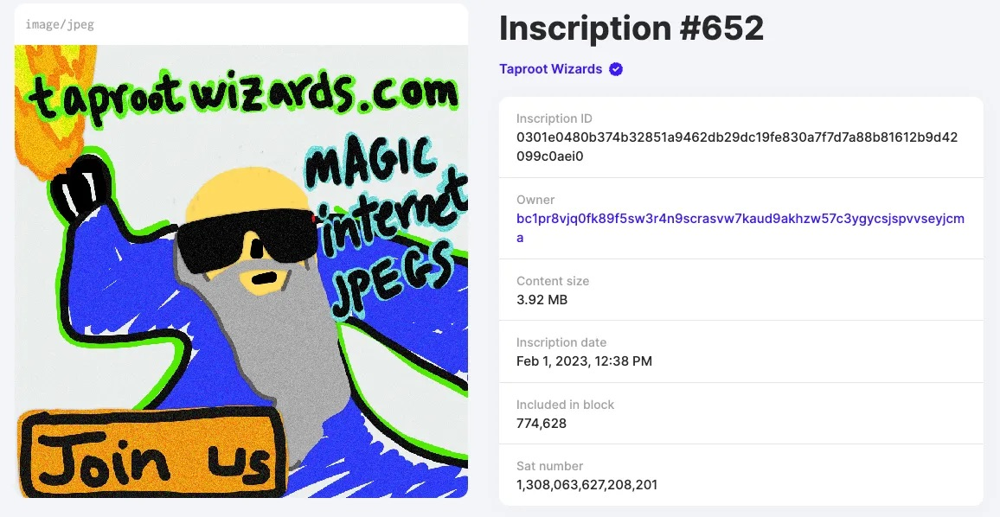
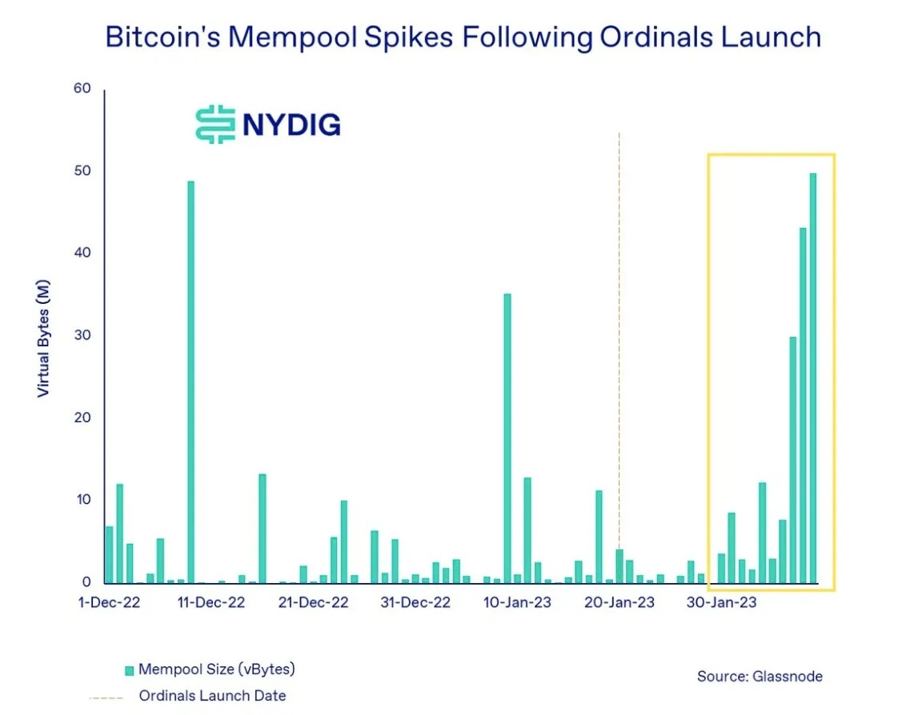
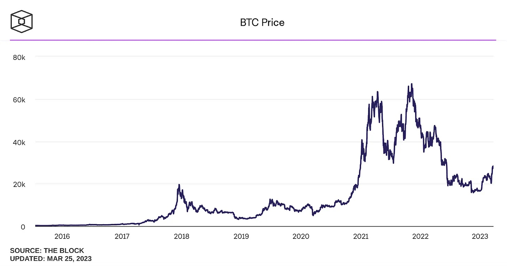
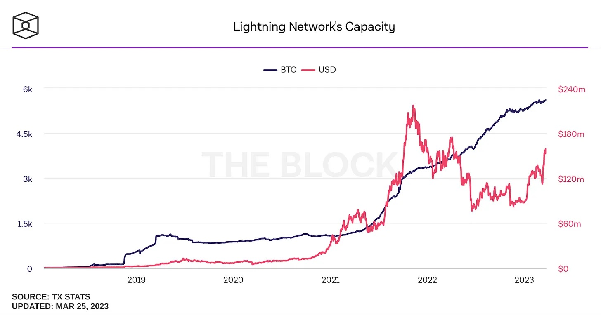
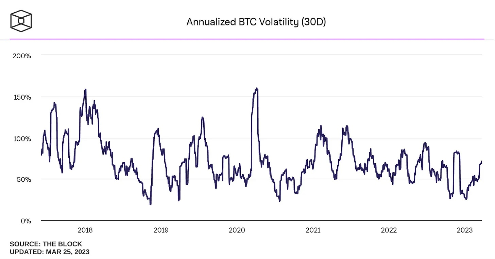
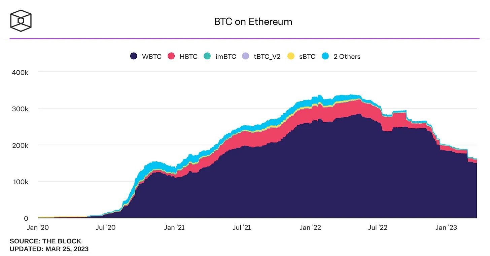
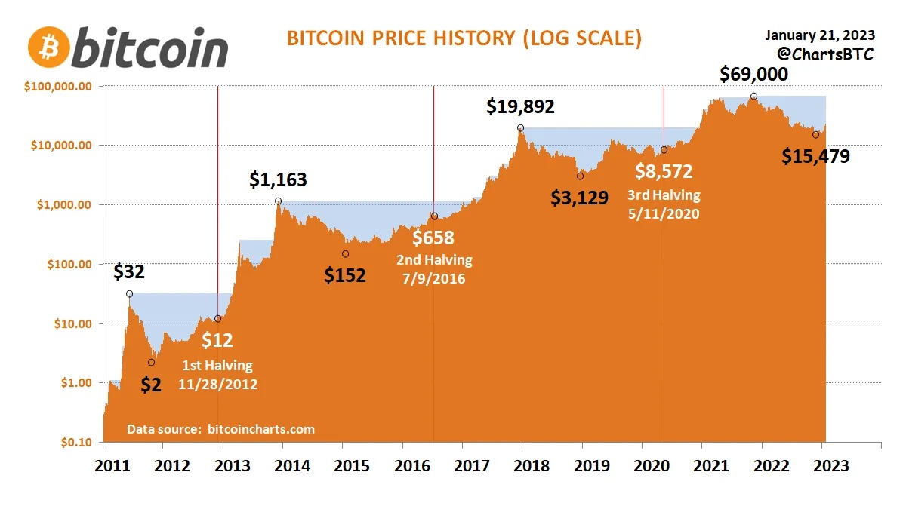
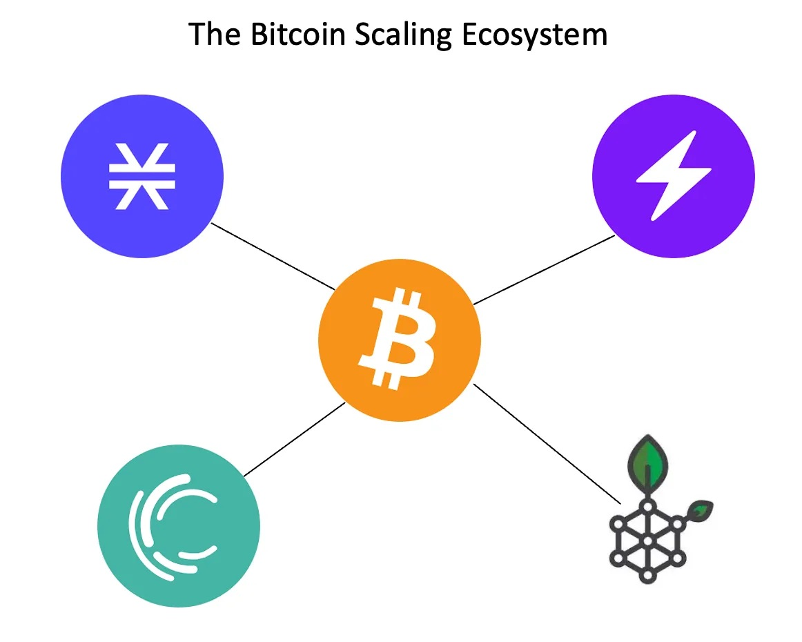

# 比特币正在迎来超越「价值存储」的变化拐点 | Thought for Today

> Ordinals 协议催生比特币 NFT 等比特币生态一系列创新，刺激着人们思考比特币是否正在超越其「价值存储」的模因，迎来变化的拐点？今天，M7e 元宇宙特攻队分享 3 月 28 日发表在《斯坦福区块链评论》的本文，以飨读者。

**作者：** Tyler Whittle

Some Ordinary Wizardry: e939d4c27b09645e236493fc8b74fc70c14e5e203116ecbd0bedac2701dd91fci0

## 简介

比特币模因（meme）[1]即将转变。虽然一小撮眼光挑剔的最大主义者想要保护比特币的神圣性，但变革正在不可阻挡地向前推进。来自 Ordinals 的顺风，BTC 的货币性，以及不断下降的区块奖励，正在推动超越**价值存储**的模因，成为比特币的前沿。

然而，这种模因性的转变不是凭空发生。它需要新的技术，而比特币即将发现自己迫切需要一个扩容解决方案。与以太坊不同，比特币最初的设计不是为了扩容。正因为如此，比特币上现有的扩容解决方案要么不够用，要么无法采用。

我相信在未来的 12-24 个月内，会出现一个扩容解决方案，它将俘获比特币社区的心智。具体来说，我相信这个解决方案将是一个兼容 EVM 的 zk-Rollup。这个架构将利用比特币网络来达成共识和结算，实现从 L2 到 L1 的免信任提款，并允许从以太坊轻松移植代码。这样一来，这个 Rollup 将把比特币和以太坊生态的精华融合在一起，形成一个强大的加密新层。

## 比特币的转折：一个不断变化的模因

比特币目前正在经历一系列的转折，这些转折将推动其模因超越**价值存储**。首先是从**价值存储**到**结算层**的过渡。第二是从**价值存储**到**货币**的过渡。最后一个拐点，区块奖励减半，需要提高比特币的交易费用，以使网络得以生存 —— 这就需要一个超越**价值存储**的模因。

### 价值存储到结算层：Ordinals 和 NFT 热潮

如果你在币圈，肯定在过去两个月里发现了一个小巫师[2]在颂扬神奇的互联网货币的价值。Udi[3] 和 The Taproot Wizards[4] 作为名为 Ordinals[5] 的比特币 NFT 协议的拥护者突然出现在舞台上。这并不是第一次在比特币上推出 NFT —— 早在 2012 年，染色币[6]就已经风靡一时了。但这次感觉有些不同……

早在 2017 年，Segwit（隔离见证）[7] 分叉通过将区块空间扩容到 4MB，打开了潘多拉魔盒。然后在 2021 年，Taproot 分叉允许单个交易的见证数据是任意大小的，只要它适合在一个 4MB 的区块内。结合起来，比特币的这些变化使得 Ordinals 协议和像 Taproot Wizards 这样的完全在链上的 NFT 得以出现[8]。事实证明，Ordinals 可能只是比特币未来意识形态战争中传遍世界的一枪。

_图 1：第一个刻在 Ordinals 上的 Taproot Wizard - 请注意 3.92MB 的大小!_

一边是响亮而骄傲的「正统」比特币最大主义者。这一阵营[9]认为，比特币的神圣性正被一帮胡子拉碴的 Taproot Wizards 所侵犯。他们认为，比特币区块空间应该只用于在一个用户和另一个用户之间转移比特币。比特币白皮书是他们唯一的福音书，任何违背中本聪言论的人都必须被逐出教会。看到一个巫师的模因占据了整个区块[10]，他们的激光眼就会陷入狂热的状态。

_模因 1: 想象「最大主义者」和「加密进化者」之间的战斗是如何进行的_

在另一边，有我所说的加密进化者（Crypto Degen）。这一阵营已经走到了以太坊上的智能合约、NFT 和 DeFi 协议的应许之地。他们发现，事实上，拥有一只在游艇俱乐部里很无聊的猿猴，可以说是非常酷。在 Taproot Wizards 的启发下，其中一些用户甚至将他们价值很高的猿猴[11]转移到了比特币网络上。Ordinals 运动目前没有放缓的迹象。你现在可以在币圈进入相当于霍格沃茨[12]的学校（在这里看到一些魔法！！[13]）。像 BRC-20[14] 这样的新创新每天都在社区中涌现。普遍的看法似乎是，如果比特币是最安全和去中心化的区块链，那么它的用户为什么不应该分享其他链所享有的禁果呢？

有一件事是肯定的，Ordinals 在我们看到的比特币区块空间需求图上出现了第一个小点[15]。但更重要的是，如果有对更多功能的潜在需求，如 NFT，那么比特币将不再只是价值存储。它将开始看起来像一个加密原语的结算层 —— 并且是以太坊的直接竞争对手。

_图 2：NYDIG 的分析显示了 Ordinals 推出后区块空间需求飙升_

最终，我认为比特币最大主义者实际上只占比特币用户的少数，而加密进化运动将在明年占据比特币社区。Ordinals 将继续获得动力，它将引发比特币的进一步创新。然而，为了实现**结算层**的全部潜力，更多改变将是必要的。脚本[16]不是图灵完全语言，因此任意的智能合约不可能直接在比特币上实现。为了让这一运动充分发挥其潜力，必须出现并采用一种提供任意代码执行的扩容解决方案。

### 从价值存储到「采用」货币：BTC 货币的崛起

让我们退一步，谈谈比特币现有的主流模因：**价值存储**。一个价值存储需要什么功能？好吧，它需要允许交易相对容易地进出，它需要一个安全的存储解决方案，而且它需要随着时间的推移保持其价值。例如，当经济衰退时，人们会涌向黄金。黄金是一个很好的价值存储，因为有相对固定的供应，它很容易在市场上获得，而且有值得信赖的第三方为你保管。但最重要的是，社会已经决定**相信**它是一种价值存储。

比特币出色地完成了价值存储所需的所有事情。任何拥有电脑的人都可以获得比特币。只会有 2,100 万个比特币被开采出来。向另一个人发送比特币很容易，而且在许多国家都有比特币和法币之间的兑换。比特币是由 ECDSA 加密算法[17]保证的，该算法被证明是难以破解的。最后，比特币在社会认为它是有价值的方面取得了长足的进步[18]。看看这篇论文[19]，深入分析了为什么比特币在长期内表现出价值存储的特征。

_图 3：过去 5 年中，比特币价值得到了巨大提升，这一点从美元的价格中可以看出_

然而，当我们谈论货币时，价值存储只是一种功能。货币的其他功能[20]是交换媒介和记账单位。货币的这两个功能是紧密相连的[21]。对于比特币来说，要想超越价值存储而发展为货币，我们就必须看到这些方面的变化。

比特币具有许多交易媒介的特征。然而，成为比特币的交易媒介的一大障碍是进行交易所需的价格和时间。截至写作本文时，比特币的平均交易所需的 gas（矿工手续费）为 1.73 美元[22]，结算时间约为 10 分钟。如果你要发送数千美元，这感觉完全合理。然而，如果你想购买 10 美元的东西，17% 的费用和等待 10 分钟完成交易，感觉就很荒谬。

幸运的是，解决方案已经开始出现了。像 Strike[23]和 Cash App[24]这样的公司正在利用闪电网络[25]来推动比特币作为交换媒介的发展。例如，你可以在 Strike 上用比特币支付，你也可以在 Cash App 上轻松地在朋友之间发送比特币。与此同时，Strike 刚刚宣布通过与 Pouch 的合作，比特币现在将被用作美国和菲律宾之间转账的中介货币[26]。随着这样的用例不断增加，比特币将进一步巩固其作为一个可行的交换媒介的地位。

_图 4：闪电网络容量和利用率继续稳步攀升_

至于成长为一个记账单位，这可能需要更多的时间。我的街边店目前还没有列出以聪（译注：比特币最小单位，1 聪等于 1 亿分之一比特币）为单位的糖果，我认为不是很快就会出现。但是在其他国家，我们可以看到朝这个方向发展的一丝迹象。萨尔瓦多就是佳例，在那里比特币已经被政府指定为法定货币。所有企业都被要求接受比特币[27]作为一种支付方式。这推动了它成为一个账户单位，但最终实现这一地位在比特币基本波动性减弱之前将是遥不可及的。账户单位需要有稳定的面额。没有人愿意发现他们一打鸡蛋的价格在一夜之间从 50 聪变成了 500 聪。

_图 5：相对于美元，比特币的波动性仍然很高_

最后，很明显，比特币持有者要求把比特币当作不仅仅是一种价值存储的东西。例如，有大约 16 万个比特币[28]被包裹在以太坊上，价值超过 32 亿美元。这些比特币被用于整个以太坊生态，从在 DeFi 协议中提供流动性到购买 NFT。主要的一点是，持有者正在寻找方法来获得他们的比特币的杠杆作用 —— 本质上是把它当作一个延迟支付的标准[29]（货币的另一个新兴属性！）。然而，这些用户正被迫进入其他生态来实现这一功能。如果比特币有一个繁荣的金融生态，那么这 32 亿美元可能会留在比特币网络上，而不是在跨链桥上冒险。事实上，我怀疑如果比特币提供原生的 DeFi 产品，我们会看到不止 32 亿美元被投入使用。

_图 6：超过 15 万个比特币目前在以太坊上被包装成 wBTC_

我相信阻止比特币实现所有货币功能的障碍将在未来几年内被削弱。交易成本将被削减。智能合约功能将被实现。波动性将下降。虽然波动性必须随着时间的推移和普及（对于以 BTC 计价的事物），但前两个挑战很容易通过比特币的扩容解决方案解决。

## 区块奖励的衰落：收费的必要性

比特币的最后一个拐点是它慢慢走向 0 BTC 区块奖励。现在，每个新挖出的区块有 6.25 BTC 的奖励。在 2024 年中期[30]，这将经历一个「减半」，即 3.125 BTC。每 21 万个区块，这个奖励将继续减半，直到所有 2100 万个比特币都被开采出来。

这并不是一个新的趋势 —— 从比特币网络开始就已经知道了 —— 但它与需要演变为价值存储的模因有关。当展开它的结论时，很明显，比特币面临着一个长期存在的威胁。最终，网络费用必须补偿矿工运行网络的费用，否则矿工的数量将急剧下降。如果这种情况发生，对网络安全将是灾难性的。

现有支付给矿工的 gas 约为每区块 0.1 BTC[31]。如果你看一下 Riot Platform（RIOT）[32]或 Cipher Mining（CIFR）[33]的 1 万个区块，你会发现其盈亏平衡率大约是区块奖励是每区块 6.25 BTC 时比特币价格在 1.35 万美元左右。当区块奖励减半时，该盈亏平衡价格将基本翻倍，达到 2.7 万美元。在过去，每次比特币减半，价格都会大幅跳升 —— 大概是由于供应量减少而需求保持不变。然而，这种趋势不可能永远持续下去。

_图 7：这个使用对数尺度的 BTC 历史价格图显示了过去减半之后的价格跳跃_

在某些时候，交易费将不得不成为区块奖励的绝大部分份额。这些费用必须足以支付挖矿成本，否则比特币网络将无法运行。下一次减半将在 2024 年到来，而比特币的价格大约在 2.4 万美元左右，如果翻倍的趋势继续下去，将会很有趣。

不管是这次减半还是未来减半，有一点是明确的 —— 比特币必须想办法提高交易费，才能生存下去。幸运的是，这个公式非常简单：更多的交易量意味着更高的交易费用。价值存储的模因将不足以创造一个平衡，让矿工得到足够补偿以继续运行网络 —— 当某些东西被当作纯粹的价值存储时，人们越是囤积它，市场上的流动性就越少。因此，我希望矿工社区能够全力以赴地支持比特币的变革，使其超越价值存储，成为推动更大交易量的东西。

## 缺少的环节：第 2 层

让我们快速回顾一下我们刚刚讨论的关于比特币演变的模因。

- 要使模因成为**结算层** —— 需要更大的功能，超过比特币本身的可能性
- 为了让模因变成**货币** - 需要更快、更便宜的执行层
- 在区块奖励归零的情况下，矿工要想保持盈利 —— 模因必须比价值存储更重要

现在我们来问问，为什么 L1 区块链会需要一个额外的层。幸运的是，这并不复杂。它归结为两个简单的原因：

(1) 成本 - 用户执行交易的潜在需求很大，但由于区块空间的成本很高，这种需求仍然受到压制。
(2) 可扩容性 - 由于设计限制，L1 无法提供用户所要求的功能。

我相信我们在比特币中遇到了原因之二。从 Ordinals 的兴起到锁定在 wBTC 中的数十亿美元，可以清楚地看到，在比特币社区中，对 NFT 和 DeFi 等加密原语有强烈的潜在需求。上述拐点的汇聚将把这种愿望推到比特币社区的最前沿。

那么，一个成功的比特币扩容解决方案将是什么样子的呢？从根本上说，我相信它需要解决成本和可扩容性这两个问题。既然如此，比特币的扩容解决方案[34]（L2、侧链、连接 L1）已经存在 —— 其中许多已经存在多年。两个最引人注目的项目是 Lightning 和 Stacks。

_图 8：比特币扩容的四个主要参与者是 Stacks, Lightning, Liquid, 和 RSK_

Lightning 解决了高交易成本的问题。它是建立在比特币之上的 L2，允许用户在闪电网络上打开资助的支付渠道，并在彼此之间进行交易。在完成他们所有的交易后，每一方所持有的比特币的最终价值最终会在比特币网络上结算。这使得交易费用大大降低。虽然即将进行的升级[35]将允许一些有趣的新支付选项，但 Lightning 不允许任意的智能合约。这意味着，虽然 Lightning 令人钦佩地解决了降低交易成本的挑战，但它不允许在网络上建立诸如 NFT 或 DeFi 协议的结构。

Stacks[36]是 TVL（总锁仓价值）在比特币上最大的扩容方案，旨在解决成本和功能两个问题。该架构实际上是一个 L1，通过一个独特的共识机制，即转移证明（PoX）[37]，继承了比特币的（部分）安全属性。Stacks 也有自己的语言，叫做 Clarity[38]，可以读取比特币全局状态的变化，并允许编写任意的智能合约。然而，我相信 Stacks 的安全模型和独立的语言要求继续阻碍任何真正普及的机会。

尽管这是两个最大的比特币扩容解决方案，Stacks 只有 4.15 亿美元的 TVL，Lightning 有 1.33 亿美元[39]BTC 桥接。这只占比特币总市值的 0.12%（回顾一下，wBTC 在以太坊生态中锁定了约 32 亿美元）。与以太坊的 Arbitrum 和 Optimism 相比，以太坊的 ETH 桥接量[40]是总流通量的约 2.5%（约 50 亿美元）[41]。此外，以太坊上的 L2 正在看到显著的活动。Arbitrum 最近在每日交易量方面超过了以太坊[42]。当以太坊看到一个充满活力和快速增长的 L2 生态时，比特币似乎远远落在后面。然而，我相信这即将改变……

## 比特币扩容的制胜法宝

虽然有一些倾向在推动比特币扩容解决方案，但我不认为目前任何解决方案是令人满意的。如果你只是想廉价地来回交易，Lighting 是很好的，但它缺乏超越交易规模的功能。Stacks 是它自己的 L1，有一个新的共识机制，将其数据的哈希值发回给比特币 —— 它实际上并没有利用 BTC。Liquid 和 RSK 是侧链，因此依赖于他们自己的安全[43]。比特币目前可扩展性场景非常像 2017 年以太坊的可扩展性场景，当时侧链和 Plasma 桥是热门话题。这里的问题是，这否定了在加密货币中最安全的网络上运行所带来的大部分好处。

我相信，在比特币成功扩容解决方案将表现出以下特性：

1. 继承了比特币的 PoW 共识的安全性（通过 Rollup 实现，而不是侧链）
2. 在比特币上提供一个免信任的桥梁和完全的数据可用性（通过 Optimistic Rollup 或 zk-Rollup 实现）
3. 创造编程便利性和可移植性（通过 EVM 兼容性实现）

下面我将深入探讨为什么这些属性都是至关重要的。从长远来看，我相信在比特币上获胜的 L2 将是一个**兼容 EVM 的 zk-Rollup**。

### 利用 PoW 共识

比特币社区的基石是它对工作量证明（PoW）[44]共识机制根深蒂固的信念。我不打算详细讨论工作量证明和其他共识机制之间的差异[45]。相反，我只想强调，比特币的安全性来自于 PoW，这也是比特币铁杆身份的一个重要部分。

鉴于此，我相信任何将被比特币社区大规模采用的扩容解决方案都会利用 PoW 共识。这不是侧链或独立链可以实现的，因为这些解决方案必须开发自己的共识机制。相反，它只能通过 Rollup 来实现。根据定义，Rollup 继承了其父链的共识机制。因此，我认为，扩容比特币的成功解决方案必须是一个完全利用 PoW 共识的 Rollup。

### 免信任的桥和全面的数据可用性

比特币意识形态中的另一个关键因素是拥有自己的硬币。因此，难怪社区在很大程度上认为桥接是危险的 —— 而且是正确的[46]。自 2022 年 1 月以来，已经有超过 13 亿美元被桥接黑客攻击而损失。我认为我们还没有看到比特币 L2 的真正采用，原因之一是缺乏原生的免信任桥接。免信任桥[47]只是由智能合约运行的桥，而不是需要一个受信第三方来保管资产。然而，当免信任桥跨越具有不同安全属性的区块链时，被桥接资产的安全性取决于最弱的链。只有 rollup（而不是侧链或其他 L1）可以实现原生的免信任桥，只依赖比特币的底层安全。

然而，免信任桥只是解决方案的一半。除了免信任桥，L2 还需要有 L1 上的完全数据可用性。完全的数据可用性[48]意味着任何人都可以只用 L1 上的数据来重现 L2 的状态。实际上，这意味着两件事。

首先，任何用户只能通过与 L1 的交互来退出 L2 协议。这允许任何用户（即使在没有合作的 L2）生成其账户的证明，并提取锁定在 Rollup 中的资金。其次，Rollup 可以使用 BTC 作为其原生通证。我相信这一想法会在比特币社区引起强烈的共鸣。

当我们考虑在比特币上创建一个 Optimistic Rollup 或 zk-Rollup 需要什么时，安抚社区就变得很重要了。这些类型的 Rollup 都需要在脚本中引入一个新的操作码[49]。新的操作码意味着比特币的软分叉。比特币的软分叉意味着社区投票。归根结底，这就是为什么任何 L2 Rollup 和随后的桥梁必须与比特币社区产生共鸣；它将需要比特币开发者的全力支持，以使新的操作码被接受。在我看来，zk-Rollup 最符合比特币的精神，因为它强调加密而不是经济安全。

### EVM 兼容性

我认为最后一个组件将在成功的比特币 L2 中发挥关键作用，那就是执行环境的选择。到目前为止，还没有一种单一的智能合约语言来统一比特币的扩容生态。脚本是比特币的原生语言，但它的功能有很大的限制。Clarity[50] 是由 Stacks 团队创建的，但仍然未被广泛采用。比特币之外目前占统治地位的有两种：Solidity 和 Rust。

我相信，带有 zkEVM 运行时的 zk-Rollup 将是比特币扩容解决方案的圣杯。zkEVM 运行时很重要，因为以太坊生态目前拥有绝大部分的开发者。一个能够为开发者提供选择，将他们的代码直接从以太坊移植到比特币的比特币 L2，意味着让开发者（以及随后的用户）上手时的摩擦最小。在币圈，社区和产品一样重要，zkEVM 运行时将在加入开发者社区时带来巨大的竞争优势。社区也有飞轮，我希望这些网络效应能迅速推动这样的一个 Rollup，远远领先于其竞争对手。

## 比特币的未来

最后，我想强调一下迄今为止在比特币上实现 zk-Rollup 的进展。Trey Del Bonis 早在 2022 年初就发表了一篇长文[51]，详细介绍了如何在比特币上建立一个 zk-Rollup。John Light [52] 花了 4 个月的时间作为 zk-Rollup 研究员 [53] 对比特币 zk-Rollup 的技术挑战、好处和风险进行深入研究 [54]。比特币社区有传言[55]，要引入一个操作码来验证 SNARKs/STARKs。而像 Alpen Labs[56]这样的初创公司也开始出现，以应对这一巨大的挑战。

我相信本文讨论的拐点将改变比特币的模因。由此产生的变化将创造出对扩容解决方案的大量需求。当这些闸门被打开时，我希望 zk-Rollup 能成为成功开创比特币新时代的解决方案。

**关于作者**

Tyler 是 Floodgate 的投资者和社区向导，他是 Outliers & Reactor 的创造者。在加入 Floodgate 之前，他在斯坦福大学完成了创业和组织方面的博士学位。Tyler 拥有即加密货币将彻底改变互联网和货币本身的坚定信念。他迄今经历的亮点包括建立 DAO 大师，孵化像 Modulus Labs 这样的公司，以及看着 Outliers 成为加密生态中的领导者。

**参考资料**

[1] 许多读者非常熟悉互联网模因，但模因的概念早于互联网！https://en.wikipedia.org/wiki/Meme

[2] https://knowyourmeme.com/memes/magic-internet-money-bitcoin-wizard

[3] https://twitter.com/udiWertheimer

[4] https://www.taprootwizards.com/

[5] https://docs.ordinals.com/

[6] https://cryptoadventure.com/a-brief-history-of-colored-coins-what-made-them-special/

[7] https://github.com/bitcoin/bips/blob/master/bip-0141.mediawiki

[8] https://www.coindesk.com/tech/2023/02/02/giant-bitcoin-taproot-wizard-nft-minted-in-collaboration-with-luxor-mining-pool/

[9] https://nftevening.com/taproot-wizards-huge-win-enrages-bitcoin-maximalists

[10] https://www.coindesk.com/tech/2023/02/02/giant-bitcoin-taproot-wizard-nft-minted-in-collaboration-with-luxor-mining-pool/

[11] https://decrypt.co/121298/bored-ape-owner-burns-169k-nft-ethereum-bitcoin

[12] https://school.taprootwizards.com/

[13] Taproot Wizards Twitter

[14] https://decrypt.co/123123/people-are-minting-brc-20-meme-coins-on-bitcoin-via-ordinals

[15] https://viewemail.nydig.com/ordinals-and-the-case-of-the-missing-fees

[16] https://en.bitcoin.it/wiki/Script

[17] https://en.wikipedia.org/wiki/Elliptic_Curve_Digital_Signature_Algorithm

[18] https://www.reuters.com/business/finance/goldman-sachs-says-bitcoin-will-compete-with-gold-store-value-2022-01-05/

[19] https://link.springer.com/article/10.1007/s00181-020-01990-5

[20] https://www.projectfinance.com/functions-characteristics-of-money/

[21] https://www.cgm.pitt.edu/sites/default/files/PPE/S20PPE/1805134.pdf

[22] https://ycharts.com/indicators/bitcoin_average_transaction_fee#:~:text=Bitcoin%20Average%20Transaction%20Fee%20is,0.46%25%20from%20one%20year%20ago.

[23] http://strike.me

[24] https://cash.app/bitcoin

[25] https://lightning.network

[26] http://pouch.ph

[27] https://www.nber.org/digest/202207/el-salvadors-experiment-bitcoin-legal-tender

[28] https://dune.com/eliasimos/btc-on-ethereum_1

[29] https://en.wikipedia.org/wiki/Money#Standard_of_deferred_payment

[30] https://bitcoinblockhalf.com/

[31] https://braiins.com/blog/transaction-fee-luck-for-bitcoin-miners#:~:text=In%20the%20year%202022%2C%20transaction,of%20the%20total%20block%20reward.

[32] https://www.riotplatforms.com/investors/sec-filings/annual-reports

[33] https://investors.ciphermining.com/financial-information/sec-filings

[34] https://www.hiro.so/blog/building-on-bitcoin-project-comparison

[35] https://bitcoinmagazine.com/technical/bolt12-lnurl-and-bitcoin-lightning

[36] https://www.stacks.co/

[37] https://www.hiro.so/blog/securing-web3-apps-through-bitcoin-an-overview-of-stacks-consensus-mechanism

[38] https://clarity-lang.org/

[39] https://defillama.com/protocol/lightning-network?denomination=BTC

[40] https://dune.com/gm365/L2

[41] https://messari.io/asset/ethereum/metrics/supply

[42] https://www.coindesk.com/tech/2023/02/15/arbitrum-surges-ahead-as-ethereums-layer-2-landscape-takes-shape/

[43] https://www.web3.university/article/sidechains-vs-layer2s

[44] https://en.wikipedia.org/wiki/Proof_of_work

[45] https://river.com/learn/proof-of-work-pow-vs-pos-proof-of-stake/#:~:text=Proof%2Dof%2DStake%20is%20presented,than%20Proof%2Dof%2DWork.

[46] https://de.fi/rekt-database

[47] https://cointelegraph.com/news/defi-security-how-trustless-bridges-can-help-protect-users

[48] https://medium.com/blockchain-capital-blog/wtf-is-data-availability-80c2c95ded0f

[49] https://wiki.bitcoinsv.io/index.php/Opcodes_used_in_Bitcoin_Script

[50] https://www.hiro.so/blog/web3-programming-languages-clarity-vs-solidity#:~:text=Syntax%20Overview,similarities%20to%20LISP%2Dlike%20languages.

[51] https://tr3y.io/articles/crypto/bitcoin-zk-Rollups.html

[52] https://twitter.com/lightcoin

[53] https://hrf.org/zkrollups

[54] https://bitcoinrollups.org/

[55] https://lists.linuxfoundation.org/pipermail/bitcoin-dev/2022-November/021153.html

[56] https://alpenlabs.io/
