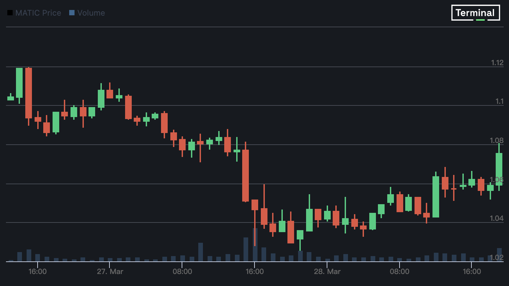

# Polygon 的零知识 Rollup 主网上线 | 关注以太坊上海升级

> 这是 4 天内第 2 个 zkEVM 发布

**作者：** Aleksandar Gilbert

Polygon 发布了用零知识技术构建的第 2 层区块链，成为 4 天内第 2 家向公众发布所谓 **zkEVM** 的公司。

Polygon zkEVM 仍处于测试阶段，该公司强调应谨慎使用 —— 根据联合创始人 Mihailo Bjelic 的说法，这一事实将在未来几个月内改变。

他坚持认为，尽管如此，它的发布标志着以太坊扩容的一个转折点。

「如果我们能保持以太坊的安全性，实现可扩展性，并且不牺牲开发者和用户体验 —— 这基本上就是我们所需要的了，不是吗？」Polygon 联合创始人 Mihailo Bjelic 在 Polygon zkEVM 发布前接受 The Defiant 采访时说，「而据我所知，zkEVM 是唯一能同时提供这三样东西的解决方案。」

据 The Defiant Terminal 数据显示，Polygon 的 MATIC 通证在过去 24 小时内下跌了约 2%。

_MATIC 价格，来源：The Defiant Terminal_

## zkEVM

用零知识（zk）技术构建的第 2 层区块链[被称为](https://twitter.com/MihailoBjelic/status/1549737068850454529?s=20)让以太坊更便宜、性能更强的「圣杯」。上周五，Matter Labs 发布了 ZkSync Era，标志着由该技术保障的以太坊兼容的 Rollup 首次公开发布。

据 L2BEAT [数据](https://l2beat.com/scaling/tvl)显示， Matter Labs、Polygon 和其他公司已经争先恐后地将它们的 Rollup 推向市场，并冲进由 Optimistic Rollup Arbitrum 和 Optimism 主导的 L2 领域，它们总共占 Rollup 上沉淀的加密资产的 88%。

## 扩容以太坊

以太坊速度很慢，最简单的交易通常会产生 1 美元以上的费用。据 DappRadar 数据显示，当网络拥堵时，这种费用会激增 —— 去年 5 月，在「无聊猿猴游艇俱乐部」创建者 Yuga Labs 的 NFT 销售中，用户的平均交易费用为 474 美元。

第 2 层区块链，也被称为 Rollup，在将用户交易追加到以太坊区块链之前，对其进行批处理和压缩。这样做大大降低了每笔交易的成本，增加了以太坊可以处理的交易数量。

Rollup 被认为是以太坊扩容最有前途的技术。因此，构建这些技术的公司已经被估值数十亿美元。但是，该领域一直被使用所谓的乐观技术（Optimistic Technology）的 Rollup 所主导，该技术假设提交的交易是有效的，并提供了七天的挑战期，在此期间，人们可以对潜在的欺诈性交易提出异议。这意味着在使用官方桥梁时，提款需要一个星期。

## ZK 技术

零知识技术使得证明一个声明是否为真成为可能 —— 比如说约翰·史密斯是个百万富翁 —— 而不需要透露任何通常需要的信息 —— 在这个例子中就是史密斯的银行账户或就业历史。

许多增强隐私的协议都利用了零知识技术，但首批进入市场的与以太坊兼容的 zk-Rollup 不会保护用户隐私或混淆他们的交易历史。

zk-Rollup 的支持者长期以来一直认为，它们将比其「乐观」的竞争对手更安全，同时提供即时的交易最终结果 —— 不需要 7 天的争议窗口。

Bjelic 说，「不可能在零知识 Rollup 上执行恶意交易。你只需要依靠数学。」

但它们复杂得可怕，而且建立一个与以太坊虚拟机 —— zkEVM 中的 EVM —— 兼容的虚拟机已被证明很困难。

「熟悉这一领域的人一直在估计，当我们在一年多以前开始的时候，大概需要 3 到 5 年的时间来建造一个 zkEVM，」Bjelic 说，「"这确实是一个令人兴奋的旅程。在此期间，我们能够从工程和密码学方面实现几个重要的突破。」

Polygon zkEVM 自去年 10 月以来一直供开发者测试。3 月 27 日周一的发布标志着它上线了以太坊的主网。

在测试网络上，开发人员正在玩弄「测试以太币、测试 MATIC 通证，不管怎样，那里没有真正的价值，」Bjelic 说。「当你在主网上时，你在桥接实际的资产。这是真正的东西。」

## 正在进行的工作

测试版是开发者对「正在进行的工作」的简称。Bjelic 说，「一些长期运行的区块链仍处于正式的测试阶段，包括 Solana 和 Polygon 的原始的 PoS 权益证明侧链。尽管如此，用户在 Polygon zkEVM 的前几个月应该谨慎行事。

『这是一项以前从未建立过的尖端技术。」他说，「我们将继续对它进行内部和外部审计。我们有漏洞赏金等。这是一个网络成熟的过程，如果不是一年，也需要几个月的时间。」

ZkSync Era 周五以内测版本发布，这是测试版之前的软件开发阶段。

## Rollup 竞赛

过去几个月中，推出第一个兼容以太坊的零知识 Rollup 的竞争一直充满争议，竞争团队在社交媒体上互相狙击。去年，一位从事竞对 zkEVM 的开发者说，Polygon 的零知识 Rollup 不符合被称为 zkEVM 的标准。

Bjelic 将「推特争吵」归因于交付第一个真正的 zkEVM 所带来的声望，并对这些批评一笑置之。

「我认为它总是，很显然得归结到事实层面上来，」他说，「以太坊创始人 Vitalik Buterin 在谈到 zkEVM 的概念时，帮助引入了一些清晰度，什么是，什么不是……Polygon 非常明显是一个 zkEVM，我认为这不是一个问题。」

Polygon 以其长期运行的区块链 Polygon Proof-of-Stake 最为著名。Polygon PoS 很受欢迎 —— 据 [Defi Llama](https://defillama.com/chains) 数据显示，凭借其速度和低费用，它已经发展成为按锁定总价值衡量的第 5 大区块链。

虽然与以太坊兼容，但它是一个完全独立的区块链，不会将其交易数据附加到以太坊。去年，Bjelic 说 Polygon 正在努力将 Polygon PoS 变成一个**真正**的 L2，从以太坊继承其安全性。

## Polygon PoS 的未来

这就提出了一个问题：在建立了以太坊扩容的「圣杯」，即真正的 Rollup，这让 Polygon PoS 留在哪里？

「我认为两者肯定都有空间，」Bjelic 说。由于 Rollup 提交交易到以太坊，它们在吞吐量和压低交易费用的程度上有固有的限制。

「Polygon PoS 链的费用仍然很低，而且可以比任何 Rollup 吞吐量更高，包括 zkEVM Rollup，」他说。一些应用，如 DeFi 借贷平台，处理相对较少的高价值交易，不需要 PoS 的速度，但可以从 zkEVM 的安全性中受益。另一方面，区块链游戏可能需要快速和廉价的交易，而 PoS 更适合提供这种服务。

Bjelic 说，他很高兴在一些人认为是加密市场最黑暗的时期发布 zkEVM，资产价值仍然远远低于历史高点，美国的监管审查在加剧，让一些企业家希望转移到国外。

「我想说的是，现在的气氛普遍有点消极，我们现在比以往任何时候都更需要一些刺激。」他说，「而我认为 zkEVM 确实是能够重新点燃这一兴趣的技术。在某种程度上，它可以成为加密领域的 ChatGPT。」
