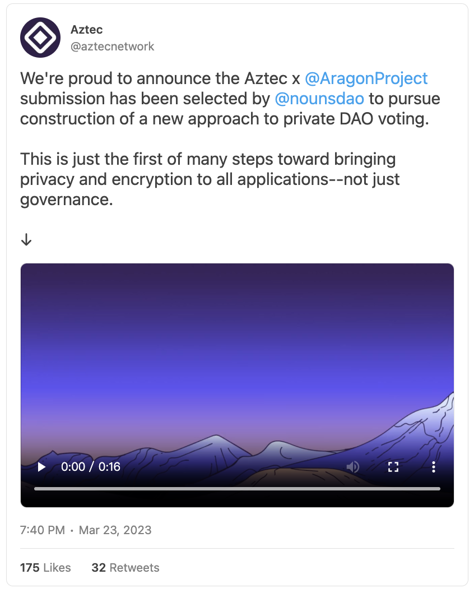
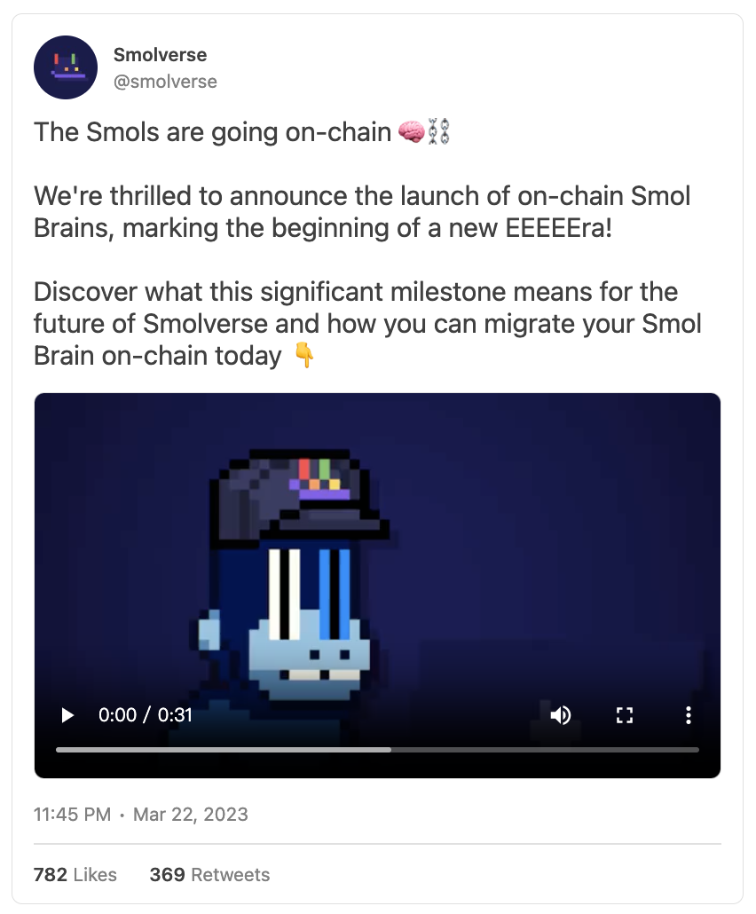
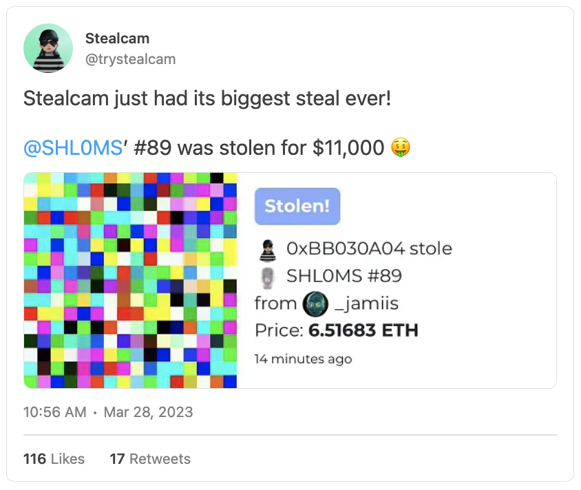

# NFT 第 1 季度收冷，仍有 20 个亮点值得盘点 | Thought for Today

> 尽管 2023 年第一季度结束时，全球 NFT 市场冷至冰点，但在刚刚过去的三个月中还是发生了很多创新创意、挑战和颠覆。Bankless 提炼出了 20 个亮点，供大家回顾。

## Jack Butcher 的 Checks 和 Opepens

创意机构 Visualize Value 的创始人 [Jack Butcher](https://twitter.com/jackbutcher) 自这些年开始在 NFT 生态中崭露头角，这要归功于他的 [Checks VV](https://opensea.io/collection/vv-checks) 项目，该项目可以说是迄今为止开放版（OE）铸造最成功的例子。

受 Elon Musk 收购 Twitter 和推出 Twitter Blue 订阅的启发，Butcher 创造了一个由 80 个多色「勾标」组成的网格，对验证和真实性进行评论。在 24 小时内，有 16,031 个 NFT 被铸造，此后，该项目采用了一种燃烧机制来创造不同的检查标记组合，又称 [Originals](https://opensea.io/collection/vv-checks-originals)。

Butcher 正在进行的实验和保持透明的方法已迅速在该项目周围获得了一个强大的社区，在这个过程中激发了数百个衍生品。除了 Checks，Butcher 单独的 OE 系列 [Opepens](https://opensea.io/collection/opepen-edition) 自 1 月以来也引起了很大的兴趣，并已演变成一个实验性的、不断发展的个人头像（PFP）项目。

## BLUR 空投

NFT 市场聚合器 Blur 通过空投推出其[备受期待的 $BLUR 通证](https://metaversal.banklesshq.com/p/blur-day)，加入了其他重要的 NFT 生态空投行列，如 $RARE、$ENS 和 $LOOKS。原生通证的推出旨在去中心化 Blur 的治理，它的到来和[正在进行的竞价和上架激励措施](https://twitter.com/blur_io/status/1640783834223456320)帮助这一新贵瓜分了 OpenSea 等对手的市场份额，并巩固了市场地位。

## Meme 卡的扩张

由 [6529 Collections](https://twitter.com/6529Collections) 牵头，The Memes 是一个由不同艺术家创作的艺术版本的[集合](https://opensea.io/collection/thememes6529)，专注于传播去中心化的信息。这些 ERC-1155 NFT 是在以太坊区块链上铸造的，版本数量通常在 300 到 1000 个之间。这些公域的收藏品在 1 月流行爆发，当时几乎达到 8 万个 ETH 的市值。从那时起，[ReMemes](https://seize.io/rememes)，社区驱动的 The Memes 衍生品，以及 [Meme Lab](https://seize.io/meme-lab)，Memes 艺术家的实验性 CC0 合约，进一步拓宽了项目的视野。

## Braindrops 热潮

作为事实上的「AI 艺术的 Art Block」，[Braindrops](https://braindrops.cloud/) 是一个致力于促进 AI 艺术家的 NFT 发布平台。该平台通常有 500 到 1000 件的收藏品，每件初始价格为 0.1 ETH，以「抽奖」铸造，这意味着收藏者从一个给定的系列中获得随机和独特的单版作品。迄今为止，由于近几个月来人们对 AI 艺术的兴趣大增，通过该平台发布的多个系列已经看到了大量的一级和二级市场活动。

## Sewer Pass、Dookey Dash 和 HV-MTL

Yuga Labs 发布了 Sewer Pass（下水道通行证）NFT，BAYC、MAYC 和 BAKC 持有人可免费申领。这些通行证可以参加一个以无聊猿猴为主题的游戏 Dookey Dash 比赛，得分越多就越有机会获得更稀有的 NFT。比赛结束后，通行证按分数分级，《堡垒之夜》职业选手 Mongraal 接受了 1000 ETH 的[竞标](https://twitter.com/Mongraal/status/1630306715768877058)，获得了顶级的 Sewer Pass，引起了轰动。这张通行证和其他得分的通行证随后被兑换成 HV-MTL（发音为「重金属」）NFT。这些 30000 个机械游戏头像将具有动态特征，并与 Yuga 的 Otherside 故事有关，因为它们是「来自裂缝的机器」。

## 大型收藏品进入跨链

1 月，Lil Pudgys —— 可爱的 Pudgy Penguins 扩展系列 —— 开始[跨链](https://media.pudgypenguins.com/post/lilpudgys-crosschain)。在与 LayerZero（一种全能链互操作性协议）的合作中，Lil Pudgys 现在可以在多链之间无缝穿梭，包括 Polygon、BNB 链和 Arbitrum 开始。这项合作的目的是扩大 Lil Pudgy Penguins 生态周围的可及性，并减少 gas 费用。

在其他大的 NFT 桥接新闻中，最近，15000 个强大的 y00ts 集合本周启动了从 Solana 到 Polygon 的迁移。DeLabs 是 y00ts 和 DeGods 背后的创业公司（它本身正在从 Solana 迁移到 Ethereum），从 Polygon 获得了 300 万美元的 grant，以促进这一迁移。本文写作时，超过 11500 个 y00ts 已经被桥接到新链上了。

## 流动性委托

delegate.cash 团队推出了 [Liquid Delegates（LD）](https://0xfoobar.substack.com/p/liquid-delegates) 这一新原语，允许用户以免信任和安全的方式把他们的 NFT 委托权出租出去。LD 实现了一系列用例，如交易空投申领权、活动票务等，要创建一个 LDs，你所要做的就是通过 delegate.cash 将 NFT 存入一个托管智能合约中。此外，新的[原生市场](https://delegate.cash/marketplace/collections)提供了一个可以轻松买卖 LD 的平台。

## Ordinals 狂热

最近，随着 Ordinals 的[推出](https://metaversal.banklesshq.com/p/bitcoin-nfts-again)，比特币生态正经历着巨大的活动激增，Ordinals 是一个将单个「聪」（最小的 BTC 面额）转换为不可伪造的数字文物的系统。尽管面临一些强硬派比特币人士的批评，Ordinals 被赞誉为比特币 NFT 场景的革命，他们的铸造和收藏活动一直在推动比特币矿工的交易费收入。与以太坊 NFT 相比，Ordinals 「铭文」的铸造成本要低得多，而且他们越来越受欢迎，这表明无论我们中最教条的比特币玩家是否喜欢，它们都会在加密经济中存在。

## OpenSea 零收费

头部 NFT 市场 OpenSea 暂时将其市场费用[降至 0%](https://twitter.com/opensea/status/1626682043655507969)，以应对来自受欢迎的低费用平台 Blur 的竞争。OpenSea 还为没有执行链上版税的收藏品设定了可选的创作者版税，起价为 0.5%，并调整了其封锁名单，允许在具有类似政策的 NFT 市场上销售，包括 Blur。今年早些时候，在 $BLUR 空投和相关激励活动后，两个平台之间的竞争加剧，这帮助 NFT 市场聚合器 Blur 赢得了主要市场份额。

## 蓬皮杜中心的收购

蓬皮杜中心是位于巴黎的一个世界知名的多学科文化机构，拥有大量的现当代艺术品收藏。今年 2 月，该博物馆搞了头条新闻：宣布从 13 位知名艺术家那里[收购](https://www.theartnewspaper.com/2023/02/14/pariss-centre-pompidou-breaks-new-ground-by-acquiring-18-nfts)了 18 枚 NFT，其中包括 [Jonas Lund](https://twitter.com/jonas_lund/status/1624038027810029568)、[Agnieskza Kurant](https://twitter.com/miminguyenmimi/status/1628076747005603847) 和 [Sarah Meyohas](https://sarahmeyohas.com/cloud-of-petals/) 等艺术家的作品。当时，蓬皮杜博物馆馆长 Xavier Rey 强调，博物馆支持艺术家探索新的表达方式，他认为这正是现代艺术的基础。

## Meta 放弃 NFT

Meta 决定在 Instagram 和 Facebook 上[停止](https://thedefiant.io/how-top-stablecoins-depegged-after-the-second-largest-us-bank-failure/)对 NFT 的支持，在推出数字收藏品功能还不到一年的时间。这一消息是由 Meta 商务和金融技术主管 Stephane Kasriel 宣布的，他在推特上[分享](https://twitter.com/skasriel/status/1635386565487898624)了该公司的资源将被分配给其他产品。在 NFT 生态中，这一决策广泛受嘲为缺乏远见，但无论如何，此举是 Meta 更广泛的重组努力的一部分，特别是最近几个月涉及其裁减数千名员工。

## Doodles「不再是 NFT 项目」

这是在 NFT 世界里听到的调侃。在 Discord 发布的帖子中，Doodles 联合创始人 Jordan 「poopie」 Castro 为他的团队决定在幕后开发新功能和产品辩护，声称 Doodles 已经[超越了「NFT 项目」的定位](https://decrypt.co/123782/doodles-no-longer-nft-project-speculators)，专注于成为一个顶级的媒体品牌。Castro 的言论得到了不同的反应，一些人赞扬了这种雄心壮志，另一些人则将其解释为对 Web3 价值观的否定。无论你对此事的看法如何，这段插曲强调了当代基于 NFT 的品牌所面临的主要张力。

## Reddit 的 NFT 市场

Reddit 首席执行官 Steve Huffman [最近证实](https://twitter.com/JackDaniel8008/status/1638475655003209732)，基于 Polygon 受欢迎的 Reddit 头像项目的下一阶段一部分是引入一个专门的 Reddit 头像市场，用户将能够随时创建、出售和交易头像。虽然仍在开发中，但鉴于 Reddit 头像目前的受欢迎程度，市场预计将在推出后看到大量的活动，Reddit 头像已经由 700 多万持有人收集了 1060 万个 NFT，目前的市值约为 1.23 亿美元。

## 私密 Nouns 投票

Nouns DAO 选择了拟议中的 Aragon x Aztec 合作，开发其即将到来的私密 DAO 投票系统。Aragon 和 Aztec 将一起使用零知识（ZK）技术创建这个尖端的投票解决方案，目的是提供一个一步到位的投票过程，最大限度地减少链下依赖。开发将包括三个阶段：以链上私密投票为特色的最小可行性产品（MVP）；批量投票和启用第三方 gas 支付的整合延迟中继者服务；以及部署用于投票后安全解密的延时服务。这一先进的资源旨在通过优先考虑公平、隐私和用户友好性来改善 NounsDAO 的投票体验。

## Smols 上链

Smolverse 通过增加对链上的支持，为 Smols NFT 引入了一些增强功能。链上的 Smols 也将拥有可消费的「IQ」，允许持有者使用 IQ 点数在 Smolverse 中购买物品，并根据 IQ 的增减进行头部尺寸调整。此外，动态特征现在让持有者能够为他们的链上 Smols 获得新的服装和衣柜物品。为了迁移，持有者必须燃烧掉他们现有的 NFT，以便在新的链上合约上获得一个相同的通证 ID。

## Immutable zkEVM

Immutable 宣布与 Polygon 合作开发 [Immutable zkEVM](https://metaversal.banklesshq.com/p/immutable-zkevm)，为 NFT 游戏提供新的 L2 扩展解决方案。这个与以太坊虚拟机（EVM）兼容的 ZK Rollup，由 Polygon 的 zkEVM 技术驱动，将为 Web3 游戏开发进行优化，为游戏玩家提供优秀的用户体验，为开发者提供卓越的灵活性，让游戏能够轻松从以太坊或其他 EVM 网络迁移，而无需修改代码。这种合作关系有可能将 Immutable zkEVM 定位为加密经济中领先的游戏 L2，将看到 Immutable 的 $IMX 原生通证分阶段升级，成为新的 L2 的 gas 通证及更多。

## Stealcam 取得了早期进展

最近在一些 NFT 圈子里有什么话题？[Stealcam](https://www.stealcam.com/)。这个新颖的社交应用几周前在 Arbitrum 上推出了测试版，它使用户能够：1）「偷偷揭示」属于他人的隐藏的 NFT；2）毫不费力地铸造自己隐藏的 NFT 供他人「窃取」。当这些 NFT（在 Stealcam 上被称为「记忆」）被盗时，它们的价格会增加 0.001 ETH 和之前价格的 10%，从而形成一种[「偷到即赚」](https://twitter.com/redphonecrypto/status/1639717735180509185)的机制。前任拥有者因此得到了他们最初支付的补偿，而剩余的金额则在前任（45%）、创作者（45%）和协议（10%）之间分配。如果你在 Arbitrum 上寻找新东西，Stealcam 是一个有趣的全新应用，可以进行实验。

## Nakamigos

由 HiFo Labs 开发，[新的 Nakamigos NFT 项目](https://nftnow.com/guides/uncovering-nakamigos-the-origins-rumors-and-what-we-know-so-far/)在 3 月 23 日公开发行的 4 天交易量明显超过了无聊猿猴游艇俱乐部有史以来的交易量。这个 20,000 份 PFP 系列具有 24x24 像素的字符，类似于 CryptoPunks，并授予其持有人商业权利。虽然这个项目的艺术家仍然保持匿名，但许多猜测已经将 Nakamigos 与 2021 年 mfers 系列背后的加密艺术家 Sartoshi 联系起来。综上所述，Nakamigos 的未来并不确定，因为 HiFo Labs 仍然保持神秘。

## Sound Swap

音乐平台 Sound 刚刚推出了 [Sound Swap](https://metaversal.banklesshq.com/p/sound-swap)，这是一个独特的受 DeFi 启发的粘合曲线基础设施，旨在帮助音乐家达到更广泛的观众，优化收入，并确保他们的 NFT 发售的流动性。Sound Swap 实现了音乐 NFT 的一键收集和销售，允许收藏者在一级发售结束后仍能铸造 NFT，并促进以当前市场价格的即时销售。这种方法有可能在未来激发各种类型收藏品的类似模式。

## 二级市场

Art Blocks，流行的生成艺术平台，刚刚推出了[自有二级市场](https://decrypt.co/124848/art-blocks-nft-marketplace-enforced-creator-royalties)，允许收藏者直接在项目网站上浏览和交易 NFT。与其他以太坊 NFT 市场不同，Art Blocks 不对二级交易收取平台费，并完全尊重艺术家指定的版税设置。
