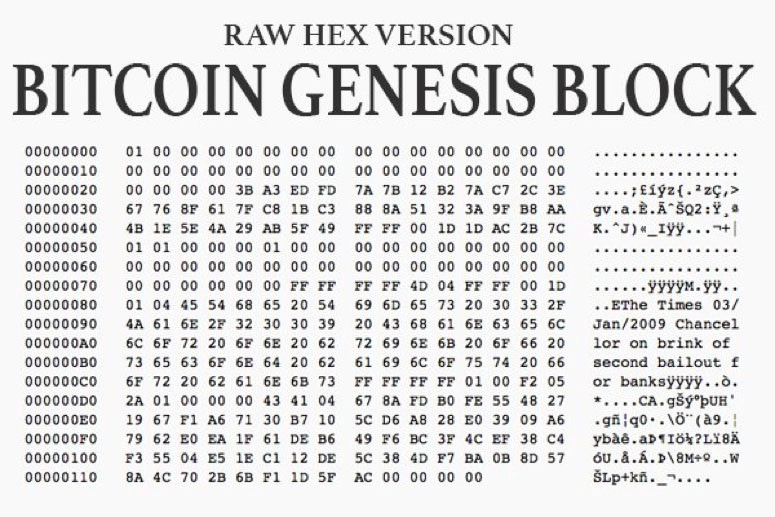
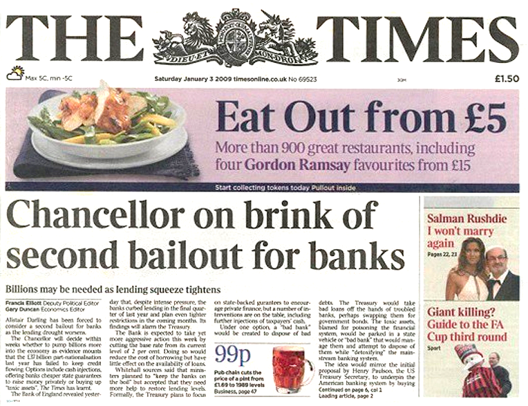
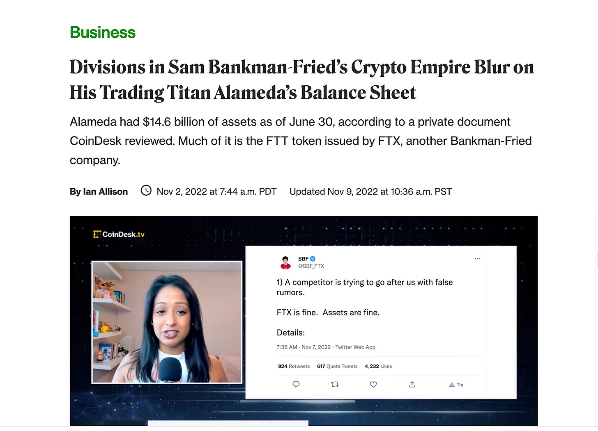
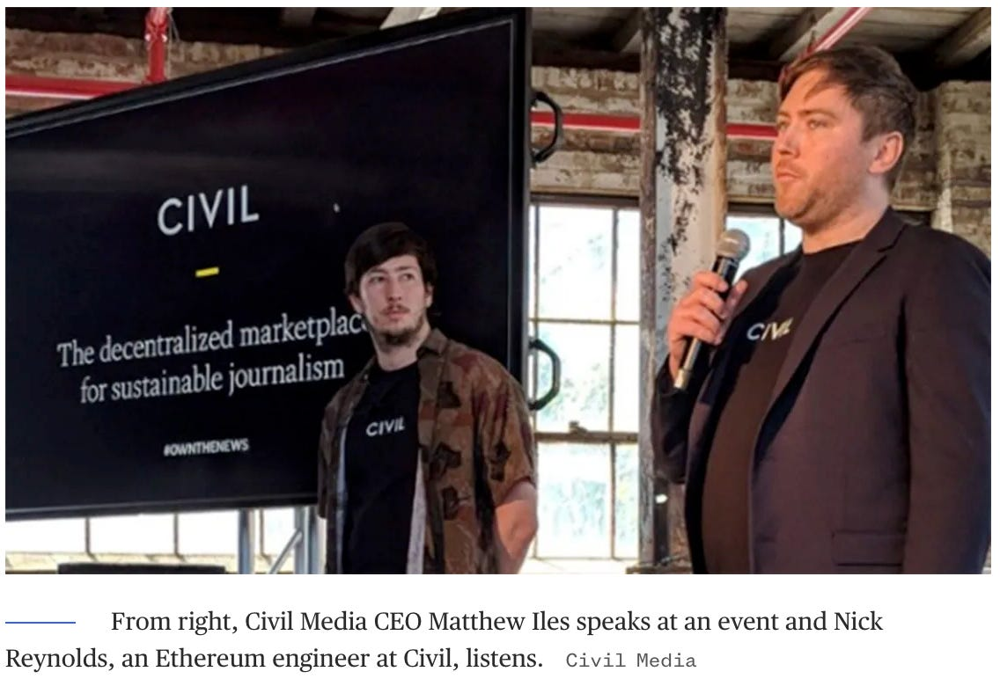
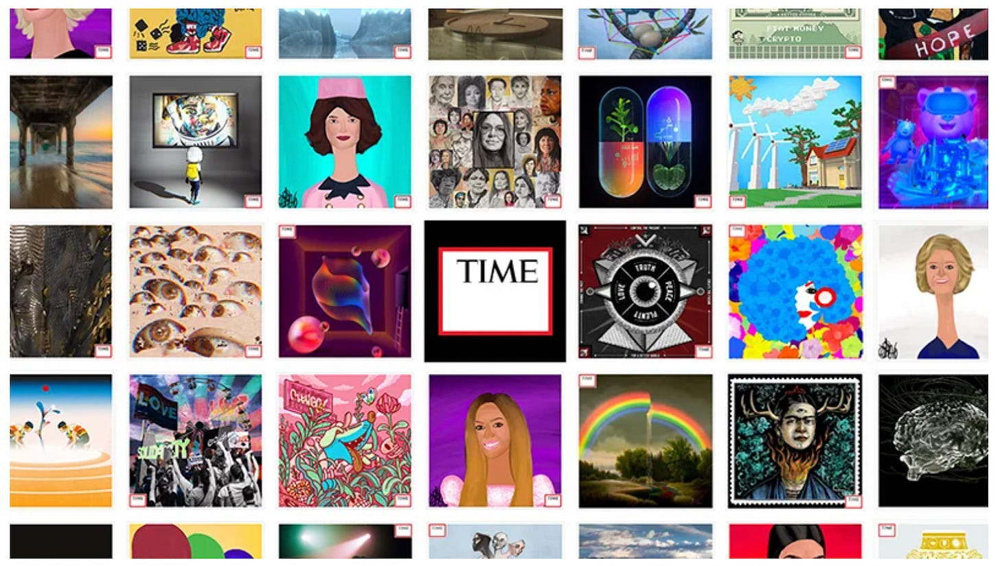
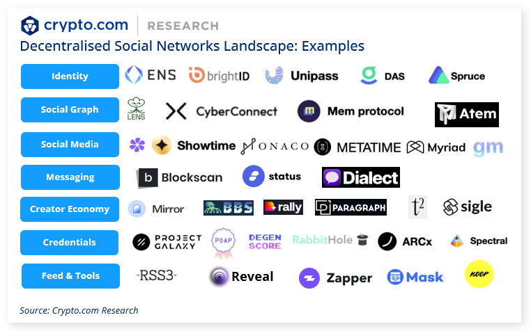
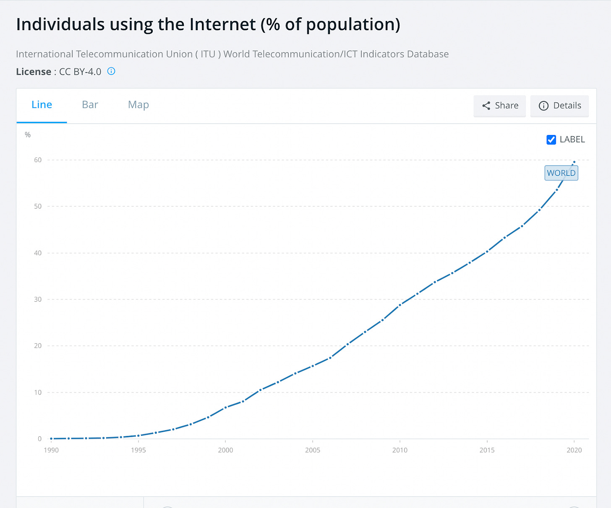
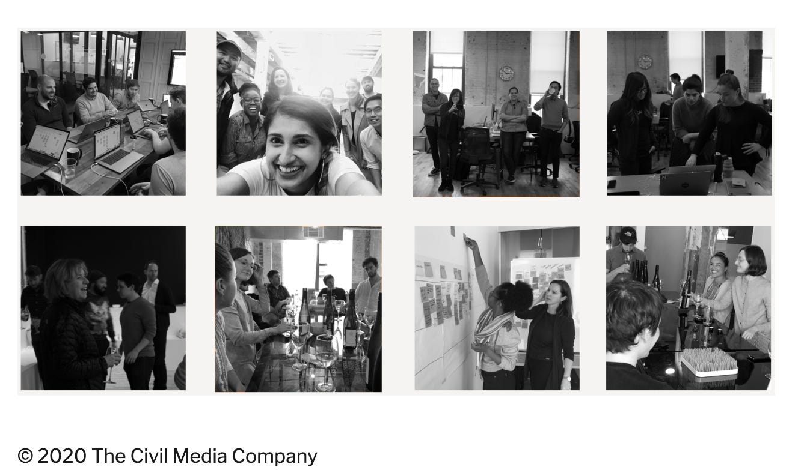

# 去中心化媒体：区块链技术和第四阶层的未来 | Thought for Today

> 时至今日，互联网已经彻底颠覆了传统媒体，而诞生发展才十多年的区块链技术、Web3 理念模式将为媒体行业带来怎样的机遇、挑战和创新？今天，M7e元宇宙特攻队分享4月4日发表在《斯坦福区块链评论》的本文，以飨读者。

**作者：** Wendy Ye

## 简介

虽然比特币的主要功能是作为一种金融工具，但它与媒体行业的联系从一开始就很明显。比特币区块链的第一个区块，即创世区块，不仅记录了交易细节，还包括了《泰晤士报》的一条新闻。经过十多年的发展，区块链技术和加密货币已经得到普及，并在金融以外的多个领域引发了创新，包括媒体行业。

区块链技术具有去中心化和透明的特性，有可能通过实现新的商业模式、提高透明度和信任度，以及为内容创作者创造新的收入来源来改变媒体格局。然而，尽管有这种巨大的潜力，区块链技术和加密货币在媒体行业的广泛采用仍然面临一些挑战。最近的调查显示，只有一小部分美国人对加密货币持积极态度，许多人提到了对波动性、安全性和监管的担忧。此外，商业和金融界的知名人士，如查理·芒格，已经**呼吁禁止加密货币**[1]，进一步增加了人们对这种新兴技术的不确定性和风险的看法。

也就是说，第四阶层和 Web3 的交叉点继续见证着不停歇的创新。本文旨在探讨区块链技术和加密货币在媒体行业的应用历史，然后研究 Web3 在颠覆第四阶层和开创去中心化媒体新时代方面的挑战和机遇。

_比特币创世区块的《泰晤士报》头版_

# 第一部分：加密媒体的简史

### 1. 以加密为中心的新闻媒体（2009-2015 年）

任何创新的出现都会诞生对相关知识和信息的需求。由于主流媒体无法也不愿意报道有关加密货币和区块链技术发展的细节，在比特币诞生后不久就出现了几个专门的加密媒体机构。其中最引人注目的，如 Bitcoin Magazine（由 Vitalik Buterin 在 2012 年共同创立），以及 Cointelegraph 和 Coindesk（均成立于 2013 年），至今仍是加密媒体的重要支柱。

虽然批评者会认为加密媒体有时会帮助推动围绕加密货币的骗局和泡沫，但加密媒体在以下方面发挥着至关重要的作用：1）在最早期教育和推动区块链技术的采用；2）培训和培养拥有区块链领域知识的记者，这些记者以后在扩大加密货币报道团队时填补传统媒体的职位；3）对欺诈和潜在的系统性后果发出警报。例如，CoinDesk 的一份报告披露了 Alameda Research 的储备，实际上在发现「最大」的加密货币欺诈和 2022 年 FTX 的崩溃中发挥了重要作用。

_来自 CoinDesk 的第一份报道披露了 FTX 的账户余额问题_

除了新闻媒体，链上数据分析和市场情报提供商也在这段时间开始浮出水面，最引人注目的是分别于 2013 年和 2014 年成立的 CoinMarketCap 和 Chainalysis。这些信息提供商的存在一定程度上提高了市场的透明度，并帮助记者开展调查。

在这个阶段，区块链在媒体行业的创新和应用非常有限。这主要是由于区块链技术最初是由比特币的创建而普及的，比特币主要被设计为一个去中心化的数字货币系统。比特币的原始白皮书，由化名创造者中本聪在 2008 年发表，确实描述了一个系统，其中区块链可以用来对文件和数据进行时间标记，但比特币网络主要是为支付而发明的，中本聪在 2010 年将一个区块的最大尺寸设定为 1 兆字节（MB），以防止区块链变得太大，无法由网络上的单个节点管理（这一区块限制在 2023 年扩展至 4 MB）。因此，尽管矿工可以在区块中附加一些不相关的数据/信息和交易细节，就像中本聪在比特币的第一个区块中所做的那样，但比特币网络上除支付之外的应用几乎是不切实际的。

除此之外，比特币网络只有几个 API（应用程序接口）可用，开发者可以用来与网络互动，这进一步限制了可以在比特币上构建的应用。直到几年后，以太坊在 2015 年推出，人们才开始探索区块链在数据存储和管理方面的全部潜力。

### 2. 智能合约和去中心化内容管理（2015-2020 年）

Vitalik Buterin 在 2015 年创建的以太坊是区块链技术发展中的一个重要里程碑。通过以太坊，Buterin 引入了一个新的区块链架构，允许在数字货币范围之外创建去中心化应用（DApp）。以太坊区块链配备了一种名为 Solidity 的编程语言，让开发者能够创建智能合约 —— 自动执行的数字化协议，自动执行协议的条款。

以太坊区块链上的智能合约的创新激发了媒体行业的许多创新。区块链技术在媒体行业最重要的使用案例之一是在内容管理和分发方面。在智能合约的帮助下，内容创作者可以通过分配许可证和设定使用其内容的条款和条件来保护其知识产权。智能合约还使内容创作者更容易直接从消费者那里获得作品的付款，而不需要出版商或分销商等中介机构。这为内容创作者创造了新的机会，使他们的作品货币化并获得公平的收入份额。

例如，Steemit 成立于 2016 年，是一个利用区块链技术的博客和社交媒体平台。该平台建立在 Steem 区块链上，让用户能够以 STEEM 通证的形式赚取加密货币，以创建和策划内容。用户根据其内容的受欢迎程度和质量，以及其从 Steemit 社区获得的投票和评论获得奖励。当 Steemit 试图开发一个由区块链驱动的、基于通证的推特版本时，出现了许多其他项目，为视频分享创建类似的去中心化平台，目的是颠覆传统的视频分享巨头，如 YouTube。一些值得注意的例子包括 StreamSpace（成立于 2017 年）、Flixxo（成立于 2016 年）、Viuly（成立于 2017 年）和 Viewly（成立于 2017 年，但已不再活跃）。

此外，区块链技术在媒体行业的应用已经超出了内容创建和分发的范围。它还促成了新的商业模式的发展，如去中心化广告网络，为用户的注意力和数据提供奖励。例如，2016 年推出的 Basic Attention Token（BAT）是一个基于区块链的广告平台，旨在通过提供一个更注重隐私和以用户为中心的模式来颠覆传统的数字广告行业。这个平台让广告商能够直接针对用户，并通过使用 BAT 通证来奖励用户的注意力。

此外，区块链技术也被用来解决与假新闻和错误信息有关的问题。其中一个名为 Civil 的平台于 2018 年推出，利用区块链技术创建了一个去中心化的新闻编辑室，允许记者直接发布和货币化他们的工作，同时还通过其社区驱动的验证过程提供透明度和问责制。

_资料来源：NBC 新闻_

这一阶段，区块链和加密领域许多项目都是由于首次通证发行（ICO）而不是传统的风险投资资金而出现的。虽然这允许在市场炒作期间以快速和简单的方式筹集资金并获得用户增长，但当加密货币市场在 2018 年经历崩溃时，它也使这些项目在财务上处于劣势。同样重要的是，虽然这些项目中有许多被推销为「去中心化」，但其中一些项目仍然依赖中心化的服务器，利用通证经济模型，并将通证纯粹作为奖励。这种缺乏真正的去中心化是业内许多人批评的一个点。

在 2017 年至 2018 年的炒作时期，还出现了其他几个创新的想法，这些想法准备将区块链技术更多地应用于各个行业，包括媒体和娱乐行业。这种创新的一个最突出的例子是非同质通证（NFT）。NFT 具有独特的属性，如可验证的真实性、独特的所有权和新收入来源的潜力，使其成为对创作者和收藏者都有吸引力的工具。虽然 NFT 在 2017 年首次与 CryptoKitties（加密猫）和 CryptoPunks（加密朋克）等早期项目一起推出，但直到 2021 年，它们才获得广泛关注，并刺激了媒体行业及其他行业的创新浪潮。

### 3. NFT、DAO 和去中心化社交媒体（2021 年后）

自诞生以来，区块链一直是传统媒体报道的小众话题，直到 2021 年发生了戏剧性的事情。世界各地的知名媒体公司参与了所谓的 NFT 热潮，将各种内容 —— 从著作到视频 —— 作为区块链上的 NFT 出售。老牌媒体公司对 NFT 的这种采用代表了该行业的一个重大转变，并表明了对区块链技术的兴趣和潜力不断增加。

传统媒体对 NFT 的参与受到了一些争议，包括比尔·盖茨在内的一些批评者声称，加密货币和 NFT 完全是基于**「博傻理论」**[2]。然而，NFT 的采用为传统媒体公司带来了新的收入，《时代》杂志在短短 14 个月内通过其旗舰产品 TimePieces NFT 系列从 NFT 销售中获得了**超过 1000 万美元的利润**[3][4]。这些利润在二级市场上仍在增长。

_TIMEPieces NFT_

NFT 不仅为内容创作者提供了一种新的盈利方式，也为他们提供了与粉丝互动的独特机会。因此，越来越多的去中心化平台已经出现，以更好地利用这项新技术，Mirror.xyz 是最引人注目的例子之一。Mirror.xyz 成立于 2020 年，通常被称为加密版的 Medium，是一个去中心化出版平台，让任何人都可以创建、分享和出售他们独特的数字内容，作为 NFT。它允许创作者对他们的内容有更多的控制权，并有能力以新颖的和创新的方式将其货币化。

随着 NFT 的日益普及，我们也看到了与媒体相关的 DAO（去中心化自治组织）的兴起。这些 DAO 利用区块链技术的力量，为媒体公司及其社区创建去中心化的生态系统，重点是透明度、社区参与和共享所有权。通过拥抱 DAO，媒体公司可以为他们的受众提供一种新的参与方式，同时建立更可持续的商业模式，使所有利益相关者受益。

例如，Mad Realities 是一家 DAO 式的初创公司，得到了 Paradigm 和一些名人的支持，包括 Paris Hilton。该公司是一个制作真人秀节目的去中心化工作室，资金来自于 NFT 的销售。而这些 NFT 的所有者对制作有各种治理权，允许他们参与传统上只有业内人士才能参与的决策过程。这种对区块链技术和 NFT 的创新使用代表了媒体行业的重大转变，因为越来越多的公司希望拥抱去中心化的生态系统，并为他们的观众提供更直接的参与机会。

除了 Mad Realities，还出现了其他几个与媒体相关的 DAO，其中 Friends with Benefits（FWB，成立于 2020 年）、Bankless DAO（成立于 2021 年）、Pub DAO（成立于 2021 年）和 Headline DAO（成立于 2023 年）就是一些例子。FWB 是一个基于通证的会员系统，会员可以直接支持他们喜欢的创作者的成功并从中受益。Bankless DAO 是一个社区驱动的去中心化媒体组织，成员贡献技能和专业知识，创造有关区块链和加密货币的教育内容，并参与决策过程和组织的治理。另一方面，Pub DAO 是一个去中心化媒体平台，专注于支持独立记者和内容创作者。该平台使用区块链技术来实现文章和内容的小额支付，允许创作者直接获得工作报酬，而不依赖广告收入或中介机构。而 Headline DAO 是一个去中心化的新闻业「实验」，它使用 NFT 销售来资助独立新闻业，NFT 持有者将有权投票选择他们想资助的记者。

除了 NFT 和 DAO 的崛起，2021 年还见证了对去中心化社交媒体/平台的需求增长，当时唐纳德·特朗普在主要社交媒体平台销号禁声，引发了围绕言论自由和内容控制的激烈争论。此外，人们越来越意识到围绕数据隐私和所有权的问题，以及科技巨头对内容越来越多的控制。这导致人们对去中心化的替代方案的兴趣激增，在那里，用户对他们的数据和内容有更多的控制。当推特在 2022 年被埃隆·马斯克收购后，这一需求继续增长。

去中心化社交媒体通过利用区块链技术创建不受任何单一实体控制的去中心化网络，为传统社交媒体平台提供了一个替代方案。与 2017-2018 年加密热潮期间许多声称是「去中心化社交媒体」的项目不同，较新的项目专注于使用联邦网络建立真正的去中心化网络。

在联邦网络中，用户可以与同一网络中的其他用户交流和分享内容，即使他们使用不同的服务器或节点。这是通过一种名为 ActivityPub 协议来实现的，许多联邦社交网络都使用这个协议来让用户相互连接，而不管他们使用的是什么具体平台。像 Lens 协议、Nostr 和 Farcaster 等协议都旨在提供这样的工具，帮助建立去中心化社交媒体应用。而 Mastodon（长毛象）和 Damus 是两个值得注意的直接面对普通用户的应用案例。

# 第二部分：去中心化媒体的挑战

NFT、DAO 和去中心化社交媒体平台的兴起，显示了区块链技术重塑媒体格局的潜力，为创作者和社区提供了货币化和分发内容的新途径，并促进了更加民主和透明的媒体生态系统。然而，这些创新仍然面临重大挑战：

### 1. 用户采用和可扩展性

媒体行业是在注意力经济的基础上运作的，成功取决于能否获取大量受众的注意力。然而，虽然互联网接入已达到世界人口的 64.4%，但**世界银行数据**[5]显示，截至 2023 年，全球加密货币采用比率仅为 4.2%左右，相当于 90 年代末互联网的采用率。

在美国，数字媒体的采用直到 2020 年才首次超过传统媒体，这要归功于 Covid-19；因此，在媒体行业出现杀手级的 Web3 应用还有很长的路要走，特别是考虑到只有 8% 的美国人对加密货币持有正面态度[6][7]。

通过大众媒体进行公共教育是促进新技术采用的有力方式，但传统媒体品牌在拥抱区块链和 Web3 的一般理念时面临两难境地。虽然他们欢迎创新，但他们也寻求与任何围绕加密货币的潜在骗局或泡沫保持距离，因为加密货币与区块链紧密相连，以保持公众的信任。这在很大程度上解释了为什么大多数成熟的媒体品牌在 2021 年选择将他们的「实验性」NFT 销售收入捐赠给各种基金会。

去中心化社交媒体平台仍处于早期阶段，它们能否获得广泛采用并与占主导地位的中心化平台竞争，还有待观察。可能影响其发展的一个主要因素是区块链网络的整体基础设施发展，因为去中心化社交媒体平台依赖于区块链技术的速度和可扩展性。在这些挑战得到解决之前，去中心化社交媒体可能很难获得与传统社交媒体平台竞争所需的关注和普及。

### 2. 基础设施的限制

基础设施需要时间来建设。建立区块链不再是创新者的主要障碍，但新的区块链如果没有建立在其上的活跃应用，可能很难获得用户增长和生存。因此，大多数创新者选择在现有的和活跃的区块链上构建，如以太坊，尽管它有可扩展性问题。以太坊拥堵会大大降低网络交易和 DApp 互动的用户体验。在高度拥堵的时候，交易费用会急剧上升，让一些用户参与网络的费用昂贵或不现实。在极端情况下，网络拥堵甚至会导致临时关闭或其他中断。

由于这些基础设施的限制，大多数去中心化应用在用户体验方面很难与中心化竞争对手相提并论，使得他们难以竞争。以 Damus 为例，这是一个去中心化社交网络，得到了推特联合创始人杰克·多尔西的支持。目前，用户在该应用上发布图片之前，必须将其上传到第三方服务器，而视频上传在该平台上还无法实现。

### 3. 波动性和不连贯性

加密市场的高度波动性给媒体行业的创新带来了巨大挑战，频繁的繁荣和萧条周期让公司难以管理员工和维持财务稳定。在市场低迷时期，加密媒体面临的挑战更加严重，此时维持业务变得更加困难。

此外，去中心化社交媒体初创企业往往在市场低迷时难以维持用户增长，因为那些在繁荣时期加入炒作的人往往并不真正相信去中心化的未来，很快就会放弃。这种市场波动也给初创企业的财务健康和可持续发展带来了重大障碍，并且不幸地导致了几个有前途的项目被关闭或出售。例如，**Civil 在 2020 年被关闭**[8]， Po.et，一个 2016 年开始的管理数字内容权利和所有权的区块链拼图，也在同年关闭，Steemit 在 2020 年被出售，TrusStory，一个基于区块链的事实检查和验证在线内容的平台，也由于资金困难而在 2020 年关闭，尽管得到区块链社区知名人士的初始投资。

### 4. 拼凑的解决方案和新问题的产生

去中心化应用（DApp）是许多问题的一个有希望的解决方案，但它们也带来了新的挑战和风险，必须仔细考虑。

例如，去中心化社交媒体平台为解决中心化平台在数据隐私、审查和内容审核方面的缺陷提供了一种方法。通过使用区块链技术，这些平台可以赋予用户权力，让他们控制自己的数据和内容。然而，它们也带来了新的挑战，如删除非法内容的难度以及传播错误信息和仇恨言论的可能性。例如，尽管 Damus 为自己是一个「言论自由」的平台而自豪，但该平台上的现有内容大多是劣质广告和色情。

此外，在努力创建一个反审查网络的过程中，去中心化社交媒体平台可能会无意中促成用户群的分裂，因为不同的群体会迁移到与他们观点一致的不同平台。这可能导致「回音室 」的产生，在那里，个人只接触到强化其现有信念的观点，而不是参与富有成效的对话和思想交流。这对医治目前这个已经分裂的社会是不利的。

再比如，DAO 提供了制作和传播媒体内容的替代方式，然而当涉及到严肃的新闻报道时，可能会出现一些不足之处，因为这一特定领域往往需要一般公众所缺乏的专业知识。而分散的决策可能很容易导致生产劣质内容和缺乏问责制。在 DAO 中投票的另一个问题是可能出现买票现象，即拥有大量资金的个人或团体可以利用他们的资源来影响投票结果。在投票权与成员持有的资金量挂钩的 DAO 中，这可能是一个特别的问题。

# 第三部分：去中心化媒体的机会

尽管在媒体行业采用区块链技术面临挑战，但仍有许多创新和增长的机会。这些机会可以归纳为三个主要领域：

### 1. 在媒体行业进一步采用 NFT 和 Web3

包括路透社、彭博社和 CNBC 在内的一些新闻供应商已经扩大了他们的加密报道团队，并提供更多关于区块链和加密货币的教育内容。尽管面临批评，但更多的传统媒体品牌正在采用 NFT 作为货币化和用户参与工具，即使在加密市场低迷时期。

采用 Web3 的情况在媒体行业也越来越普遍。据报道，《泰晤士报》正在加倍推进其 Web3 战略，而根据截至 2022 年底领英上的公开信息，《福布斯》和 NBC Universal 正在寻找负责 Web3 的副总裁。

而 2023 年已经见证了更多媒体公司采用 NFT。今年 2 月，《GQ》推出了其首个 NFT 系列，福克斯娱乐的《蒙面歌王》推出了通证门控的粉丝体验项目。据 CoinDesk 报道，福克斯还计划在今年推出由 NFT 驱动的电视剧 Krapopolis，该剧由《瑞克和莫蒂》的创作者丹·哈蒙参与制作[9] 。

游戏是大众媒体之外的另一个伟大的技术采用渠道，随着区块链基础设施的发展，内置 NFT 和经济模型的原生链上游戏已经吸引了公众越来越多的关注。GameFi 的发展有可能大大影响区块链在媒体行业的大规模应用。随着人们对区块链和 DeFi 应用的兴趣日益浓厚，GameFi 提供了一种新方式来吸引受众并推动采用，特别是在更有可能成为游戏玩家和技术专家的年轻一代中。

### 2. 零知识证明和媒体

零知识证明（ZKP，或简称 ZK）的发展是顶级 VC 大力押注的最有前途的领域之一，在过去的几个月里，几家 ZK 初创公司分别融资数千万美元。

ZPK 是一种加密技术，它让一方能够向另一方证明一个声明是真实的，而不用透露声明本身的真实性以外的任何其他信息。ZKP 具有广泛的潜在应用，特别是在区块链和网络安全领域。例如，在区块链中，ZKP 可以用来证明交易的有效性或数字资产的真实性，而不透露有关各方的任何敏感信息。这可以帮助提高区块链网络的速度和效率，同时维护用户的隐私和安全，很大程度上解决以太坊和其他区块链网络拥堵带来的挑战。这反过来将使所有 DApp 整体受益，包括媒体行业的 Web3 创新。

除了提供可扩展性和隐私保护外，ZKP 还有可能直接应用于媒体行业，特别是在打击虚假信息方面。斯坦福大学的一个研究小组已经证明了 ZKP 在媒体行业中的可行性，特别是在使用区块链驱动的 ZK 技术验证数字图像和视频的真实性。该研究小组的成员 Trisha Datta 和 Dan Boneh 在 Medium 上发表了一篇博客，解释了 ZK 证明如何用于打击虚假信息[10]。通过利用区块链和 ZK 技术的力量，数字图像和视频可以在不透露底层数据的情况下进行认证，这有助于防止深度伪造和其他形式可用于传播虚假信息的操纵媒体的传播。

ZKP 提供了一种验证数据而不披露数据本身的方法，使其成为打击虚假信息的有力工具。通过使用 ZKP 验证数字媒体的真实性，媒体公司可以为用户创造更安全、更可信的平台来消费和与内容互动。此外，ZKP 还可以用来保护用户隐私，防止对个人数据的跟踪和收集。通过保持用户数据的私密性，媒体公司可以为用户创造更安全、更可信的平台，这可以增加用户的信心和参与度。

总的来说，ZKP 在媒体行业有着巨大的潜力，尤其是在打击虚假信息和保护用户隐私方面。随着 ZKP 技术和应用的不断发展，媒体公司如何采用和利用 ZKP 为用户创造更安全、更可信的平台，将是一个有趣的问题。

### 3. 去中心化内容编策系统

随着 Web3 的兴起和媒体格局的去中心化，建立去中心化内容编策系统的重要性已变得越来越明显。虽然主要的 Web2 社交媒体平台赋予了个人创造内容的权力，但他们使用的由黑箱算法驱动的中心化编策系统在透明度和民主访问方面存在局限。

为了建立一个去中心化内容编策系统，有必要解决各种技术和治理方面的挑战。主要的技术挑战之一是确保可扩展性，以容纳大量的用户和内容，同时保持高安全性和透明度标准。还必须解决与决策和问责制有关的治理挑战。

尽管有这些挑战，去中心化内容编策系统在影响媒体行业方面有很大的潜力，特别是在内容发现和分发方面。通过使内容编策系统更加民主和透明，这些系统可以帮助促进一个更加多样化和公平的媒体环境，让所有的声音都有机会被听到。

大多数现有的媒体相关 DAO 自然是作为去中心化子编策系统，一些较新的 DAO 是专门为解决这些问题而创建的，2023 年成立的 KurateDAO 就是一个例子。KurateDAO 特别寻求使用「加密经济游戏来编策世界的信息」，展示了去中心化内容编策系统在媒体行业产生影响的潜力[11]。而我们将期待在未来几年内这一领域出现更多的创新想法。

_来源：KurateDAO_

# 总结

总之，区块链技术为 Web3 媒体行业带来了巨大的机遇。去中心化、不可更改性和安全性是区块链技术的一些关键优势，它可以解决媒体行业长期存在的问题，如错误信息、缺乏透明度和审查制度。然而，全面采用长路漫漫，媒体业将在这一过程中面临各种挑战，包括监管障碍和技术困难。

为了充分实现区块链在媒体行业的潜力，关键是要专注于解决实际问题和财务上可持续的实际解决方案。只有这样做，媒体行业才能走向一个更去中心化和可持续的未来，让信任和透明度成为行业的前沿。

**关于作者**

Wendy Ye 是 NewsBlock 的联合创始人，该项目旨在将每日的加密头条新闻保存为 NFT。作为转型web3 建设者的前记者，她在华尔街、硅谷和新加坡有十年的商业和金融新闻报道经验，拥有传播和新媒体研究的硕士学位。

推特：https://twitter.com/Wendy_W_Ye

**参考资料**

[1] https://www.wsj.com/articles/why-america-should-ban-crypto-regulation-economy-finance-china-england-trading-currency-securities-commodity-gamble-11675287477

[2] https://www.cnbc.com/2022/06/15/bill-gates-says-crypto-and-nfts-are-based-on-greater-fool-theory.html

[3] https://digiday.com/media/one-year-after-embracing-the-blockchain-time-has-earned-more-than-10m-in-profit/

[4] https://time.com/collection/timepieces-nft/

[5] https://data.worldbank.org/indicator/IT.NET.USER.ZS

[6] https://whatsnewinpublishing.com/digital-media-adoption-overtakes-traditional-media-for-the-first-time/

[7] https://www.cnbc.com/2022/12/07/just-8percent-of-americans-have-a-positive-view-of-cryptocurrencies-now-cnbc-survey-finds.html

[8] https://civil.co/

[9] https://www.coindesk.com/web3/2023/02/15/the-masked-singer-launches-token-gated-fan-experience/

[10] https://medium.com/@boneh/using-zk-proofs-to-fight-disinformation-17e7d57fe52f

[11] https://www.coindesk.com/business/2022/03/08/polychain-leads-685m-investment-in-curate-to-earn-project/

亦见：

区块链在新闻业的用途：https://www.lse.ac.uk/media-and-communications/assets/documents/research/Blockchain-POLIS-Report-Jan-2019.pdf

去中心化社交网络概览：https://crypto.com/research/decentralised-social-networks
