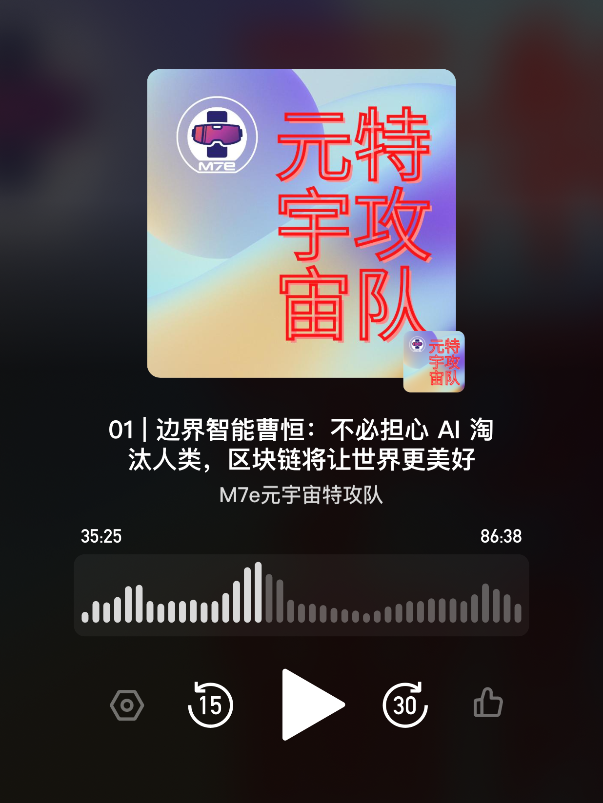

# 边界智能曹恒：不必担心 AI 淘汰人类，区块链将让世界更美好 | M7e Podcast

> M7e 元宇宙特攻队推出播客，首期节目由客座主持掀风视频创始人 Crystal 专访边界智能 & IRISnet 创始人曹恒。

ppqqChatGPT 大火，让大学读书的女儿担心由它引领的 AI 要淘汰人类，而 IBM 研究 16 年人工智能而转投区块链创业 8 年的曹恒相信 Web3 会让世界变得更美好。

边界智能 & IRISnet 创始人曹恒就下列围绕 Web3 建设和创业的问题娓娓道来 ——

（audio）

# 1:52 Web3 创业与数字游民

从去年开始，我跟很多年轻的 Web3 创新团队沟通的感觉是：他们带来很多生机和生气。和我在 2019 年之前合作的一些全球加密圈创业者不一样的是，他们带来了很多专业性。这些创业者一直在思考现有 Web3 产品的缺陷，以及有什么途径能够去改进改造。另外，他们也非常开放，非常愿意学习新东西，学习东西非常之快，所以我挺期待这些 Web3 新鲜血液。

关于数字游民：信息化发展到今天，已经允许我们各自在世界各个地方一起协作，让大家有能力可以用最适合自己的方式来工作。说实话，我有时候挺羡慕的，毕竟像我还有孩子了在读书，肯定不能离开家很久。我觉得，在年轻的时候，比如说大学刚刚毕业，在还没有更多的其他约束，有机会全国全球去跑一跑，用最适合自己的方式去工作，跟人一起协作，是一个很好的新的工作方式。

# 4:56 当年清华的学业压力和今天年轻人面临的挑战

能上清华大学自动化系读书，我一直觉得自己很幸运。我倒没觉得它是最难的专业，因为自动化专业还是有很多是面向工程，我觉得挺好玩的，但比起我崇拜的数学系和物理系，还是要简单一点。关于学业压力和挑战，其实真的感觉还好，因为每个学生，或者我们在工作每个阶段，总是有各种各样的压力。毕竟我现在已经离开学校 20 年了，心里所想到的都是很让人期待珍惜的东西，当时你有机会去学，以最自由最有活力的状态去学习。而且能交到自己一生的朋友，所以我真的感觉大学留给我更多是很美好的回忆。当然，学业上肯定是会有挑战，因为同学好强，自己会觉得这个功课好难，后面我又到美国去读书。感觉很荣幸，好像跟世界上最聪明的一帮孩子混到一块儿去了，但是心里常常会有自卑，也会有很大的压力，老师讲课，你觉得每个英文单词都听得懂，但你真的不知道他在讲啥。不过，这种挑战真的在后面算不了什么。

谈到大学这个话题，我孩子现在都上大学二年级了，我发现现在大学生跟我们当年感觉到的压力或者困惑其实很不一样。就在今天（注：2 月 17 日采访当天）中午，孩子在跟我聊 ChatGPT。她跟我说她怎么让 ChatGPT 来帮她写作业，然后感觉它经常会出错，但是你可以调教训练它，然后它就不断的反馈和进步，觉得很像人。她结论是 ChatGPT 挺可怕，感觉这么下去就是觉得大学生的知识结构和组成可能还不如人工智能，这个世界真的是要完蛋了，人要完蛋了……我就觉得现在年轻人，其实他们面对的挑战和思考，比起我们当年更加深刻，因为当今世界带来更多挑战和压力。

# 9:10 女儿担心 ChatGPT，而母亲却相信区块链

ChatGPT，属于 AIGC，即 Artificial Intelligence Generated Content，人工智能产生的内容。大家一直认为，AI 和区块链是推动我们整个社会变革的两大重要驱动力：AI 在大大加强生产力，然后区块链是在改变生产关系。今天中午我正好在跟孩子聊 AI，她当时说，哎，这个世界太可怕了，人类要完蛋了。未来 AI 掌握的知识比我们大多数人的知识可能都更多更全面，整个世界将来变成的是两类人：控制机器的人、被机器控制的人。而且她会认为，很可怕的是控制机器的人，其实不是科学家、算法工程师，而是资本家 —— 因为掌握了最大的算力，今天 ChatGPT 后面整个算力基础其实真的是军备竞赛，需要投入巨大的财力算力去堆积，所以她当时就很悲观，说要期望资本家有善心去促进社会向善向好发展是不可能的，AI 可能会对人类社会造成颠覆，促进了更多不公平的发展。我跟她聊到说，其实仔细去看一看，在现阶段，区块链行业里发展的很多事情，就是通过区块链这个可信基础去促进就是更多个体能够以一种更加公平、更加和谐的方式能工作在一起。

去看一下创造 ChatGPT 的 OpenAI 架构，跟区块链领域 DAO 的组织模式已经很像了，因为它设置的这个机构机制就是如何让参与者能够被更好的激励，而且最后的控制权其实不是真正被微软这样的巨头所控制，它并不是一个股权制结构来控制。当我们用这个 DAO 的组织，其实区块链就是最好的支撑。甚至在一个具体的案例，其实 ChatGPT 已经对于版权、内容和创作者已经造成了很多冲击，而真正要解决这个问题，也得靠区块链。包括从最原创的人最有创造性的工作开始，它们是给机器训练的原料，那么只有区块链能够很好的把这个原始训练的材料中能够很好的进行确权。后续当这个机器在产生一些效果。新的东西的时候在进行商业化，它高效地能够进行利益分配，这个事情也得靠区块链来做，所以，区块链跟 AIGC 非常相关。所以，未来的世界，我觉得要变得更好，变得更加公平、更加高效，这里一定是需要区块链更好的去支持，更加分布式的治理去支撑。这样一个更加开放、更加公平的协作，只有区块链能做得到，这也是区块链能够支撑将来，不管是机器产生的东西，更多人产生的东西，大家能够和谐工作在一起的一个基础。

然后，我孩子当时就回了一句说，现在看来加密圈的人是一帮非常自大的 —— 一帮不切实际的理想主义者。回想过来，我觉得这些年轻人，大家可能更多的是一个共同学习，共同在不断推进。我觉得可以分享的是：我们还是应该可以相信这个世界会变得更加好。我们也见到了人类在过去历史阶段有很多，简直面临崩溃 —— 一战、二战，种种很坏的事情，但是我们还是相信人类社会有自我修复的能力。那么，现在我们看到，包括刚才谈的 AI 对于人类的一些威胁，我们相信，包括区块链、人工智能的从业者，大家都还是在努力，在不断推进，让技术更多造福普惠到更多的人，而不是把它变成少数人用来控制世界的一个手段。所以我觉得还是对整个世界抱有一个很乐观的期待。

# 17:13 在 IBM 工作 16 年的收获

IBM 给我最重要的经历是专业性的培养，这个专业性也包括对于未知的敬畏。同时非常专注于创造价值，或者说我们做的每件事可能会思考它的价值是什么？会很专注在于价值要落地，就是你希望你做的每一件事情，每一个工作，它究竟是帮了你，你的客户，还是你的合作伙伴？

IBM 的经历对我创业有很大的帮助。其实，我今天这个创业的过程不仅仅是我一个人，而是我们有非常优秀的团队。我很自豪我们的创业团队能够在全球区块链领域有自己独有的贡献，这跟我们过往这些专业经历是很有关系的。我是在 IBM 研究院，也是当年是全球最好的工业界的研究院工作了很长的时间，我们另外一位创始人在全球最顶级的对冲基金、全球最大的商品期货交易所工作过。我们经常会把我们做的叫作企业计算 Enterprise Computing，这和我们当年的经历相关。我们每天在考虑的都是最为复杂的商业系统，都是在连接最为复杂的商业流程，在区块链、在加密技术圈，有很多人的创新角度可能更多的是底层协议的开发，但我们可能还会带来了更多的角度，就是区块链技术如果要真正去服务于现实世界，那么它怎么能工作？对它的需求是什么？我觉得过去 IBM 的经历，让我们有这样的能力去挖掘这样的需求，然后找出来可执行的路径。所以我们团队所做的很多工作，现在全球也得到大家的认可，这也是跟我们这些经历是离不开的。

# 21:45 接触区块链并创业

我在创业之前一直都在做研究，这对我有一个很重要的要求，就是你的好奇心，Curiosity。我是在 2014 年在关注区块链技术，那时以太坊还刚刚才开始。在那时，我就关注到花旗行 Citibank 当时就拿比特币网络的代码研究改写，开始做全球跨境结算的一个验证性系统，当时非常有启发，因为虽然比特币网络 2010 年初很早就关注了，但是没有想好它对于商业有什么价值。但是花旗银行 2014 年这样一个跨境结算的验证系统，能够大大加快效率，能够即时结算，而不是要经过至少一天的周期，当时开始认真的在想这个技术能够怎么用。

到了 2016 年就出来创办边界智能。在这里，我也非常感谢我们天使投资方万向区块链股份有限公司，包括肖风总。我一直把肖总看作是我们的一个导师，因为他对这个行业非常具有前瞻性。其实也是万向区块链实验室当时请到 Vitalik 组织以太坊的实验。教大家这个以太坊是怎么工作的，所以当时首先对于技术有了更深的认知，然后发现其实进入以太坊这样一个阶段，区块链的可编程性。让我们去支撑真正的现实世界的商业系统，感觉又近了一步；其次，我当时在 IBM 研究院也工作 16 年了，然后感觉也挺渴望的自己想去做一些事情，就是自己去定义，然后自己去驱动，我们管它叫 define and drive；第三，我原来在创业之前其实一直做的是人工智能方向，因为我的训练背景就是人工智能。而当时人工智能大规模要落地，看到最大一个问题真的就是算法，以及最后它的使用，怎样大规模协作，提供数据的保护，隐私的保护，权益的分配，区块链当时让我们看到有这样的希望去支撑这样一个大规模的协作。所以在这三个点上面，我当时就决定出来创业。

# 26:33 女性创业者的挑战

说实话，我觉得工作当中第一目标都是专业，大家往往会忘掉性别。如果你要问我有什么特别困难的时候，确实我觉得女性的情感会比较丰富，最困难的时候确实也遇到，就是你难免会有压力，会有困难的时候，那么我想什么时候把眼泪给憋回去，那个时候是有一点点的困难，当然随着不断的经历和成长，然后那种包容性，也会变得越来越容易。

在 IBM 研究院的时候，我们有专门的组织「科技女性」（WIT，Women in Technologies），希望去推动更多女性承担技术方面的工作。我自身体验，从生理的构造来看，确实女性和男性不一样，但是技术本身需要的逻辑分析能力、创新能力，我不觉得女性和男性有任何的差别，没有任何的差别。但是为什么女性最后专注在这个领域上会比较少呢？可能是从最早就是先入为主的偏见，大家自然而然可能从幼儿园开始起，就会认为说女孩子不会擅长数学机械工程，更加有逻辑理性的思考方式，更擅长于感性的表达，唱歌跳舞，更擅长文艺文学。然后让很多女性很早也会对自己有所暗示，其实我觉得就是从身体结构来说，真的没有任何不一样。所以当时我们会经常到周边的小学、幼儿园去给小女生们演示小机器人，让他们会感觉它不是冷冰冰的技术，是可以很有趣的，而且就是在这样的一个前提下，我们感觉就说这里面可能还有更多确实是一个教育，还有一个社会认知，我觉得大家很需要，对于女性从很小就让她们会知道她们有很多的选择，我们女孩子自己就是从小要学会打破这样一个禁箍。我觉得这个不仅是对女孩子，对男孩子都是一样，包括对男孩子也一样，就是男孩子就是不应该是被别人告诉你说男孩子不能干什么事情，而是应该是你自己可以开放的去探索。

# 35:57 边界智能在 Web3 中的角色

我们要构建的全球互联互通的可信互联网，是需要区块链来支撑。边界智能的定义角色，三句话：首先，我们在干什么？我们在构建全球互联互通的下一代分布式商业商业网络（可能现在拿 Web3 来对照就是最好的一个对照）；其次，我们的目标是希望成为全球受尊重的创新者。第三，我们希望是给这个行业带来深远价值，

其实早先是我们在说下一代分布式商业互联网，现在我觉得用 Web3.0 其实是给了一个蛮好的解释。Web 1.0 第一代互联网，是像门户网站雅虎，搜索引擎 Google，主要是一个信息单方面的输入，然后我们也管它叫做信息经济 Information Economy。然后到了第二代，更多是一个交互的互联网了，比如微博、推特、抖音，里面每一个用户其实参与内容创作，不是单纯的只读了，所以我们说它是可读写的互联网，Web 2.0 的经济模式就是平台经济 Platform Economy，平台具有最大的垄断能力，它确实在早期提高效率、经济的发展做了很多推动，但是现在也进入了瓶颈期。这个瓶颈就是真正的创作，因为每个用户的贡献没有最为高效的获得回报和激励，所以，这也就是大家所期待的下一代更加公平的互联网。变成了不再是仅简单可读写的，而变成是个可拥有的、共创共建的互联网，所以这是 Web 3.0。那 Web 3.0 就是用英文来讲，大家管它叫 Token Economy，这 Token 其实就是面对的就是数字资产，它当然就是我们创造的有价值的东西，比如说我在抖音上的一个视频，别人看了会觉得有价值有营养，那它就是一个数字资产，我们希望就是这个能够通过区块链技术，让每一个有价值的数字资产能够得到最好的确权，而当这个数字资产在被使用 —— 这个数字资产很广义的，会指有价值的信息和内容。它在被使用的过程中产生了经济价值，那每一个人包括平台，也包括创作者，应该最为高效、公平、透明的得到激励和奖励，所以这就叫下一代互联网。

我们构建的就是下一代互联网，它能够去支撑，就是让这样的呃商业系统，大家能够有机的合作在一块，而且所有的参与者，首先他们的贡献能够被确权。同时大家所有参与的利益分配能够得到更加高效透明的分配，所以这就是我们现在正在做的。其中包括我们一直在国内推进的开放许可链，也叫开放联盟链 Open Permission Blockchain，实际希望给大家提供一个非常开放的区块链网络底座，能够让很多应用以低成本，但是非常高效的形式，能够部署到这个网络上面，就像大家在用这个互联网，在用它整个网络基础一样，所以在国内，我们在推进的这个开放许可链，代表就是文昌链。然后在全球我们也在推进，就是跨链通讯协议的开发，因为链和链之间它一定是要能够安全可信的进行信息、资产交换的，这一整套协议也是我们团队非常专注的工作。

# 41:41 公链、联盟链和开放许可链

公链和联盟链的技术框架和体系有不太一样的路线，这个起步在 2014 年，也是我最开始关注区块链的时候。当时大家发现区块链技术可能可以做很多事情，所以开始试图要把它用在复杂的商业系统，这个是以 IBM 的 Hyperledger 联盟链为代表，但是当时大家对于区块链究竟能够去支撑的形态会是什么样的理解还比较有局限性，另外因为区块链技术存在不可能三角，就是性能、安全性和开放性，三者不可能面面俱到。当时为了解决这一问题，就会感觉有两个技术不同的分支：一个就是公链体系，第一代比特币网络，第二代以太坊网络，第三代就有很多了，包括 Cosmos 在内，后面就是高性能公链，不管 Solana、Near，还有最近出来的 Aptos，这一系列就是一代一代的公链，它们会更加专注解决的问题是它的开放性，因为开放和去中心化是一体的，然后还有安全性，它想解决这两个维度。因为它搭建的是一个全球开放网络，那么就要去面对最为恶劣、严酷的安全环境，因为黑客就在找漏洞，而且它也是开放，随便什么人都可以接进来，什么人都可以用，所以它专注是这两个维度。联盟链最开始为了解决商业问题，那么商业的计算很重，商业的业务流程需要设计很多的数据，然后它计算量也很大，需要很高的性能。所以联盟链关注更多的是性能，还有安全性，所以就可能就会去丧失掉对开放的追求。所以当时就发现，联盟链的的开放性其实有点像互联网时期的局域网，因为你想把它放在一个比较小范围内的支撑业务协作的环境，然后就我们几家业务体组一条区块链，它的安全就会更容易去解决，也更容易去承担更重要的数据、更重的数据和计算。公链这边完全开放，谁都可以接进来，什么应用都可以往上放，那它更关注的链的开放性和安全性。公链会很看重开放，而且支撑的应用全专注在数字资产，而联盟链更注重性能，为性能会放弃一些，而且会利用比如中心化的一些控制去牺牲一些开放性和牺牲一些直接底层的安全。从 2014 年到现在，整个区块链技术也有很多的进步，所以在解决不可能三角也有了更多可扩展的方案。所以，我们现在在推动的。实际上是把联盟链和公链它的技术做了一定的融合，就是让区块链能够像公链一样的开放。但同时为了支撑商业应用，一定要去满足合规 —— 合规是非常重要复杂的问题，各国的合规体系又不一样。所以我们在做的开放许可链，其实是把公链和联盟链的优点结合在一块，但是它确实想专注的把开放和合规能够去并举，这样才能支撑商业应用。

# 49:08 如何接触 Cosmos 然后成为其核心贡献团队

我们整个团队的背景带有蛮多企业级计算的背景，所以我们想拿区块链解决复杂的分布式商业系统协作问题，但 2014 年那时，我们认为 IBM Hyperledger 跟我们想象的下一代商业系统还是有点儿差距，我觉得下一代商业系统是面向数字资产的，而 Hyperledger 比较偏分布式数据协作。公链技术中，以太坊当时一上手就发现离复杂计算差太远了，当时 Bitshare 的石墨烯技术什么我们当时都来测试过验证过，都不符合要求。2016 年万向举办的区块链黑客松上，Cosmos 创始团队叫做 Tendermint，他们拿了一个创新奖，所以我们当时一看那个 Cosmos 的 Tendermint 共识引擎，发现整个理念跟我们的想法非常契合，非常模块化，非常开放，我们就觉得因为模块化就会允许你我们有些企业级的想法，就可以很容易去构建。当时 Cosmos 创始团队就说你们要不一块来开发吧，所以我们从 2017 年就成为了当时除了创始团队之外的第二个代码贡献团队。所以 Cosmos 基金会在官方博客上给我们写了一篇，宣布边界智能是 Core Contributor to the Cosmos（核心贡献者），我们是跨链生态的皇冠上的一颗珍珠，所以我们感到挺荣幸的。

# 54:17 边界智能 Avata 与区块链在复杂商业世界的应用

边界智能 Avata 是 PasS 服务，即平台即服务，Platform as a Service。它让应用开发者想要开发 Web3 或者下一代分布式应用的一个更加便捷的支撑平台，我们会提供 API 服务、节点服务，也会提供一些更加模块化的智能合约服务。会让分布式商业应用开发者，他们一上来不是面对一个要从头构建的应用栈了，他可以用这个已有模块来快速组建他的商业系统。举例来说非同质化资产 NFT，它的全生命周期的管理，比如它的铸造、转让、销毁，也包括去年我们已经集成的数字版权服务。我们前两天还和一家非常优秀的支付公司汇付天下达成了战略合作。就是能够让分账、支付是是链上可编程的，来实现一个可支付的业务流程。它可以让我们应用开发者，包括内容共创平台，你是原创者，你的后续被别人来用了，那么应该怎么样来分成？平台该分什么？那么现在就直接可以调用链上的智能合约，非常之高效，而且还非常之透明。这也能够去促进公平，因为以前其实平台就算不想作恶，别人还老怀疑你可能数据给我是假的，那现在链上一目了然。但是我们会用 Avata 来进行封装，跟我们合作伙伴一块来做这个事，是因为你如果每个应用要想实现这一套，那你都要去集成它，而且你要去理解这个合规去怎么去支持，而我们会去跟就是专门的支付公司合作 —— 支付公司采用了最为严谨的去满足合规要求的措施，包括对于账户的管理、资金的监管要求，还有它的安全要求，由他们来完成，但是我们能够形成链上链下一个可信互操作，链上的合约跟底下这个支付网络信息是互通的。所以这个给到开发那边就会变成了一个通常的支付接口一样。

区块链的技术挑战从我们踏入这个行业的第一天开始就有，整个行业特别是在做底层技术的，大家都在追求，希望去攻克，也在不断的在优化在推进。这个挑战一直到现在，我觉得也没有让大家感觉到非常的满意。因为我们的目标是希望贴近现实世界的商业系统，能够用得上区块链，所以包括从底层如何更高效、信息交互的安全性、开发者的友好性等挑战。你要降低开发者门槛，还有最终终端的 Web3 用户门槛足够得低，这些我觉得不仅是边界智能，也是行业内很多团队都在不断的努力，也有不少的进步，但直到今天。我觉得大家高兴了吗？其实还是没有达到目标，因为怎么样让开发者能够更加便利，包括 Web2 开发者，Avata 是为这个目的来设计的，但我们并没觉得它完美。前两个月我们跟那个支付公司一块合作上的，我们现在也在不断地推进跟物联网设备底层合约的支持，但我觉得这些都不够，还有包括更好的钱包技术，怎么样能够支持好监管，但同时又能够满足用户去管理自己的资产，而且还要用户体验足够的好，因为不是每个用户都是学 IT 出身的，你要给他搞得太复杂了，他搞不定的。但他搞丢了的话，那对他来说是个巨大的损失。这些挑战一直都在那儿，这是技术挑战。商业挑战呢？当然这是一个新兴的行业，所以确实有时候也会有炒作、劣币驱逐良币，还有对于行业的认知。所以怎么样能够让大家很好的去认知到，就是它的真正的商业价值，而且把它变得落地，能够去协调更多的合作伙伴朝着我们认为就是就是更好的一个目标去走。

# 1:10:08 Web3 去中心化与监管不矛盾

其实区块链最早的推动者来自加密极客，Crypto Native 的 Hacker，就是他们加密极客来推动的。从全球角度来看，大家也都越来越多的认识到区块链再有更大的发展，一定要跟监管很好的合作。如果按照最初的极客理想化的目标就是区块链能够做到普惠，打破现有的不公平，它一定不会是一个弱肉强食、毫无规则的黑暗森林。这样一个形态就是人类对于秩序是有追求的，是我们对于整个公平或者更好生活的一部分，那么，这个秩序就一定是要通过监管框架，还有这套方式来奠定，所以我认为 Web3 不应该跟监管有冲突，而更多是应该要合作在一起。像我刚才提到的，平台能够采用区块链这种可编程分账机制，其实是非常有进步意义的，它不仅对于平台可以更高效，因为以前你要自己写那些代码，然后去配置，究竟该怎么来分？而且同时用户还不开心，觉得你可能在骗我害我，用户有了这样一个开放机制以后，他们的激励是最直接的，同时对于监管也是最为友好的，因为整个数据非常明晰，然后你需要去进行风控的时候，这数据全是数字化的。我觉得区块链的发展，包括对于未来就是实现普惠，是可以支持监管，可以更高效支持有序发展。所以它们一点都不矛盾，

# 1:15:33 DAO 将改变生产关系

DAO 是一种非常灵活生产关系组合体，DAO 的 D 应该是 Distributed 或者 Decentralized，去中心化自治组织。我也见到一些 DAO 所有的治理方法可能也就是大家共同认知的一个纲领性文件。但如果要更为公平的，或者更加有序的去组织它，那就一定是要通过区块链的。我认为区块链实际上提供了一个特别好的支撑，不管是 DAO 或者这种新的生产关系经济体。大家合作的规则能够非常高效的被实施，当我们有这样的一个可信基础后，就会发现，因为所有大家合作的问题，不管是商业还是平时关系，其实都是一个信任。这信任呢，由我们每天大家这种面对面一起很长的时间构建出来的信任。那也有通过像区块链，比如他把这种规则非常明晰，变成可执行的，可以被追溯的，所以就让大家在进行合作的时候，也许就是第一天见面，但是我们把规则讲清楚了，就知道干的这个事情就一定会得到公正的回报，因为没有人能够去阻止这个代码是这么在实现的，因为这个代码也是我们大家认可的智能合约。所以主要是规则是要通过区块链来支撑来实现。

# 1:20:06 Web3 的中国优势与前景

关于中国的 Web 3，作为一个基础设施支撑方，我们感到很荣幸的一个点就在于。我们有能力去获得这么丰富的商业场景，比如说这么多的 Web 2.0 的应用，他们所产生的对于基础设施对于平台的技术需求，我觉得这个在全球的公链上面可能是很比较难看到的，比较少看到的，因为在中国这个体系下面，其实我们现在做的很多 Web3 的工作，它其实是一个 Web 2.0 的一个升级。Web 2.0 的平台经济有它的一定的瓶颈，但是它有它好的地方，就是它对终端用户体验是极好的。当然，它就会把这个压力就会压在了系统这一边。这些技术的挑战都是如此之真实，也是最为高效的，其实在帮助技术在发展，因为作为技术创新者，我们最愿意看到的就是真实的需求，因为真实需求是最有生命力的，而且我们也有真实的数据。因为当我们在看的时候再来分析，而且在真实环境下他们的访问的模式是什么样子，已经不再是实验室里最单纯的交易模式了，因为像我们刚才说的铸造一个非标资产，这样的计算量还有智能合约的调用量，跟一个简单转账这样的交易量事务，它的计算完全是不一样的。所以这里面来如何来优化来平衡，我觉得这个我在中国是很容易能够看到这样的一个需求的。

ppqq 边界智能创立于 2016 年，是 IRISnet 跨链网络的核心开发团队，是被公认为「区块链互联网」 Cosmos 的核心贡献团队之一，也是 Cosmos 在中国的技术和运营合作伙伴。在创立边界智能之前，曹女士在 IBM 研究院工作了 16 年，曾经担任 IBM 研究院上海研究院院长，是前 IBM 全球研究院大数据分析技术带头人。她分别在清华大学和卡耐基梅隆大学获得自动化控制学士学位和机器人硕士学位。

### 欢迎扫码订阅「M7e 元宇宙特攻队」播客

**播客音乐：Omar Black** https://twitter.com/theomarblack

**点击「阅读原文」，收听首期播客**
