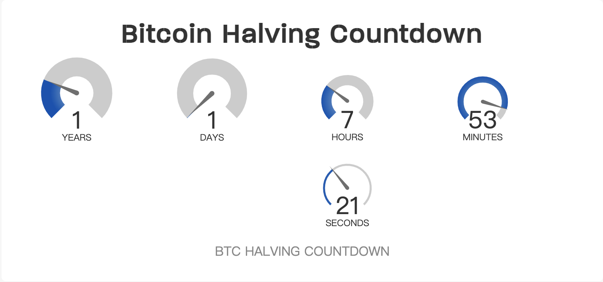
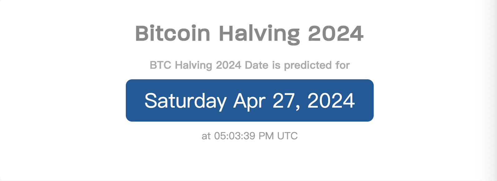
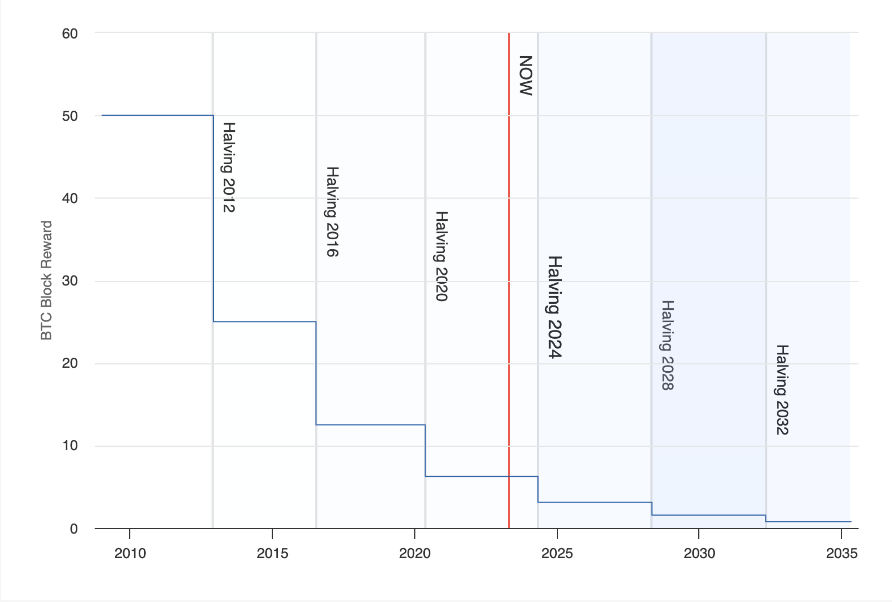

# 比特币减半，就在 366 天后

> 比特币每四年减半，基本决定了加密货币市场荣枯周期。下一次发生在区块 840,000 的比特币减半，距离今天还有 366 天。

当下一次 2024 年比特币减半日期到来时，比特币减半将区块奖励从 6.25 BTC 减少到 3.125 BTC。预测下一次比特币减半将在世界标准时 2024 年 4 月 27 日星期六下午 05:03:39 发生。

_显示比特币减半 2024 年日期的比特币减半倒计时钟是基于最新的区块高度 787,076 和每个区块 600 秒的定义区块时间。_

### 比特币减半的日期

比特币减半计划每 21 万个区块进行一次。到目前为止，已经有 3 个比特币减半的日期：2012 年、2016 年、2020 年。

上面显示的比特币减半倒计时是定于 2024 年发生的下一次减半。下面的比特币减半日期是已经发生的 BTC 减半日期。

比特币减半日期的历史

| 减半的年份 |     块高      | 块高奖励 |                                    日期 |
| :--------- | :-----------: | -------: | --------------------------------------: |
| 2024       |    840,000    |    3.125 | 2024 年 4 月 27 日下午 05:03:39（预计） |
| 2020       |    630,000    |     6.25 |          2020 年 5 月 11 日下午 7:23:43 |
| 2016       |    420,000    |     12.5 |           2016 年 7 月 9 日下午 4:46:13 |
| 2012       |    210,000    |       25 |        2012 年 11 月 28 日下午 03:24:38 |
| 2009       | 0（创世区块） |       50 |           2009 年 1 月 3 日下午 6:15:05 |

### 比特币减半图

比特币减半图显示了比特币协议中预先确定的比特币区块奖励（补贴）减半时间表。当一个比特币区块用有效哈希值敲定时，这个比特币（BTC）区块奖励会给矿工或矿池。

### 下一个比特币减半是什么时候？

根据比特币减半倒计时，下一个比特币减半日期定在区块 840,000 处 —— 预测发生在世界标准时 2024 年 4 月 27 日下午 05:03:39。

在比特币减半日 —— 区块奖励计划从每区块 6.25 比特币降至每区块 3.125 比特币。

### 上一次比特币减半是什么时候？

上一次比特币减半发生在世界标准时 2020 年 5 月 11 日 7:23:43 的 630,000 区块。当时，比特币区块奖励从 12.5 BTC 降至 6.25 BTC，并减半。

### 比特币何时减半？

根据比特币减半时间表，下一次 BTC 减半 2024 年预测在区块 840,000 处，定于时间标准时 2024 年 4 月 27 日下午 05:03:39。

在比特币减半的时候，区块奖励将被削减一半，因此每个比特币挖矿作业（无论大小）的收入也将被削减一半。

这段时间对矿工来说是非常艰难的，反过来，一些矿工将别无选择，只能关闭他们的矿机，或寻找更有利可图的加密货币进行挖矿。

你可以使用[比特币挖矿计算器](https://www.coinwarz.com/mining/bitcoin/calculator)来估计区块奖励减半时的挖矿奖励。

### 什么是比特币减半？

比特币减半是用来确定区块奖励补贴时间表的术语。比特币协议定义了比特币减半周期，比特币区块奖励每 21 万个区块减半。

鉴于比特币区块奖励从 50，到 25，到 12.5，到 6.25 依次减半，这个过程和时间表被称为比特币区块奖励减半。

**题图：** Kanchanara on Unsplash
  