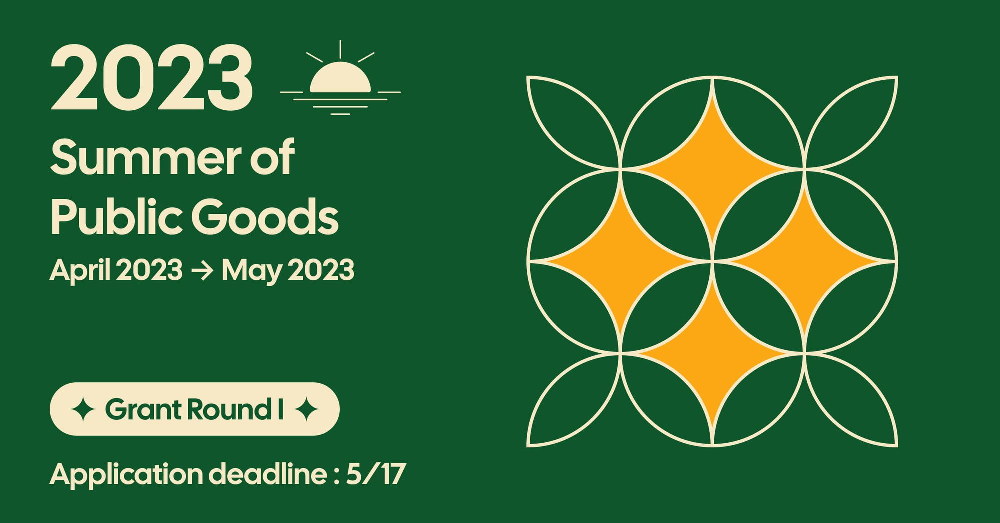
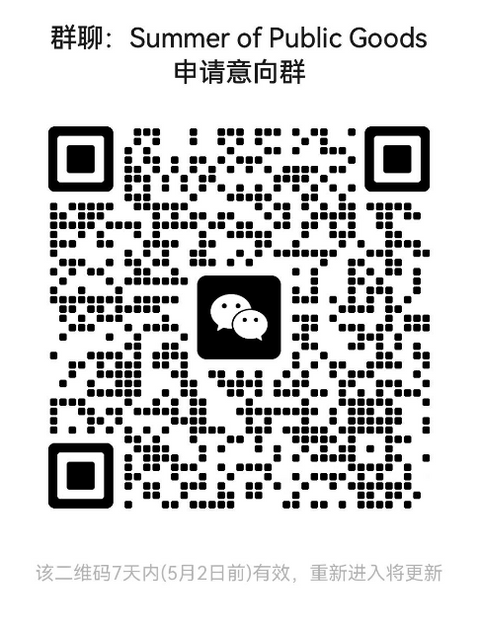
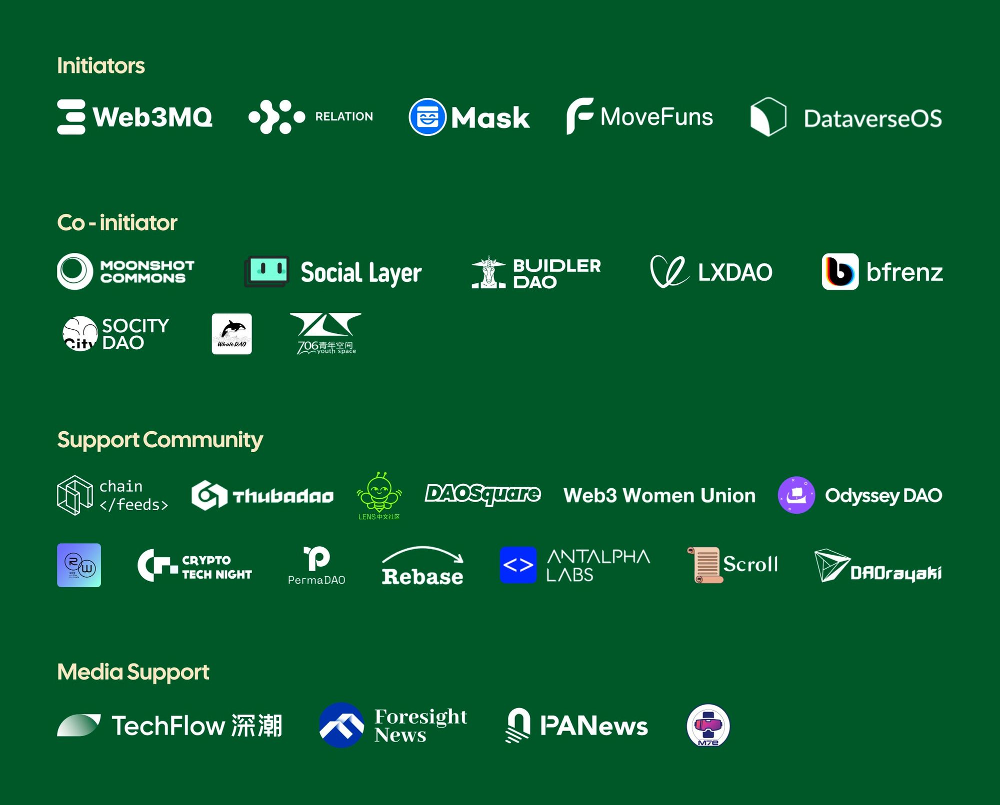

# 后 Twitter 开源时代：重建联邦化信息分发机制，「公共物品开发挑战基金」启动 | M7e 合作

> 只有信息分发机制是正义的，Web3 才能成为真正的价值互联网。Web3MQ 发起「公共物品开发挑战基金」，M7e 元宇宙特攻队、Odyssey DAO 分别作为媒体和社区伙伴全力支持！

### **TL;DR**

申请链接：https://tally.so/r/meMVZk

- Grant 总预算 50k，Main Grant 由 Web3MQ 赞助，第一轮单笔最高资助 15k
- 本次开发主题：开源信息分发机制（Main Grant）
- Relation、Dataverse、MoveFuns DAO 设置了单项 Grant，开发者可同时申请

### 面向中心化利益编程：Twitter 信息化分发

3 月的最后一天，Elon Musk 如约公开 Twitter 部分算法。正如许多 Web3 公司会宣称自己会「渐进去中心化」一样，Twitter 的算法公开也是「渐进开源」。本次公开的限于For You信息流，也就是在用户信息流中呈现何种信息的推荐算法，而搜索算法暂未公开。Twitter 宣称Openness is part of our DNA，但在开源之后，作为一个并非全程开源的中心化大公司，开源之初，它的代码总会给大家提供又一个中心化的观察样本。**世界在本次公开的推荐算法中发现了显现的非中立的偏袒、带有政治和个人目的的「面向中心化利益编程」的印痕。**

Twitter 的推荐系统由以下三方面组成：

- 候选源：根据不同推荐源，选择最好的推文推荐
- 排名：使用机器学习模型对每条推文进行排名
- 降权：将过滤 1）已屏蔽用户的推文、2）NSFW；3）用户已阅读的推文

在游戏规则公布后，我们可以方便地看出这个世界中各个角色的加权地位：NPC、Admin、高级玩家和普通玩家。但这个世界并非独立于整个现实世界之外，它同时还映射着现实世界的政治党派。如此的内容分发机制已并非秘密，Twitter 只是其中率先诚实坦白的那个。**自由的互联网一刻也不是完全自由的。**

### 联邦化信息分发：看见即自由

对于 Twitter 霸权的解构尝试实际上从未停止。Mastodon 及其背后的 ActivityPub ，但由于信息分发和内容推荐算法的高壁垒，Mastodon 并未形成一个充分具有弹性和自我调节功能的分发机制，而更多是根据单一维度（时间）来进行一视同仁的、平等的内容推送。Mastodon 的联邦化尝试一定程度上消解了中心化的庞然大物给在线社交带来的压力，但其实例的增多给每个节点带来的交互压力、网络性能压力和服务器费用压力等同样会在达到某种程度后形成一个「反中心化」的向心阻力。Mastodon 等有时会被称为「Twitter 难民收容所」，这个戏称同时也暗示了它的不完整和不完善，实质上是一种中心化程度和分发机制权衡取舍之后的「有损 Twitter」。

**开源、开放，但同时「无损」，是否可以同时做到呢？** 在 Twitter 算法开源之后，对 Web3 社区而言，进行真正联邦化社交服务的构建难度阶梯直线降低。看见即自由，每一名开发者读者都是天然的联邦化信息分发网络中的一员，每一次分发都是一次价值判断，只有信息分发机制是正义的，Web3 才能成为真正的价值互联网。ChatGPT 的闭源是危险的，AI 分发的黑匣子一旦关上就很难打开。**而此刻 Twitter 推荐算法开源的努力，无疑是重振我们对建立更深层次的公共物品飞轮的信心。**

### 公共物品主题开发 Grant：以触达网络为核心

我们想发出这样一个号召：以开源可用的公共层产品为核心，在本次开发挑战赛中，建立真正属于用户的联邦化信息分发。

Web3 诞生以来，DeFi、NFT、GameFi 等不同链上链下项目应用展现了它众多使用场景，但其金融属性也使得这个网络场域更多掌握在投机和资本导向的开发和运营者手中。我们谈论开源、去中心化、均等价值，但就像只有「人」（而非代码）在真正使用互联网，也只有具体的用户能够真正从这些新概念中获益。长久以来被忽视、甚至被视为伪命题的社交，恰恰是用户每日使用时间最长、距离其日常生活最近的场景。从「资产导向」审视 Web3 社交，固然会看到伪命题；但从价值导向（根本上也就是用户导向）来审视 Web3 社交，看到的是还有大量在原有的轨道上没有得到解决的问题。Web3 既然以「下一代互联网」来标识自己，就不能绕过人和用户本身。在熊市漫漫、尚未破局的瓶颈阶段，我们希望本次**从内容分发开始，首先参与建设由「资产导向」转向「用户导向」的 Web3，亦即以「触达网络」为核心的 Web3，以真实向善的方式，有效地与真实用户进行真诚的价值互动。**

Web3MQ 作为开源的 Web3 原生通讯基础设施，自身即 Web3 三大公共层（去中心化计算、通讯、存储）中不可或缺的重要组成部分。在从资产导向（asset-centric）向用户导向（user-centric）转型的过程中，Web3MQ 始终希望能带给终端用户更多可感价值。Web3MQ 即将上线自己的激励测试网，鼓励所有人来运营节点，增大通讯网络的去中心化程度，同时提供相应激励。

**节点申请表：** https://docs.google.com/forms/d/1fL5oDsFlwIvOtOsKFG_Hv3VFX-B4bTVZetwkX2yGmPw/edit

Web3MQ 联合 Relation、Dataverse、MoveFuns DAO、BuidlerDAO、Mask Network、Social Layer、706 Community、LXDAO、PermaDAO、bfrenz、SoCity DAO、WhaleDAO 设立了一个针对开发者的公共物品开发挑战基金。基金将组织多次特定主题的 Grant，本轮 Grant 开发围绕**信息分发机制**进行，不限定于 Web3 产品。在 Twitter 开源的背景下，本次开发主题如下：

1）依托 Twitter 开源的内容推荐算法，建立新的信息分发机制；
2）依托 AI 进行新的内容分发/curation 尝试；
3）建立新的开源通知（Push）机制，作为新的用户触达网络。

除开发者外，对 DeSoc 和公共物品的讨论感兴趣的内容创作者、研究员和从业者也可加入 **Social-Infra-Insights Notion 页面**：https://www.notion.so/S-o-c-i-a-l-I-n-f-r-a-I-n-s-i-g-h-t-s-f97a31bce3b04245bfd5af77d7f4ba9c

**申请截止日期：** 2023/5/17

**申请链接：** https://tally.so/r/meMVZk

**申请意向群：**

_注：如二维码失效，可添加工作人员微信 iAzr2017 申请入群。_

