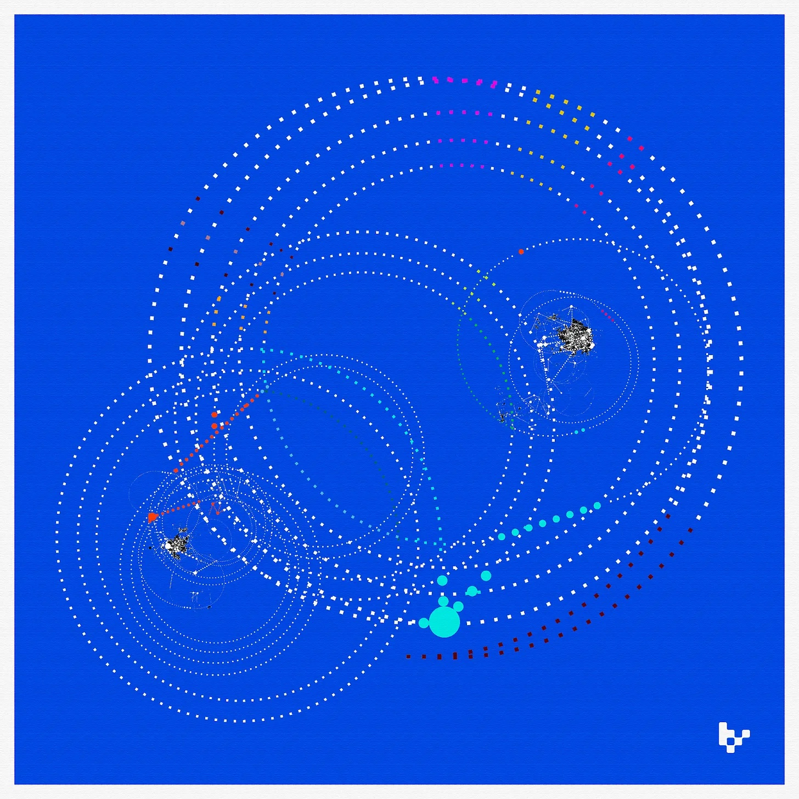

# Web3 社交网络：资产，还是意识形态优先？| Thought for Today

> 社交是互联网应用刚需，传统的互联网社交平台凸显了越来越多用户痛点。Web3 究竟从什么角度来切入解决呢？创作者经济 KOL、Variant 基金合伙人 Li Jin 提出了她的观点。

**作者：** Li Jin

我认为在 Web3 社交网络主要有两种建设路径：资产优先，或意识形态优先。

*资产优先路径*注重用户对盈利的渴望，通过数字所有权来解锁，这将金钱放在平台的最前沿。金融化的功能允许用户在网络中消费、收藏和赚钱。

[BitClout](https://www.newyorker.com/tech/annals-of-technology/the-dark-democratizing-power-of-the-social-media-stock-market) 完全符合资产优先路径，并让用户能够通过交易创造者代币来押注著名人物的轨迹，在网络的中心创造一个投机性的社交游戏。[Lens](https://www.lens.xyz/) 是另一个资产优先的 Web3 社交网络的例子，用户的帖子被实例化为 NFT，可以被收藏和购买，顶级创作者从可收藏的帖子中获得高达 90,000 美元的收入。PFP NFT 社区也可以被认为是资产优先的社交网络：通过收藏资产而形成的兴趣小组。在所有这些情况下，用户参与的动机并不纯粹是内在的，而是至少在某种程度上涉及经济利益的潜力。这就像收藏邮票或棒球卡：这很有趣，也很愉快，但同时，如果它们有一天会值钱呢？

相比之下，*意识形态优先*的 Web3 社交建设途径需要吸引用户的价值观和理想。这意味着要强调区块链赋能的特点，包括抗审查、数据隐私、社交图谱和内容的可携带性。实际的用户体验可能与 Web2 社交产品非常相似，但底层架构涉及部分数据被存储在链上，以及随之而来的所有好处。

我的观点是，Web3 社交网络将通过采取资产优先的方式取得成功，即创造吸引用户的盈利机会。换句话说，这些网络不是纯粹的社交网络，而是*社交经济*网络。这种方法也创造了一个更明显的差异化的用户体验，在理论上应该产生更广泛的共鸣（收入是一种普遍的需求，而理想对许多人来说是抽象的）。这也反映了币圈其他地方更广泛的采用路径，包括 NFT、DeFi，甚至 L1 公链：对经济利益的渴望引导了新的网络和应用，并在其普及采用中发挥了关键作用。

说白了，倾向于资产优先路径并不意味着只迎合投机者，创造一个容易被操纵的金融化游戏。社交网络很容易被垃圾邮件和不良行为者[污染](https://guides.co/g/the-network-effects-bible/121737)，它们会减弱网络的作用，产生负面的网络效应。与 DeFi 借贷协议不同的是，所有的流动性都是有价值的，即使它来自投机者，在社交网络中，内容和用户的质量很重要。简单地奖励所有内容的创造、传播或使用，是一种太直接鲁钝的经济激励，有可能造成一个充满垃圾或无用内容的环境，或者是完全有毒的环境。

一个在 Web3 社交网络核心的成功的金融游戏应该结合内在和外在的动机。[Stealcam](http://stealcam.com/) 是一个内容共享平台，当粉丝拥有的 NFT 被以更高的价格购买时，他们可以从销售中获得分成，它既吸引了以盈利为目的的交易者，参与来回交易图片的烫手山芋游戏，也吸引了真正的粉丝，他们希望保留他们喜欢的创作者制作的内容作为收藏品。

采取资产优先路径也将让网络能够构建新的社交图谱。社交网络是围绕着独特的社交图谱构建的，这构成了其网络效应的基础：Facebook 通过利用你现实世界的朋友/大学的图谱而起步；LinkedIn 映射出你的职业关系；而 TikTok 的社交图谱是基于你的兴趣，从你在应用上的行为推断出来的。一个基于资产的社交网络可以开创并推广*所有权图谱*，其中用户根据共享的链上所有权进行连接。这超越了简单地将用户聚类到 PFP 社区，这是我们已经看到的这个想法的原始版本。随着用户所有权历史的密度在链上的增长，随着时间的推移，这个所有权图谱可以丰富地反映用户的兴趣，补充用户自称的兴趣或现实世界的联系。

总而言之，现在有一个独特的机会窗口来建设 Web3 社交网络。现有的 Web2 社交公司如 Twitter 和 TikTok 正面临着动荡，而用户也渴望得到新的东西。

我们对 Web3 社交网络的愿景植根于利用加密货币的独特能力，提供差异化的奖励持续使用的用户体验。
