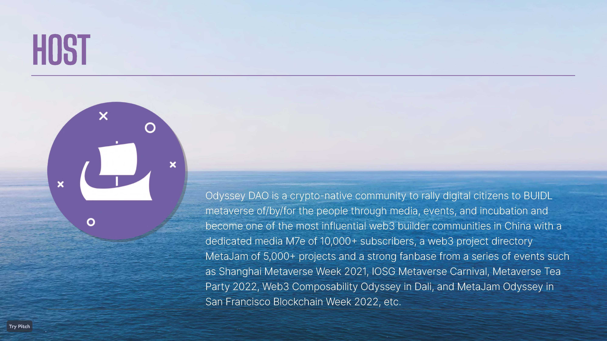

# 到黑山去，玩转 Web3 可组合性 | Web3 Composability Odyssey@EDCON 2023 ①

> 继以太坊上海升级、香港 Web 嘉年华之后，最令华语 Web3 建设者兴奋的是，即将于 20 天后在黑山举行的以太坊社区开发大会 EDCON 2023。在这场 OG 云集、聚焦于 Public Goods & Network State 最新叙事的全球 #Web3BUIDL 盛会中，我们邀请大家到黑山去，一起玩转 Web3 可组合性！

# Web3 可组合性为何重要

区块链、去中心化存储、DID、NFT、DAO 赋权数字公民，让 Web3 天然具有打破垄断、无限开放的可组合性。历经上一轮牛市爆发与熊市沉寂，不久顺利完成上海升级的以太坊和其他公链的基建新进展都在向模块化区块链演进，加之 AIGC 的爆发，让 Web3 的可组合越来越可实操落地。

# 将 Web3 Composability Odyssey 进行到底

（2 videos）

继去年 8 月大理瓦猫之夏、10 月旧金山区块链周两场 Odyssey 活动之后，我们在 EDCON 2023 继续举办 Web3 Composability Odyssey，邀请全球底层协议、中间层服务、上层应用、DAO、NFT 项目创始人、建设者、创作者和研究者一起通过各种活动聚会就 Web3 可组合性从技术到应用的无穷可能和前景分享真知灼见、孵化创意和创新。

ppqq EDCON（社区以太坊发展大会）是一个非营利性的全球以太坊年度会议，每年在不同国家举行一次（EDCON 2017 年在巴黎，2018 年在多伦多，2019 至 2021 年在线上，2022 在旧金山大通中心）。EDCON 致力于为以太坊生态服务，促进全球以太坊社区的交流和互动。

ppqq 即将举行的 EDCON 2023 将是一个为期五天的活动。它将汇集来自以太坊领域的专家，讨论以太坊技术的最新发展和趋势，并探索基于以太坊的解决方案对各种商业和社会挑战的潜力。除了演讲和小组讨论外，该活动还将提供与志同道合的专业人士交流的机会，以及向行业专家学习的机会。

# 怎么玩转 Web3 可组合性

### 活动 ① VIRTUAL TALK：分享关于 Web3 可组合性的观点和创意

- **主办：** Odyssey DAO
- **时间：** 5 月 1 日至 31 日
- **地点：** Twitter Space、元宇宙平台等
- **内容：** 相关项目和建设者受邀参加一系列线上交流，分享关于 Web3 可组合性想法和思路

### 活动 ② 1 ON 1 INTERVIEW：探索 Web3 可组合性

- **主办：** Odyssey DAO、M7e 元宇宙特攻队
- **时间：** 5 月 16 日至 31 日
- **地点：** EDCON 2023 现场、远程连线
- **内容：** 精选受访对象开展播客或视频专访

### 活动 ③ RANDOM WORSHOP：开展 Web3 可组合协作

- **主办：** Odyssey DAO
- **时间：** 5 月 19 日至 22 日
- **地点：** EDCON 2023 现场
- **内容：** 即兴举办工作坊，让 Web3 建设者相互链接和协作

### 活动 ④ FIRESIDE CHAT：探寻 Web3 新动力

- **主办：** Odyssey DAO
- **时间：** 5 月 23 日
- **地点：** EDCON 2023 现场
- **内容：** 开展对话，探寻可组合性作为 Web3 发展的新动力

### 活动 ⑤ PANEL DISCUSSION：深潜 Web3 可组合性

- **主办：** Odyssey DAO、区块律动
- **时间：** 5 月 23 日
- **地点：** EDCON 2023 现场
- **内容：** 若干场特定主题的分组讨论，以促进 Web3 可组合协作

### 活动 ⑥ SOCIAL NETWORKING：构建 Web3 建设者社交网络

- **主办：** Odyssey DAO、区块律动
- **时间：** 5 月 23 日
- **地点：** EDCON 2023 现场
- **内容：** 交流编织 Web3 建设者信任的社交网络

### 活动 ⑦ BADGE & NFT：申领参与徽章，链上记录成就

- **主办：** Social Layer
- **时间：** 5 月 1 日至 31 日
- **内容：** 凡参与线上线下 Odyssey 活动，均可申领 Social Layer 设计发行的链上徽章，持有线上线下参与徽章可在将来铸造 Odyssey DAO 的 NFT

### 活动 ⑧ ONE MORE THING：诚邀共建共创

诚邀去黑山 EDCON 的小伙伴一起共建共创你喜欢的主题活动！

**活动介绍：** https://shorturl.at/mqKS9

### Odyssey DAO 发起主办

基于 M7e 元宇宙特攻队的社区和影响力，Odyssey DAO 新近成立，致力于建设一个号召数字公民建设人人所有自主自治的元宇宙的加密社区，发起主办此次 Odyssey 活动，首度亮相。

# 合作伙伴，首批亮相

截至 4 月 28 日，Web3 Composability Odyssey@EDCON 2023 首批合作伙伴就位亮相！

- **协办方：** 区块律动、M7e 元宇宙特攻队、ManesLAB
- **贡献者：** DataverseOS、Navigator
- **合作伙伴：** 706 Creators、Antalpha Labs、Atticc、Buidler DAO、Litentry、Mask Network、Metaforo、PAKA、SeeDAO、Social Layer、THEPASS、Viti Diary、Web3MQ、Weido Ghost Gang
- **媒体支持：** 币扑、胖车库、Foresight News、星球日报、橙皮书

_注：合作伙伴 Logo 按英文首字母排序_

# 欢迎入群 参与共创

如果熊市低迷、AI 火爆都未能动摇你 All in Web3 的信心和行动，而且对 Web3 可组合性的可能性和前景充满兴趣，无论你是否去黑山，无论现在是什么身份状态，欢迎扫码入群，参与到这场将于黑山 EDCON 2023 开展的 Web3 Composability Odyssey 中来！

_扫码入群_
