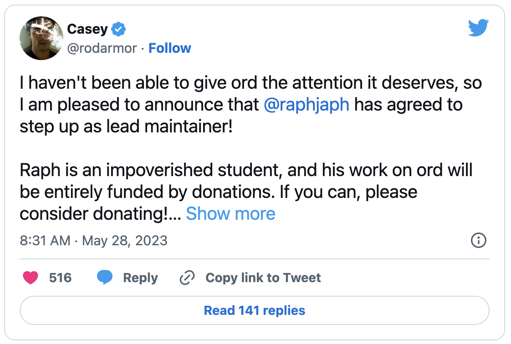

# 比特币 Ordinals 铭文突破千万，协议维护者换将 | Decrypt 报道

> 比特币 Ordinals 铭文数在周一突破了 1000 万，新的领导人告诉 Decrypt 他打算如何填补协议创造者 Casey Rodarmor 的位置。

**作者：** André Beganski

炙手可热的比特币协议 Ordinals 在周一抵达一个可观的新里程碑，就在其创建者表明他将退缩的几天后。但是 Casey Rodarmor 不会完全消失，项目的新看守人告诉 Decrypt。

由 Rodarmor 在 1 月推出的 Ordinals 允许在比特币上创建类似 NFT 的资产，称为铭文，其中独特的数据位可以分配到聪 —— 比特币可划分的最小货币单位。

两个月前，只有不到 66 万个铭文诞生，但由于使用该协议可以在比特币上构建实验性通证 BRC-20，Ordinals 的受欢迎程度最近迅速增长。根据 [Dune](https://dune.com/dgtl_assets/bitcoin-ordinals-analysis) 仪表盘的数据，5 月 29 日周一所创造的铭文总数激增，超过 1000 万。

一些加密交易所已经推出了对 BRC-20 通证的支持 —— 这些通证是以以太坊上的 PepeCoin 等 ERC-20 通证为模型的，而像 Magic Eden 这样的 NFT 市场也已经采取行动来适应 Ordinals 铭文。

尽管关注度越来越高，Rodarmor 周末在推特上表示，他将卸任该协议的主要维护者，把项目的缰绳交给一位化名为 [Raph](https://twitter.com/raphjaph) 的开发者。

「我一直没能给予[Ordinals]应有的关注，」Rodarmor 在推特上说，Raph 已经「同意担任首席维护者」。

_https://twitter.com/rodarmor/status/1662617512700420096_

与比特币核心开发者通过慈善行为获得支持的方式类似，Rodarmor 说 Raph 在「[Ordinals] 的工作将完全由捐款资助」。

即使 Rodarmor 的头衔已经改变，他仍然会参与这个项目，Raph 在采访中告诉 Decrypt，他解释说 Rodarmor「只是目前不想成为 [Ordinals] 的公众形象」。

比特币的化名创造者中本聪在其创造开始流行后就离开了。但 Raph 的新角色包括定期与 Rodarmor 通电话，他说。

Rodarmor 没有立即回应 Decrypt 的评论请求。

Raph 说他在德国工作，目前正在攻读教育学位，他说他的角色将是兼职。但作为项目的主要维护者，他将对维护 Github 上 Ordinals 的代码库有更大的控制权，该协议的最新软件可以在这里下载。

「Casey 是一个小瓶颈，因为我总是不得不等待他对代码审查和类似东西的批准。」Raph 说，「他也还在 GitHub 上做事情。他只是想让我成为他的盾牌。」

Raph 指出，这个项目的代码库已经从 Rodarmor 的个人 GitHub 转移到了属于 Ordinals 的一个[账户](https://github.com/ordinals)，作为它自己的组织。他还指出，他不是唯一可以发布新代码或进行修改的人。

虽然 Ordinals 吸引了整个数字资产行业的人才，并激起了 MicroStrategy 等公司的兴趣，但该协议并没有被比特币社区完全接受。例如，一些比特币铁杆对 BRC-20 通证造成的高额交易费用表示担忧。

Raph 说，他在未来几周内一个重点转移的领域是文档，他解释说，将由社区牵头，在 GitHub 上提供材料，可以更好地帮助人们理解 Ordinals 的技术要素。

Raph 说，他对 Ordinals 或 Rodarmor 并不陌生，他在这个项目上工作了近 10 个月 —— 在该协议上线之前。

「我对代码库非常熟悉。而且，更重要的是，我非常熟悉 Casey 喜欢怎么做事情，」Raph 说，「这就是为什么我是这个角色的完美人选。」

(space)

ppqq 黑山 Web3 可组合奥德赛回顾 ①：从迈阿密到黑山

5 月 18 至 23 日，迈阿密 2023 比特币大会、黑山以太坊社区开发大会 EDCON 2023 同期在欧美两大洲举行。比特币 Ordinals 的火爆 vs 以太坊 NFT 陷入历史低谷、比特币社区对去中心化越来越强的共识 vs 以太坊社区推进 L2/ZK 技术及公共物品/Network State 的建设愿景，构成了区块链两大主流生态有趣的对比……

⏰ 明晚 9 点，从美国迈阿密比特币大会到黑山 EDCON 两场大会均参与的 Bruce 和其他分别参会的嘉宾将交流分享他们从这两场活动中获取的两大生态最新动向！

主持：SocialLayer 联合创始人 Jerry

嘉宾：

- DRK Lab 创始人 Audrey Tang
- AstroX Network 创始人 Bruce
- 小幽灵社区经理喵喵
- FindTruman 联合创始人 Lyon
- PlanckerDAO 核心贡献者 Pablo

🎙 推特 Space：https://twitter.com/i/spaces/1dRKZMLMqdVxB

ppqq
