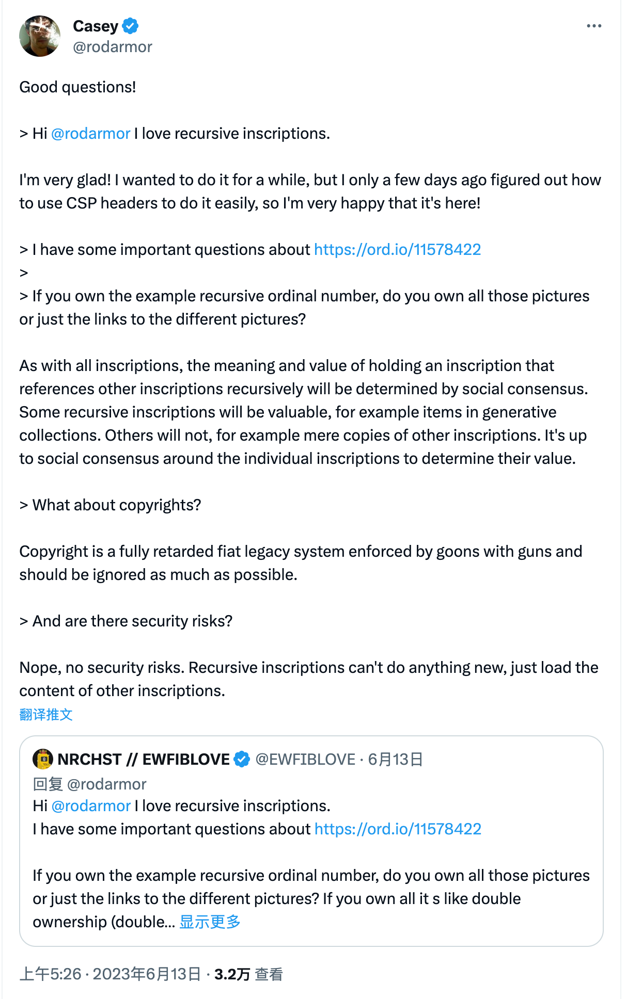
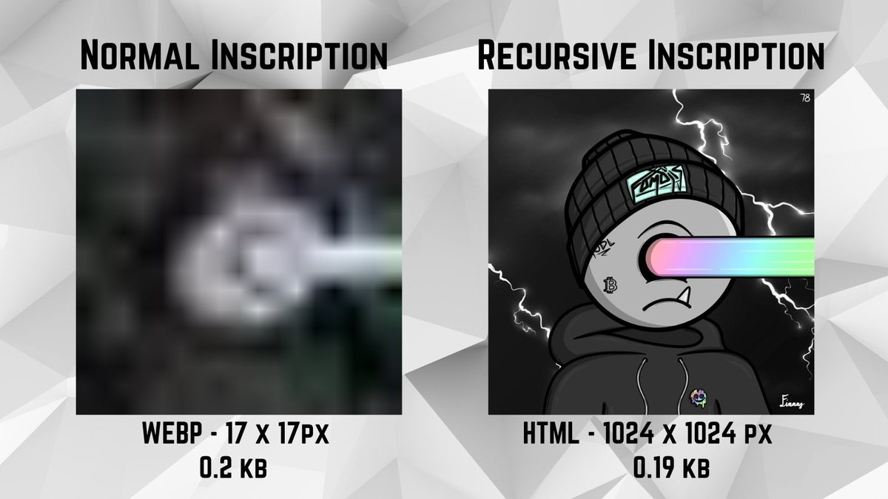

# Ordinals 协议推出递归铭文，有可能用比特币重建互联网？| Thought for Today

> Ordinals 协议日前推出能够相互连接引用的递归铭文，引爆了 Ordinals 社区对在比特币上重建互联网、实现元宇宙的想象与激情。

# 背景

6 月 12 日，比特币协议 Ordinals 新任首席维护者 Raph @raphjaph 近日在 Github 上，将比特币协议 Ordinals 创建者 Casey Rodarmor @rodarmor 提出的「递归铭文」（Recursive Inscriptions）2167 号 https://github.com/ordinals/ord/pull/2167 更新合并到 Ordinals 代码库中。

# 观点

### Leonidas.og

Ordinals 生态播客 The Ordinal Show 主持人 Leonidas.og @LeonidasNF 撰推介绍递归铭文，并分析其将为比特币生态带来什么影响，认为现在即可将复杂的 3D 视频游戏完全放在比特币区块链上。

_https://twitter.com/LeonidasNFT/status/1668098460766052353_

今年初，Ordinals 协议引入了任何人都可以将文件完全铭刻在比特币区块链上的能力。这些铭文独立存在且不知道其他文件已被铭刻。随着递归铭文的引入，情况即将改变。

铭文现在可以使用特殊的 `/-/content/：inscription_id` 语法来请求其他铭文的内容。这个简单的更改解锁了许多强大的用例。例如，与其为 PFP 集合单独铭刻 1 万个 JPEG 文件（这将非常昂贵），不如从集合中抽取刻录 200 个特征，然后再制作 1 万个铭文，每个铭文使用少量代码来请求特征并以编程方式呈现图像。结果是一样的。艺术只是以更有效的方式存储在链上，例如 对于 Bitcoin Apes https://bitcoinapes.com 可以节省超过 100 万美元的交易费用。

不过，让我们放大想象力。如果刻入每个人都可以调用的代码包会怎样？这正是 OnChainMonkey https://onchainmonkey.com 所做的。他们将 p5.js 和 Three.js npm 包完全刻在链上，然后在即将到来的 Dimensions drop 中使用递归，从铭文中对这些包进行调用，这使得他们能够在 1KB 以下创造出美丽的 3D 艺术。而最重要的是，任何人都可以这样做。现在这些代码包被刻在了比特币上，它们是一种公共产品，每个人都可以用它来便宜地制作很酷的生成艺术。

我们还能把想象力放得更大，如果很多人上传大量代码包怎么办？所以现在有一个庞大的软件包存储库供开发者构建。这将解锁在 4 MB 以下永远无法完成的强大用例。最复杂的软件毕竟只是一堆编译在一起的代码。现在，可以将复杂的 3D 视频游戏完全放在比特币链上。这就打破了天花板，天空才是极限。比特币本质上成为一个内部互联网，每个文件都可以从比特币上的其他文件请求数据。目前还不清楚人们将如何使用它，但这无疑是比特币历史上的一个重要时刻。像 ordinals.com 和 ord.io 这样 Ordinals 浏览器将很快支持递归铭文。

享受在比特币互联网上冲浪吧！

### Ordinals World

Ordinals 社区 Ordinals World @OrdzWorld 认为递归铭文将 Ordinals 协议带入铭文 2.0 阶段。

_https://twitter.com/OrdzWorld/status/1668520507942268932_

**实现基本逻辑** 项目方或者其他任何玩家在 BTC 区块链铸造基础属性铭文，从而形成一个 BTC 内部的铭文网络，项目方或玩家只需提供主要特殊部件就可铸造想要的 NFT，递归铭文虽然和之前的 GBRC721 方法类似，但用例和理念程度不一样，递归铭文用例包括 NFT、链上生成艺术、3D、视频，甚至游戏等。

突破了比特币 4M 区块限制，同时理念方面主要共识是可组合性所有数据互通。相当于在比特币上建造超级代码库，任何人都可以为这个代码库贡献代码，参与的人越多资料越丰富，组合性和复杂性更高，就能做出更复杂需求的的应用，想象空间巨大。

**先锋代表项目**

- OnChainMonkey 以前是以太坊项目，拥有成熟团队 CEO @huuep CTO @amandaterry Market @Goodthings 很强的技术背景和资金储备，属于实力派，现正在 BTC 网络成为新的 ordinals 开拓者，将在 6 月 15 日采用递归铭文铸造 300 个 3D 版本 OCM Dimensions NFT。

- Cypherpunk Ghosts 是一只复古且有趣的团队，创始人 @Natahala33 拥有丰富的开发经验，在他们网站有一个基于 HTML 和 /content 的例子，在当前递归铭文合并之前就已建立，网站也有游戏的元素。cypherpunk 将在稀有聪 blcok78 采用递归铭文发射 777 只 ghosts，时间待定。

**前景** 一个新协议出来，成功与否需要时间验证其共识强度，如果 OCM 和 cypherpunk 的成功发射能持续带来热度，引导更多新项目采用该协议，最后成为通用型协议，他就成功了。根据 Recursive Inscriptions 的用例范围和无限可组合性的特点，加上市场需求，我认为是天时地利，Inscriptions 2.0 未来已来！

# 交流

Ordinals 创建者 Casey Rodarmor 在推特上也回答了关于递归铭文的价值和版权方面的疑问。

_https://twitter.com/rodarmor/status/1668369281472512001_

ppqq嗨 @rodarmor 我喜欢递归铭文。

我很高兴！我想做一段时间，但几天前我才弄清楚如何使用 CSP 标头轻松地做到这一点，所以我很高兴它就在这里！

_首个递归铭文_

ppqq我有一些关于 https://ord.io/11578422 的重要问题。如果你拥有示例递归序号，是拥有所有这些图片还是只拥有指向不同图片的链接？

与所有铭文一样，持有递归引用其他铭文的铭文的意义和价值将由社会共识决定。一些递归铭文将很有价值，例如生成艺术收藏中的项目。其他不会，例如其他铭文的单纯复制品。围绕单个铭文确定其价值取决于社会共识。

ppqq版权呢？

版权是一个完全迟钝的法定遗留系统，由持枪者强制执行，应该尽可能地忽略。

ppqq是否存在安全隐患？

不，没有安全隐患。递归铭文不能做任何新的事情，只是加载其他铭文的内容。

# 示例

Ordinals 项目 Ordinal Fomojis @OrdinalFomojis 率先尝试递归铭文铭刻，并分享了他们的体验。

_https://twitter.com/OrdinalFomojis/status/1668813664516997121_

递归的力量 🤯

左图：将 JPEG 转换为 WebP 并将尺寸减小到 17 x 17 像素，最终输出 = 0.2kb ~ 200 字节

右图：使用 1024 x 1024 像素递归铭文的 HTML，最终输出 = 0.19kb ~ 190 字节

来自 @raphjaph @rodarmor 和 @veryordinally 的 3 行代码已经实现了以高分辨率显示的全链上图像，其大小仅为几分之一!要实现艺术作品在没有递归铭文的情况下同样小的文件尺寸，将让图像基本上不可能被破译!

我们是如何做到这一点的，都在链上，任何人都可以看到并利用 🤝。希望今后人们能用同样的方法来更有效地铭刻!Ordinals 和 BTC 的魅力在于它的开源和无需许可。每个人都可以用代码来释放它的全部潜力!

递归铭文并不适合每个人，原始图像和 JPEG 可能永远是最纯粹的铭文形式!但是，随着对区块空间的需求不断增加，使用这样最小的空间来铭刻大型集合的能力将是扩展 Ordinals 的一个巨大步骤

很多人都在问我们是如何做到的。现在，我们将让区块链侦探四处窥探，看看它是如何做到的，但很快我们将在更多的技术层面上帮助解释这一切，让任何有兴趣的人去尝试一下 🤝。

这只是递归铭文可以解锁的一个开始！本周晚些时候，@OnChainMonkey 和 @huuep 将通过 OCM Dimensions 将它提升到一个全新的水平！

铭文 2.0 才刚刚开始 🧡

这第一批 200 是一个可以实现的例子，下一步是尝试其他创新的递归技术，也许会铭刻更多的东西 🤫。

跳转到 ord.io 玩一玩吧!

只需按最古老的区块 78 聪排序查看 ⏳ 🫡

Ordinals 递归铭文是否像亚马逊河那只扰动全球气候的蝴蝶一样引发去中心化互联网的起步？且让我们密切关注，拭目以待。