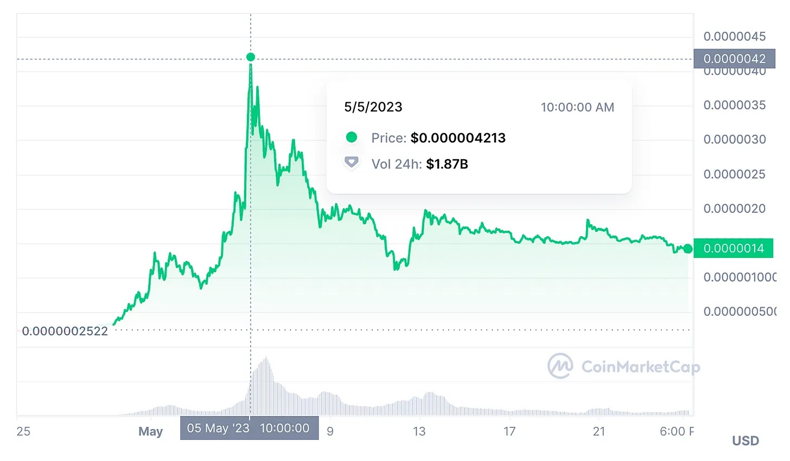

# 模因币为何崛起？| Thought for Today

> 今天，距离高峰期刚好 20 天，佩佩币（Pepecoin）从其历史最高点下跌了 70%。随着模因币（Memecoin）的关注度消散和 FOMO 狂热消退，加密市场进入深熊，《斯坦福区块链评论》发文分析模因币的美德或特性。

**作者：** @0xFishylosopher

## 简介

在过去的两个月里，很难错过佩佩币（Pepecoin）史诗般的传奇故事，伴随着它的出现，模因币（Memecoin）的炒作再次出现。事实上，5 月 5 日，佩佩币突破了惊人的 10 亿美元市值，成为排名前 50 的加密货币[1]。在许多方面，佩佩币的崛起让人想起了狗狗币（Dogecoin）和柴犬币（Shiba Inu ）的著名且惊人的崛起，这是历史上最著名的两种模因币。事实上，佩佩币本身甚至向它所代表的模因币的悠久传统致敬，写道它将「让模因币再次伟大」[2]。那么，是什么让模因币「伟大」？为什么它们在加密货币生态系统中存在（甚至茁壮成长），尽管它们明显缺乏效用？

## 认识你的模因币

模因币一直是加密货币的新奇和怪异之处。它们最大的特点实际上是自称缺乏任何实用性，它们带着半讽刺性的自豪感。尽管今天几乎任何人只需点击几下按钮就能创建一个模因币，但并非所有的模因币都是平等的。毕竟，持有狗狗币的人比 HarryPotterObamaSonicInu（这是 CoinMarketCap 上的一个真实的币种）[3]要多很多。

事实上，最成功的模因币从不起身卑微：它们是战士。这些模因在互联网模因文化的波涛汹涌的大海中进行了激烈的战斗，在那里，任何文化感觉或任何吸引人们注意力的东西，从伊隆·马斯克（Elon Musk）的引用（Tweelon），性笑话（CumRocket），文字大便（PooCoin），GPT 的引用（PepeGPT）都可以变成模因[4] 。

在这些史诗般的战斗中，只有那些已经证明了它们的平易近人、亲和力、持久性的模因才能生存下来。对于那些做到这一点的人来说，它们会得到无尽的荣耀，有来自人群的魅力，有来自强者的敬意，以及一个能穿透最艰难的加密货币风暴的模因币。而在这一切之中，也许佩佩确实有机会生存下来，取得胜利，并茁壮成长。

## 佩佩，模因皇族

_院子「感觉不错，老兄」的佩佩模因_

佩佩币是含着银汤匙出生的，因为佩佩的模因属于（与狗狗一起）一类互联网模因的皇族。诞生于 2008 年的漫画家 Matt Furie 的手中，这只绿色的青蛙有一双凸起的绿色眼睛，被描绘成字面上的小便（pee-pee-ing），同时评论说「感觉不错老兄」[5]。从那时起，佩佩就以各种形状和形式出现了，包括悲伤的版本、傻笑的版本，以及更多的版本[6]。

自创立以来，佩佩模因和相应的丑陋青蛙形象具有明显的反文化和颠覆性的内涵，特别是当与更悲观的狗狗模因对比时。虽然佩佩的大多数用法都是非常良性的，但这只丑陋的青蛙也有明显的「丑陋的一面」。在 4chan 和其他更边缘的社交媒体平台上，青蛙模因经常被扭曲和修改，变得更加黑暗，有时体现出极端主义的政治符号。而渐渐地，佩佩系列模因的变体成为极右团体和其他更黑暗、更颠覆性的互联网角落的主打产品[7]。因此，佩佩模因存在着巨大的二元性：一方面，它作为一种良性的反文化形象存在于主流社会，即一只脸上带着或喜或悲或傻笑表情的丑陋青蛙。另一方面，这个反主流文化的符号被用于极端主义政治运动，造成社会不稳定。

这种双重性是让佩佩币备受争议的原因，也是它让 Coinbase 陷入困境的原因，因为 Coinbase 指责佩佩的模因被「共同用作极右派的仇恨符号」，后来被迫道歉，并承认佩佩的大多数主流用途是没有偏见的[8]。但在模因币的背景下，它们在争议和持续的媒体关注中茁壮成长。毕竟，正是佩佩作为长期的模因皇族成员和互联网模因文化无可争议的标志之一的地位，支撑了佩佩币的价值主张，并解释了其令人瞠目结舌的上升到 10 亿美元的市值，在其高峰期有 18.7 亿美元的交易量。

_佩佩币价格，截至 5 月 24 日的 CoinMarketCap 数据_

在利用其作为无可争议的互联网模因皇族的力量来支撑其作为加密货币的价值这一点上，佩佩币与狗狗币非常相像。人们可以说，佩佩币的口号「让模因币再次伟大」以及其仅由「纯粹的模因力量」推动的自我宣称有其真实的内核。毕竟，由于佩佩是一个如此重要的模因皇族，当然可以想象佩佩币可以坚持相当长的时间，就像狗狗币一样[9]。

## 拉盘、砸盘，和 FOMO 的力量

像狗狗币和佩佩币这样的模因币，加上它们的自我处理缺乏任何效用，当然是拉盘砸盘计谋和监管的成熟目标。而在许多情况下，「骗取山寨币」（shilling shitcoins）是富人最喜欢的一种消遣方式，无论是个人还是机构。

人们无需再看伊隆·马斯克在塑造狗狗币的命运方面如何发挥了作用，就能看到关键意见领袖如何将价格飙升到月球的影响[10]。在简单地在推特上发布「狗狗」并写道「狗狗币是人民的加密货币」之后，狗狗币价格飙升了 40%，而在 2021 年的大牛市中，狗狗币在短短五个多月内就实现了惊人的 147.6 倍价格上涨。

可以说，这种被关键意见领袖随意拉盘砸盘能力已经被植入到了模因币的经济逻辑中。如前所述，模因币的货币化和收益是根据基础模因（或文化现象）能够积累和维持多长时间的注意力和文化资本。像马斯克这样的关键意见领袖，顾名思义，有能力一手创造和维持文化现象，从而使这些文化衍生品（即模因币）获得巨大的价值，并反过来为散户投资者启动了一个「害怕错过」（fear-of-missing-out，FOMO）的循环，它们想跳上快速致富的加密货币之旅。

这种逻辑同样适用于佩佩币在过去一个月左右的快速上升。虽然没有一个明确的名人在推特上推动佩佩币（如马斯克和狗狗币的情况），但从链上数据可以看出，在佩佩币的炒作下，已经有一些大的机构赢家。例如，世界上最大的资产管理公司贝莱德在 4 月 21 日买入了价值 244 美元的佩佩币，并在 5 月 5 日的高峰期以 263 万美元的价格全部售出[11]。

当然，随着拉升的出现，不可避免地出现了抛售。今天，距离高峰期刚好 20 天，佩佩币从其历史最高点下跌了 70%[12]。随着模因币的关注度不可避免地消散和 FOMO 狂热消退，价格（这种关注度的函数）自然也会下降。但这只是模因币的美德或特性。对于一个模因币来说，佩佩币跌 70% 已经可以被认为是温顺和「良性的」。至少佩佩币没有模仿 Squid Game token 的命运，这种模因币在 2021 年乘着 Netflix 电视节目 Squid Game 大获成功的浪潮。Squid Game token 在一周内从 1 美分跃升至 2856 美元，然后在其创造者基本上带着赚来的钱跑路之后，暴跌归零[13] 。

但是，这种波动来自于模因币，它们自称其唯一的价值来自于它们的模因力，人们真的不应该感到惊讶 —— 毕竟，它们的标签上真的写着 "无用"。

_来自佩佩币网站_

## 模因链和效用问题

但是，模因币的未来是什么样子的？它们会不会真的只成为纯投机泡沫的对象？答案其实比简单的是或不是更复杂。从设计上看，模因币是由其基础的模因的效力所支持的。问题是，你永远无法真正定量地衡量一个模因的经济价值。毕竟，这些只是在互联网上广泛获取和传播的免费图片文件，因此，显然不产生任何货币价值。毕竟，为什么要为一个我可以免费看到、复制和创造的模因付费？

但是，仅仅因为一个模因上没有价格标签，并不意味着它缺乏内在的价值。如果佩佩的模因没有任何价值，为什么人们会继续使用它到今天，作为抵抗、反文化和数字身份的象征？这是所有艺术的中心悖论，但特别是可以自由复制粘贴的数字纪念品：没有人怀疑它们的价值，但却没有办法衡量这种价值。

在某种程度上，模因币实际上可能是解决这个问题的一个途径。如果一个模因是某种「不可量化的价值」，那么一个模因币在本质上就是一种「可量化的非价值」。因此，这两者携手并进，并将一些可量化的代表附加到硬币背后的模因的价值。因此，即使许多模因币的狂热是由投机所助长的，我也不指望像佩佩和狗狗这样的主流模因币会归零，只要这些模因币本身仍然存在。

然而，在模因币社区中，已经出现了一股狂热，为这些原本应该「无用」的硬币增加所谓的「效用」。这主要包括狗狗币社区的「狗狗链」（Dogechain），一个使用 Polygon Edge 构建的智能合约执行的 PoS 链，其中燃气费可以用狗狗币支付[14]，以及柴犬币社区的 Shibarium，一个最近刚刚宣布公开测试的 L2 扩展解决方案[15]。这些「附加效用功能」大多围绕着经典的玩法，即为了名义上的「拥有效用」而获得一个链。但是，加密行业已经遍布了失败的链的尸体，今天已经有太多的 L1 和 L2 链能够匹配和超越像 Dogechain 和 Shibarium 这样的拟议功能。建立一个链来为这些代币注入所谓的「效用」的核心问题是：为什么我应该使用 Shibarium 和 Dogechain 来执行智能合约，而不是说 Arbitrum、Optimism 或 Polygon？

对这些问题的任何令人满意的回答都必须回到模因币最初的出发点 —— 支撑整个模因币的原始模因，例如狗狗币中的狗狗，或者佩佩币中的佩佩。事实上，如果这些由模因币驱动的模因链真的成功了，它们很可能是某种以模因为中心的链，其中链的设计利用并放大了模因的标志性力量，这反过来又增加了价值。

从长远来看，一个模因链的成功运作可能会更类似于一个成功的 NFT 社区的运作，如 BAYC、Azuki、Nouns 或 Doodles，而不是像以太坊、Arbitrum 或 Polygon 这样的实际 L1 或 L2 链的运作。重点首先需要放在支持模因币的基础资产 —— 模因上，而不是链本身的功能。

这种模因、硬币和技术之间的融合和三角关系，可以说是模因币最具创新性和启发性的方面。如果佩佩币、Dogechain 和 Shibarium 能够创新出一种新颖的治理结构，使底层模因的寿命得以延续，它们无疑将在 Web3 的文化遗产上留下重要的印记。 然后，也许我们将真正能够「让模因再次伟大」。

**关于作者**

0xFishylosopher，或称 Jay，是斯坦福大学的一名本科生，攻读计算机科学和哲学的双学位。他担任《斯坦福区块链评论》的创始主编和斯坦福区块链俱乐部的内容主管。在斯坦福大学之外，他也是 Rough Draft Ventures（General Catalyst 的学生分部）的学生研究员，并担任 Web3.com Ventures 的研究员。

**参考资料**

[1] https://markets.businessinsider.com/news/currencies/what-is-pepecoin-pepe-memecoins-dogecoin-shiba-inu-crypto-news-2023-5

[2] 参见佩佩币网站：https://www.pepe.vip/

[3] https://coinmarketcap.com/alexandria/article/9-funniest-memecoin-names

[4] 什么是模因币：https://www.pcmag.com/how-to/what-is-a-meme-coin-how-do-they-work

[5] https://knowyourmeme.com/memes/pepe-the-frog

[6] 佩佩青蛙的衍生模因： https://knowyourmeme.com/memes/pepe-the-frog/children

[7] https://www.thedailybeast.com/how-pepe-the-frog-became-a-nazi-trump-supporter-and-alt-right-symbol

[8] https://www.forbes.com/sites/antoniopequenoiv/2023/05/11/coinbase-apologizes-for-tying-meme-token-pepecoin-to-racist-symbols/?sh=37957e942419

[9] https://www.forbes.com/advisor/investing/cryptocurrency/what-is-dogecoin/

[10] 伊隆·马斯克和狗狗币：https://coincodex.com/article/21927/elon-musk-dogecoin/

[11] 贝莱德和佩佩币：https://coinmarketcap.com/headlines/news/blackrock-labeled-wallet-nets-2-4m-from-pepe/

[12] 截至 5 月 25 日的 CoinMarketCap 数据：https://coinmarketcap.com/currencies/pepe/

[13] 关于 Squid Game Token 的崩塌：https://www.bbc.com/news/business-59129466

[14] 关于狗狗链：https://coinmarketcap.com/alexandria/article/what-is-dogechain-the-smart-contract-platform-for-doge

[15] 关于 Shibarium：https://blog.shibaswap.com/introduction-to-shibarium/

[16] 参加例如 NounsDAO 的 NFT 圈社区建设的重要性：https://review.stanfordblockchain.xyz/p/nouns-dao-and-the-philosophy-of-governance
