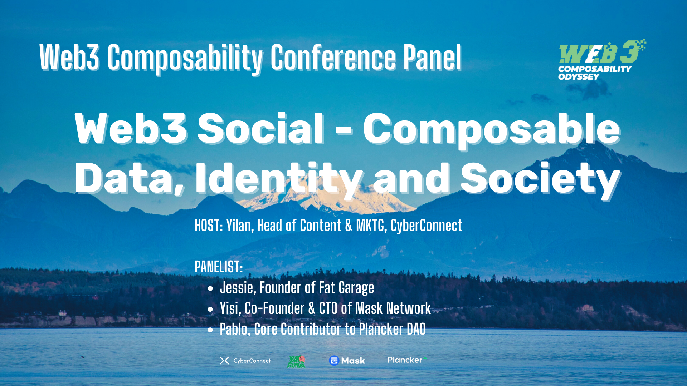

# Web3 社交：数据和应用的解耦，为去中心化身份和社会带来哪些可组合性？

> 都说 Web3 来了，互联网所有应用都值得重做一遍。至于社交，这一需求最刚、应用最广的领域，除了主张创作者经济和抗审查，Web3 到底带来哪些颠覆性影响和独一无二的价值？

5 月 19 日上午，黑山波德戈里察 CUE 酒店，由 Odyssey DAO 主办的 Web3 Composability Conference Web3 可组合性研讨会却从数据与应用的解耦的角度来探讨 Web3 社交的真正影响和变化。

(video)

**嘉宾**

- Yilan，CyberConnect 内容营销负责人
- Jessie，胖车库创始人
- Yisi，Mask Network 联合创始人
- Pablo，Plancker DAO 核心贡献者

## 主持人开场

**Yilan**

我们今天的主题会从 Social（社交）角度来切入，其实我觉得 Social 不一定要局限在所谓的 Social Network（社交网络）或者 Social Media（社交媒体），这样一个习以为常的应用和平台的维度。Social 代表的是人在社交关系或者社会网络里的社会性身份，其中有一些是社交的部分，有些是大家平常去建立其他关系来一起做其他事情，或者是在各种其他真实的场景，不管你是购物也好，打游戏也好，做各种事情也好，都能形成人与人之间的关系。然后这个关系也反过来会塑造我们每个人的身份，以及社会的一些结构形态。今天我们可以从 3 个维度来探索一下 —— 正好也可以映衬我们今天 Web3 Composability（可组合性）这个主题：一个维度是从 Data（数据），一个维度是从 Identity（身份），然后最大一个维度是 Society（社会），我们如何从一个技术的角度切入，现在造成了我们可以有那种新的方式来思考这些事情。

最开始可以简单的给大家介绍一下我们在座几位嘉宾，每个人可以一两句话介绍一下自己和自己的项目。

## 自我介绍

**Pablo**

我们是一个以太坊工程师社区，叫 PlanckerDAO。比起一些很硬核的技术社区，我们更多时间会跟大家讨论以太坊背后的 Crypto 的东西，比如一起共读 Green Pill、Vitalik 的博客去看它们背后的一些想法。Social 很重要，因为以太坊基金会也非常关注去中心化社会、去中心化社交，我们有一些研究性的内容，因为网络国家跟这个也非常相关。涉及技术方面，我们主要是有参与 DAOstar、Metagov 一个 DAO 的标准设计组织，它们的目标是对齐 W3C 的 DID 标准。

**Yisi**

大家好，我是 Yisi。Mask 从 2018、2019 年就开始做 Social 到现在，我们目标是作为 Web2 到 Web3 的一个桥梁，我们从这个前端应用比如说 Chrome 插件，然后还有 APP（手机应用），然后做各种各样的协议，我们想从各个角度或各个方向去投入 Web3 Social。对于 Social 的看法，就像刚 Yilan 提到的，其实不只是 Social Media，你玩游戏，甚至是各种各样的线上线下社交都是 Social。所以我们可能思考的更多的是说如何把 Social 做成一个这种 Infrastructure（基础设施），然后把它放到各种各样不同的场景里去，而不只是局限于比如说我们自己做一个 Social Media，或者说做了一个 Social Media 相关的一个插件或者 APP 这么简单。

**Jessie**

大家好，我是 Jessie。之前我自己是做一个媒体「胖车库」，这次来黑山，我是代表 Ownership Labs，我们做了一个产品 DataverseOS，一个 Web3 操作系统。我们就是主要是在探索 Web3 可组合性，一直在探索这个事情。因为创始人李其柄博士，他是学 AI 的，他特别重视 Data Privacy，一直在想怎么用 Web3 已有的基础设施去既能够实现一个可组合性，又能够为用户提供一个可以理解使用的东西。

我们就想到操作系统这个概念，为什么呢？因为一方面它用到比如 DID（去中心化身份），比如钱包 —— 现在其实可以交互的 DID 就是钱包，然后包括现在提出来的账户抽象 AA，对吧？然后一端是让用户能够连接这个 DID，然后另一端就是要连到那些已有的 Decentralized Applications（去中心化应用），所以我们想提供中间那一层，然后既连接用户，又能让开发者能够去调用一些标准化的接口去在上面建立一些 DApp。但是这样说起来比较容易，但是做起来就是有非常多的标准化那些工作。我们现在是跟 Ceramic 的结合是最紧的，我们要把所有比如说你在互联网上这些行为转化成 Data，又要让人可以理解，所以我们就要在操作系统里那个抽象的 Logic（逻辑），就是 Files（文件）。所以比如说你在那个 Web3 的推特上面发了一条推，或者说你写了一篇文章的话，那它不仅是一个文章，而且它背后还有一个 Data，所以这两个东西打发到一起，在我们做那个操作系统里面，它就是一个 File，所以用户可以直观的看到你既发了一个 Post，你又可以在你那个 Dataverse 里找到那个 Data。然后比如说到时候用户有什么样权限的话，他可以去跟 Developer（开发者）有进一步的内容结合，这就是我们在做的事情。

我之所以觉得这个产品非常有意思，是因为我自己也用它在实现我自己想做的一个应用，因为我本身不是开发者，我正在学代码，我的技术能力非常有限，所以我发现它能让我去 Start Building Something（开始创造一些东西），所以我觉得非常 Amazing（惊奇）。然后，我自己的媒体叫「胖车库」，之前一直持续的在写，从 2019 年底开始就是写区块链，写 Tools for Thoughts（思维工具），就是想把它们结合起来，也想建立一个自己的产品，所以大家有兴趣可以关注一下。

**Yilan**

我也快速介绍一下 CyberConnect。可能跟刚刚大家介绍的有一些比较相似的地方，也是在处于一个中间的位置，CyberConnect 是一个 Social Network Protocol（社交网络协议），然后其中最大的 Social Graph（社交图谱）部分，从时间点和用户量数据量上来讲，目前是最大的。最近的一个新闻给大家分享一下，就是我们前不久我们 Token 在 Coinlist 上 Public Sale，这个对当然对于团队和生态是很重要的事情，更重要的是它对于整个 Web3 Social 来讲是吸引了很多的注意力，导致大家会看到 Web3 Social 可能真正进入下一个阶段，让更多的人开始用起来，不管他是出于什么目的。所以，从现在开始，接下来这半年、一年可能会让大家更多人来关注到 Web3 Social，它不仅仅是 SocialFi 的部分，而是有 Social 的关键点，而让每个人可以更好地进去体验它。从另外一个部分跟我们待会可能会讲到有关系，也就是说这个 Composability，尤其从 Data 和 Identity 的维度，如何让大家可以更好的去进入到 Web3 Social 这个体验里面。而且我觉得今天其实这个 Panel 上，大家其实有很多互补，有的可能更靠近 Data，有的可能更靠近直接的用户体验和应用，有的更靠近是组织形态。

## 问题：Web3 社交的数据与应用解耦，变得有可组合性，由此产生的变化有哪些？Web3 社交可组合性所延展的去中心化身份的变化有哪些？

**Yilan**

对于 Web3 Social 来讲，最大的、第一个，或者最底层的变化，就是把 Social Data（社交数据）和 Social Application（社交应用）和 Social Platform（社交平台）的绑定关系打破了，就所谓有一个解耦（decouple）的这个过程。当分开之后，它就变成了一个独立的，可以被组合在一起，而且可以被 Apply（应用）到其他任何不同的场景里去的的一个 Layer（层），或者一个 Stack（栈）的一个部分，这里我们看到有很多可能性。第一是打开了很多新的场景可能性；第二是让社交身份变得更多样，同时也更全面。全面的意思是指我们会有更多的身份或者社交的信息，或者社交的方面来自于不同场景被组合在一起，它成为了你属于自己的一个更完整的身份的代表，更好的代表你的一个真实的 Identity 身份，很多时候也是说你的一个 Agency（代理）或者个体性的东西。反过来讲，因为它来自于不同的场景，所以它也让你的身份变得更多面化，所以也可以说更场景化。你来自于游戏的每个人，比如说我们现在 Web2，大家习惯的是我在不同的所谓的媒体，虽然媒体或者社交网络里会有不同的身份、社交关系和形象，以至于我们会看到很多社交媒体的迭代是来自于这个社交圈子里面的社交关系，失去了它本来的那个特别的意义，所以我需要去另外一个地方重新建立这个东西。但在 Web3，如果我们能够更好的去可控，更好的去组合，去 take and choose（获取和选择），去来分配这些所谓的不同方面，而且让不同方面的社交身份在不同的场景里得到不同的体现，而且反过来得到不同的体验，那它就变成了一个更灵活的、更整合在一起的，更个人的同时，更 universal（通用）的这样一个所谓的社交范式。

我觉得这是一个从 Data 解耦变成可组合之后我们看到的一种可能性。这跟 CyberConnect 可能也有点关系，就是我们在去发展生态的时候，会有意识的去找不同场景的应用来接入这个所谓的 Social 的部分，或者我也推 Social 的部分，然后让不同的人在不同场景里做他本来该做的事情，更有机的去形成他一个更完整的身份，并且在未来可以更好地反过来说，根据他不同场景来的不同身份的部分来给他做更 contexalize（语境化）的 Personalization（个性化）或者可 Recommendation（推荐）之类的服务。

不知道三位有没有从你们自己的角度觉得 Data 解耦之后，它的 Composability 会体现在哪些地方？然后站在用户或者开发者的角度，他们会有一个什么样最明显的感受？

**Jessie**

其实刚才听你说的过程中，我就想到 NFT 可以作为 Social Identity 代表人的一些身份，因为是我们主动去 pick（挑选）这些 NFT，但是这个 NFT 只停留在一个主观去 pick 它的过程中，但是它并没有代表你在互联网上所有这些不同的平台上 to actually track your social behavior or social events in social activities（在社交活动中去真正追踪你的设计行为和活动）。之所以我们想到那个方案是通过 Data，通过已有的基础设施，它可以提供让 Data 去 visualize（视觉化）这个方向。是因为我们觉得 NFT 很好，然后如果在这基础之上有哪些东西去可以去让追踪你的这些 Online（线上）的行为的话，并且把它去绑在一个 Identity 下面，就相当于你一边 Browser（浏览），一边在做这些 Activity，然后那些 Data 就可以跟着你去在你这个 Identity 下去逐渐积累，并且去 connect（连接），就是我们现在实践的一个过程，最终达到了一个目标和 NFT 当时出来的时候就想代表你的那个比如说元宇宙或者 Online 这样一个 Identifer（身份标识符）其实差不多的，只是我们现在就是通过 Data 去实现这样一个目标。

关于 Data 解绑，就是说现在大家的那个东西都散落在各个平台上，是因为云服务这些 Service Provider（服务提供者），他们 Control（控制）了很多很多东西，于是我们的这些 Data 就都是隔离开的，就每一个有自己的一块就没法去把所有人连起来，所以就出现了一些解决方案。比如说 DID 这种。说好我们现在建立一个统一的 ID，然后所有的这些，当然除了 Web3 以外的这些 Data，我们也是可以把它弄到这样一个 DID 下面去的。所以，我觉得 Web3 的包括不管是 Web 什么的，现在的一些解决方案都是要把云的那一端问题去解决一下，并且提供一个原先就是 PC（个人电脑）的时候，大家都拥有自己的数据，并且就是结合那个的好处。然后我看 Yisi 穿的是 Linux 的那个 Shirt，然后 Linux 当时其实是连的不同的硬件去调配那些硬件的资源，这是我最近了解到的一些东西，我觉得也结合了开源的优点去实现这样一个问题。

然后，我觉得 Data 解绑还有一个好处，就是它不仅是让一个人的一些 Data 可以去 Portable（携带）在自己的那个身份之下，它还让真正的协作、去中心化协作成为可能。比如说你在 Notion 上面写了一大堆东西，然后你不能够在另一个平台上跟别人去协作，比如说我用那个飞书，他用那个 Notion，然后别人用 Roam Research，然后好我们怎么协作？没法协作。那最后一个 Team 就必须得在 Notion 上协作，但我就不愿用 Notion，怎么办？现在我觉得也有可能实际就是可协作性，跨平台的可协作性成为可能。

**Yisi**

我觉得讨论这个问题的话，可能得从我们做 Mask 最初一些想法开始。如果大家提到数据，首先需要提到是身份，因为每一条数据都是 attach（黏附）到一个身份上，数据是需要有生产者和拥有者。在讨论所有的数据 Composability，或者说未来的 Privacy 之前，我们需要先重新定义一下身份，因为如果身份还是在中心化平台上的话，那所有这些数据还是没有办法得到真正所谓的自由，或者能得到我们想要的可组合性。比如说你在推特上，就像刚刚 Jessie 说的，在推特上的数据，在 Notion 上的数据，你在不同地方的数据，如果还是在以现在这样的方式在生产并且并存储的话，那我们永远都没有办法得到更加自由的协作这么一种状态。

我们 Mask 最早做的其实就是身份，其实到现在，我们都在做身份。只是我们不能只做身份，因为我们发现那只做身份的话好像特别的干，然后用户好像也没有办法直接得到里面很多 Benefits（好处）。所以我们于是把身份作为最核心那个部分，然后套在我们那个浏览器插件里面，那浏览器插件可以干嘛呢？浏览器插件可以加密你的数据，然后你可以在推上面 post（发布）加密好的一些这个推，然后你可以决定谁可以看到，谁不可以看到，那所有这些其实都是现在的任何一个 Web2 平台都无法提供的功能。现在最大的问题是数据孤岛，如果有一种统一的身份，就可以彻底打破这样的数据孤岛，这也是为什么最早做 Mask 原因。但是我觉得就是刚刚很多人提到 DID 会有一个统一的身份，可以把你所有不同的平台上数据互通，甚至是 Online 或者 Offline 所有数据都放到同一个身份之下。但我觉得更重要一个问题是，DID 不只是让我们把所有的数据放到一个账号里面，而是更多的是给你一个拥有自己不同身份的自由。

因为刚刚其实 Yilan 提到有 Social Manager（社交管理器）这个东西，那你在不同的 Social Context（社交语境）下有不同的身份这么一种 Appearance（表现）。比如说我现在在这边我可能代表 Mask，然后讨论 Mask 一些想法，一些做的事情，那我可能有 12345 各种不同的 Setting（设置）。但是我面对我家人朋友同事的时候，都有各种不同身份的表现。那在传统的比如微信一个人最多只能有 6 个实名账号，那 Facebook 要求每一个账号都要有一个手机号绑定，那每个手机号其实背后都是 KYC（身份验证），所以理论上一个人也只能有一个 Facebook 账号，你没有办法真正把你不同 Social Context 下不同的 Social Identity 隔离开，我觉得 DID 做到了这一点。我们不只做的是一个人可以有一个身份要链接不同的数据、不同的平台，更重要的是一个人可以拥有无数个身份，然后可以自由地去把不同的 Data，不同的 Appearance 绑定在不同的 Identity 上。这也是我们一直以来做的。如果大家用过 Mask 的话，你会发现其我们那个最核心的功效叫做 Persona（角色），你可以一个人拥有无数个 Persona，因为它就是一个功效，你只要把它安全 generate（产生）出来就可以。那每一个 Persona 你都可以绑定不同的推特、Facebook，然后你在不同的这种 Social Context 下面可以真正实现个人的身份自由，数据自由，甚至最后的隐私自由。

**Pablo**

大家刚才讨论很多 Personal（个人），我可以讲一些组织层面的 Practice（实践）。大概在前年 EthDenver 有一个线下聚会，可能各个 DAO、DAO Toolings（DAO 工具），包括 Aragon、Gnosis，还有可能 Moloch。然后他们就说，我们 DAO 之间好像没有一个通用的数据标准，比如你在 DAOhaus 上创建一个 DAO，你在 Aragon 上创建一个 DAO，然后你用 Moloch 的框架创建一个 DAO，大家数据都不互通，你甚至不知道到底有哪些 Member Proposal（成员提案），你可能要每个 DAO 去看它的框架怎么样。然后 Metagov 的 Director 也在那边，然后他们就讨论，那我们应该做一个，这样互相之间数据好互通，然后互相之间也可以更有组合性。

他们就在大概前年底去年初的开始组建 DAOstar。最近我们跟他们一起搞了一个亚洲这边的 Round Table，就开始吸纳亚洲的 DAO 和 DAO Tooling 成员。他们主要做的一个事情，他们提了个 EIP，然后我们经常会戏称他们就是 DAO 的工商局，就是去中心化工商局，给你一个工厂合约地址，然后让他们去注册，然后按照他们标准的介绍文件格式来，他们在不断去增加这个数据结构。但早期的可能就是 DAO 的基本介绍，然后你的成员 Members，然后因为他其实相当于就做了一层中间层，就你在 json 文件把文本提上去就行，然后至于你 Members 从哪里来的，你可以去做成去中心化。比如你 Member 就去链上去写你的 Token Holder 的数据，也可以是你、完全中心化的提供这个 Member 信息，因为不同 DAO 定义 Member 信息不一样，有些 DAO 可能持有作品就 Member，那有的是 NFT，有的是 ERC20，有些都是你一定要超过多少 Token 才是 Member，或者是你要做过什么事情才叫 Member，每家不一样。为了数据可组合性，他们就类似定义一个中间层或者规范的数据结构，然后另外还有 Proposal，还有 Activity，然后比较麻烦是 Contribution。嗯，就一直不知道该怎么定义这个事情，原来是像我发条 Twitter 这个 Contribution，但他们目标是希望做 W3C DID 这样的标准，要做到类似于 DAO 的 DID，给 DAO 一个 ID。他们下面现在有很多工作组，有 Strike Team 专门做这种工程实现，应该是 Moloch 之前的 CTO 在做。最近还有专门做 DAO 的合规化，就 DAO 怎么在这个国家能被正常注册下来，就和公司一样真的被注册下来，因为它是 DAOstar 的人员跟 Metagov 是高度重叠的。Metagov 本身做很多 DAO 的研究，包括 DAO 的治理，DAO 的组织形式，他们也写了很多类似于这样的 Paper（论文）去调研所有 DAO Proposal 怎么提的？你是一个大的治理变革还是小的治理变革？提供了各种各样的这样规范。有些 Open Group（开放小组）就研究这个。最近我们可能也会帮助他们在亚洲建一个类似于 NFT Voting Governace 的 Open Group。

如果大家有兴趣，我觉得可以多参与，因为他们自己说比较西方叙事，就现在 DAO Tooling，因为他们现在进入的规则是说，你来申请加入，有四个其他的组织成员 upvote（同意），然后就可以加入。但这个对亚洲这边可能就不太 fair（公平），因为里面就没有亚洲 DAO，我们亚洲 DAO 跟他们也不认识。我们现在就在尝试建立这样连接，大家有兴趣来做贡献的也可以联系我们。

## 探讨话题：Web3 社交对构建去中心化协作、去中心化自治组织（DAO），以及去中心化社会（DeSoc）的模式有什么变化？

**Yilan**

Pablo 刚才提的那个方向很有意思。就是我们在讲 Identity 或者 Social 的时候，出发点都是从个体出发，对吧？作为个人，我们去做什么事情？拥有什么东西？写了什么东西？跟谁成为好友？好像每个人都是一个原子化节点一样，然后通过这些节点才连起了一个网络。但我们发现如果把这个 Data 解耦之后，也不一定要通过个人来和其他的 Data 或其他场景里的实体或者事情发生关系，这里面其实就有了协作的可能,以及 Pablo 讲的更多的是作为一个集体而不是个人的概念，一个 DAO 和 DAO 之间，或者 DAO 作为 Tooling 去服务其他去 enable（赋能）其他 DAO 或者是个人在 DAO 里又有不同的的身份来做一些共同的事情，这里我们就往上再越了一步，就不仅再是一个人身份来做这些部分。

如果顺着这个思路，现在我们 Data 和 Identity 它是可以组合互换，那我们在讲集体去协作，集体去做一些事情的时候，如何来把刚刚 Jessie 讲的一种 Collective Intelligence（群体智慧），然后那个 Pablo 讲的不以个人角度出发，而集体的角度来追求一些更广泛的 Vision（愿景）的时候，那这个维度上来讲这个社会的基本组成单位会是什么样子？这个社会的基本组成单位的有我们刚提到的这些 decentralized（去中心化）或者造成的 Composabilty 和这种解耦的关系，它对下一代的协作方式会有什么样的影响？以及说大家可以想象到的一些实际的案例，或者是说我们可以展望它形成会什么样的效果？

**Jessie**

协作这个事情现在还挺困难的，基本上没有什么可以 visualize 的那种 Use Case（用例），比如说我刚才说的用不同的软件去写东西这样一件非常简单的事情，然后你就不能跨平台去实现。我在 Notion 上写，就不能把它搞到比如 Roam Research 里，首先格式什么就不用说了，就是这个事情就是很别扭的一个事儿。我觉得 Web3 基础设施提供的一些可组合性，比如 Ceramic、Lit 这样的 Protocol 提供了一些可组合性，能够让这个事情在一个标准化的东西里去成为一种可能。

当然有的人、开发者或者 Team（团队），可能是用不同的 Protocol 去做，可能比如说 Ceramic，他是做这个 Database 的，但是有另外一个项目他也是做 Database 的，那我就用这几个项目组合在一起，这几个 Infrastructure 组合在一起，然后去提供一个标准。然后你如果在这个平台上去去做的话，那你就是可以，比如说有开发者他做了不同的 Applications，然后这些 Application 都可以在这一个标准之下通行，就是我觉得这不是一种可能性，可能是好多种可能性，但是它是可以实现就是一个 user 可以在不同的 DApp 之间来回去切换。所以这就是我觉得让协作成为去中心化的协作，反正就是那种可以在不同的 Application 之间进行协作的可能。

我刚刚想到一个可视化的例子，就是现在 Web3 的那些 Data 怎么样去呈现一种去中心化连接。比如说交易，现在最主要的应用其实就是 Finance（金融）方面的应用就是交易，因为 Behavior Data（行为数据）还没有形成这种像交易一样的，就是非常 visualize 的网络。我有个朋友叫 Tokenthereum，他是一个加密艺术家，专门去绘制交易网络的那种可视化的图，就是它以一种艺术的形式就是呈现出来。就比如说 DeFi 账户的交易，然后每一个钱包所对应的那个点，然后大概是怎么样连接在一起，然后形成一个网络。但是它 basically 是 Finance 场景中的那些 Data，然后现在很多的努力，我觉得 Application Data（应用数据）怎么样去可视化出来，对吧？如果这些东西能够可视化出来的话，那它也是形成了一个 Web3 网络，那样的话我们就看到更丰富的刻度和的形态。

**Yisi**

我想讲几点，第一就是标准化。其实我们一直也在思考说标准就是我们做 DID、身份、Social，然后从 2018 年走到现在，可能四五年里有非常多各种各样新标准出现。比如说最早的时候有 DIF，就是那个 Decentralized Identity Foundation（去中心化身份基金会），我们最早思考要不要加入这个基金会？那时候不会，因为一是没钱，二是因为那时候我看非常多大公司在里面，我在想说这样子 Foundation 能够真的能够产生一个符合我们这种真正 End User（最终用户）想要的标准吗？

再后来我们有各种机会可以参加各种标准制定中去。但我一直在想所有这些标准，到最后，比如说大家也看到什么用这个新的 DID 标准，然后之前也有 WebAuthn，就是 Web Authentication（网络验证）。前两天我看到一个新闻，就是 Google 发了新的 Pass Key 工具，大家以后可以彻底不用密码，而是用一个这种密钥去登录到各种各样的 Google 服务。那其实这也是一个 WebAuthn 标准，早在 2018 年其实就已经彻底的标准化了，就已经到 1.0 阶段，但好像从来都没有任何一家愿意这么 active（积极）的去实施它，甚至五年之后也只有一家真正的大公司去 adopt（采用）。所以我们一直在思考这种标准化到底的意义是什么呢？然后再反过来看现在 Web2 世界里面的标准，比如说大家用的 Account（账号），那基本就是你的 Email 或者手机号，所有这些其实都没有写在任何一个标准里，我们现在用的这种标准其实都是 de facto（事实上）的标准，就是没有被制定，只是大家公认的，所有人都在这么用，所以它慢慢就形成了一种标准。

那我觉得可能在我们 Web3 也是一样的，我们首先可能应该思考的不是标准化问题，而是说如何能让某一些数据的格式，或者说某一些 Composability 的可能性，能够让更多的这些用户组织或者公司 adopt，能够用起来。然后我们再基于这些再去制定标准。否则像 WebAuthn，首先它要 require（要求）一个硬件，大部分人都不会有什么硬件的身份验证，除了这种像这种 Engineer（工程师）会有这个 UBP，他可以直接用 WebAuthn，但是更多的人其实是慢慢用起来。所以这种标准先制定起来之后再去找用户、场景，是没有办法真正得到 Mass Adoption（大规模采用），WebAuthn 就是这么一个例子。那在 Web3，现在既然所有的协作都这么公开、透明，所有的标准我们都可以看到，或者说所有大家用的方式方法我们都可以用到，有多少人在用？如果未来能够有，因为大家现在都很 open，然后愿意不是说我们一家独大，我们愿意可以用借用或者说直接要到其他人的标准或其他人的用法的话，那我们在 Web3 里面可能达到比如像 Email 或者说手机号这样子的这么一种真正的 Mass Adoption 的，未来应该会比较近。

第二，我觉得最近看了一个非常好的 Data Composability，或者说这种 Data 和使用场景解耦的一个很好的例子，就是全链上游戏。它的逻辑其实就是所有的这些，你游戏的逻辑和所有游戏资产其实都在区块链上，它其实是一个跟 Client（客户端）完全解耦的一种游戏形式，你的所有逻辑都在链上，所有 Asset（资产）都在链上。所以你在不同 Client 上可以用命令行去玩，你可以在网页端玩，甚至可以基于这个游戏逻辑搭建手机 APP，都可以，那所有的这样子，新的不同的这么一种 Scheme，其实就是彻底把协议和 Client 彻底分开。甚至比如说现在推特有各种第三方客户端，但是第三方客户端也还需要用推特的官方 API，那在前段时间，官方平台被关了之后，导致很多轻客户端彻底告别了推特。那在 Web3 里既然所有东西都透明公开的，全链游戏所有这些 Asset 都是清晰清楚写在 Smart Contract（智能合约）里，这个它所有权限的，更加有这种 Creativity（创意），更加有 Innovation（创新）的地方客户端变成有可能，而不再被某一个公司中心化，公司来把它彻底 dominate（主导），彻底 manipulate（操纵）这么一种现状。

刚刚这两点讲可能听起来都不是很社交，但我觉得大家就应该把社交放到更高或者更广的层面上，因为社交就像我刚刚说的，社交其实是一个 Fundamental（基础的）一个 Feature（功能），从来不会说我跟你在聊天，我们就在社交，我们从来不会说我们在玩游戏，或者说我卖你 NFT，所有这些东西其实听起来都不是社交，但其实它的本质都是人与人之间的这种连接，那我们希望就是未来 Mask 也好，或者在座的所有开发者、项目也好，都在为一个更加透明、更加能够 collectively 去创造知识或价值的未来努力。这可能也是我们为什么现在在聊这些，或者在创造所有这些工具标准的一个意义和目的。

**Pablo**

我觉得首先 DAOstar 其实不是一个完全建立在以太坊上的组织，虽然 Metagov 跟以太坊的关系也很深，主要是因为如果研究 DAO 的主要对象就在以太坊上，主要的 DAO 和 DAO Tooling 都在以太坊上，让大家做 DAO 标准的时候，是考虑到很强的组合性和扩展性的，它本身组合其他一些标准。比如我记得有一个就是多地址标准，就是包含了比如 BTC、Cosmos 扩展可能的一个地址格式，它本身设定的时候就没有设定，只是实际开放。然后这两年其实我们可以看到他们很多研究对象，其实不是我们经典的区块链的 DAO，然后最近在 Zuzalu 也声音很大，那个 Afropolitan 是一个存在了很久的组织，他们是一个非洲云上国家。然后他们这两年可能才转型开始发 NFT，然后转移到 Web3，他们本身在之前已经存在很久了，DAOstar 也很关注 Co-Ops（合作社）之类的，韩国也有一些，然后日本也有。我觉得东亚倒还挺像的，搞的事情也很像，我去 EthTokyo 的时候，然后他们会搞，我们集资建设一个 DAO，然后集资买一个经典的建筑。就是听上去好像不是那么 Crypto Native（加密原生），但是有各种各样的 DAO，我觉得 DAO to DAO 的这种标准现在看起来可能是影响力被低估，但有一些的影响力可能会很大，尤其我也不知道 Network State（网络国家）这个趋势会怎么走，CoordiNation 这个趋势会怎么走，但是很显然个人主义和新的组织形态已经被激活了。

## 总结

**Yilan**

我觉得今天我们其实联络在了一个很好的点上，虽然是从个人的角度出发，从一个单独的 Data 角度出发，但到最后我们是希望把整个 Social Layer（社交层）做得更 open（开放），然后也更整合在一起，同时也更 universal，它是可以在任何一个场景之下，让大家都可以去进行社会关系的建立，以及用新的社会关系来做新的事情。可能更直白的一个说法，就是我们一直以来，尤其在 Crypto（币圈）里，大家都一直处于一个很个人主义，或者一个很单人模式的状态。但其实 Social 其实应该是把这个 Layer 从平台解耦出来之后，放到所有的场景里面，让每个人都可以进行一个更多人模式、协作模式，做各种事情才会让这个事情更好完成，更大的价值。所以，我觉得这是我们可能今天讨论的一个共识，也算是可以接下来继续一起去从不同方面继续共建的一个方向。

(audio)

ppqq 欢迎点击「阅读原文」收听本期内容播客
