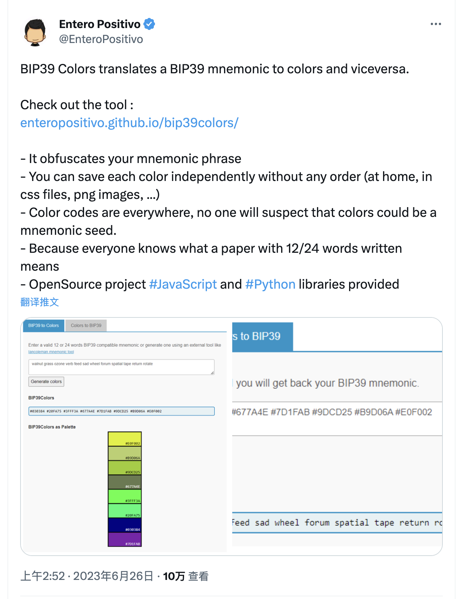
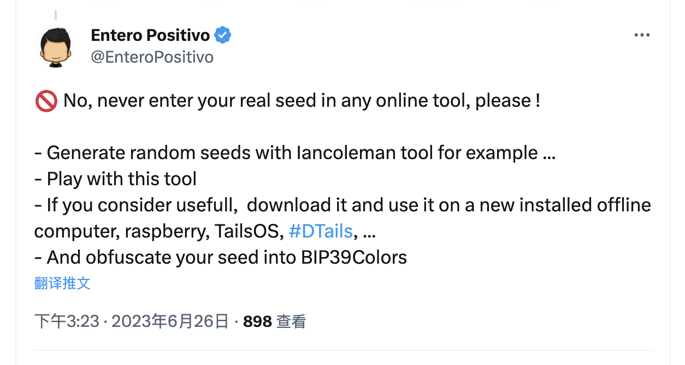

# 你现在可以用色彩来保存比特币私钥 | Decrypt 报道

> 一种新的备份私钥的工具可以让盗贼（还有政府）更难没收你的比特币。

**作者：** Andrew Throuvalas

忘掉单词列表和字母数字字符串吧 —— 一个新的比特币工具可以让你在彩虹中隐藏你的比特币私钥。

比特币开发商 Entero Positivo 上个月推出了 BIP39Colors，这是一个开源[工具](https://enteropositivo.github.io/bip39colors/#bip39tocolors)，可以将拥有者的 BIP39 助记词转换成一系列颜色，反之亦然。

Positivo 通过推特私信向 Decrypt 解释道：「使用这种方法，你可以将 12 词的短语转换成 8 种颜色（或将 24 词的短语转换成 16 种颜色）。然后，你也可以将颜色转换回原始种子短语。」

_https://twitter.com/EnteroPositivo/status/1673041550585069568_

BIP39 是生成种子短语的标准，种子短语是由 12 到 24 个单词组成的有序集合，包含创建私钥所需的信息，私钥用于创建和访问个人比特币钱包。

助记短语的标准化旨在将复杂的私钥转换成一组可读的单词，让用户在丢失钱包设备时更容易找回加密货币。

如今，大多数钱包提供商鼓励用户将 12 个单词写在一张纸上作为备份，并防止其他人看到。然而，正如 Positivo 所解释的那样，将一个人的加密货币存储为 12 个单词的列表对于黑客或小偷来说是非常容易获取的。

相比之下，颜色「无处不在」。私钥可以在众目睽睽之下隐藏，小偷也不会察觉。

他说：「与标有'我新家墙壁颜色'等字样的调色板或你的网站 styles.css 内的色标数据相比，一张写有 12 个字的纸更可疑。」

该工具生成的颜色以十六进制色码表示，这种六位数系统几乎可以将任何颜色表示为红、蓝、绿的某种组合。Positivo 解释说，这些颜色可以存储在包括 HTML、CSS 或 PNG 调色板等「多种格式文件」之中。

与基于单词的系统不同，人们不需要记住颜色的「顺序」来恢复自己的种子：重要的是所有的颜色都存在。开发者认为，这种存储方法的灵活性可以让政府更难没收某人的比特币。

他写道：「你可以把一种颜色给你的母亲，把另一种颜色放在你的网站中，把另一种颜色写在网页设计书中 …… 将来再从这些无关不可知的颜色中恢复你的种子。

_https://twitter.com/EnteroPositivo/status/1673230555150798849_

开发者还提供了如何将 BIP39 颜色解码回其助记短语的[说明](https://github.com/enteropositivo/bip39colors/tree/main/manual)，只需一个计算器，不需要任何外部工具。
