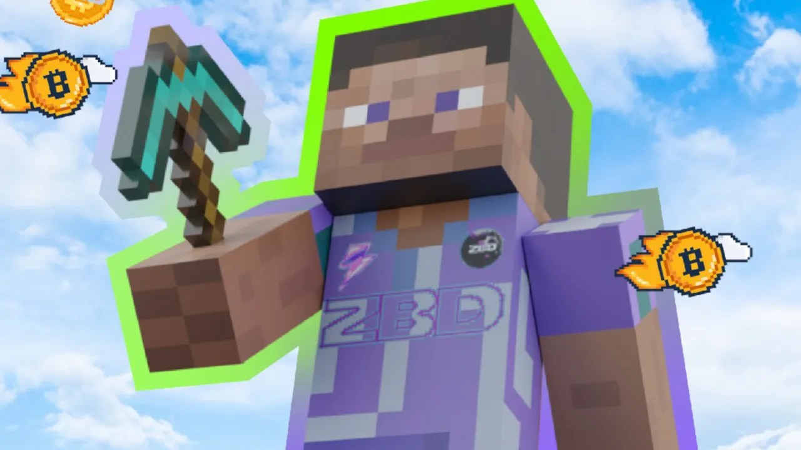
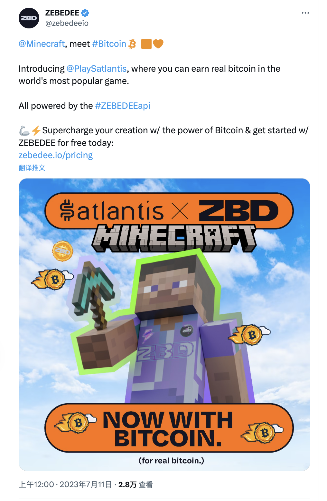

# 你现在可以玩 Minecraft 赚取比特币 | Decrypt 报道

> Satlantis Minecraft 服务器与比特币支付初创公司 Zebedee 合作，每周发放超过 100 万聪。

**作者：** Andrew Hayward

由于以比特币为中心的支付初创公司 Zebedee 为 Minecraft（我的世界）提供了新的集成，这个世界上最流行的视频游戏现在可以为玩家赚取比特币了。

由社区成员运营的以比特币为主题的 Minecraft 服务器 [Satlantis](http://play.satlantis.net/) 已经集成了 Zebedee 的闪电网络（Lightning Network）游戏技术，玩家可以通过游戏赚取比特币。它与电脑上的 Java 版 Minecraft 兼容，玩家可以将收入提取到 iOS 或 Android 上的 ZBD 钱包应用中。

这是一个非官方的比特币技术集成，并没有得到 Minecraft 开发商 Mojang 或发行商微软的认可。Satlantis 服务器的设计灵感广泛来源于比特币这种领先的加密货币，其游戏元素的灵感来自于比特币矿机和矿池，此外还可以提高挖矿「哈希率」，以便在游戏中赢得更多比特币。

_https://twitter.com/zebedeeio/status/1678434051827351560_

当然，你的奖金可能不会太高。据 Zebedee 称，Satlantis 每周发放的奖金超过 100 万聪，相当于 0.01 个比特币 —— 换句话说，每周总价值刚刚超过 300 美元。聪是比特币的最小计量单位，每个比特币包含 1 亿个聪。

但这对于用比特币、以太坊和其他加密货币奖励玩家的游戏和应用来说是非常典型的。像 Sweet Bitcoin 和 Ethereum Blast 这样的游戏，Decrypt 已经对其进行了评测，通常每玩一小时就能获得价值几美分的加密货币。

除了各种使用 Zebedee 游戏技术的手机游戏外，该公司之前还为另一款大型传统游戏推出了专门赚取比特币的服务器： Valve 的小队射击游戏《反恐精英：全球攻势》。早在 2021 年，Zebedee 就在该游戏中启用了比特币投注和奖励功能。

这也不是 Minecraft 第一次与比特币产生交集。早在几年前，一个名为 BitQuest、现已关闭的服务器允许玩家寻找和收集少量比特币，玩家可以在游戏中使用这些比特币。其他粉丝运营的 Minecraft 服务器在过去也尝试过 NFT 和加密货币的集成。

然而，微软计划打击这种集成。2022 年 7 月，这家科技巨头宣布，它计划从所有 Minecraft 服务器中禁止 NFT，并表示基于 NFT 的通证门控功能「不包容我们所有的社区，并创造了一个富人和穷人的场景。」

一年后，微软仍未更新 Minecraft 的条款，以反映预期的 NFT 禁令。然而在 6 月份，微软的一位代表向 Decrypt 证实，Minecraft 仍然计划跟进这一举措。

尽管 Minecraft 的 NFT 禁令尚未正式生效，但一些粉丝运营的服务器和衍生项目要么关闭，要么改弦更张。NFT Worlds 是一个为 Minecraft 专用服务器出售基于 NFT 的地块的项目，但它最终选择了创建自己的类似游戏。

Minecraft 关于计划禁令的原始通告还提到了「其他区块链技术」，其中可能包括加密货币。Satlantis 的一位代表向 Decrypt 表示，考虑到更大型、更成熟的服务器已经违反了 Minecraft 的最终用户许可协议（EULA），Satlantis 对此并不担心。

「EULA 实际上限制性很强，但从我们的研究来看，它似乎更像是一份防御性合约，Mojang 可以在单个服务器遇到任何问题时使用它。」他们说，「除非迫不得已，否则他们似乎不会强制执行，因为有许多拥有 10,000 多名玩家的大型服务器违反了上述规则。」
