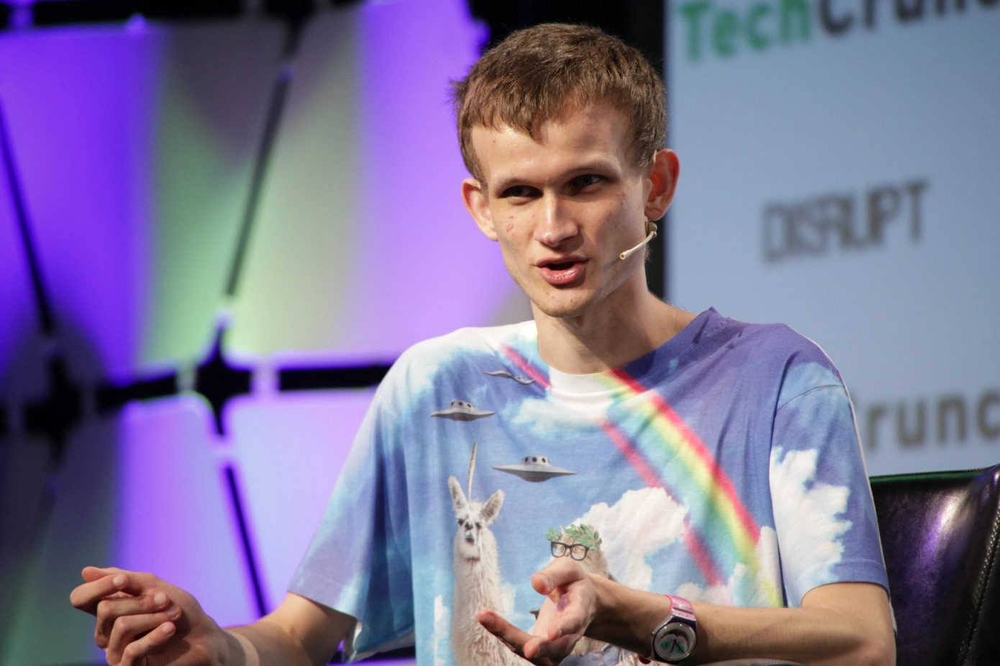
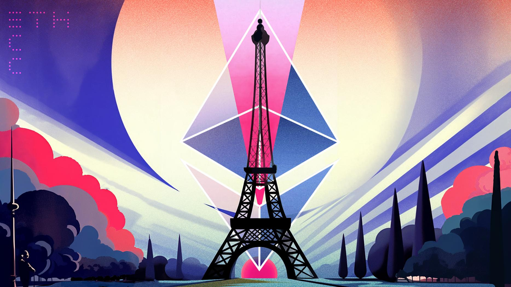
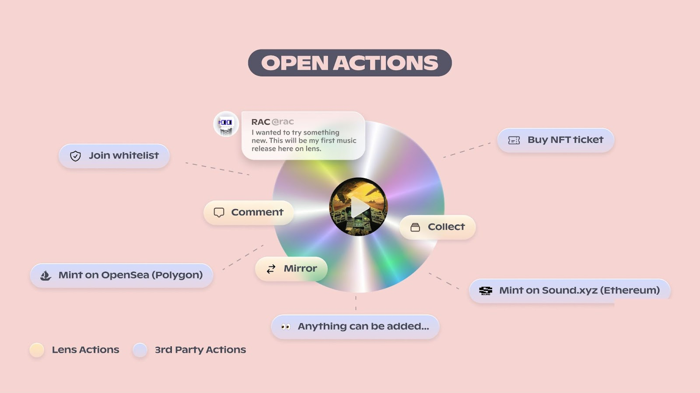
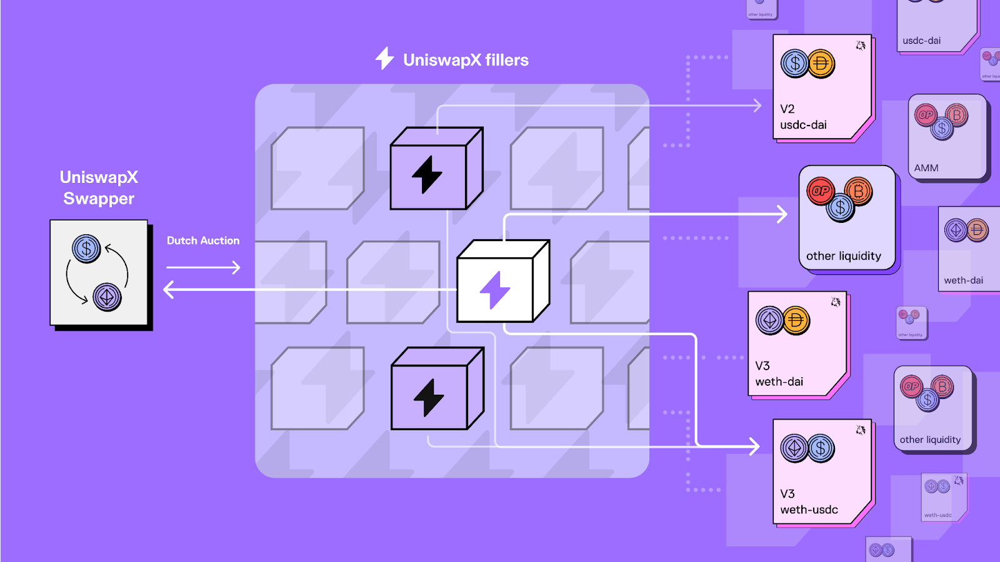
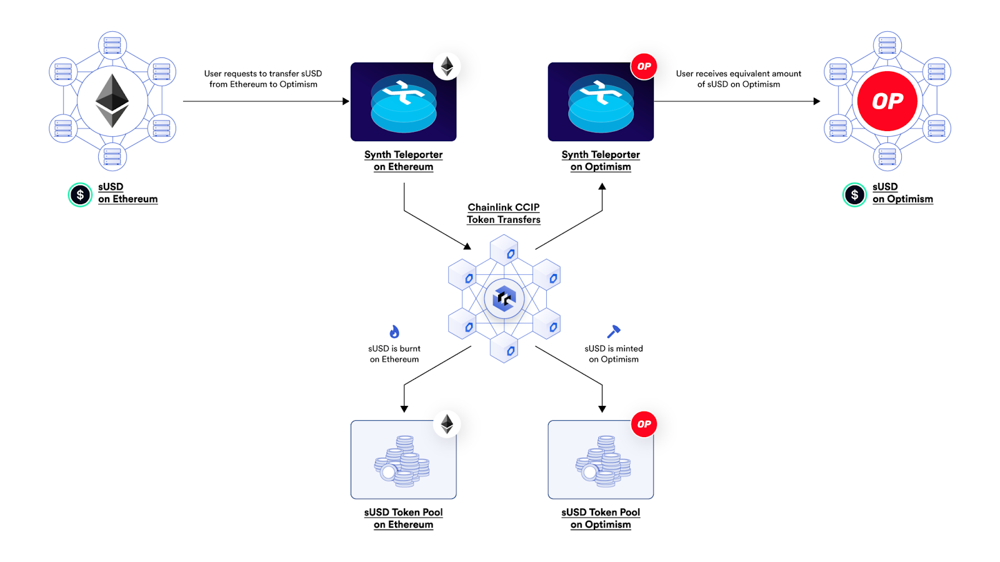
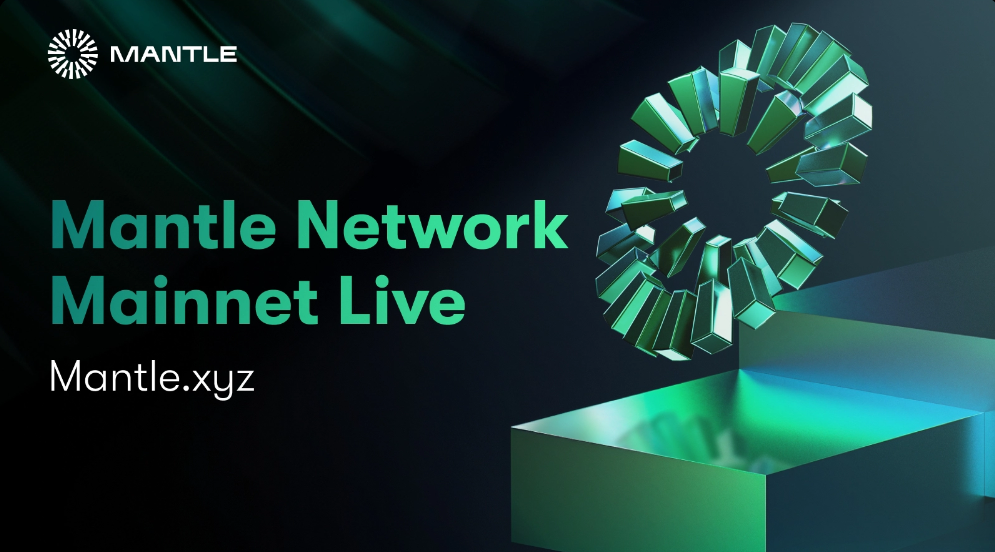
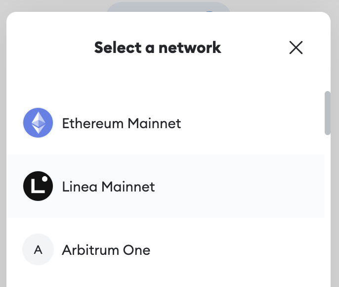
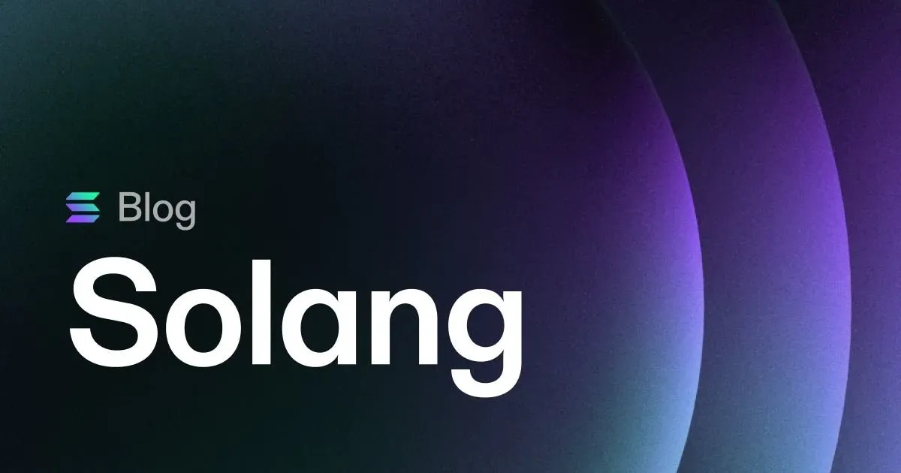

# 昨天刚刚结束的 EthCC 以太坊社区大会，今年有什么亮点？

> 巴黎以太坊社区会议 EthCC 于 7 月 17 日至 20 日举行，共吸引了 350 多名演讲者和 5000 名参与者。

## TechCrunch 为未能参加今年在巴黎举行的 EthCC 人们准备的回顾

**作者：** Jacquelyn Melinek

虽然我未能亲临这一欧洲最大规模的以太坊年度盛会，但我在纽约的公寓里密切关注着会议的进展，这样我就能向 TechCrunch 的读者提供概述，并为他们节省数千美元的巴黎之行费用（尽管度假，我是说工作旅行，在巴黎也是不错的选择）。

以下一些主要机构的圆桌讨论引起了我的兴趣：

**以太坊**

- 以太坊联合创始人 Vitalik Buterin 探讨了账户抽象的历史以及开发者即使在一层区块链网络启动之前一直在进行的工作。Buterin 讨论了最新的以太坊改进提案，该改进可能允许用户创建非托管钱包作为可编程智能合约。如果成功，这一升级有可能通过让加密钱包像电子邮件账户一样容易使用，从而提高全球 Web3 采用率。

**a16z**

- a16z 加密货币的常务合伙人 Sriram Krishnan 在主题演讲中表示，Web3 有望修复社交媒体和消费者应用。他认为现在是建立「大规模加密货币消费者社交媒体市场应用」的时机。
- a16z 的 Web3 媒体常务合伙人 Chris Lyons 谈到了「隐藏线缆」的潜力，以及这可能是加密货币发展到 1 亿用户的最大机遇。

**Reddit**

- Reddit 负责可收藏化身的高级工程经理 Mirela Spasova 分享了该平台的主要使命，即吸引数百万用户使用数字收藏品，就像去年那样。她指出，Reddit 目前已将 800 多万用户纳入其钱包和数字收藏品，并为 30 至 100 名创作者创造了超过 100 万美元的收入。

**Chainlink**

- Chainlink 联合创始人 Sergey Nazarov 讨论了 Chainlink 跨链互操作协议（CCIP），该协议最近在 Avalanche、以太坊、Optimism 和 Polygon 等主网上线。CCIP 的推出旨在专注于打造一个「安全可靠的合约互联网」，Nazarov 指出：「你构建的应用越好，整个区块链的吸引力对于那些有钱的人，无论是大银行、个人还是资产经理，都会越大。」

**Coinbase 的 Base**

- Coinbase 的 Base 项目负责人及协议主管 Jesse Pollak 谈到了该二层区块链项目计划实现去中心化。他说：「如果你回顾互联网出现之前，作为开发者，你很难为全世界构建产品。」然后互联网出现了，它开放了构建应用的能力。Pollak 相信，链上世界将会通过区块链技术取代在线时代。他说：「现在我们正处在这种转变的边缘，从在线平台向链上平台迈进。」
- Pollak 表示，下周专注以太坊的二层项目 Optimism 将发布一个「开放中立框架」，重点是去中心化准则，Base 项目也会遵循这个框架。该框架计划为旨在实现去中心化的网络提供原则。

**Aave**

- Aave 公司 CEO Stani Kulechov 宣布推出 Lens Protocol V2，这是一个针对创建去中心化社交网络生态的 Web3 产品升级版。这个新版本将有「开放动作」等升级功能，将链上元素与社交内容连接起来，让 Web3 体验变得社交化，Kulechov 指出：「这样我们将拥有一个惠及所有人的互联网，并且是由人们驱动的社交网络，在未来你将对网络的发展有发言权。」

原文链接：https://techcrunch.com/2023/07/20/ethcc-ethereum-conference-recap-paris-2023/

ppqq 以上是 EthCC 回顾的前菜，现在奉上丰盛的正餐！

## Bankless 整理的 Eth 2023 的 8 大发布

**作者：** William M. Peaster

大家好！没错，随着 EthCC 2023 的盛大开幕，巴黎到处都洋溢着以太坊社区的活力。

以太坊社区大会以深入探讨以太坊及其生态的技术而闻名，已成为发布重大消息的热门平台，今年也不例外。

让我们来了解一下 EthCC 2023 的最大发展（排名不分先后）！👇

**1. Lens V2 🌱**

Lens Protocol 在 EthCC 上介绍了 [V2 升级的细节](https://mirror.xyz/lensprotocol.eth/-hJH-2IYSe56rK7IEdwSI17hUWt-paTyAs1r4Zes0uQ?ref=bankless.ghost.io)，这将是实现 Lens 愿景的重要一步，为 Web 提供开放且去中心化的社交层，引入了许多新功能。

Lens V2 的核心是「开放动作」概念，允许用户和开发者将「自己的智能合约」带入任何 Lens 出版，甚至进行跨链操作。

此外，Lens V2 引入了新的 Profile Manager 系统，支持 ERC-6551 通证标准，即「通证绑定账户」，让用户可以将 NFT 存储在其他 NFT 中。因此，你可以直接将在 Lens 上收集的所有内容存储在你的 Lens 个人资料中。加密社交正在发展！

**2. UniswapX 🦄**

Uniswap 发布了新的 [UniswapX 系统](https://blog.uniswap.org/uniswapx-protocol)，一个旨在将加密交易推向下一代领开源协议，在 EthCC 上引爆了激情。

简而言之，UniswapX 采用新的荷兰式拍卖机制 Dutch orders，交易订单的价格开始高于当前市场价格，随着时间逐渐降低，激励「填充者」尽快执行订单。

也就是说，UniswapX 系统通过第三方「填充者」（即做市商）外包其复杂的链上和链下路由需求，这有助于交易者找到最佳价格。此外，UniswapX 致力于通过无 Gas 交易、失败交易无费用以及 MEV 抵御保护等重要方式改进交易体验。

了解更多：https://uniswap.org/whitepaper-uniswapx.pdf

**3. Chainlink CCIP ⛓**

本周 EthCC 另一大亮点是加密经济的领先数据预言机网络 Chainlink，其宣布了跨链互操作协议（Cross-Chain Interoperability Protocol，CCIP）的主网发布。

该协议旨在促进不同区块链网络之间的无缝通信，最初支持以太坊、Optimism、Polygon 和 Avalanche，并已被 Aave 和 Synthetix 等 DeFi 巨头采用。

Chainlink 联合创始人 Sergey Nazarov 将其比喻为金融领域的 TCP/IP 协议，CCIP 旨在创建一个更强大和灵活的 DeFi 生态系。例如，新的 Synthetix Teleporter 系统利用该协议在以太坊和 Optimism 网络之间燃烧和铸造 sUSD。

**4. Starknet Appchains 🟠**

我们看到许多二层项目团队都在急于开发让在他们的 Rollup 栈上进行无许可开发成为可能的技术。

Optimism 有 Superchain，Arbitrum 有 Orbit，zkSync 有 Hyperchains。虽然不同策略可能会以不同程度开源代码或具有不同的底层架构，但它们都体现了类似的原则。尽管 Starknet 团队通常选择「先展示，再讲解」，但它还是选择打破这一生态的口头禅，将 Starknet 的名字添加到这一列表中。Appchains（应用链）刚刚在 EthCC 上发布，首个 Starknet 应用链即将进入主网。

这些应用特定的区块链将允许团队创建定制链，保留公共 Starknet 的优势，例如原生账户抽象和极高 TPS，同时避免拥堵，并能够实现公链不支持的功能，如独特的费用市场逻辑。

**5. Gnosis Pay + Gnosis Card 💸**

准备用魔幻的互联网货币支付，像是用现金一样，但是没有银行？Gnosis 在 EthCC 上推出了 Gnosis Pay 和 Gnosis Card。前者是将 Web3 与主流支付系统连接的去中心化支付网络，而后者是 Visa 借记卡，可以直接与链上的自托管钱包连接。

Gnosis Card 的目标是让用户同时享受自托管加密货币的优势，同时可以随时从所持资产中轻松支付（而无需先将资金发送到中心化交易所账户，出售换成美元，然后提现到银行，再转账到 PayPal 应用等）。

至于 Gnosis Pay，该系统将使用 Gnosis Chain 作为「用户储蓄账户」的一层网络，以及基于 Polygon Supernet 的二层作为「用户支付账户」。

了解更多：https://gnosispay.com/

**6. Mantle Mainnet Alpha 🟢**

本周，二层项目 Mantle Network 在 EthCC 上发布了其主网 alpha 版的上线。该系统的早期阶段旨在为开发者提供一个平台，在完整的网络上线前构建和测试应用。

不管未来如何发展，Mantle 是一个值得关注的二层项目，得益于其模块化设计：它依赖于自己的交易执行，以太坊一层用于结算，而 EigenLayer 用于维护数据可用性（DA）。这种模块化的方法无疑预示着以太坊扩容领域即将发生的变化，Mantle 在此方面正在取得突破。

**7. Linea Mainnet Alpha ✔️**

说到 L2 主网 alpha，7 月 18 日在 EthCC 上，ConsenSys 团队也正式向公众推出了其 Linea zkEVM alpha。

这种 zkEVM 风格是二层生态的下一个重大进展，它将零知识（zk）证明与完整的以太坊虚拟机（EVM）等价结合，实现高可访问性和高可扩展性。

此外，由于 Linea 现在成为了 Consensys 旗下项目（如 MetaMask、Infura 等）的二层方案，它在分发上也具有重要优势。因此，随着这个新网络的亮相，我们将非常有兴趣看到它的活动水平。

**8. EVM 扩大影响 🔷**

以太坊会议不仅仅是为了以太坊社区而举行！来自各个生态的团队都利用这个机会展示他们的进展，尤其是与以太坊相关的项目。

Tezos 和 Solana 都试图让以太坊开发者更容易迁移到他们的链上，并在 EthCC 周宣布了相关改进。Tezos 在 EthCC 上推出了 Etherlink，这是一个与 EVM 兼容的解决方案，用于结算链上交易，而 Solana 则宣布了 Solang，一种让开发者能够使用 Solidity 在 Solana 上编写智能合约的编译器。

Solidity 是以太坊的原生语言，Tezos 和 Solana 都在采取措施允许开发者用这种语言编写合约。这些链都意在继续与以太坊争夺用户，承认了 EVM 所创造的优势，并为开发者提供以 Solidity 编程的灵活性，这是吸引以太坊原生去中心化应用的智能合约部署的必要步骤。

**大图景**

总体来说，今年 EthCC 宣布的进展推动了以太坊生态在各方面的前进。随着我们继续跟踪这些发展及其对更广泛的加密货币领域的影响，越来越清晰的是，以太坊的未来将在 DeFi 到 web3 社交等各个方向蓬勃发展！

原文链接：https://www.bankless.com/ethcc-2023-announcements

## Twitter Space 回顾：Bitmap 为比特币、元宇宙带来了什么

_https://twitter.com/i/spaces/1mnxeRRzPovKX_

昨晚关于 Bitmap 的 Twitter Space 顺利举行，嘉宾之一、MetaCat 创始人 CK 发表感受如下——

1. 对同一个问题，builder 和 trader 的观点甚至是相反的，不过这正好构成了市场的多和空两种情绪
2. 比特币社区有自下而上的 builder 氛围（ord、bitmap 的发明人都是草根），这点可能跟比特币没有智能合约有关
3. bitmap 的多数 builder 不太了解元宇宙生态，主要体现在对卖地的看法、bitmap 的构建建议
4. 以太坊智能合约足够灵活，但灵活性带来了一定的不公平（科学家、夹子、项目方占优势），这一点比特币显得 less is more，对普通玩家更公平
5. 中心化、去中心化对应精英治理和大众治理，没有标准答案
6. 国人有更多权威崇拜，因此看重 V 对以太坊的影响，以太坊作为一种社会化软共识，V 并不是决定性的因素
7. 对比特币来说，到底是价值存储还是应用链，是个重要问题，但尚未形成绝对共识
8. 作为生态，叙事派和实干派同时被需要，前者提供想象，后者实现想象

欢迎点击文末左下角「阅读原文」，收听 Space 全程精彩内容。
