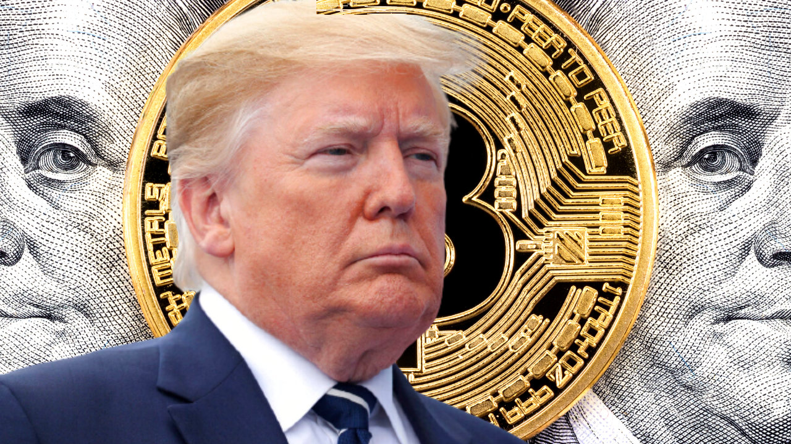
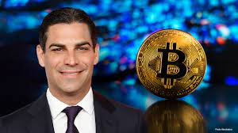
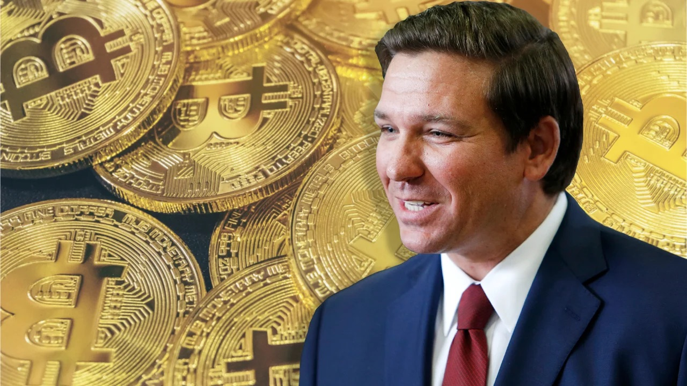

# 长期怀疑加密货币的川普，居然持有多达 50 万美元的以太坊 | Decrypt 报道

> 这位美国前总统过去曾对加密货币的价值不屑一顾，但随着 2024 年总统大选临近，和其他竞选者一起开始拥抱加密货币。

**作者：** Nocholas Morgan

根据一份最新披露的提交给联邦伦理办公室的财务报表，唐纳德·川普持有 50 万美元加密货币。

一份提交给政府伦理办公室的[文件](https://s3.documentcloud.org/documents/23876912/donald-trump-oge-public-financial-disclosure-report-2023-part-1.pdf)包括了这位前总统的资产和其他收入来源。在 82 页表格的倒数第二个条目中，有一行列出了一个「加密货币钱包（以太坊）」，价值在 25 万美元到 50 万美元之间。

这个钱包似乎与他的竞选活动启动的一系列 NFT 相关联，这是他在 2024 年重返白宫的竞选中推出的一部分，此前他在 2020 年输给了现任总统乔·拜登。

这些 NFT 是一系列虚拟收藏卡片，上面有川普以超级英雄、牛仔或宇航员的多种姿势的插图，于 2022 年 12 月以每张 99 美元的价格推出。

在接下来的几个月里，其 NFT 销售[火爆](https://nftpricefloor.com/trump-nft-digital-trading-cards)，甚至在他首次被纽约州法院起诉之后也是如此，直到他在 4 月推出第二批 NFT，导致第一批 NFT 价格暴跌。

川普拥有加密钱包的事实，与他过去对加密货币发表的历史性批评言论形成鲜明对比，他曾以更接近民主党竞争对手而不是共和党同僚的方式质疑它们的价值。

当他还在任时，川普只在一次推特中提到过加密货币。在 2019 年 7 月，他表示自己「不是比特币和其他加密货币的忠粉」。川普在白宫任职期间的前通讯总监安东尼·斯卡拉穆奇后来告诉 Decrypt，他怀疑川普并非是这条现已被删除的推文的作者。

在 2020 年大选落败后，川普在 2021 年 6 月告诉福克斯商业频道，比特币 —— 第一种也是交易最广泛的加密货币 —— 「感觉像是一场骗局」，并明确表示他更喜欢法定货币。

「我不喜欢它，因为这是另一种与美元竞争的货币。我希望美元成为世界的货币。这是我一直说的，」川普告诉福克斯的斯图尔特·瓦尼。

川普对加密货币的厌恶与他所在党派内其他人对这项技术的热情拥抱形成鲜明对比。自从控制了国会以来，众议院和参议院的共和党人一直致力于推进为加密货币制定的新法案，这些法案得到了该行业的欢迎，尽管还存在一些疑虑。

在竞争进入白宫的共和党对手中，有一些人公开支持加密货币的采用。

迈阿密市市长弗朗西斯·苏亚雷斯和企业家 Vivek Ramaswamy 公开支持加密货币的采用。佛罗里达州州长罗恩·德桑蒂斯也承诺，如果当选，将结束他所说的拜登政府对比特币的「战争」。然而，所有这些候选人在民意调查中都远远落后于川普。

在民主党一方，鲜为人知的民主党候选人小罗伯特·F·肯尼迪公开表达了他对加密货币的支持。他透露他和他的家人拥有大约 14 个比特币，而此前他曾表示他不是投资者。

## 总统候选人弗朗西斯·苏亚雷斯宣布接受比特币为其竞选捐款

2023 月 8 月 5 日，迈阿密市长弗朗西斯·苏亚雷斯（Francis Suarez）在 CoinDesk TV 上宣布，他的总统竞选活动将接受比特币（BTC）捐款。苏亚雷斯表示：「正式地说，我的竞选活动正在接受比特币。」

他认为这是一种发展技术的过程，这些技术将为财富创造提供民主化的机会，而不受人类的其他动机、政治目标等的操纵。支持者可以在 FrancisSuarez.com 上捐赠最少 0.00034 比特币，相当于 1 美元。

苏亚雷斯批评了拜登政府对加密货币的处理方式。他表示，这一政府最大的错误是他们不了解加密货币，因此他们选择了一种通过执行来进行监管的机制，而不是设定基本规则。苏亚雷斯还表示，他将禁止中央银行数字货币。

苏亚雷斯是共和党人，于 2023 年 6 月宣布参选总统。

## 德桑蒂斯誓言若当选总统将终止拜登对比特币发动的「战争」

2023 年 8 月 1 日，美国总统候选人、佛罗里达州州长罗恩·德桑蒂（Ron DeSantis）在新罕布什尔州的一次竞选活动中表示，他将结束拜登政府对比特币和加密货币的所谓「战争」。

他表示：「当我成为总统时，拜登对比特币和加密货币的战争将会结束。我们将允许美国人投资比特币和加密货币。没有人强迫你这样做，如果你想这样做，你可以这样做。」德桑蒂斯可能指的是美国证券交易委员会（SEC）最近对 Coinbase 和 Binance 等加密货币交易所提出的指控。

SEC 的委员是由总统任命的。拜登本人对加密货币的立场模糊，留给人们很多解读空间。他几乎没有对该行业采取直接行动，只是指导其监管机构研究并找出监管该行业的方法。

## 小肯尼迪证实持有比特币

2023 年 7 月 10 日，据 CNBC 报道，美国总统候选人小罗伯特·F·肯尼迪（Robert F. Kennedy Jr.）在五月的迈阿密会议上表示他并未投资比特币，但六月的财务文件显示他确实投资了这种加密货币。根据 6 月 30 日提交的财务文件，前总统约翰·F·肯尼迪的侄子在一家经纪账户中持有价值在 100,001 至 250,000 美元之间的比特币。

这位总统候选人的代表告诉 CNBC，这笔投资是在他在 Bitcoin Miami 发表了支持比特币的演讲之后进行的。该代表还表示，这笔投资并不构成利益冲突。

CNBC 指出，肯尼迪是比特币的支持者，他在推特上表示：「比特币不仅是对抗极权主义和我们的货币供应被操纵的堡垒，它还指向了一个未来，即政府机构更加透明和民主的未来。」肯尼迪的竞选团队首先告诉 CNBC，这笔投资是由他的妻子，前 Curb Your Enthusiasm 女演员 Cheryl Hine 进行的，但后来确认这笔投资属于该总统候选人。
