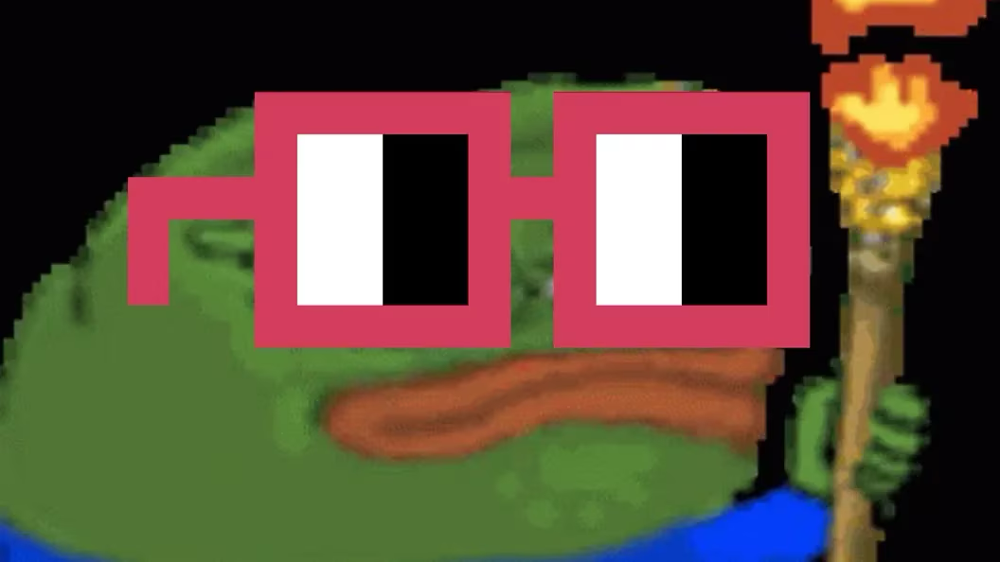

# Nouns DAO 的 2,700 万美元叛乱揭示了贪婪的交易者和区块链理想主义者的有害混合 | CoinDesk 报道

> 不仅是花费 9 万美元来为一种罕见的厄瓜多尔青蛙品种命名的事情让这个去中心化区块链项目社区成员感到不满；一些精明的套利交易者只是想分一杯羹。

**作者：** Danny Nelson

- Nouns DAO 的内部批评者长期以来一直对这一 NFT 项目的肆意花费感到不满，比如花费 9 万美元将一种罕见的青蛙品种为自己取名
- 该 DAO 设计了一个「分叉」来为持不同意见者提供退出通道，也为自己提供了一个逃生舱口，以防自己遭受攻击
- 然而精明的套利交易者却以谋利为目的参与了治理游戏，引发了关于去中心化的吸引力的严峻问题

你能给去中心化的治理贴上价格标签吗？对于 Nouns DAO 来说，答案是 2,700 万美元的加密货币。

DAO 是加密运动中的公司版本，但具有更多的民主和（理论上的）无领导者。购买 DAO 的加密资产的任何人 - 在 Nouns DAO 的情况下，是 NFT - 都有权投票决定该团体如何使用其资金和做出决策。但是，这些团体的章程不断发展，可能会很快变得混乱。

在 Nouns DAO，情况变得混乱了。上周，这个 NFT 实验失去了其对自己不满意的投资者的一部分，超过了其 5,000 万美元的财库。他们离开了 Nouns DAO；用加密术语来说，他们选择了「分叉」。

这个分叉是多个月内有关运行 Nouns DAO 的争议性讨论的高潮，Nouns DAO 是一个众所周知的加密俱乐部，内部存在许多戏剧性事件。是否允许分叉的争论非常激烈；最终，社区决定允许分叉，理由是这个选项将改善整体治理 - 作为一种政治创新，作为保护任何持不同意见的运动的形式，以及朝着更大范围的去中心化迈出的一步。其设计者认为其他 DAO 也可以采用这种方法。

但接下来发生的事情 —— 一个非常昂贵的分叉 —— 现在被一些观察者描述为后院起火。它吸引了精明的套利交易者，而不是保护 Nouns DAO 免受 51％ 的攻击者（这是每个去中心化加密项目的核心恐惧），他们参与了 Nouns DAO 的治理游戏以谋利。

加州大学伯克利分校哈斯商学院的金融教授吉利安·格伦南（Jillian Grennan）说，「这个 Nouns DAO 的分叉可能会成为一个警示故事。」

这个故事提供了关于 DAO 如何应对不同意见的经验教训，这个问题肯定会在更多真诚地追求根本去中心化的项目中再次浮现。很少有人像 Nouns DAO 那样坚定地去做这样的尝试。至少这一事件提供了一个案例研究，展示了在区块链启用的实验中，当资金管理去中心化时会发生什么问题。

## 背景

CoinDesk 对 Nouns 社区博客文章，Discord 消息，Twitter Space 以及与十多名成员的访谈进行的审查显示，这次分叉既是内部政治的结果，也是出于对安全性和去中心化的担忧。

Nouns DAO 通过每天拍卖一张多彩的 JPEG 图像 —— Nouns NFT —— 来筹集成员想要资助的任何东西。例如，上周三的拍卖为 DAO 带来了近 49,000 美元的 ETH。这就是它的庞大财库来的方式。

这次分叉实际上是社区内两派长期交战的结果。

「在 Nouns 中，主要有两派人：账面价值派和模因价值派，」加密投资公司 Bitwise 的联合创始人、Nouns 基金会六人董事会成员 Hong Kim 说。

模因价值派是 Nouns DAO 的最初动力，他们试图通过资助数千万美元的游击营销活动以及支持 Nouns 项目的基础设施来在流行文化中传播 Nouns。他们更有创意的项目涵盖了从奇特 —— 花费 9 万美元为厄瓜多尔发现的一种罕见的青蛙命名 —— 到臭名昭著 —— 试图将 3D 打印的 Noun 发射到国际空间站的失败尝试。

「Nouns 花费了数百万美元在未经证实的人身上做了愚蠢的事情，」化名为 BigshotKlim 的人在一条 Telegram 消息中告诉 CoinDesk。他是 Nouns 超大红眼镜「noggles」的艺术家，他本人通过 DAO 委托项目获得了数万美元的报酬。

所有这些支出激怒了第二组人，他们采取了更加保守的方法，项目成员说。账面价值派认为 NFT 至少应该等于其在库存中所占份额。对他们来说，Nouns DAO 的大量支出（CoinDesk 估计 DAO 已经在营销上花费了超过 2,600 万美元）是在浪费。在长时间的加密熊市中，一些人认为他们可以更好地管理这个项目。

社区内部的成员 Noun 40，也就是 Kim，表示，「这两派人在存在上深受对方的触发，认为对方有坏意，并且一切都是如此。」他说，「我们最终认为『加密如何解决这个问题？比特币和以太坊如何解决这个问题？』」

## 分叉

两个最大、最有价值和最重要的公链在不同派别对区块链未来产生分歧时都曾发生过分叉。比特币多年的区块大小内战于 2017 年催生了比特币现金。在以太坊的早期，令人痛苦的 DAO 黑客事件基本上通过从原始链分叉而被抛弃，现在被称为以太坊经典。

尽管是政治性的，但区块链分叉也是技术性的：当一个网络的底层计算能力分散在支持两个不同历史的情况下，它们会发生。DAO 没有等同于处理离婚的手段。

也许最接近的方法是 MolochDAO 在 2019 年提出的「[ragequit（怒退）](https://github.com/MolochVentures/Whitepaper/blob/master/Whitepaper.pdf)」。这种机制允许不同意项目方向的 DAO 成员退出原来的俱乐部，并将他们的资金带到分支中。

当项目的两位核心工程师，Elad Mallel 和 David Brailovsky，在一个由 Nouns DAO 资助的媒体 Noun Square 举办的 [Twitter Space](https://twitter.com/thenounsquare/status/1605231548034326528?s=20) 上介绍了这种具有争议性的机制时，ragequit 成了 2022 年 12 月 20 日的 Noun 城镇的话题。他们将其定位为对抗 51％ 攻击的安全支持，即那些已经掌握了多数控制权的作恶者可以强制通过恶意提案，比如将整个财库发送给自己。

Mallel 在 Twitter Space 中说：「如果发生这样的攻击，除了攻击者之外的每个人都可以退出。并且不仅他们带着资产离开，而且他们也使攻击者的收益大大降低。」

他和 Brailovsky 将 ragequit 定位为 Nouns DAO 对抗恶意提案的替代方式：Nouns 基金会董事会成员持有否决权。

Kim 作为董事会成员之一，有否决权，他表示 Nouns 社区并不担心基金会可能会「走火入魔」，但仅仅是这个可能性也是令人担忧的。一个基金会的否决权被视为 DAO 中的中心化的点，而 DAO 标志着去中心化（即使现在，与 Nouns DAO 最亲近的人也表示，他们希望消除否决权，以期使用分叉等替代方法）。

分叉机制在 2022 年 8 月作为 Nouns DAO 的 [V3 升级](https://nouns.wtf/vote/356#:~:text=Summary,proposal%27s%20transactions%20and%20text%20description.)的一部分实施。熟悉 Nouns DAO 技术的人士表示，该设计试图在最大程度上将分叉作为一个理论逃生通道的有用性，以及最小化金融利用的机会。

根据新规定，任何 Nouns NFT 持有人都可以在不喜欢的提案后要求分叉。只有在社区持有的 Nouns NFT 的 20%加入后，他们的呼吁才会生效。一旦分叉者超过这个 20%的门槛，Nouns DAO 的所有功能都会冻结七天，不进行支出，只进行辩论 —— 留下还是离开？然后，离开者会带着他们的资产份额进入一个模仿 Nouns DAO 原始治理规则的分叉 DAO，尽管有一个重要的补充：ragequit。分叉 DAO 的成员可以随时退出并提取他们的资金。

不久之后，一位不满的 Noun 持有人要求分叉，并迅速达到了这个 20%的门槛，将所有这些假设都付诸实践。这不是 51%的攻击，而是两个交战派别之间政治斗争的结果。模因价值派和账面价值信仰者即将分道扬镳。

对于第三组人来说，这也是一个值得庆祝的时刻，这些人与 Nouns DAO 的长期信徒完全不相关，观察家说。经过八个月的逐渐积累力量和影响力，套利交易者们现在是时候展示他们的力量并大规模退出 Nouns DAO 了。

## 套利

「这次分叉之所以特别引人入胜，是因为存在两个完全不同的派别：那些真正对 Noun DAO 的战略选择不满意的人，以及一群认为分叉只是一种简单的金融权衡的套利者，」Grennan 教授说。

对于该项目的一些投资者来说，ragequit 一直是计划中的一部分。

套利者是加密货币投资（机）者，他们以低于「账面价值」的价格购买了 Nouns NFT，赌注是以后可能会以更高的价格兑换它们进行 ragequit。其中一些人在去年的 ragequit 讨论时关注了 Nouns DAO。然后他们开始购买。据 Kim 称，2023 年拍卖的大多数 Nouns NFT 都是被套利者购买的。

一直为 Nouns DAO 治理撰写 Newsletter 的社区化名成员 TheBower 表示，「关于分叉的讨论增加了」激进投资者的权力。他说，激进分子「开始对 Nouns DAO 产生重大影响」，以至于进行分叉成为必要 —— 即使只是为了摆脱他们。

到新闻发布时，大多数分叉者已经退出了他们的分支团体，并带走了 2700 万美元库存的 62%。每个 Nouns NFT 的退出都给他们带来了 35.5 ETH 的收益，差不多相当于 2024 年宝马 5 系轿车。一些人以 27 ETH 或更低的价格购买了他们的 NFT。

虽然 ragequit 对 Nouns DAO 来说是新鲜事物，但对于许多套利者来说却是很熟悉的。其中一些人是多产的激进投资者，他们在加密领域寻找以低于账面价值交易的 DAO 资产的机会。一旦进入，他们会向 DAO 的权力经纪人施加压力，要求提供赎回机制 —— 即 ragequit —— 以满足不满的投资者。

最大的分叉者之一，一个多产的匿名加密交易者，名叫 Blurr，告诉 CoinDesk，他们从「第一天」就关注 Nouns DAO，但直到 2022 年 8 月才开始进行 44 个 Noun 的收购，因为「很明显他们不得不」让分叉发生。

Blurr 说，「这一直都是各方最大化价值的游戏。」他反驳了 Nouns 的七位数 NFT 从未是投资游戏以外的任何东西的论点，并猛烈抨击了 Nouns DAO 的激进支出。根据链上记录，该交易者从 DAO 分叉获得了价值 400 万美元的各种加密货币。

套利者的金融技巧给 Nouns DAO 剩下的成员带来了昂贵的后果。他们用来赞助电影、捐赠慈善机构、委托儿童涂色书、更名青蛙，甚至支付开发者的资金缩水了 2700 万美元。

Nouns DAO 的核心团队并没有因财库损失而被吓倒。一位要求匿名的知名社区成员表示，该团体知道存在风险，可能会有人为了获得经济利益而参与分叉。这人表示，这个风险是值得的，「为了推动 DAO 设计的界限」。

## 后续

Nouns 社区 —— 无论是留在原处的还是分叉的人 —— 仍在努力理解导致混乱的原因，并辩论这是否是成功。

佛罗里达湾岸大学的 Kelly Werder 教授加密货币课程，活跃在 Nouns DAO，她认为该团体「没有花足够多」的财库资源，以阻止套利交易者利用账面价值折扣和 ragequit。

但是，化名为 Toady Hawk 的人，他仍然在原始的 Nouns DAO 中，并运营其 Nouns Square 媒体，更愿意给予没有 ragequit 的分叉者机会来运营「更具财务慎重」的 DAO。

研究 DAO 设计的伯克利分校金融教授 Grennan 表示，Nouns DAO 的分叉实验「强调了需要更加复杂的治理结构，以满足各种利益相关者的需求，同时不损害组织的长期愿景」。

她说，「从大局来看，这个一次性的例子表明，虽然 DAO 为基于社区的治理和群众智慧提供了令人兴奋的前景，但群众只是有时也是正确的。」

**原文：** https://www.coindesk.com/business/2023/09/21/nouns-daos-27m-revolt-reveals-toxic-mix-of-money-hungry-traders-and-blockchain-idealists/
